# Design Patterns & SOLID Principles in Google OAuth

## GoF Design Patterns Applied

### 1. Strategy Pattern (Authentication Methods)

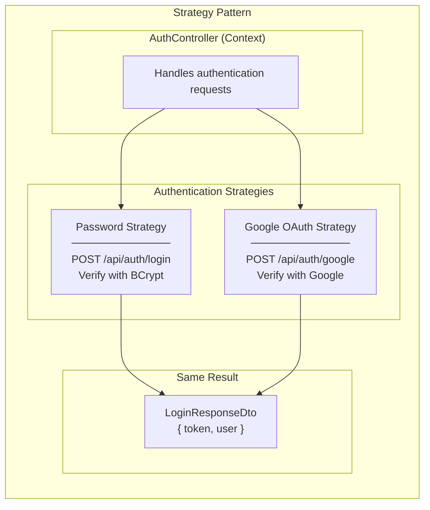

**Where:** Multiple authentication methods in AuthController

**Why Strategy:**
- Different algorithms for same goal (authentication)
- Client chooses which strategy (endpoint) to use
- All strategies return same LoginResponseDto

---

### 2. Factory Pattern (User Creation)

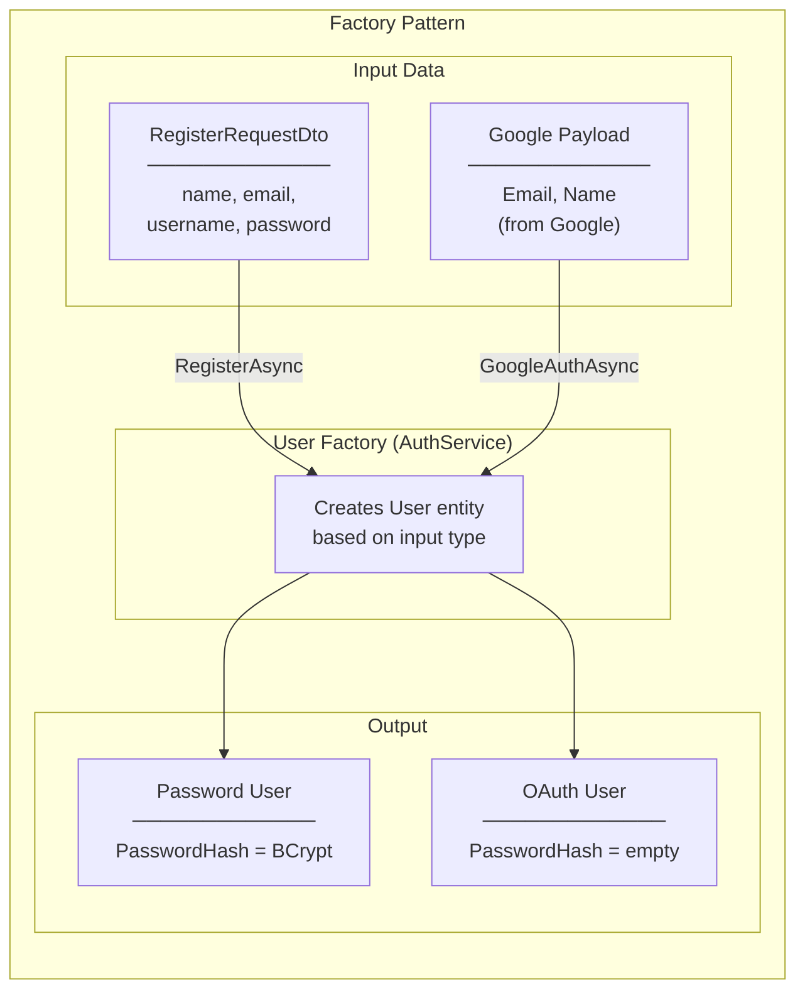

**Where:** `AuthService.GoogleAuthAsync()` creates OAuth users

**Why Factory:**
- Different user types from different inputs
- Encapsulates user creation logic
- Service decides how to construct User entity

---

### 3. Adapter Pattern (Google API Integration)

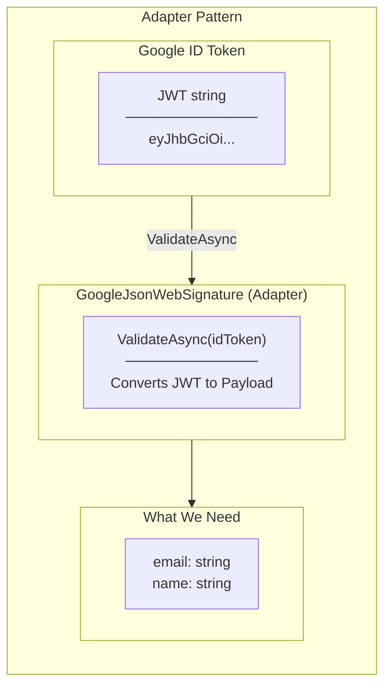

**Where:** `GoogleJsonWebSignature.ValidateAsync()` converts Google JWT to usable payload

**Why Adapter:**
- Google returns opaque JWT string
- We need structured data (email, name)
- Adapter converts between incompatible interfaces

---

### 4. Facade Pattern (GoogleAuthAsync)

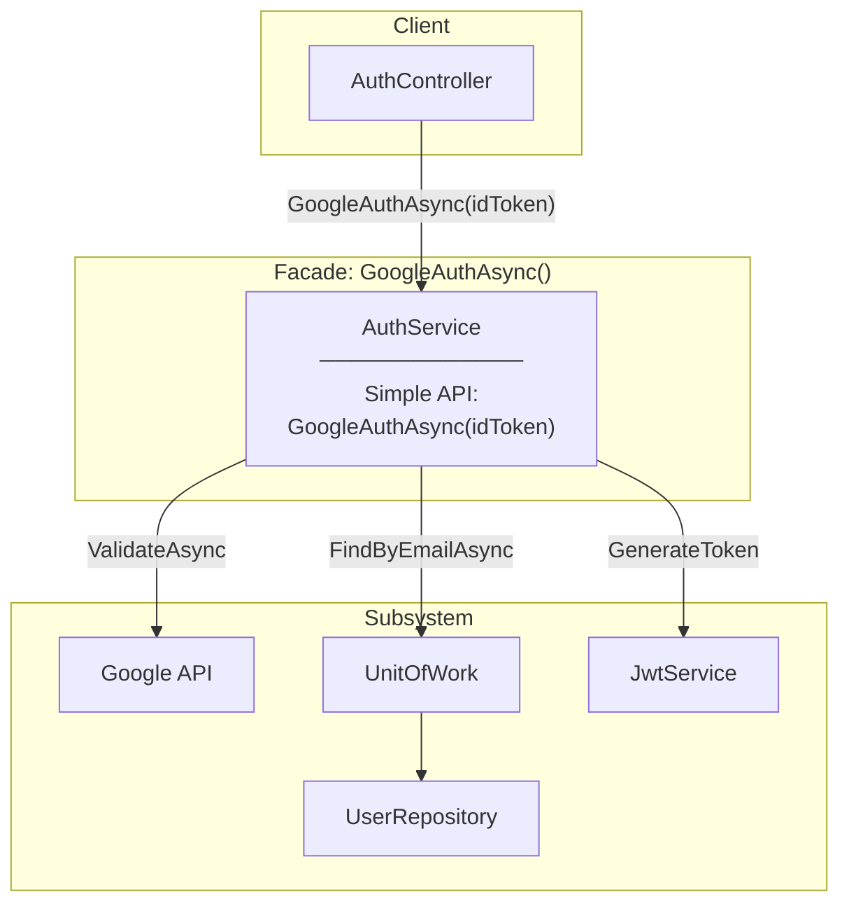

**Where:** `GoogleAuthAsync` hides complexity of Google validation + user management

**Why Facade:**
- Controller doesn't know about Google API details
- Single method does: validate → find/create → generate token
- Easy to use: pass idToken, get LoginResponseDto

---

### 5. Null Object Pattern (User Lookup)

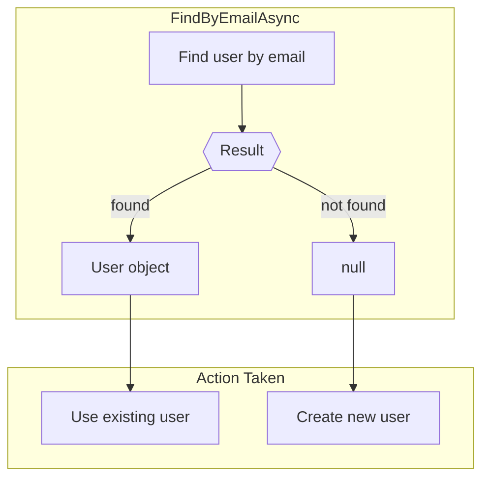

**Where:** User lookup in `GoogleAuthAsync`

**Why:**
- null means "create new user"
- Clear branching logic
- No exception for missing user (expected case)

---

### 6. Data Transfer Object (DTO) Pattern

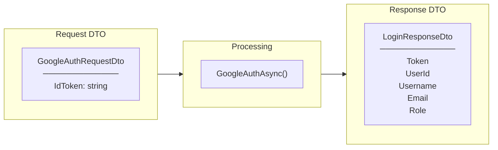

**Where:** `GoogleAuthRequestDto` and `LoginResponseDto`

**Why DTO:**
- Clear API contract
- Separate from domain entities
- Hide internal User structure (no PasswordHash)

---

## SOLID Principles Applied

### S - Single Responsibility Principle (SRP)

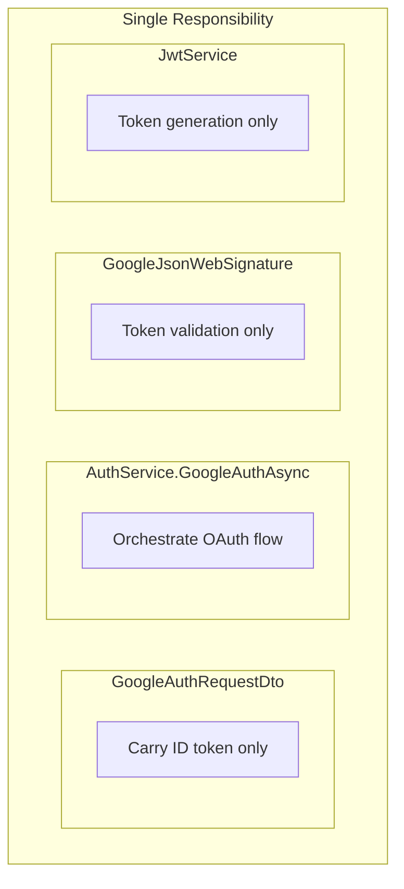

| Component | Single Responsibility |
|-----------|----------------------|
| GoogleAuthRequestDto | Carry Google ID token |
| GoogleJsonWebSignature | Validate token with Google |
| AuthService.GoogleAuthAsync | Orchestrate OAuth flow |
| JwtService | Generate our JWT token |
| UserRepository | Data access for users |

---

### O - Open/Closed Principle (OCP)

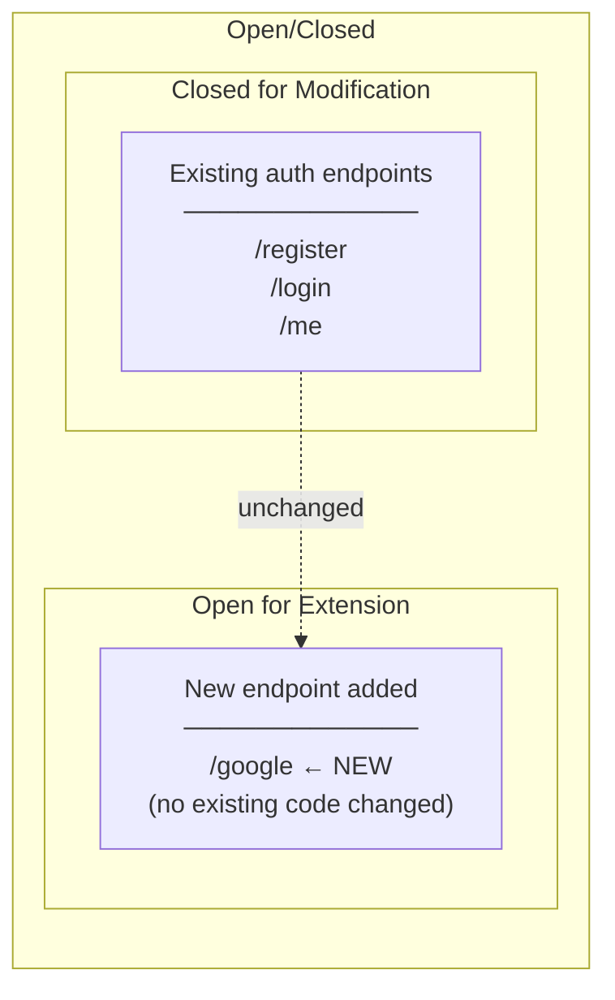

**Where Applied:**
- Added `/google` endpoint without changing `/login` or `/register`
- Added `GoogleAuthAsync` without modifying existing methods
- `IAuthService` interface extended, not changed

---

### L - Liskov Substitution Principle (LSP)

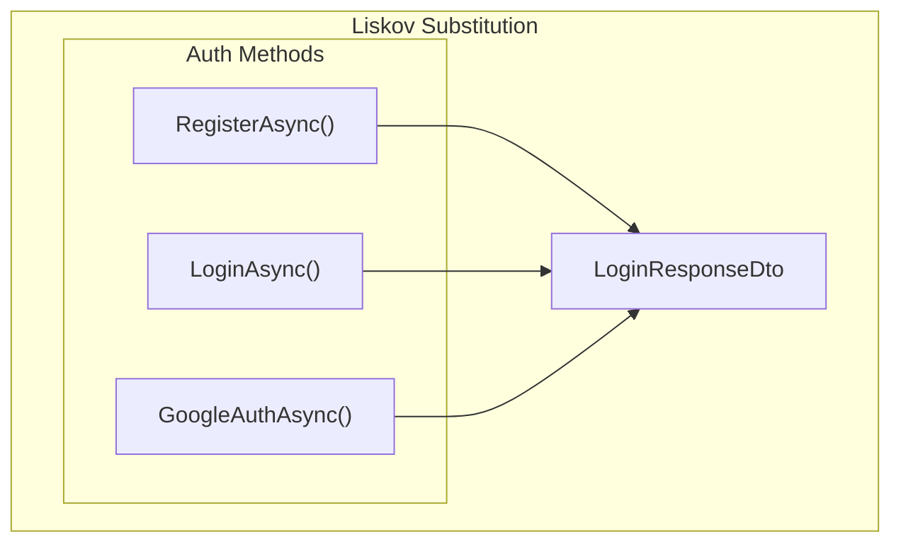

**Where Applied:**
- All auth methods return `LoginResponseDto`
- Client code works the same regardless of auth method
- Can substitute one auth method for another

---

### I - Interface Segregation Principle (ISP)

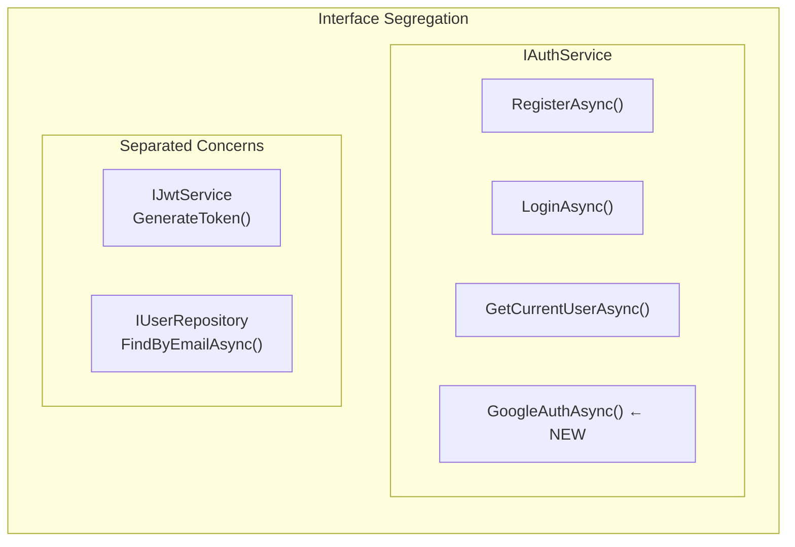

**Where Applied:**
- `IAuthService` has auth methods only
- `IJwtService` has token methods only
- Google API accessed directly (static method, no DI needed)

---

### D - Dependency Inversion Principle (DIP)

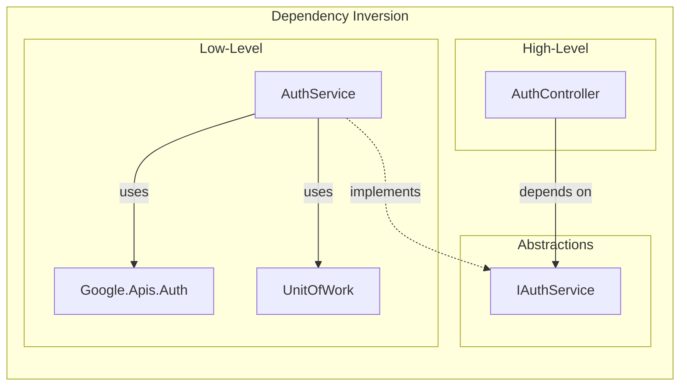

**Where Applied:**
- Controller depends on `IAuthService` interface
- Controller doesn't know about Google API or UnitOfWork
- DI Container injects AuthService at runtime

---

## Summary Table

| Pattern/Principle | Where Applied | Benefit |
|-------------------|---------------|---------|
| **Strategy** | Multiple auth endpoints | Same result, different methods |
| **Factory** | User creation | Password vs OAuth users |
| **Adapter** | Google API | Convert JWT to payload |
| **Facade** | GoogleAuthAsync | Hide OAuth complexity |
| **Null Object** | User lookup | Create if not exists |
| **DTO** | Request/Response | Clear API contract |
| **SRP** | Separate concerns | Each class has one job |
| **OCP** | New endpoint | No existing code changed |
| **LSP** | Auth methods | All return same type |
| **ISP** | Focused interfaces | Auth-related methods only |
| **DIP** | Constructor injection | Loose coupling |

---

## Related Documentation

- [00-development-plan.md](./00-development-plan.md) - Implementation details
- [02-programming-concepts.md](./02-programming-concepts.md) - Programming concepts
