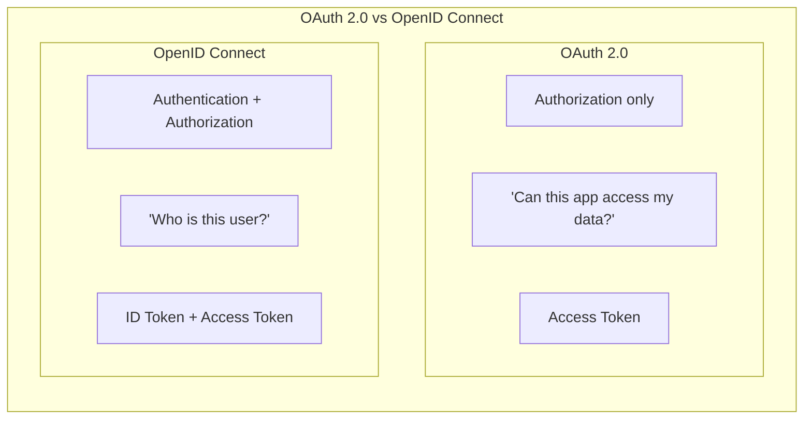
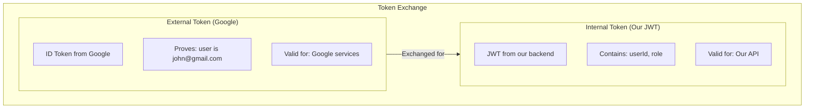
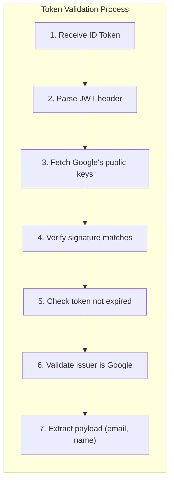
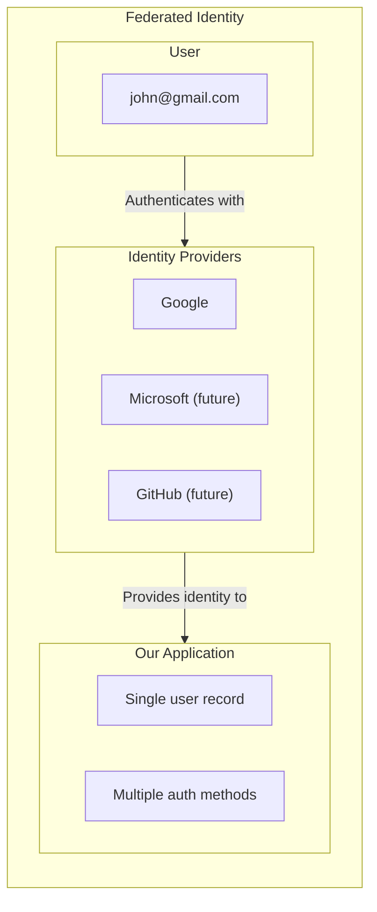
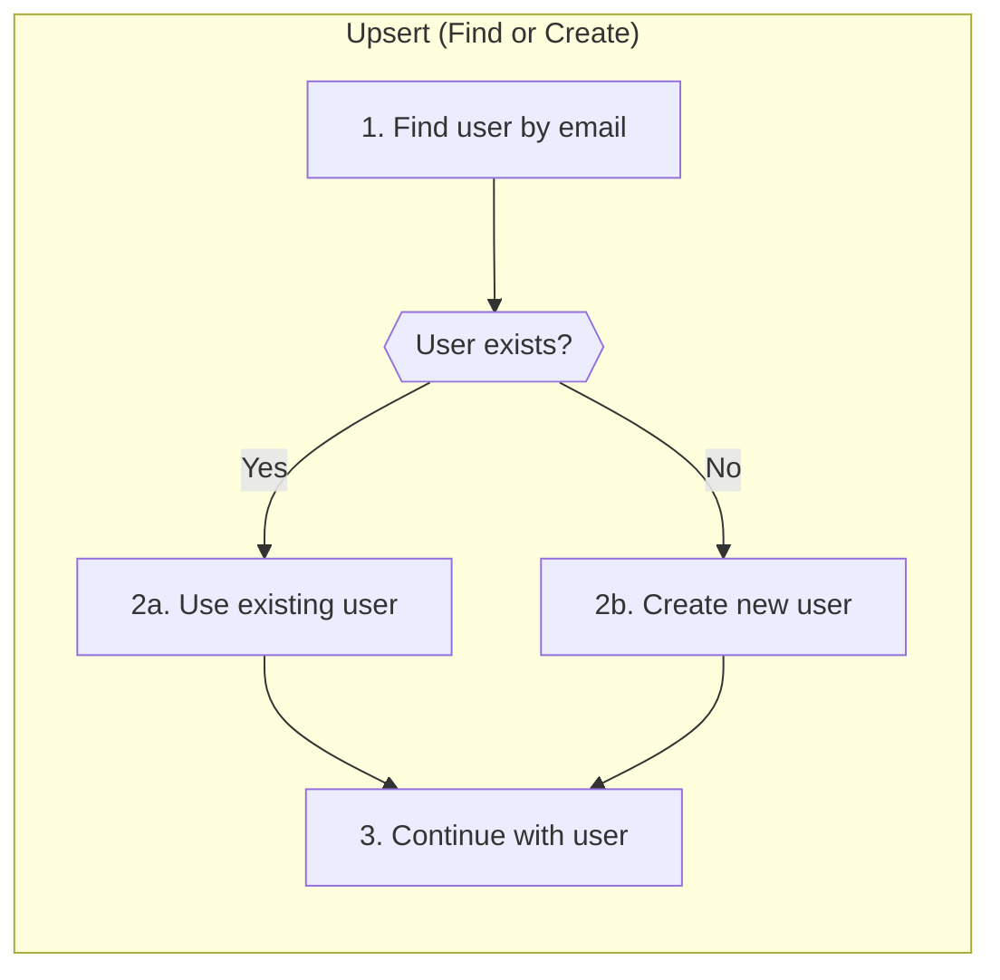
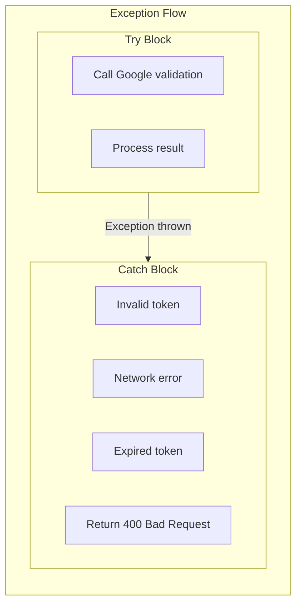
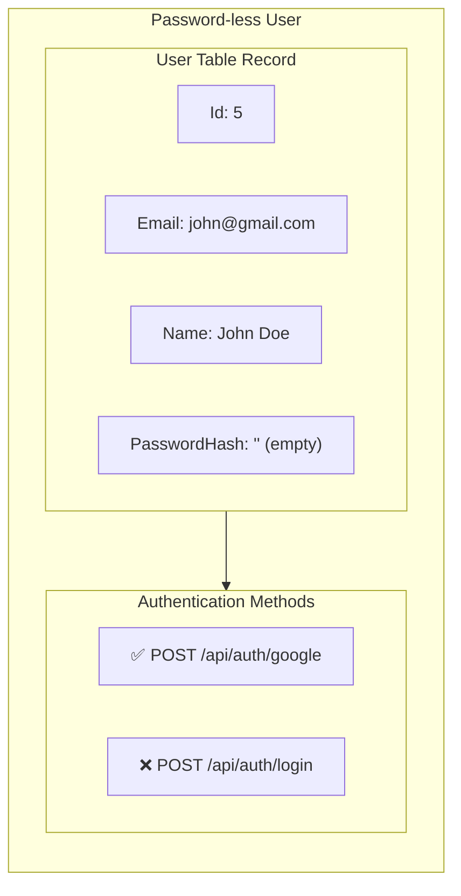

# Programming Concepts Recap (Language Agnostic)

## Table of Contents

1. [OAuth 2.0 / OpenID Connect](#1-oauth-20--openid-connect)
2. [Token Exchange Pattern](#2-token-exchange-pattern)
3. [Third-Party Token Validation](#3-third-party-token-validation)
4. [Federated Identity](#4-federated-identity)
5. [Upsert Pattern](#5-upsert-pattern)
6. [Exception-Based Flow Control](#6-exception-based-flow-control)
7. [Password-less Authentication](#7-password-less-authentication)

---

## 1. OAuth 2.0 / OpenID Connect

**Concept:** OAuth 2.0 is an authorization framework that enables third-party applications to obtain limited access. OpenID Connect (OIDC) adds authentication on top of OAuth 2.0.



**Key Insight:**

| Protocol | Primary Purpose | Token Type | Contains |
|----------|-----------------|------------|----------|
| OAuth 2.0 | Authorization | Access Token | Permissions/scopes |
| OpenID Connect | Authentication | ID Token | User identity info |

**Google Sign-In uses OpenID Connect:**
- Returns ID Token (JWT with user info)
- Contains email, name, picture
- Backend validates ID Token, not Access Token

---

## 2. Token Exchange Pattern

**Concept:** Exchange one type of credential for another. User proves identity with external token, receives internal token for API access.



**Key Insight:**

| Aspect | External Token | Internal Token |
|--------|----------------|----------------|
| Issuer | Google | Our Backend |
| Trust | We trust Google | Our API trusts us |
| Content | Google user info | Our user info |
| Lifetime | Short (~1 hour) | Configurable |

**Why Exchange?**
- External tokens contain external user IDs
- Our API needs our user ID and role
- Separation of concerns: Google handles auth, we handle authorization

---

## 3. Third-Party Token Validation

**Concept:** Verify that a token was genuinely issued by a trusted third party (like Google) by validating its cryptographic signature.



**Key Insight:**

| Validation Step | What It Checks | Failure Means |
|-----------------|----------------|---------------|
| Signature | Token signed by Google | Token forged or tampered |
| Expiration | Token not expired | Token too old |
| Issuer | Token from accounts.google.com | Wrong identity provider |

**Google.Apis.Auth handles all this:**
```csharp
var payload = await GoogleJsonWebSignature.ValidateAsync(idToken);
// If we reach here, token is valid
// payload.Email, payload.Name are safe to use
```

---

## 4. Federated Identity

**Concept:** Users authenticate with an external identity provider (IdP) rather than creating credentials in your system. Trust is delegated to the IdP.



**Key Insight:**

| Aspect | Traditional Auth | Federated Identity |
|--------|------------------|-------------------|
| Password storage | We store hash | We don't store password |
| Password reset | We implement | IdP handles |
| 2FA | We implement | IdP handles |
| Trust | User trusts us | User trusts IdP |

**Benefit:** Users don't need another password. Security handled by Google/Microsoft/etc.

---

## 5. Upsert Pattern

**Concept:** "Update or Insert" - find existing record or create new one in a single logical operation. Avoids duplicate records for the same identity.



**Key Insight:**

| Scenario | Action | Result |
|----------|--------|--------|
| First Google login | Create user | New user in DB |
| Second Google login | Find user | Existing user used |
| Email matches existing | Find user | Existing user used |

**Implementation:**
```csharp
var user = await _unitOfWork.Users.FindByEmailAsync(payload.Email);

if (user == null)
{
    user = new User { Email = payload.Email, ... };
    await _unitOfWork.Users.AddAsync(user);
    await _unitOfWork.SaveChangesAsync();
}

// Continue with user (either found or created)
```

**Why Not Just Insert?**
- Same user may login multiple times
- Would create duplicate accounts
- Email is unique identifier from OAuth

---

## 6. Exception-Based Flow Control

**Concept:** Use exceptions to handle failure cases, especially when dealing with external services that may fail in unpredictable ways.



**Key Insight:**

| Approach | When to Use | Example |
|----------|-------------|---------|
| Return codes | Expected outcomes | User not found |
| Exceptions | Unexpected failures | Invalid token, network error |

**Controller Pattern:**
```csharp
try
{
    var result = await _authService.GoogleAuthAsync(request.IdToken);
    return Ok(result);
}
catch (Exception ex)
{
    return BadRequest(new ErrorResponseDto
    {
        Error = "GOOGLE_AUTH_FAILED",
        Message = ex.Message
    });
}
```

**Why Exceptions Here?**
- Token validation can fail in many ways
- Google library throws exceptions for all failures
- Cleaner than checking multiple error conditions

---

## 7. Password-less Authentication

**Concept:** Users authenticate without ever setting or entering a password. Authentication is delegated entirely to external providers.



**Key Insight:**

| Aspect | Password User | OAuth-Only User |
|--------|---------------|-----------------|
| PasswordHash | BCrypt hash | Empty string |
| /api/auth/login | Works | Fails (no password to verify) |
| /api/auth/google | N/A (no linking) | Works |
| Password reset | Available | Not needed |

**Security Consideration:**
- Empty password hash cannot be verified
- BCrypt.Verify("", "") returns false
- OAuth user cannot login with password endpoint

**Future Enhancement:**
- Could allow linking OAuth account with password
- User could then login either way
- Requires "set password" flow

---

## Summary Table

| Concept | Where Applied | Key Benefit |
|---------|---------------|-------------|
| **OAuth 2.0 / OIDC** | Google Sign-In | Standardized auth protocol |
| **Token Exchange** | ID Token → JWT | Convert external to internal auth |
| **Third-Party Validation** | GoogleJsonWebSignature | Cryptographic trust |
| **Federated Identity** | Google as IdP | No password management |
| **Upsert Pattern** | FindByEmail or Create | Prevent duplicate users |
| **Exception Flow** | Controller try/catch | Handle validation failures |
| **Password-less Auth** | Empty PasswordHash | OAuth-only users |

---

## Related Documentation

- [00-development-plan.md](./00-development-plan.md) - Implementation details
- [01-architecture-diagram.md](./01-architecture-diagram.md) - System architecture
- [02-design-patterns-and-solid.md](./02-design-patterns-and-solid.md) - Design patterns
