# Token Refresh Backend Implementation Plan

## Overview

Task #25: Add POST /api/auth/refresh endpoint to refresh access tokens using refresh tokens.

**GitHub Issue:** #25

---

## What Was Implemented

| Component | Location | Purpose |
|-----------|----------|---------|
| RefreshToken field | LoginResponseDto.cs | Return refresh token in auth responses |
| RefreshTokenRequestDto.cs | Controllers/DTOs/Auth/ | Request DTO for refresh token |
| ConcurrentDictionary | AuthService.cs | In-memory refresh token storage |
| GenerateRefreshToken() | AuthService.cs | Private helper to create/store refresh tokens |
| IAuthService.RefreshTokenAsync | Services/Interfaces/ | Service contract method signature |
| AuthService.RefreshTokenAsync | Services/ | Refresh token validation + new token generation |
| AuthController.RefreshToken | Controllers/ | POST /api/auth/refresh endpoint |

---

## Implementation Flow

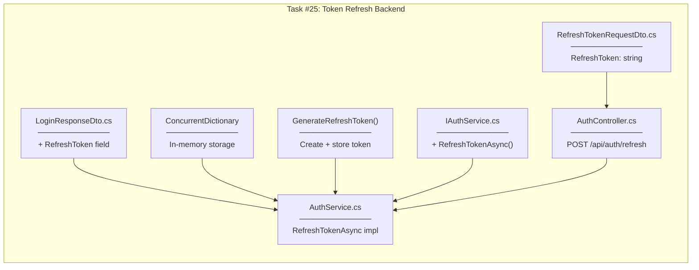

---

## Token Lifecycle

### Before (Single Token)

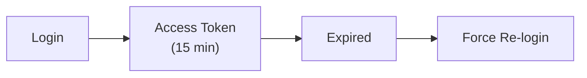

### After (Dual Token)

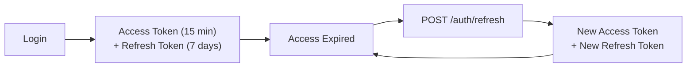

---

## RefreshTokenRequestDto

### Responsibility

| Aspect | Description |
|--------|-------------|
| **What it does** | Carries refresh token from frontend to backend |
| **Where it's used** | Request body of POST /api/auth/refresh |
| **What it contains** | Single RefreshToken property |

### Properties

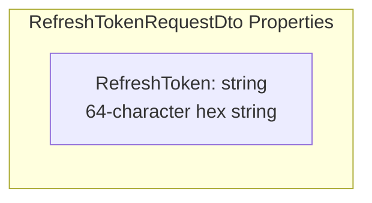

---

## In-Memory Token Storage

### ConcurrentDictionary

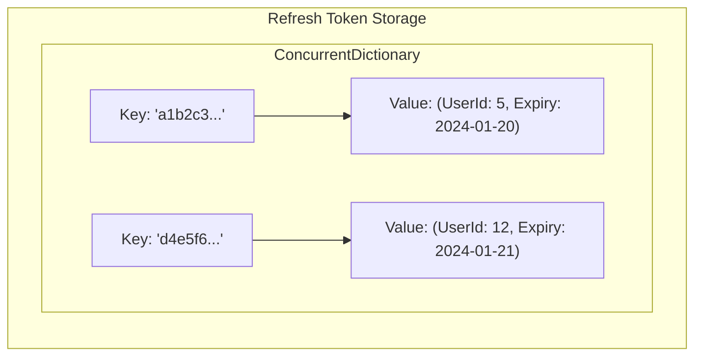

| Aspect | Description |
|--------|-------------|
| **Key** | Refresh token string (64 chars) |
| **Value** | Tuple of (UserId, Expiry DateTime) |
| **Thread-safe** | Yes (ConcurrentDictionary) |
| **Persistence** | None (lost on restart) |

### Why In-Memory?

| Approach | Pros | Cons |
|----------|------|------|
| **In-Memory (current)** | Simple, fast, no DB changes | Lost on restart |
| **Database (production)** | Persistent, revocable | More complex |
| **Redis (enterprise)** | Fast, persistent, distributed | External dependency |

---

## GenerateRefreshToken() Helper

### Responsibility

| Aspect | Description |
|--------|-------------|
| **What it does** | Creates random token string and stores in dictionary |
| **Where it's called** | RegisterAsync, LoginAsync, GoogleAuthAsync, RefreshTokenAsync |
| **Returns** | 64-character hex string |

### Logic

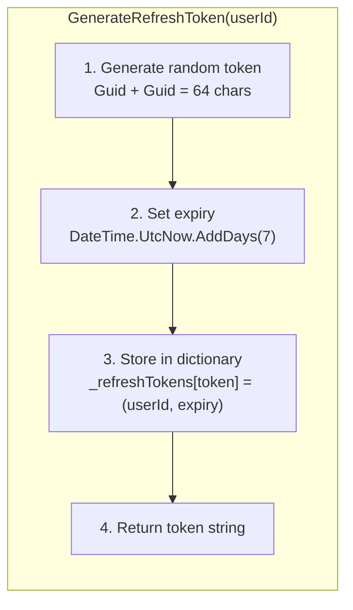

### Token Format

```
Guid.NewGuid().ToString("N") + Guid.NewGuid().ToString("N")
= 32 chars                  + 32 chars
= 64 character hex string
Example: "a1b2c3d4e5f6789012345678901234567890abcdef1234567890abcdef12345678"
```

---

## RefreshTokenAsync (Service Method)

### Responsibility

| Aspect | Description |
|--------|-------------|
| **What it does** | Validates refresh token, issues new tokens |
| **Where it's called** | From AuthController.RefreshToken |
| **Returns** | LoginResponseDto with new tokens |

### Logic

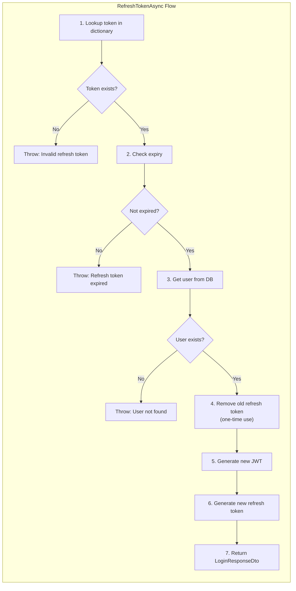

### Token Rotation

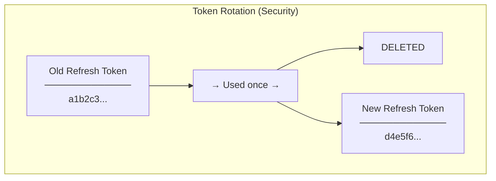

| Aspect | Without Rotation | With Rotation |
|--------|------------------|---------------|
| Token reuse | Same token forever | New token each refresh |
| If stolen | Attacker has permanent access | Attacker can use only once |
| Detection | Hard to detect theft | Original user gets error on next refresh |

---

## RefreshToken Endpoint

### Responsibility

| Aspect | Description |
|--------|-------------|
| **What it does** | HTTP entry point for token refresh |
| **Route** | POST /api/auth/refresh |
| **Auth Required** | No - access token is expired |
| **Returns** | 200 OK with new tokens, or 401 Unauthorized |

### Logic

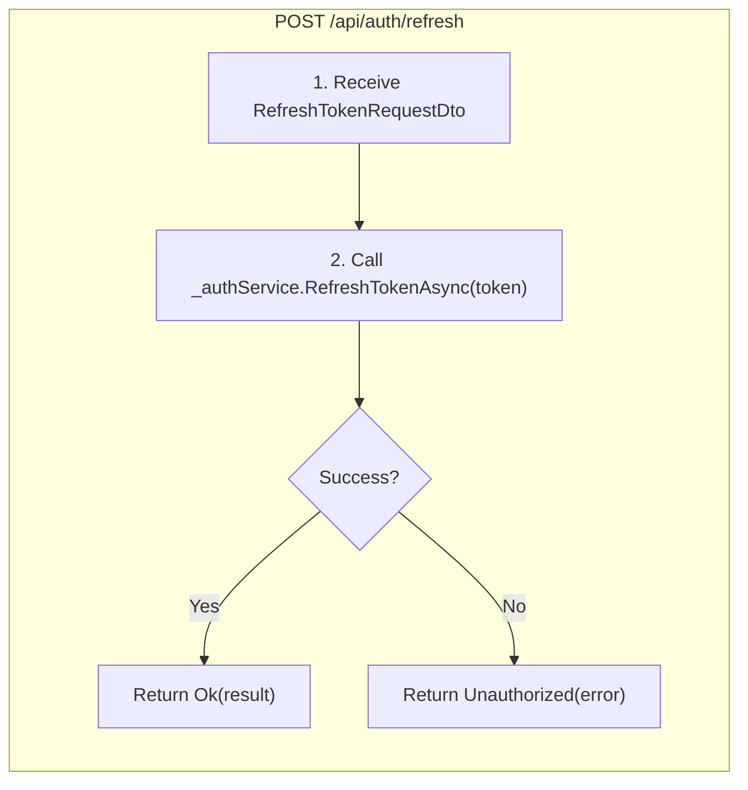

### Why No [Authorize]?

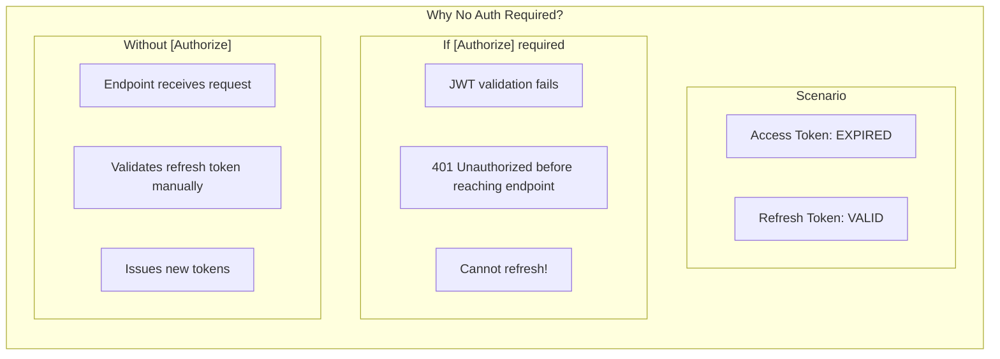

---

## Request Flow (End-to-End)

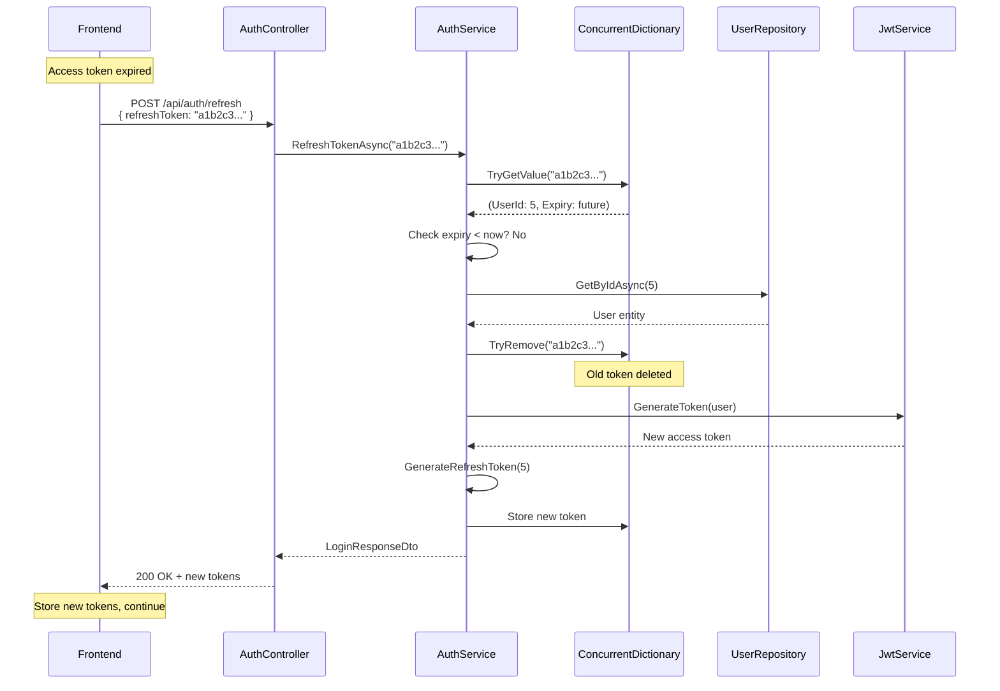

---

## All Auth Endpoints Now Return RefreshToken

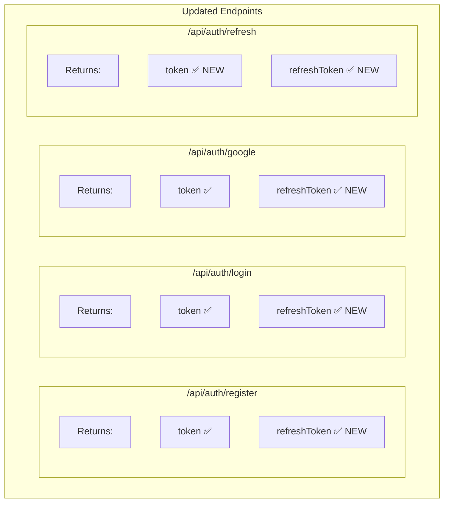

| Endpoint | Input | Output |
|----------|-------|--------|
| POST /api/auth/register | name, email, username, password | token + refreshToken |
| POST /api/auth/login | usernameOrEmail, password | token + refreshToken |
| POST /api/auth/google | idToken | token + refreshToken |
| POST /api/auth/refresh | refreshToken | token + refreshToken |

---

## Error Handling

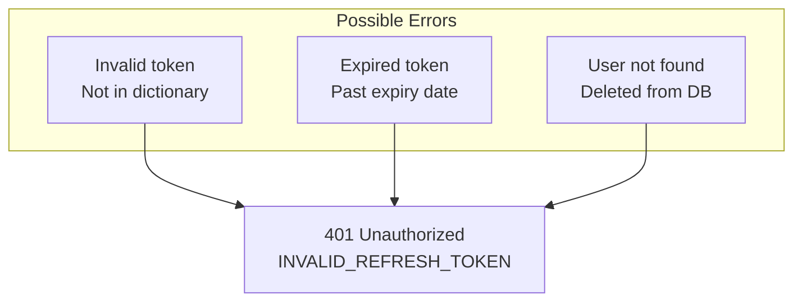

### Error Response

```json
{
  "error": "INVALID_REFRESH_TOKEN",
  "message": "Refresh token expired."
}
```

---

## Checklist

- [x] Add RefreshToken field to LoginResponseDto
- [x] Create RefreshTokenRequestDto
- [x] Add ConcurrentDictionary for token storage
- [x] Create GenerateRefreshToken helper method
- [x] Update RegisterAsync to include refresh token
- [x] Update LoginAsync to include refresh token
- [x] Update GoogleAuthAsync to include refresh token
- [x] Add RefreshTokenAsync to IAuthService
- [x] Implement RefreshTokenAsync in AuthService
- [x] Add RefreshToken endpoint to AuthController
- [x] Build successful

---

## Related Documentation

- [01-architecture-diagram.md](./01-architecture-diagram.md) - System architecture
- [02-design-patterns-and-solid.md](./02-design-patterns-and-solid.md) - Design patterns
- [03-programming-concepts.md](./03-programming-concepts.md) - Programming concepts
- [Task #6 Auth Service](../06-auth-service/00-development-plan.md)
- [Task #23 Google OAuth](../23-google-oauth/00-development-plan.md)
