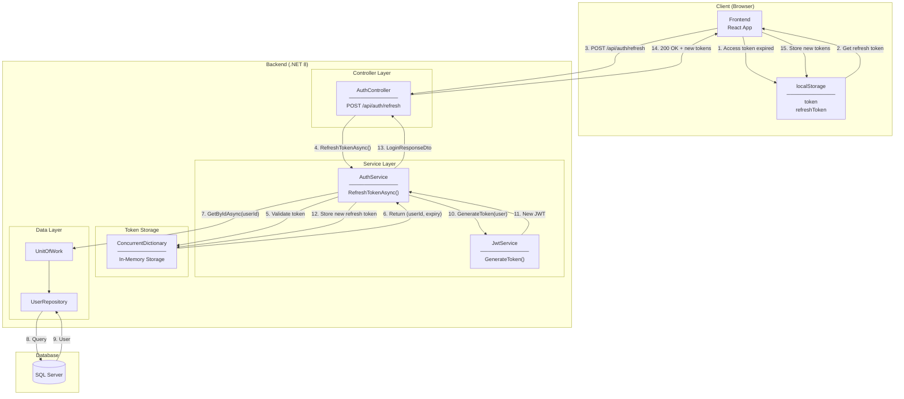
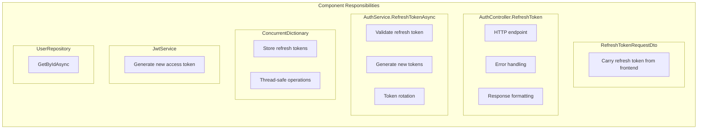
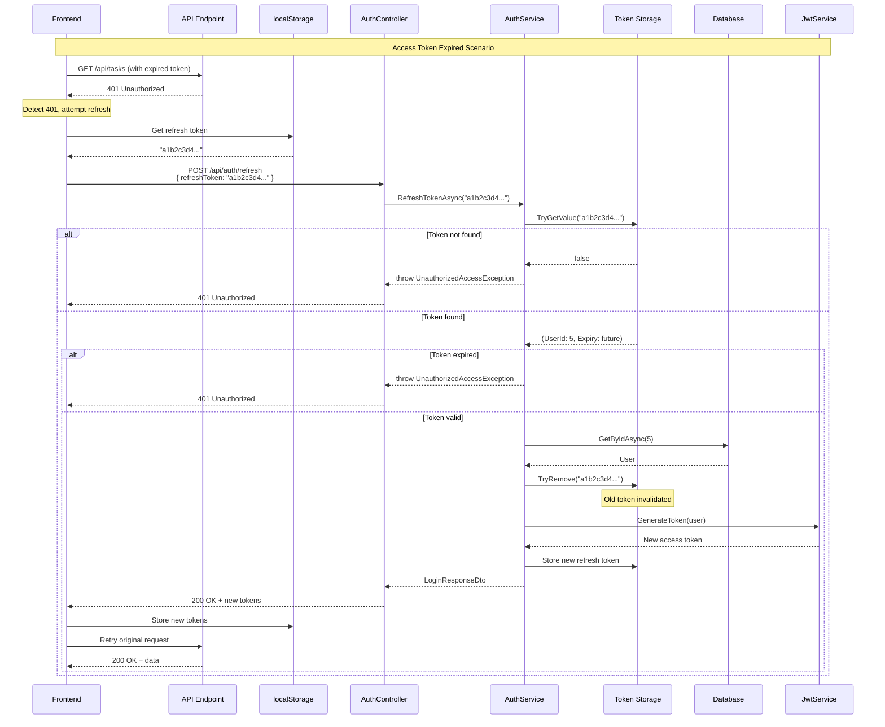
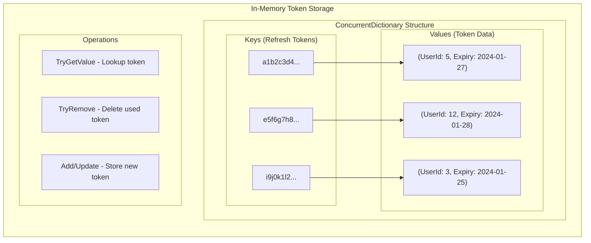
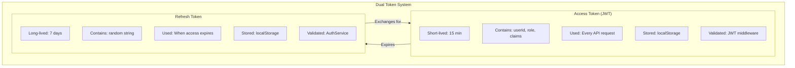
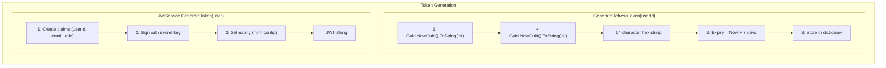
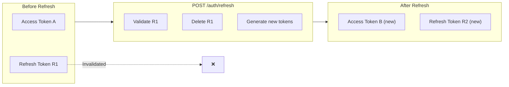
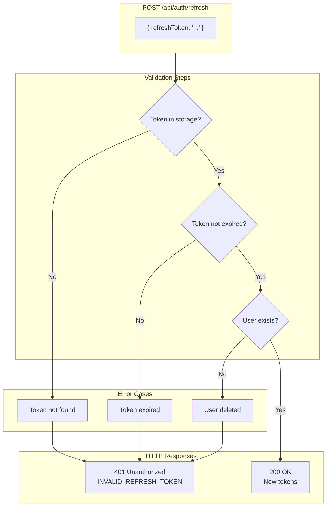
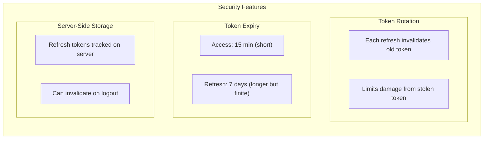

# Token Refresh Architecture Diagram

## System Architecture



---

## Component Responsibilities



| Component | Responsibility |
|-----------|----------------|
| RefreshTokenRequestDto | Carry refresh token |
| AuthController | HTTP endpoint, error handling |
| AuthService | Token validation, rotation, generation |
| ConcurrentDictionary | Thread-safe token storage |
| JwtService | Generate new access tokens |
| UserRepository | Fetch user data |

---

## Token Refresh Flow Sequence



---

## Token Storage Architecture



| Operation | Method | Thread-Safe |
|-----------|--------|-------------|
| Lookup | TryGetValue | Yes |
| Delete | TryRemove | Yes |
| Add | indexer assignment | Yes |

---

## Dual Token Architecture



| Aspect | Access Token | Refresh Token |
|--------|--------------|---------------|
| Format | JWT (encoded) | Random hex string |
| Lifetime | 15 minutes | 7 days |
| Contains | User claims | Just token string |
| Validated by | JWT middleware | AuthService |
| Storage (backend) | Not stored | ConcurrentDictionary |
| Usage | Every request | Only for refresh |

---

## Token Generation Flow



---

## Token Rotation Diagram



| Step | Token R1 Status | Token R2 Status |
|------|-----------------|-----------------|
| Before refresh | Valid, stored | Does not exist |
| During refresh | Removed from storage | Being created |
| After refresh | Invalid (not in storage) | Valid, stored |

---

## Error Handling Flow



---

## File Structure

```
Backend/TaskCollaborationApp.API/
├── Controllers/
│   ├── AuthController.cs              ← POST /api/auth/refresh
│   └── DTOs/
│       └── Auth/
│           ├── LoginResponseDto.cs    ← + RefreshToken field
│           └── RefreshTokenRequestDto.cs ← NEW
├── Services/
│   ├── Interfaces/
│   │   └── IAuthService.cs            ← + RefreshTokenAsync
│   ├── AuthService.cs                 ← ConcurrentDictionary
│   │                                    + GenerateRefreshToken
│   │                                    + RefreshTokenAsync
│   └── JwtService.cs                  ← Reused
└── Repositories/
    └── UserRepository.cs              ← GetByIdAsync
```

---

## Security Considerations



| Threat | Mitigation |
|--------|------------|
| Stolen access token | Short expiry (15 min) |
| Stolen refresh token | Token rotation, one-time use |
| Token replay | Old tokens removed from storage |
| Session hijacking | User ID validated on each refresh |

---

## Related Documentation

- [00-development-plan.md](./00-development-plan.md) - Implementation details
- [02-design-patterns-and-solid.md](./02-design-patterns-and-solid.md) - Design patterns
- [03-programming-concepts.md](./03-programming-concepts.md) - Programming concepts
