# Design Patterns & SOLID Principles in Token Refresh

## GoF Design Patterns Applied

### 1. Strategy Pattern (Token Generation)

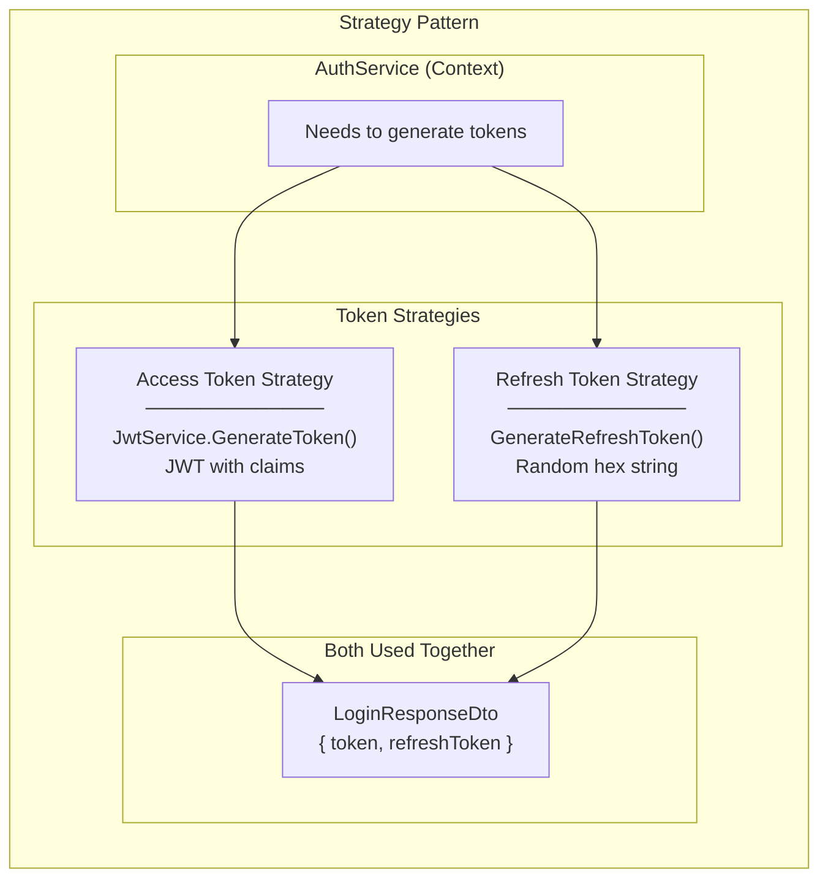

**Where:** AuthService uses two different token generation strategies

**Why Strategy:**
- Different algorithms for different token types
- JWT for access (stateless, self-contained)
- Random string for refresh (server-validated)
- Both strategies produce tokens, but with different characteristics

---

### 2. Template Method Pattern (Auth Flow)

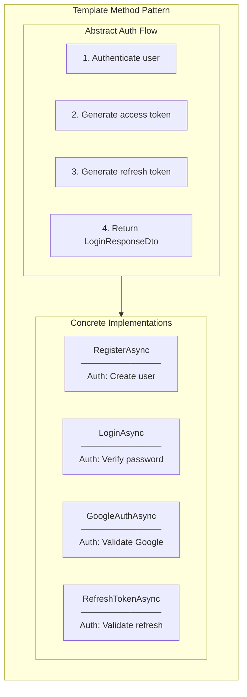

**Where:** All auth methods follow same pattern but vary in authentication step

**Why Template Method:**
- Steps 2-4 are identical across all methods
- Only Step 1 (authentication) differs
- Code reuse via helper methods (GenerateRefreshToken)

---

### 3. Flyweight Pattern (Token Storage)

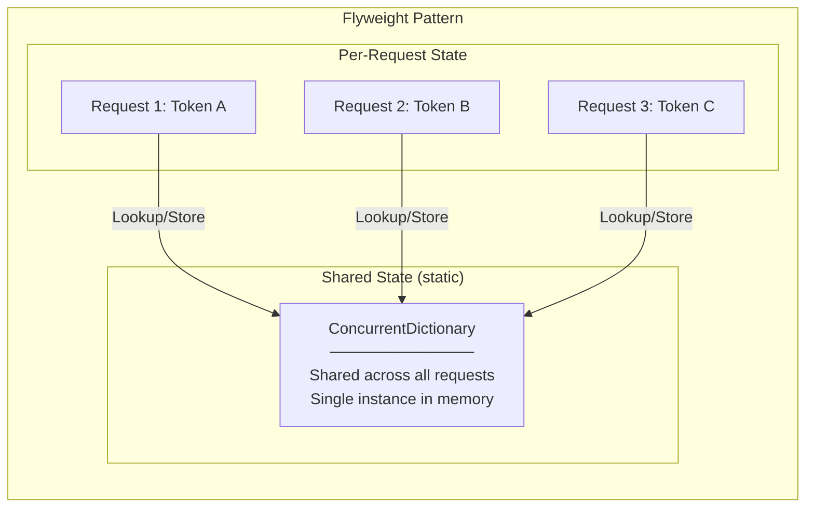

**Where:** Static ConcurrentDictionary shared across all AuthService instances

**Why Flyweight:**
- AuthService is Scoped (new instance per request)
- Token storage must persist across requests
- Static dictionary = single shared instance
- Reduces memory usage vs. per-instance storage

---

### 4. Command Pattern (Token Operations)

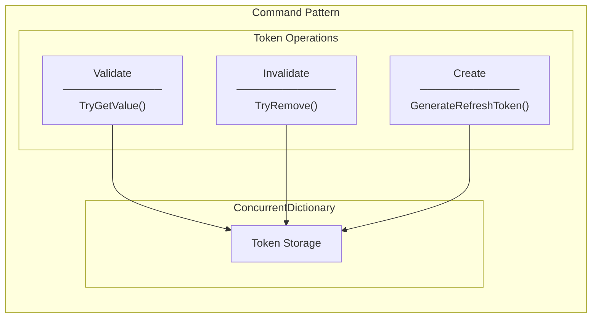

**Where:** Token CRUD operations on dictionary

**Why Command-like:**
- Each operation encapsulates an action on storage
- Operations can be composed (validate → invalidate → create)
- Clear separation of concerns

---

### 5. Null Object Pattern (Token Lookup)

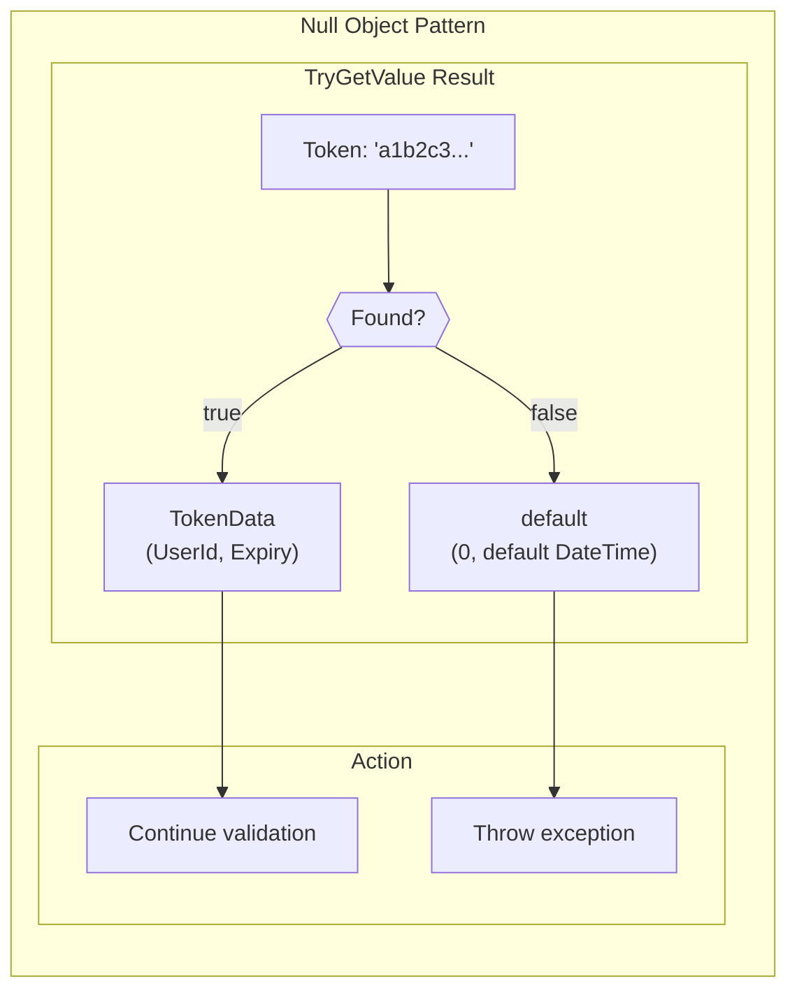

**Where:** TryGetValue returns false + default value instead of throwing

**Why:**
- Avoids exception for expected "not found" case
- Boolean return indicates success/failure
- Cleaner control flow

---

### 6. Data Transfer Object (DTO) Pattern

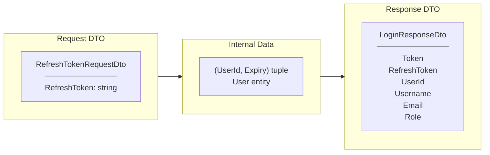

**Where:** RefreshTokenRequestDto and LoginResponseDto

**Why DTO:**
- Clear API contract
- Hide internal tuple structure
- Consistent response format across all auth endpoints

---

### 7. Facade Pattern (RefreshTokenAsync)

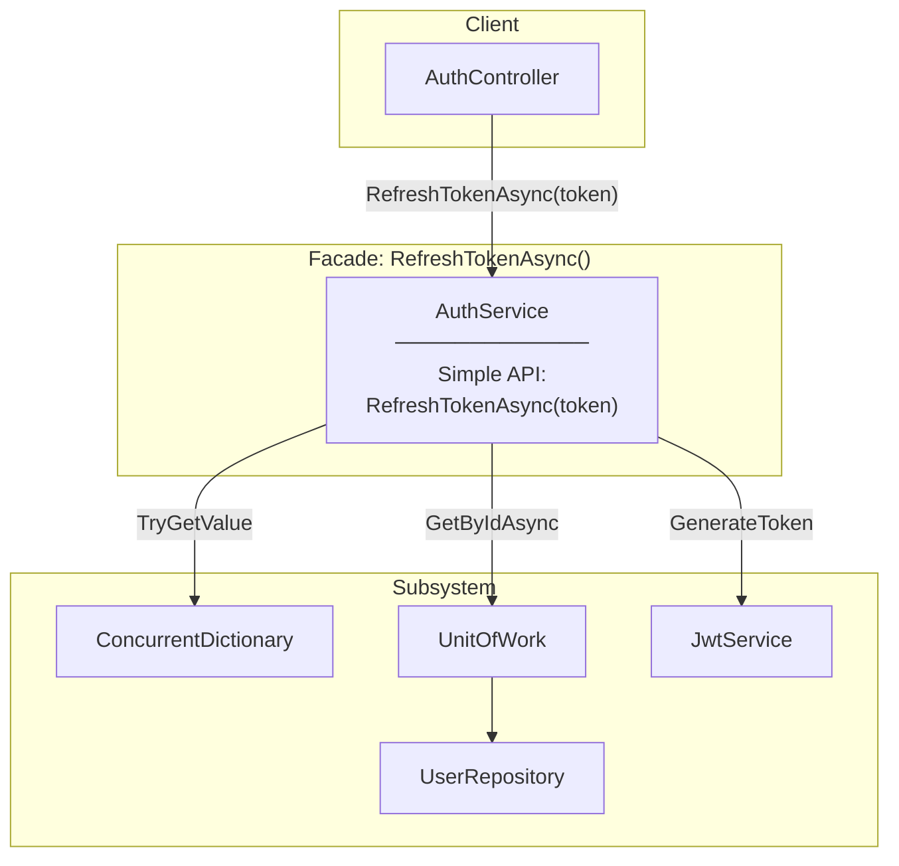

**Where:** RefreshTokenAsync hides complexity of token validation + rotation

**Why Facade:**
- Controller just calls one method
- All complexity hidden: validate, lookup user, rotate, generate
- Easy to use, easy to test

---

## SOLID Principles Applied

### S - Single Responsibility Principle (SRP)

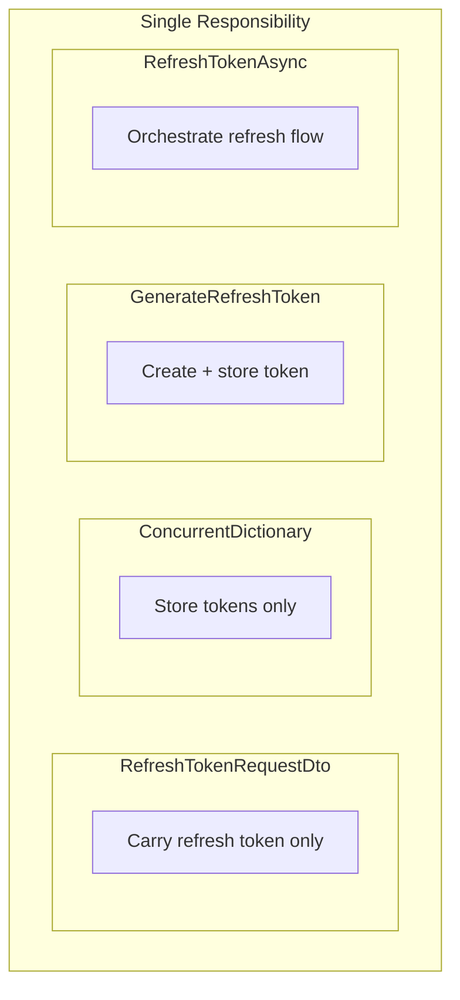

| Component | Single Responsibility |
|-----------|----------------------|
| RefreshTokenRequestDto | Carry refresh token in request |
| ConcurrentDictionary | Thread-safe token storage |
| GenerateRefreshToken | Create and store new refresh token |
| RefreshTokenAsync | Orchestrate token refresh flow |
| JwtService | Generate JWT access tokens |

---

### O - Open/Closed Principle (OCP)

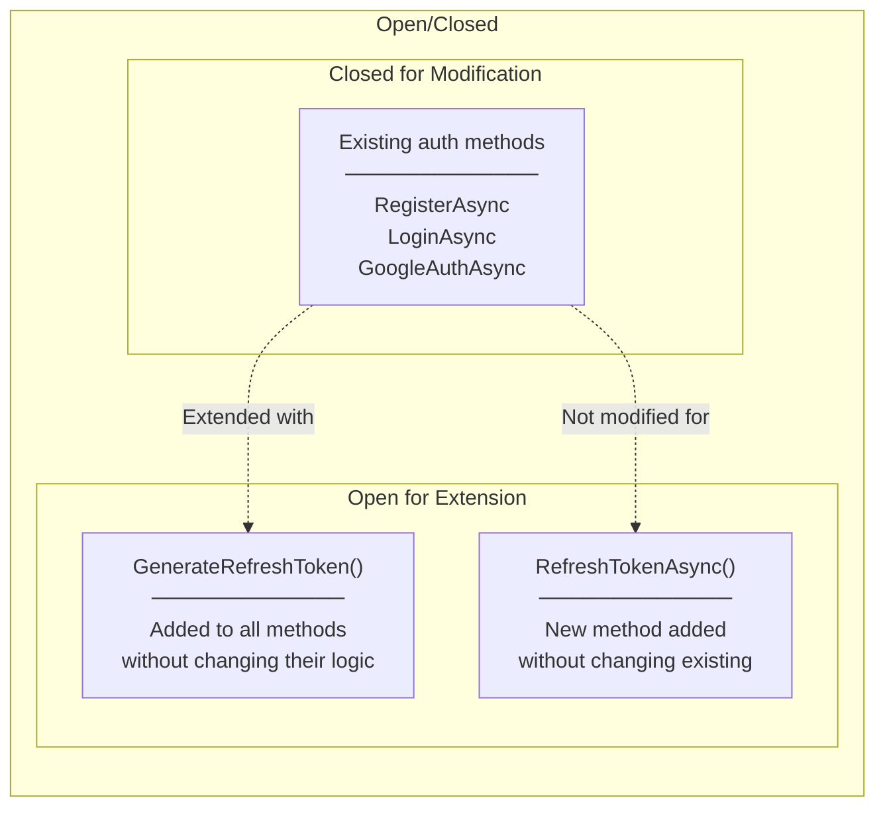

**Where Applied:**
- Added refresh token to existing methods by calling helper
- Added RefreshTokenAsync without changing other methods
- LoginResponseDto extended with new field (additive change)

---

### L - Liskov Substitution Principle (LSP)

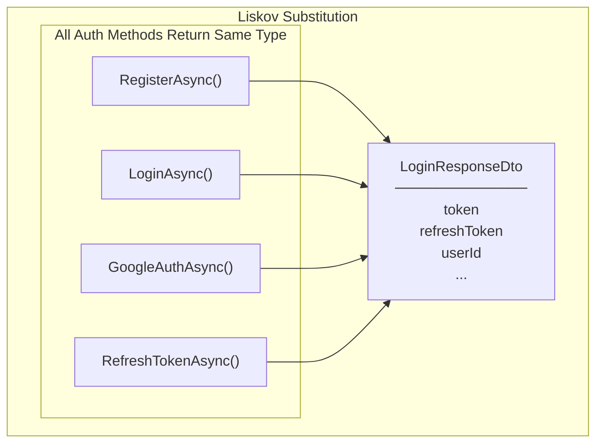

**Where Applied:**
- All auth methods return LoginResponseDto
- Frontend can handle any auth response the same way
- RefreshTokenAsync follows same contract as other methods

---

### I - Interface Segregation Principle (ISP)

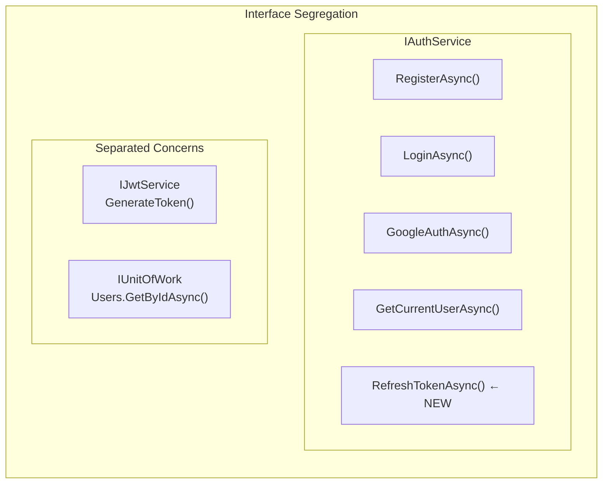

**Where Applied:**
- IAuthService contains only auth-related methods
- Token storage is implementation detail (not in interface)
- JWT generation delegated to IJwtService

---

### D - Dependency Inversion Principle (DIP)

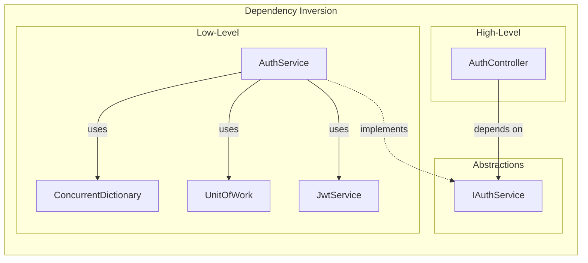

**Where Applied:**
- Controller depends on IAuthService interface
- Controller doesn't know about ConcurrentDictionary
- DI Container injects AuthService at runtime

---

## Summary Table

| Pattern/Principle | Where Applied | Benefit |
|-------------------|---------------|---------|
| **Strategy** | Access vs Refresh token generation | Different algorithms, same goal |
| **Template Method** | Auth flow structure | Shared steps, varying authentication |
| **Flyweight** | Static ConcurrentDictionary | Single shared storage instance |
| **Command** | Token operations | Composable actions |
| **Null Object** | TryGetValue | No exception for "not found" |
| **DTO** | Request/Response | Clear API contract |
| **Facade** | RefreshTokenAsync | Hide complexity |
| **SRP** | Separate concerns | Each component has one job |
| **OCP** | New functionality | No existing code broken |
| **LSP** | Consistent return type | Substitutable methods |
| **ISP** | Focused interface | Auth methods only |
| **DIP** | Interface dependency | Loose coupling |

---

## Related Documentation

- [00-development-plan.md](./00-development-plan.md) - Implementation details
- [01-architecture-diagram.md](./01-architecture-diagram.md) - System architecture
- [03-programming-concepts.md](./03-programming-concepts.md) - Programming concepts
