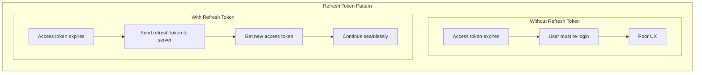
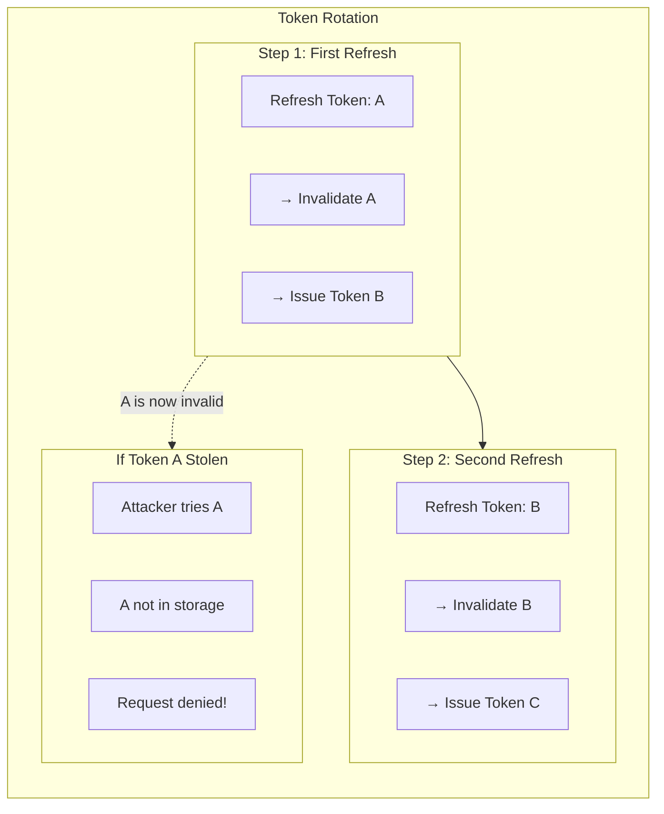
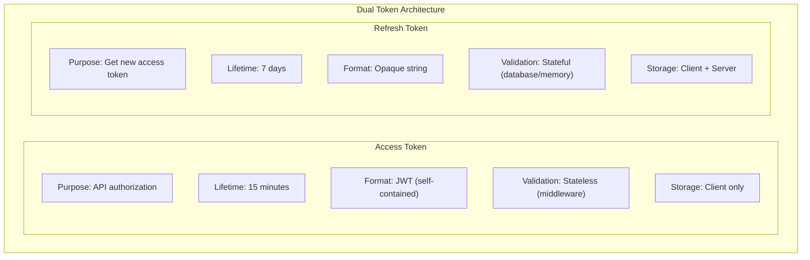
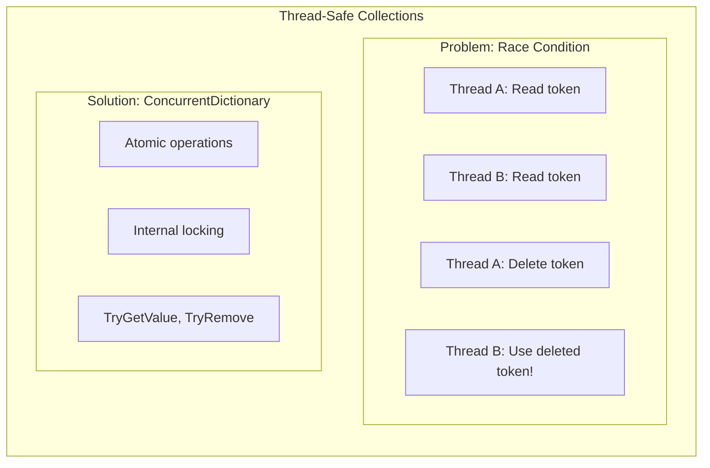
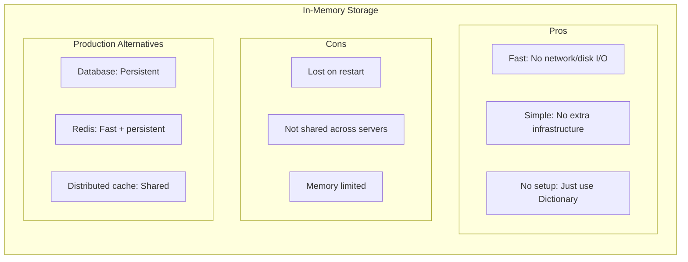
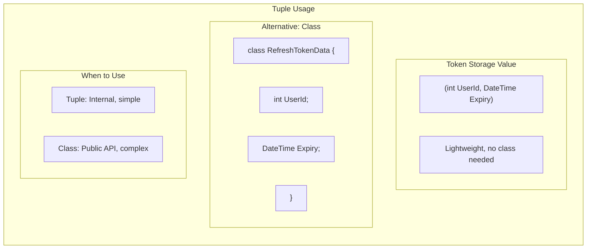
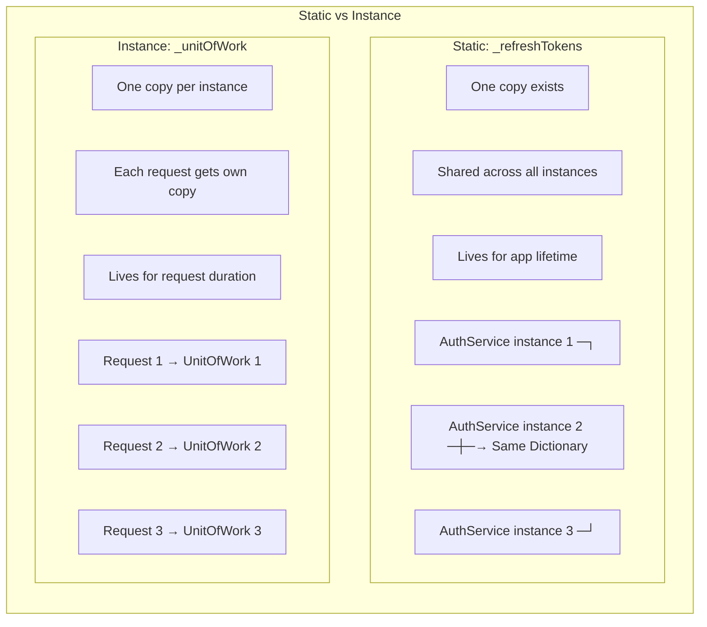

# Programming Concepts Recap (Language Agnostic)

## Table of Contents

1. [Refresh Token Pattern](#1-refresh-token-pattern)
2. [Token Rotation](#2-token-rotation)
3. [Dual Token Architecture](#3-dual-token-architecture)
4. [Thread-Safe Collections](#4-thread-safe-collections)
5. [In-Memory Caching](#5-in-memory-caching)
6. [Tuple Return Values](#6-tuple-return-values)
7. [Static vs Instance Members](#7-static-vs-instance-members)

---

## 1. Refresh Token Pattern

**Concept:** A long-lived credential used to obtain new short-lived access tokens without requiring the user to re-authenticate.



**Key Insight:**

| Aspect | Access Token Only | With Refresh Token |
|--------|-------------------|-------------------|
| Token lifetime | Long (risky) or short (annoying) | Short access, long refresh |
| User experience | Frequent re-logins | Seamless until refresh expires |
| Security | Compromise = long access | Compromise = limited window |

**Why Two Tokens?**
- Access token: Used frequently (every API call) → short-lived for security
- Refresh token: Used rarely (on expiry) → can be longer-lived

---

## 2. Token Rotation

**Concept:** Each time a refresh token is used, it is invalidated and replaced with a new one. This limits the damage from a stolen token.



**Key Insight:**

| Scenario | Without Rotation | With Rotation |
|----------|------------------|---------------|
| Token stolen | Attacker has 7 days of access | Attacker can use only once |
| Detection | Hard to detect | Legitimate user gets error next refresh |
| Recovery | Must wait for expiry or manual revoke | Automatic invalidation on next use |

**Implementation:**
```csharp
// 1. Validate old token
_refreshTokens.TryGetValue(refreshToken, out var data);

// 2. Immediately remove it (one-time use)
_refreshTokens.TryRemove(refreshToken, out _);

// 3. Generate and store new token
var newToken = GenerateRefreshToken(userId);
```

---

## 3. Dual Token Architecture

**Concept:** Using two types of tokens with different lifetimes and purposes - one for API access, one for renewal.



**Key Insight:**

| Property | Access Token | Refresh Token |
|----------|--------------|---------------|
| Frequency of use | Every request | Only on expiry |
| Can be revoked | No (stateless) | Yes (server-side storage) |
| If compromised | Attacker has 15 min | Attacker has until next legit refresh |
| Contains user info | Yes (claims in JWT) | No (just random string) |

**Why Stateful Refresh?**
- Server can revoke tokens (logout, security breach)
- Server can track active sessions
- Server controls token lifecycle

---

## 4. Thread-Safe Collections

**Concept:** Data structures designed to handle concurrent access from multiple threads without corruption or race conditions.



**Key Insight:**

| Collection | Thread-Safe? | Use Case |
|------------|--------------|----------|
| Dictionary<K,V> | No | Single-threaded code |
| ConcurrentDictionary<K,V> | Yes | Multi-threaded / web apps |
| SortedDictionary<K,V> | No | Ordered keys, single-threaded |

**Why ConcurrentDictionary for Web?**
- Multiple HTTP requests run on different threads
- Same token storage accessed concurrently
- Built-in thread safety prevents data corruption

**Key Methods:**
```csharp
// Thread-safe lookup
bool found = dict.TryGetValue(key, out var value);

// Thread-safe removal
bool removed = dict.TryRemove(key, out _);

// Thread-safe add/update
dict[key] = value;
```

---

## 5. In-Memory Caching

**Concept:** Storing data in application memory for fast access, accepting that data is lost on restart.



**Key Insight:**

| Storage | Speed | Persistence | Scalability |
|---------|-------|-------------|-------------|
| In-Memory | Fastest | None | Single server |
| Database | Slower | Full | Shared |
| Redis | Fast | Configurable | Distributed |

**When In-Memory is OK:**
- Development/learning
- Single server deployment
- Token lifetime is short
- Users can re-login (not critical)

**When to Use Database/Redis:**
- Production with multiple servers
- Tokens must survive restarts
- Need to revoke specific tokens
- Compliance requirements

---

## 6. Tuple Return Values

**Concept:** Grouping multiple values together without creating a formal class. Useful for internal data structures.



**Key Insight:**

| Approach | When to Use | Example |
|----------|-------------|---------|
| Tuple | Internal implementation, 2-3 fields | `(UserId, Expiry)` |
| Class/Record | Public API, many fields, behavior | `RefreshTokenData` |
| Anonymous type | LINQ queries, temporary | `new { x, y }` |

**C# Tuple Syntax:**
```csharp
// Declaration
ConcurrentDictionary<string, (int UserId, DateTime Expiry)> tokens;

// Access
var data = tokens[key];
int userId = data.UserId;      // Named access
DateTime expiry = data.Expiry;

// Deconstruction
var (userId, expiry) = tokens[key];
```

---

## 7. Static vs Instance Members

**Concept:** Static members belong to the class itself (shared), while instance members belong to each object (per-instance).



**Key Insight:**

| Aspect | Static | Instance |
|--------|--------|----------|
| Lifetime | App lifetime | Object lifetime |
| Sharing | All instances share | Each instance has own |
| DI Scope | N/A (not injected) | Scoped, Transient, Singleton |
| Use case | Shared state, utilities | Per-request data |

**In AuthService:**
```csharp
public class AuthService
{
    // Static: Shared token storage (survives across requests)
    private static readonly ConcurrentDictionary<...> _refreshTokens = new();

    // Instance: Per-request dependencies (injected by DI)
    private readonly IUnitOfWork _unitOfWork;
    private readonly IJwtService _jwtService;
}
```

**Why Static for Tokens?**
- AuthService is Scoped (new instance per request)
- Token storage must persist across requests
- Without static, each request would have empty storage

---

## Summary Table

| Concept | Where Applied | Key Benefit |
|---------|---------------|-------------|
| **Refresh Token Pattern** | Token refresh flow | Seamless token renewal |
| **Token Rotation** | TryRemove + new token | Stolen token mitigation |
| **Dual Token Architecture** | Access + Refresh | Security + UX balance |
| **Thread-Safe Collections** | ConcurrentDictionary | No race conditions |
| **In-Memory Caching** | Token storage | Fast, simple |
| **Tuple Return Values** | (UserId, Expiry) | Lightweight grouping |
| **Static vs Instance** | _refreshTokens static | Shared across requests |

---

## Related Documentation

- [00-development-plan.md](./00-development-plan.md) - Implementation details
- [01-architecture-diagram.md](./01-architecture-diagram.md) - System architecture
- [02-design-patterns-and-solid.md](./02-design-patterns-and-solid.md) - Design patterns
