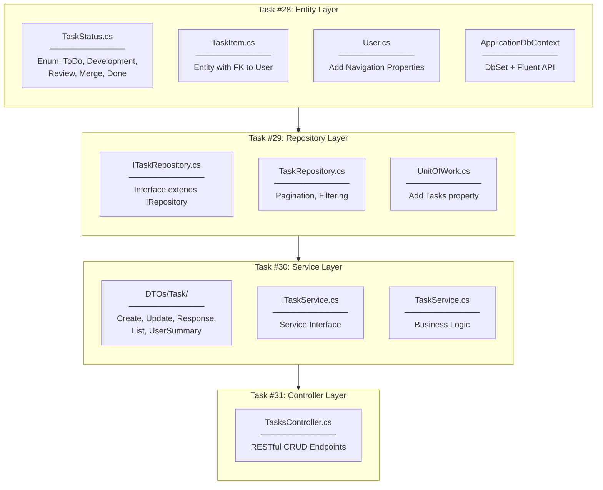
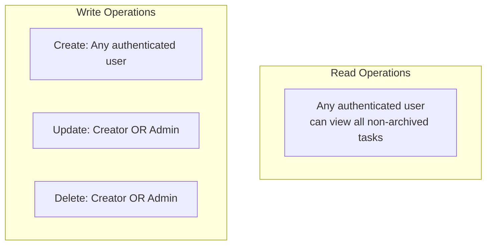

# Task Entity & CRUD Implementation Plan

## Overview

Story #27: Implement Task Entity & CRUD covering Tasks #28-31 for Phase 2 Core Task Management.

## Implementation Flow



---

## File-by-File Implementation Order

### Task #28: TaskItem Entity & TaskStatus Enum

#### 1.1 TaskStatus.cs

**Location:** `Data/Entities/TaskStatus.cs`

**Purpose:** Enum representing task workflow states (Kanban columns)

**Values:**
| Value | Description |
|-------|-------------|
| `ToDo` | Task created, not started |
| `Development` | Actively being worked on |
| `Review` | Ready for code review |
| `Merge` | Approved, pending merge |
| `Done` | Completed |

---

#### 1.2 TaskItem.cs

**Location:** `Data/Entities/TaskItem.cs`

**Purpose:** Task entity with relationships to User

**Properties:**
| Property | Type | Description |
|----------|------|-------------|
| `Id` | int | Primary Key |
| `Title` | string | Task title (required) |
| `Description` | string? | Optional description |
| `Status` | TaskStatus | Workflow state |
| `CreatedById` | int | FK to creator User |
| `AssignedToId` | int? | FK to assigned User (nullable) |
| `CreatedAt` | DateTime | Creation timestamp |
| `UpdatedAt` | DateTime | Last modification |
| `IsArchived` | bool | Soft delete flag |

**Relationships:**
- `CreatedBy` → User (required, 1:N)
- `AssignedTo` → User (optional, 1:N)

---

#### 1.3 User.cs Navigation Properties

**Location:** `Data/Entities/User.cs`

**Added:**
```csharp
public ICollection<TaskItem> CreatedTasks { get; set; } = new List<TaskItem>();
public ICollection<TaskItem> AssignedTasks { get; set; } = new List<TaskItem>();
```

---

#### 1.4 ApplicationDbContext Configuration

**Location:** `Data/ApplicationDbContext.cs`

**Added:**
- `DbSet<TaskItem> Tasks`
- Fluent API configuration for TaskItem entity
- Relationship configuration with delete behaviors

---

### Task #29: TaskRepository

#### 2.1 ITaskRepository.cs

**Location:** `Repositories/Interfaces/ITaskRepository.cs`

**Methods:**
| Method | Return | Description |
|--------|--------|-------------|
| `GetPagedAsync()` | `(IEnumerable<TaskItem>, int)` | Paginated with filters |
| `GetByCreatorAsync()` | `IEnumerable<TaskItem>` | Tasks created by user |
| `GetByAssigneeAsync()` | `IEnumerable<TaskItem>` | Tasks assigned to user |
| `GetByIdWithDetailsAsync()` | `TaskItem?` | Single task with navigation |

---

#### 2.2 TaskRepository.cs

**Location:** `Repositories/TaskRepository.cs`

**Features:**
- Extends `Repository<TaskItem>`
- Eager loading with `.Include()` for User navigation
- Dynamic filtering (status, assignee, creator, search)
- Pagination with total count

---

#### 2.3 UnitOfWork Updates

**Location:** `Repositories/Interfaces/IUnitOfWork.cs`, `Repositories/UnitOfWork.cs`

**Added:** `ITaskRepository Tasks { get; }`

---

### Task #30: TaskService

#### 3.1 DTOs

**Location:** `Controllers/DTOs/Task/`

| DTO | Purpose |
|-----|---------|
| `UserSummaryDto` | Lightweight user info for responses |
| `CreateTaskRequestDto` | Create request with validation |
| `UpdateTaskRequestDto` | Update request (all optional) |
| `TaskResponseDto` | Single task response |
| `TaskListResponseDto` | Paginated list response |

---

#### 3.2 ITaskService.cs

**Location:** `Services/Interfaces/ITaskService.cs`

**Methods:**
| Method | Description |
|--------|-------------|
| `GetTasksAsync()` | Get all tasks (paginated, filtered) |
| `GetMyTasksAsync()` | Tasks created by current user |
| `GetAssignedTasksAsync()` | Tasks assigned to current user |
| `GetTaskByIdAsync()` | Single task by ID |
| `CreateTaskAsync()` | Create new task |
| `UpdateTaskAsync()` | Update existing task |
| `DeleteTaskAsync()` | Delete task |

---

#### 3.3 TaskService.cs

**Location:** `Services/TaskService.cs`

**Business Logic:**
- Authorization check: creator OR admin can edit/delete
- Entity ↔ DTO mapping
- Timestamp management (CreatedAt, UpdatedAt)
- Status transitions

---

### Task #31: TasksController

#### 4.1 TasksController.cs

**Location:** `Controllers/TasksController.cs`

**Endpoints:**
| Method | Route | Description | Status Codes |
|--------|-------|-------------|--------------|
| GET | `/api/tasks` | List all tasks | 200 |
| GET | `/api/tasks/{id}` | Get single task | 200, 404 |
| GET | `/api/tasks/my` | Tasks I created | 200, 401 |
| GET | `/api/tasks/assigned` | Tasks assigned to me | 200, 401 |
| POST | `/api/tasks` | Create task | 201, 400, 401 |
| PUT | `/api/tasks/{id}` | Update task | 200, 400, 401, 403, 404 |
| DELETE | `/api/tasks/{id}` | Delete task | 204, 401, 403, 404 |

**Attributes:**
- `[Authorize]` on all endpoints
- `[ApiController]` for auto validation
- `[Route("api/[controller]")]`

---

## Authorization Rules



---

## DI Registration (Program.cs)

```csharp
// Repository
builder.Services.AddScoped<ITaskRepository, TaskRepository>();

// Service
builder.Services.AddScoped<ITaskService, TaskService>();
```

---

## Checklist

- [x] 1.1 Create TaskStatus.cs enum
- [x] 1.2 Create TaskItem.cs entity
- [x] 1.3 Add User.cs navigation properties
- [x] 1.4 Configure ApplicationDbContext for TaskItem
- [x] 2.1 Create ITaskRepository.cs interface
- [x] 2.2 Create TaskRepository.cs implementation
- [x] 2.3 Update UnitOfWork with Tasks property
- [x] 3.1 Create Task DTOs (5 files)
- [x] 3.2 Create ITaskService.cs interface
- [x] 3.3 Create TaskService.cs implementation
- [x] 4.1 Create TasksController.cs
- [x] Register services in Program.cs
- [x] Add seed data to DbSeeder.cs
- [x] Build verification
