# Task CRUD - Complete Architecture Diagram

## Full System Diagram

```mermaid
flowchart TB
    Client["Client<br/>(React Frontend)"]

    subgraph PRESENTATION["PRESENTATION LAYER"]
        direction TB
        subgraph CONTROLLER["CONTROLLER"]
            TasksController["TasksController<br/>─────────────<br/>-_taskService<br/>+GetTasks()<br/>+GetTask()<br/>+GetMyTasks()<br/>+GetAssignedTasks()<br/>+CreateTask()<br/>+UpdateTask()<br/>+DeleteTask()"]
        end
        subgraph DTOS["DTOs"]
            direction LR
            CreateDto["CreateTaskRequestDto<br/>─────────────<br/>+Title [Required]<br/>+Description<br/>+Status<br/>+AssignedToId"]
            UpdateDto["UpdateTaskRequestDto<br/>─────────────<br/>+Title<br/>+Description<br/>+Status<br/>+AssignedToId<br/>+IsArchived"]
            ResponseDto["TaskResponseDto<br/>─────────────<br/>+Id, Title, Description<br/>+Status, CreatedBy<br/>+AssignedTo, Timestamps"]
            ListDto["TaskListResponseDto<br/>─────────────<br/>+Items<br/>+TotalCount<br/>+Page, PageSize"]
        end
    end

    subgraph SERVICE["SERVICE LAYER"]
        direction LR
        ITaskService["ITaskService<br/>─────────────<br/>«interface»<br/>+GetTasksAsync()<br/>+CreateTaskAsync()<br/>+UpdateTaskAsync()<br/>+DeleteTaskAsync()"]
        TaskService["TaskService<br/>─────────────<br/>+Business Logic<br/>+Authorization<br/>+DTO Mapping"]
        TaskService -.->|implements| ITaskService
    end

    subgraph REPOSITORY["REPOSITORY LAYER"]
        direction LR
        ITaskRepository["ITaskRepository<br/>─────────────<br/>«interface»<br/>+GetPagedAsync()<br/>+GetByCreatorAsync()<br/>+GetByAssigneeAsync()"]
        TaskRepository["TaskRepository<br/>─────────────<br/>+Pagination<br/>+Filtering<br/>+Eager Loading"]
        TaskRepository -.->|implements| ITaskRepository
    end

    subgraph DATA["DATA LAYER"]
        direction LR
        DbContext["ApplicationDbContext<br/>─────────────<br/>DbSet‹TaskItem› Tasks<br/>Fluent API Config"]
        TaskItem["TaskItem Entity<br/>─────────────<br/>Id, Title, Description<br/>Status, CreatedById<br/>AssignedToId, Timestamps"]
        TaskStatus["TaskStatus Enum<br/>─────────────<br/>ToDo, Development<br/>Review, Merge, Done"]
    end

    %% Client to Controller
    Client -->|"HTTP Request"| TasksController

    %% Controller to Service
    TasksController -->|uses| ITaskService
    TasksController -->|receives| CreateDto
    TasksController -->|receives| UpdateDto
    TasksController -->|returns| ResponseDto
    TasksController -->|returns| ListDto

    %% Service to Repository
    TaskService -->|uses| ITaskRepository

    %% Repository to Data
    TaskRepository -->|uses| DbContext
    DbContext -->|maps| TaskItem
    TaskItem -->|uses| TaskStatus
```

---

## Layer Separation View

```mermaid
flowchart TB
    subgraph CLIENT["🌐 CLIENT LAYER"]
        direction LR
        Browser["Browser / Postman / Swagger"]
    end

    subgraph ASPNET["⚡ ASP.NET CORE MIDDLEWARE"]
        direction LR
        AUTH["UseAuthentication()<br/>───────────<br/>JWT validation"]
        AUTHZ["UseAuthorization()<br/>───────────<br/>[Authorize] check"]
        ROUTING["MapControllers()<br/>───────────<br/>Route matching"]
    end

    subgraph PRESENTATION["🎯 PRESENTATION LAYER"]
        direction LR
        TC["TasksController<br/>───────────<br/>HTTP concerns<br/>Thin Controller"]
        DTOs["DTOs<br/>───────────<br/>Request/Response<br/>Data Shapes"]
    end

    subgraph SERVICE["⚙️ SERVICE LAYER"]
        direction LR
        ITS["ITaskService<br/>───────────<br/>Contract"]
        TS["TaskService<br/>───────────<br/>Business Logic<br/>Authorization<br/>Mapping"]
    end

    subgraph REPOSITORY["📚 REPOSITORY LAYER"]
        direction LR
        ITR["ITaskRepository<br/>───────────<br/>Contract"]
        TR["TaskRepository<br/>───────────<br/>Data Access<br/>Query Building"]
    end

    subgraph DATA["💾 DATA LAYER"]
        direction LR
        CTX["DbContext<br/>───────────<br/>EF Core"]
        ENT["Entities<br/>───────────<br/>TaskItem<br/>TaskStatus"]
    end

    %% Flow
    CLIENT -->|"HTTP Request"| ASPNET
    ASPNET -->|"routed request"| PRESENTATION
    PRESENTATION -->|"delegates"| SERVICE
    SERVICE -->|"uses"| REPOSITORY
    REPOSITORY -->|"queries"| DATA

    %% Implementations
    TS -.->|implements| ITS
    TR -.->|implements| ITR
```

---

## Request Flow: POST /api/tasks (Create Task)

---

## Request Flow: PUT /api/tasks/{id} (Update with Authorization)

---

## Pagination & Filtering Flow

```mermaid
flowchart TB
    subgraph REQUEST["Client Request"]
        Params["GET /api/tasks?<br/>page=1&pageSize=10<br/>&status=ToDo<br/>&assignedTo=2<br/>&search=design"]
    end

    subgraph CONTROLLER["TasksController"]
        Extract["Extract Query Parameters<br/>───────────<br/>page, pageSize, status,<br/>assignedTo, createdBy, search"]
    end

    subgraph SERVICE["TaskService"]
        Call["GetTasksAsync()<br/>───────────<br/>Pass filters to repository"]
    end

    subgraph REPOSITORY["TaskRepository"]
        direction TB
        Query["Build IQueryable<br/>───────────<br/>_context.Tasks"]

        Filter1["Filter: Status<br/>───────────<br/>.Where(t => t.Status == status)"]
        Filter2["Filter: AssignedTo<br/>───────────<br/>.Where(t => t.AssignedToId == id)"]
        Filter3["Filter: Search<br/>───────────<br/>.Where(t => t.Title.Contains(search))"]
        Filter4["Filter: Archived<br/>───────────<br/>.Where(t => !t.IsArchived)"]

        Include["Eager Load<br/>───────────<br/>.Include(t => t.CreatedBy)<br/>.Include(t => t.AssignedTo)"]

        Count["Get Total Count<br/>───────────<br/>await query.CountAsync()"]

        Page["Apply Pagination<br/>───────────<br/>.Skip((page-1) * pageSize)<br/>.Take(pageSize)"]

        Execute["Execute Query<br/>───────────<br/>await query.ToListAsync()"]
    end

    subgraph RESPONSE["Response"]
        Result["TaskListResponseDto<br/>───────────<br/>Items: TaskResponseDto[]<br/>TotalCount: 45<br/>Page: 1<br/>PageSize: 10"]
    end

    REQUEST --> CONTROLLER
    CONTROLLER --> SERVICE
    SERVICE --> Query
    Query --> Filter1 --> Filter2 --> Filter3 --> Filter4
    Filter4 --> Include --> Count --> Page --> Execute
    Execute --> RESPONSE
```

---

## HTTP Status Codes

```mermaid
flowchart TB
    subgraph ENDPOINTS["TasksController Endpoints"]
        GET_ALL["GET /api/tasks"]
        GET_ONE["GET /api/tasks/{id}"]
        GET_MY["GET /api/tasks/my"]
        POST["POST /api/tasks"]
        PUT["PUT /api/tasks/{id}"]
        DELETE["DELETE /api/tasks/{id}"]
    end

    subgraph STATUS_200["Success Codes"]
        S200["200 OK<br/>───────────<br/>GET success<br/>PUT success"]
        S201["201 Created<br/>───────────<br/>POST success"]
        S204["204 No Content<br/>───────────<br/>DELETE success"]
    end

    subgraph STATUS_400["Client Errors"]
        E400["400 Bad Request<br/>───────────<br/>Validation error"]
        E401["401 Unauthorized<br/>───────────<br/>Missing/invalid JWT"]
        E403["403 Forbidden<br/>───────────<br/>Not creator/admin"]
        E404["404 Not Found<br/>───────────<br/>Task doesn't exist"]
    end

    GET_ALL --> S200
    GET_ONE --> S200
    GET_ONE --> E404
    GET_MY --> S200
    GET_MY --> E401
    POST --> S201
    POST --> E400
    POST --> E401
    PUT --> S200
    PUT --> E400
    PUT --> E401
    PUT --> E403
    PUT --> E404
    DELETE --> S204
    DELETE --> E401
    DELETE --> E403
    DELETE --> E404
```

---

## DI Container Registration

```mermaid
flowchart LR
    subgraph Registration["Program.cs (Startup)"]
        R1["AddDbContext‹ApplicationDbContext›()"]
        R2["AddScoped‹IUserRepository, UserRepository›()"]
        R3["AddScoped‹ITaskRepository, TaskRepository›()"]
        R4["AddScoped‹IUnitOfWork, UnitOfWork›()"]
        R5["AddScoped‹ITaskService, TaskService›()"]
        R6["AddControllers()"]
    end

    subgraph Container["DI Container"]
        DbCtx[(ApplicationDbContext)]
        UserRepo[(UserRepository)]
        TaskRepo[(TaskRepository)]
        UoW[(UnitOfWork)]
        TaskSvc[(TaskService)]
        TaskCtrl[(TasksController)]
    end

    subgraph Injection["Constructor Injection"]
        I1["TasksController(ITaskService)"]
        I2["TaskService(IUnitOfWork)"]
        I3["UnitOfWork(DbContext, ITaskRepository)"]
    end

    R1 --> DbCtx
    R2 --> UserRepo
    R3 --> TaskRepo
    R4 --> UoW
    R5 --> TaskSvc
    R6 --> TaskCtrl

    TaskSvc -->|injected into| I1
    UoW -->|injected into| I2
    TaskRepo -->|injected into| I3
    DbCtx -->|injected into| I3
```

---

## Entity Relationships

---

## Legend

| Symbol | Meaning |
|--------|---------|
| `«interface»` | Interface (contract only) |
| `-.->` | Implementation (implements interface) |
| `-->` | Dependency (uses) |
| `-` | Private member |
| `+` | Public member |
| `[Attribute]` | Data Annotation |
| `PK` | Primary Key |
| `FK` | Foreign Key |
| `UK` | Unique Key |
