# TaskRepository - Detailed Diagram

## Repository Layer Architecture

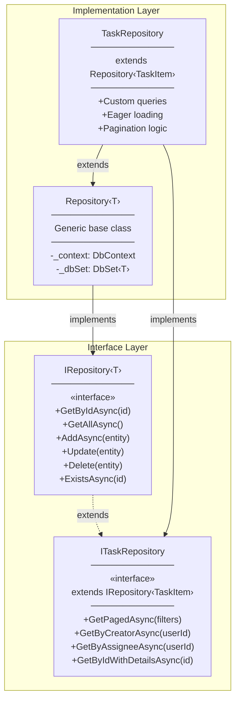

---

## ITaskRepository Interface

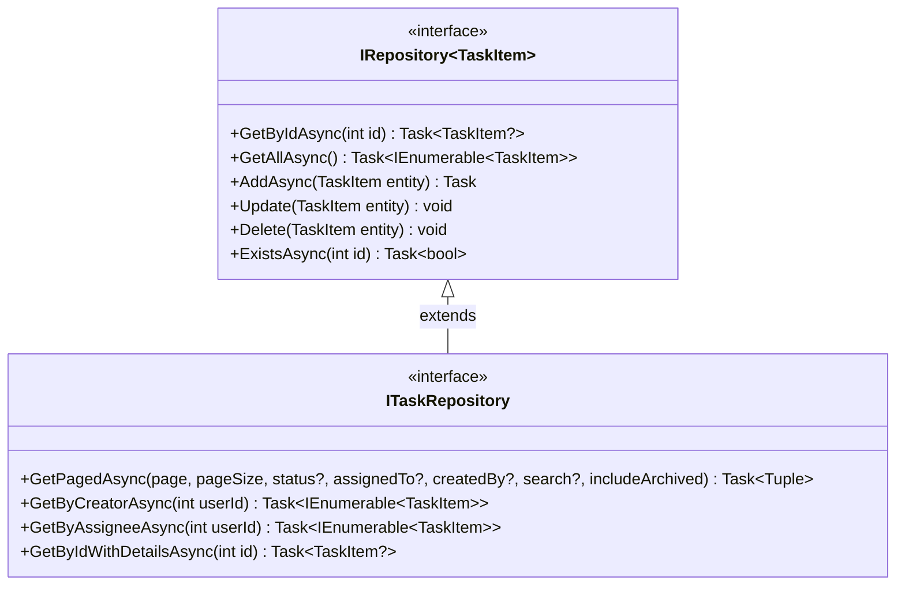

---

## TaskRepository Implementation

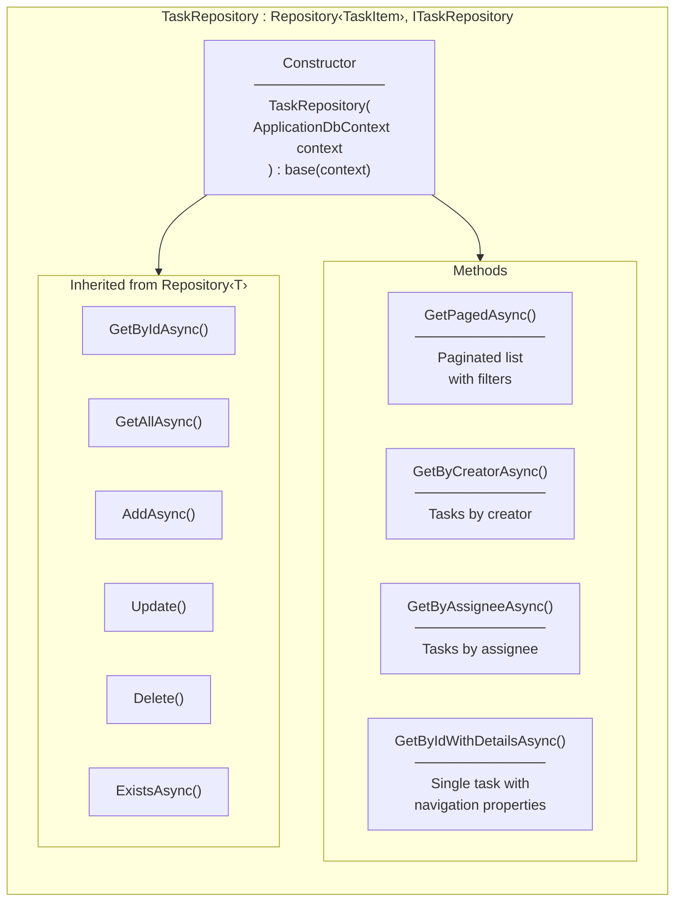

---

## GetPagedAsync - Query Building Flow

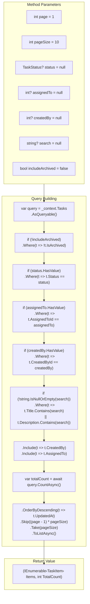

---

## Eager Loading with Include

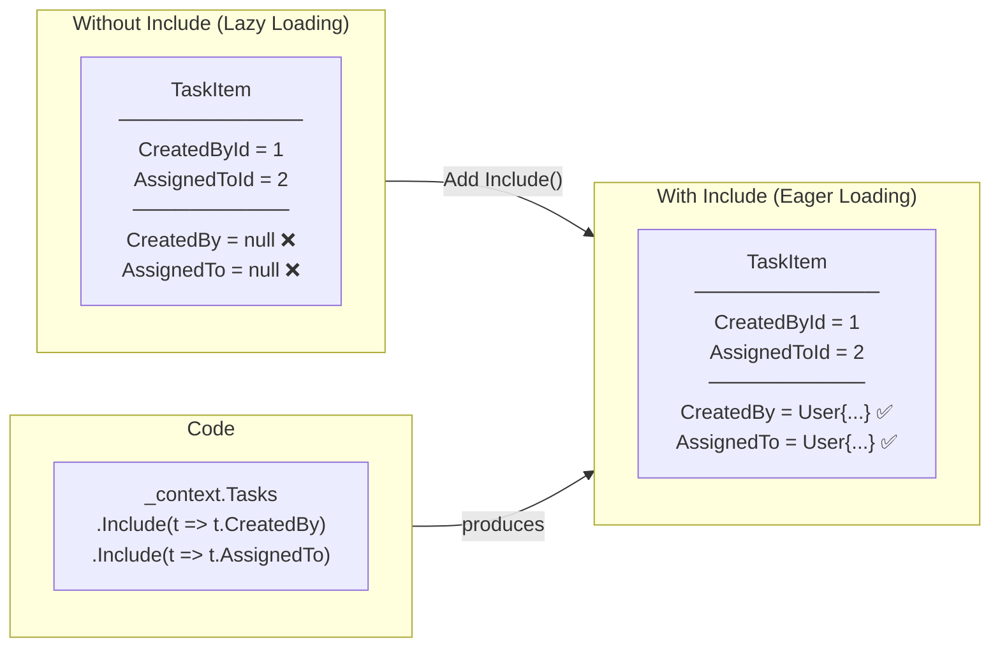

**Key Point:** Include() loads related entities in a single query (JOIN) instead of separate queries.

---

## Pagination Logic

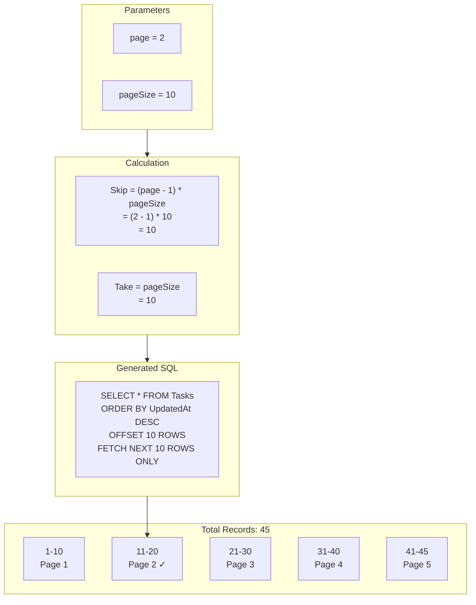

---

## GetByIdWithDetailsAsync Flow

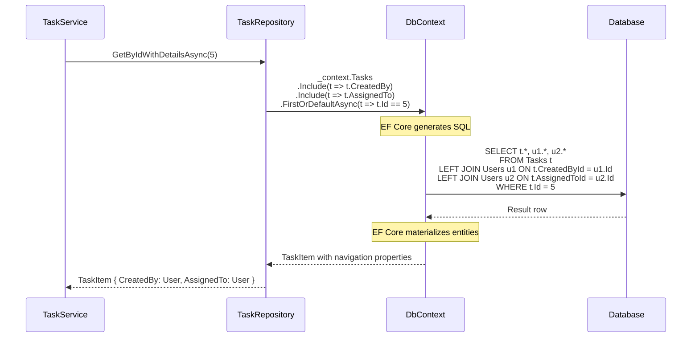

---

## Repository Pattern Benefits

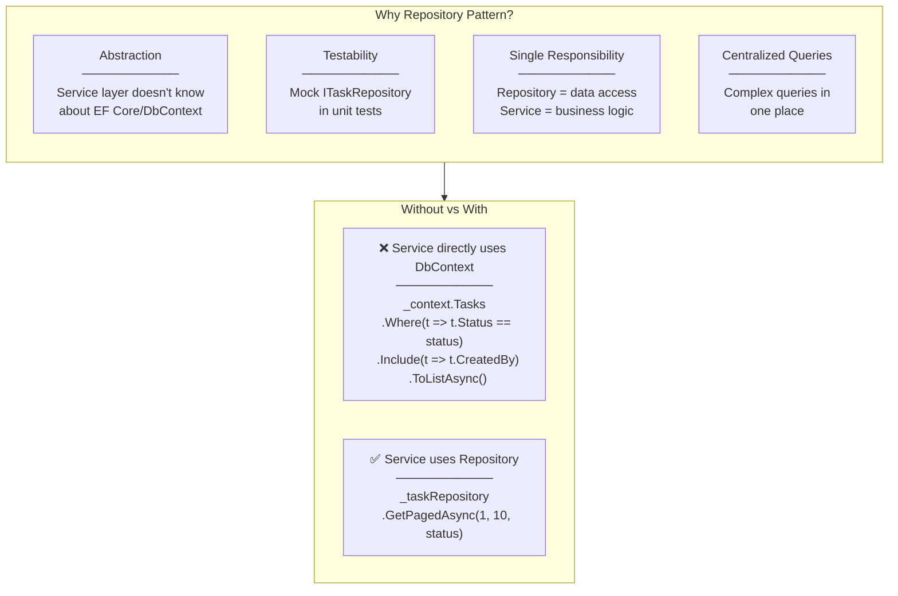

---

## UnitOfWork Integration

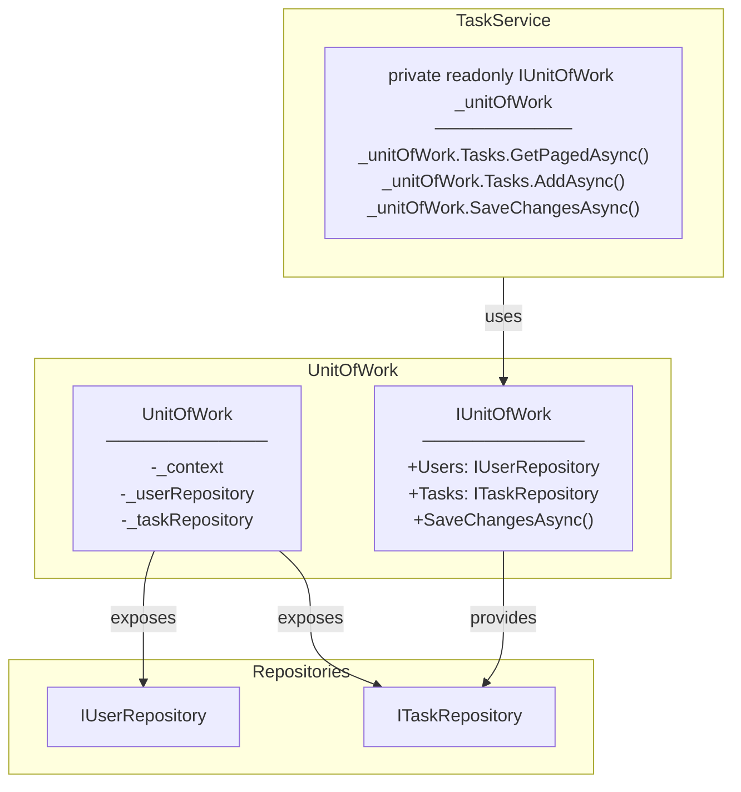

---

## Query Filter Chain

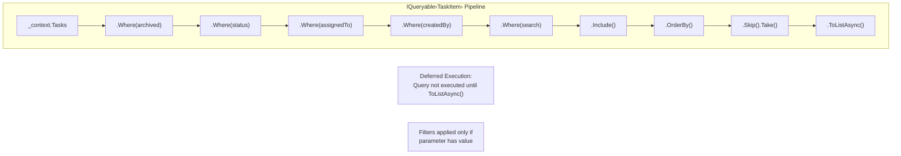

**Concept:** IQueryable uses deferred execution - filters are composed into a single SQL query, not executed until enumeration.

---

## Return Tuple Pattern

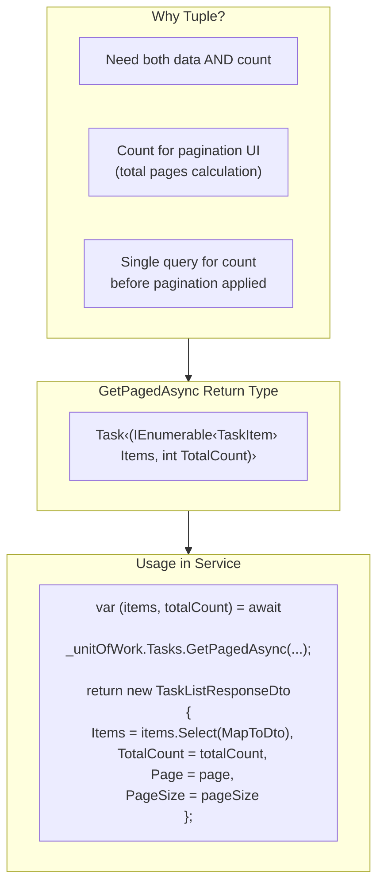
