# TaskService - Detailed Diagram

## Service Layer Architecture

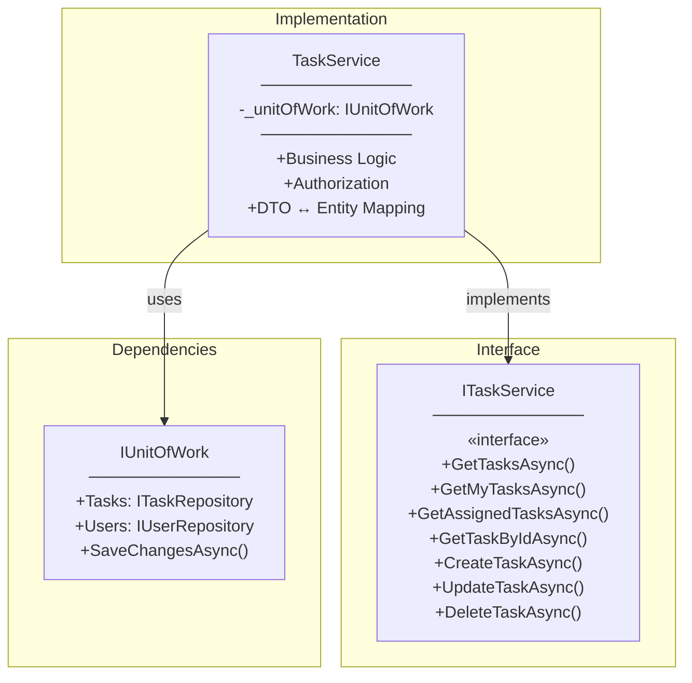

---

## ITaskService Interface Methods

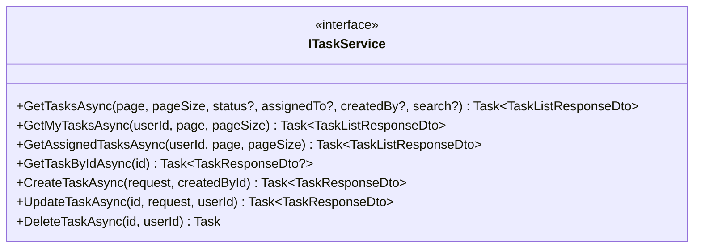

---

## TaskService Dependencies

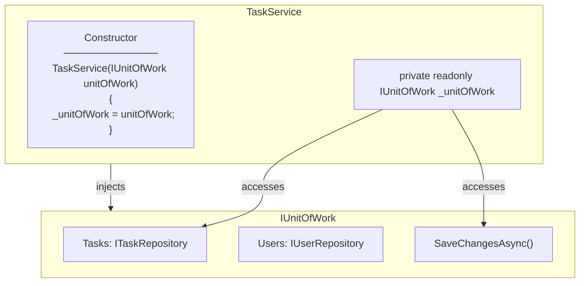

---

## CreateTaskAsync Flow

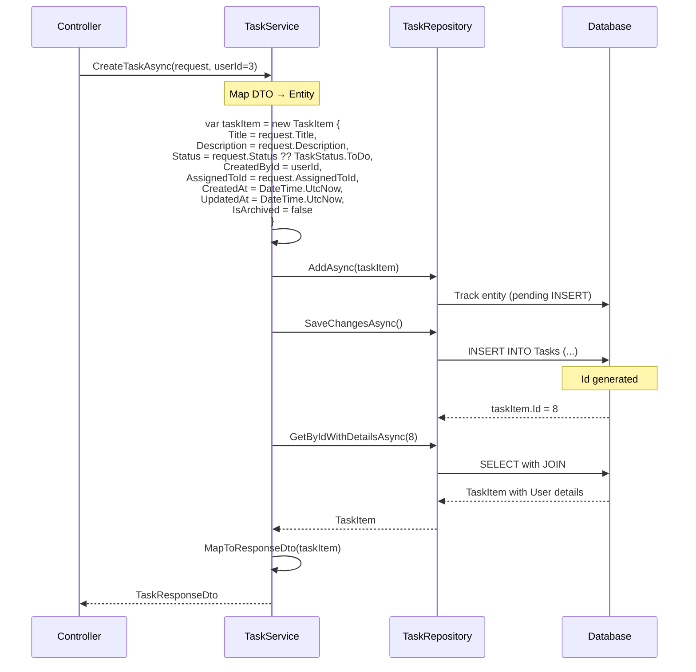

---

## UpdateTaskAsync Flow with Authorization

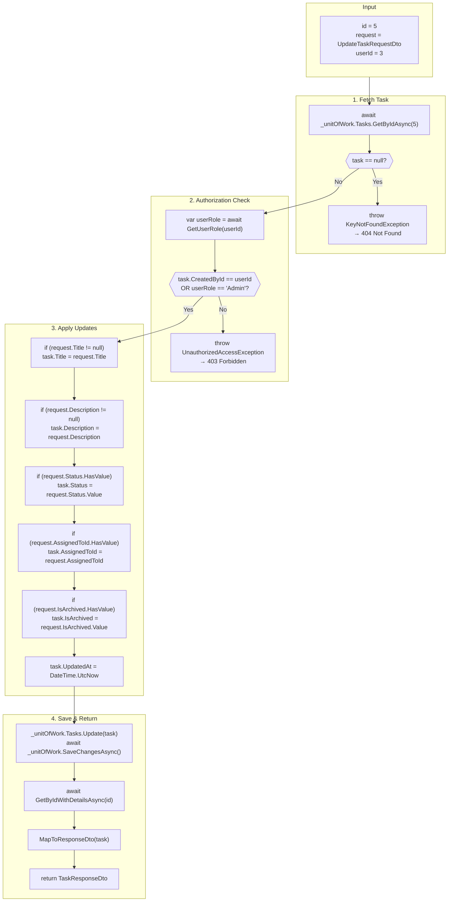

---

## DeleteTaskAsync Flow

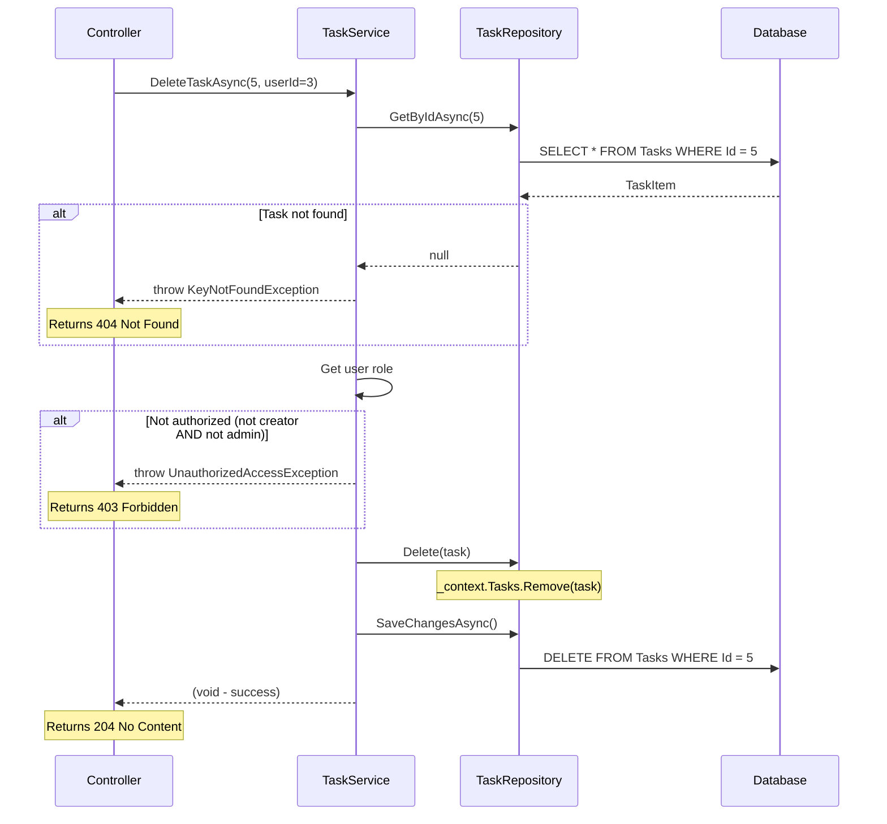

---

## DTO ↔ Entity Mapping

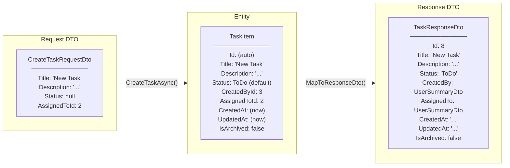

---

## MapToResponseDto Method

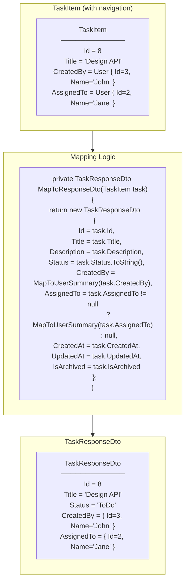

---

## Authorization Logic

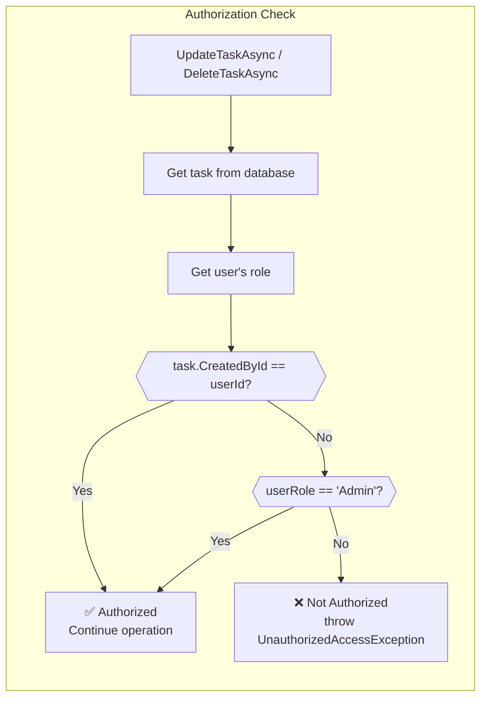

**Rules:**
- Creator can always modify/delete their own task
- Admin can modify/delete any task
- Other users cannot modify/delete tasks they didn't create

---

## GetTasksAsync - Pagination Response

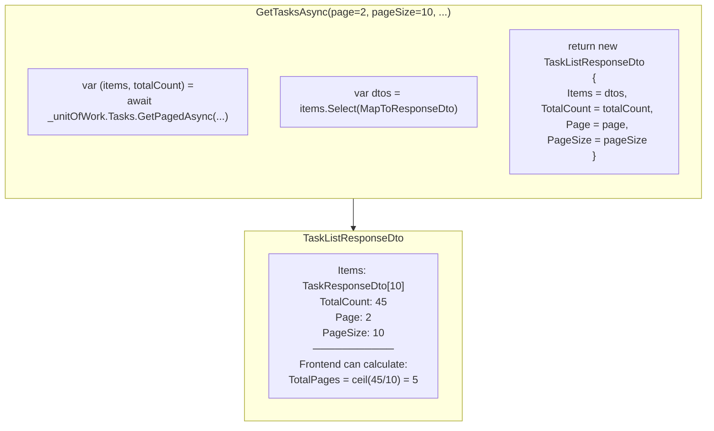

---

## Error Handling Strategy

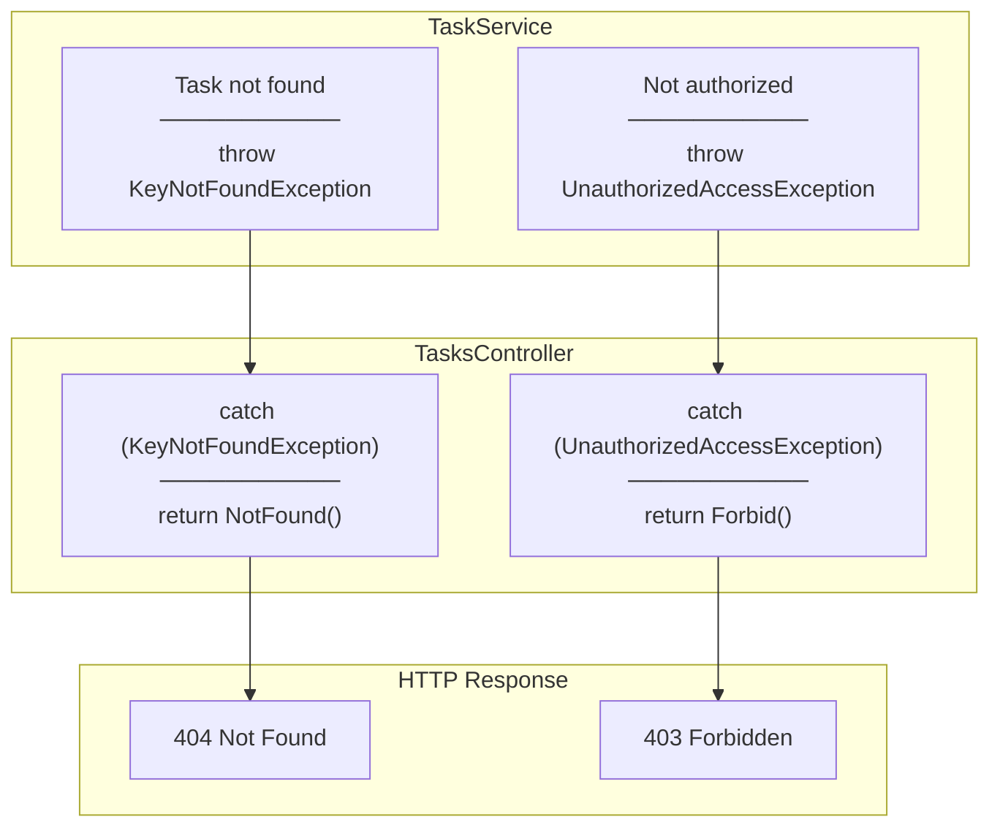

**Pattern:** Service throws specific exceptions, Controller catches and converts to HTTP status codes.

---

## Service Layer Benefits

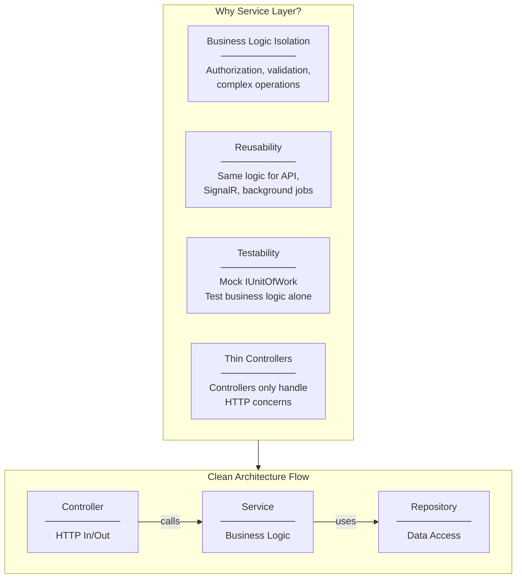
