# TasksController - Detailed Diagram

## Controller Architecture

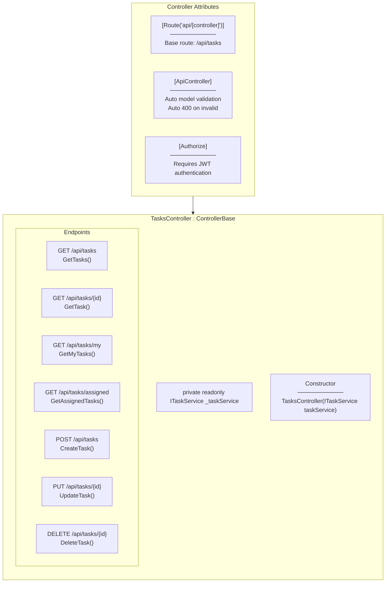

---

## Endpoint Overview

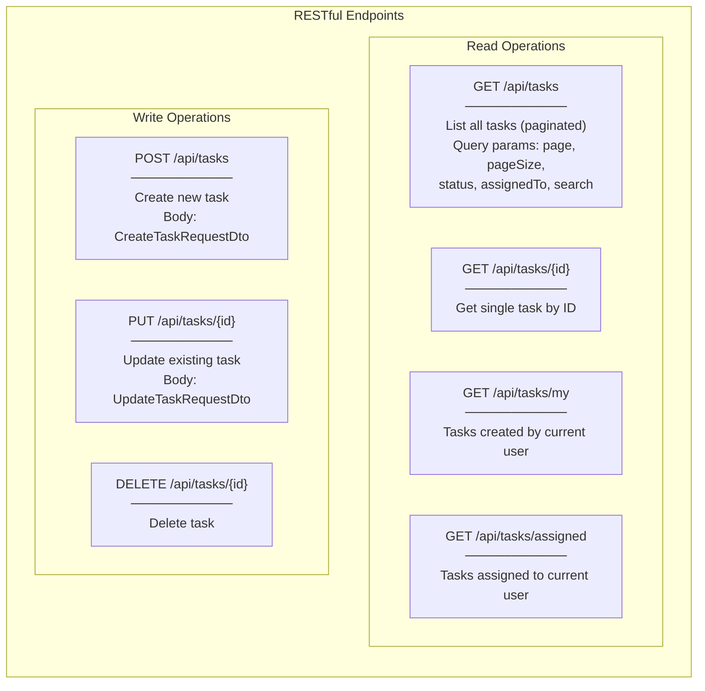

---

## GET /api/tasks - List Tasks

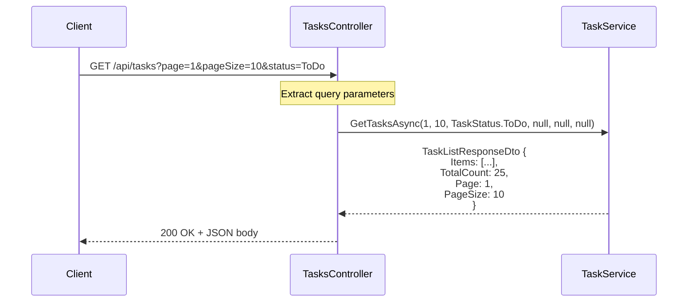

**Query Parameters:**
| Parameter | Type | Default | Description |
|-----------|------|---------|-------------|
| `page` | int | 1 | Page number |
| `pageSize` | int | 10 | Items per page |
| `status` | TaskStatus? | null | Filter by status |
| `assignedTo` | int? | null | Filter by assignee |
| `createdBy` | int? | null | Filter by creator |
| `search` | string? | null | Search in title/description |

---

## GET /api/tasks/{id} - Get Single Task

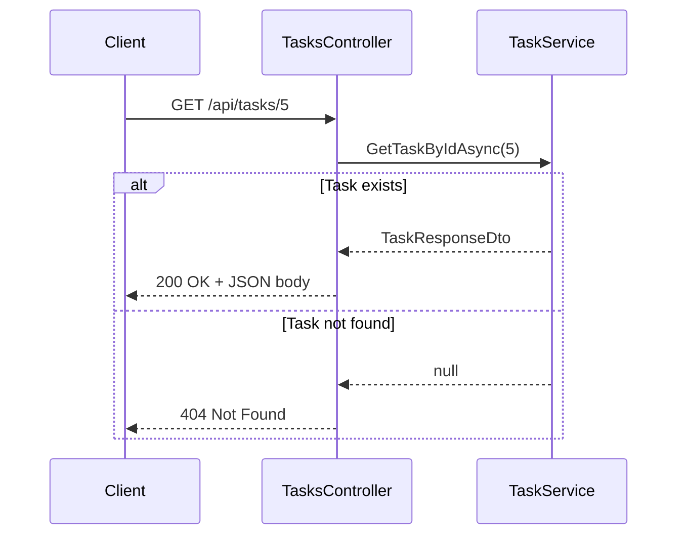

---

## GET /api/tasks/my - My Created Tasks

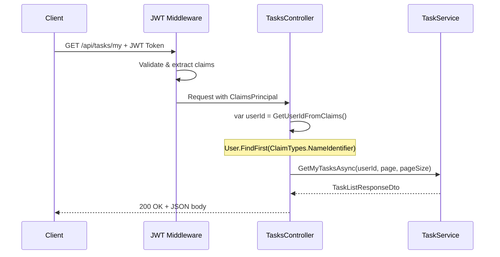

---

## POST /api/tasks - Create Task

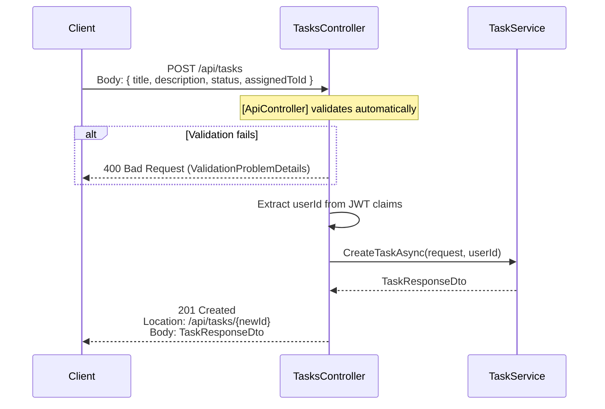

**Response:**
- Status: `201 Created`
- Header: `Location: /api/tasks/{id}`
- Body: `TaskResponseDto`

---

## PUT /api/tasks/{id} - Update Task

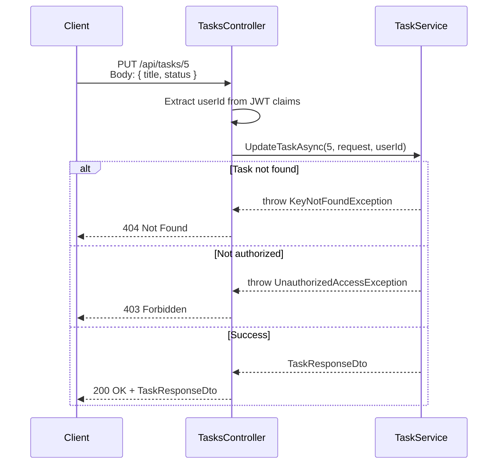

---

## DELETE /api/tasks/{id} - Delete Task

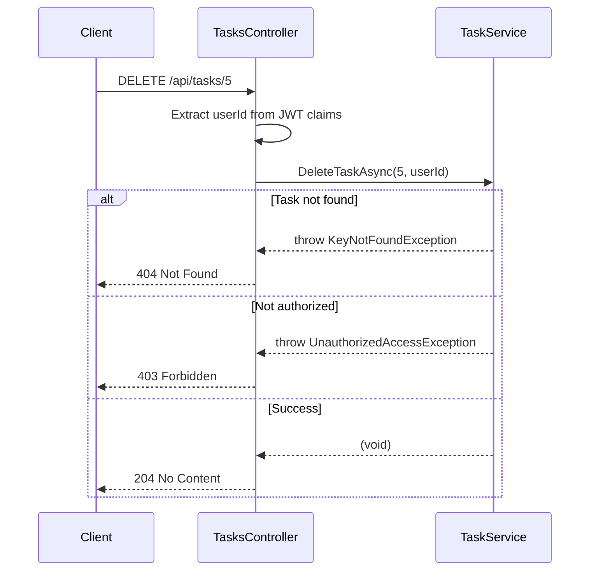

---

## Extracting User ID from JWT Claims

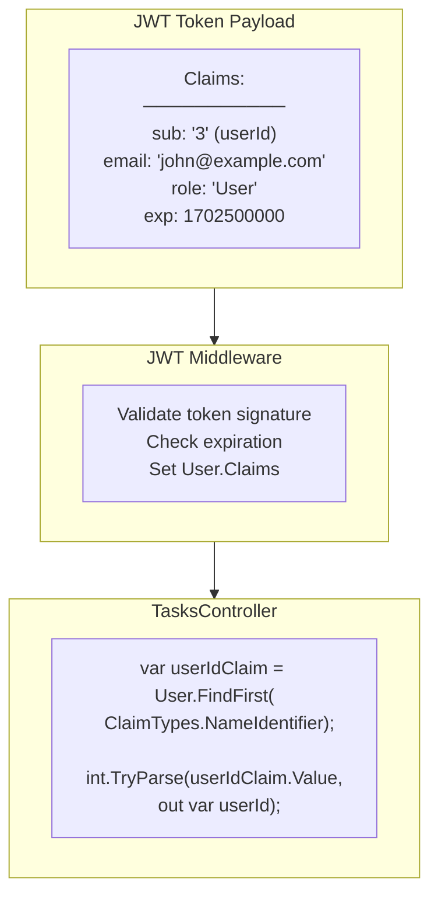

**Code Pattern:**
```csharp
private int GetUserIdFromClaims()
{
    var userIdClaim = User.FindFirst(ClaimTypes.NameIdentifier);
    if (userIdClaim == null || !int.TryParse(userIdClaim.Value, out var userId))
    {
        throw new UnauthorizedAccessException();
    }
    return userId;
}
```

---

## HTTP Status Codes Summary

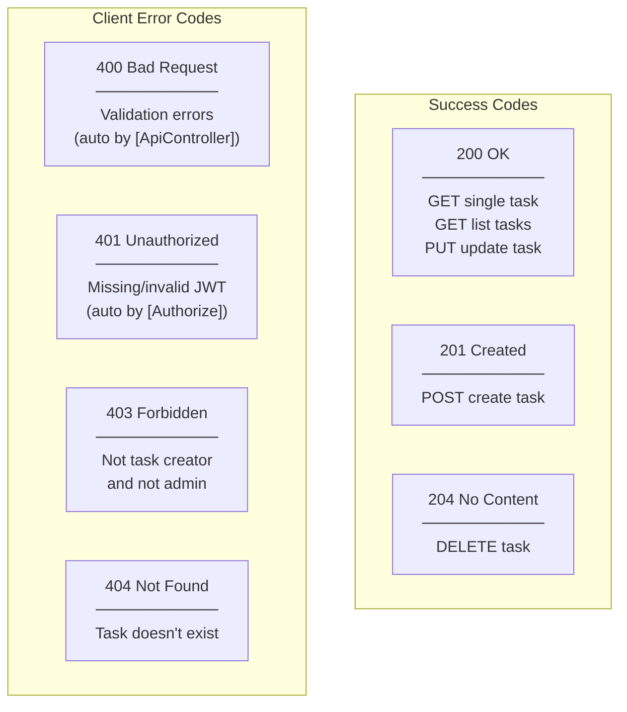

---

## [ApiController] Attribute Benefits

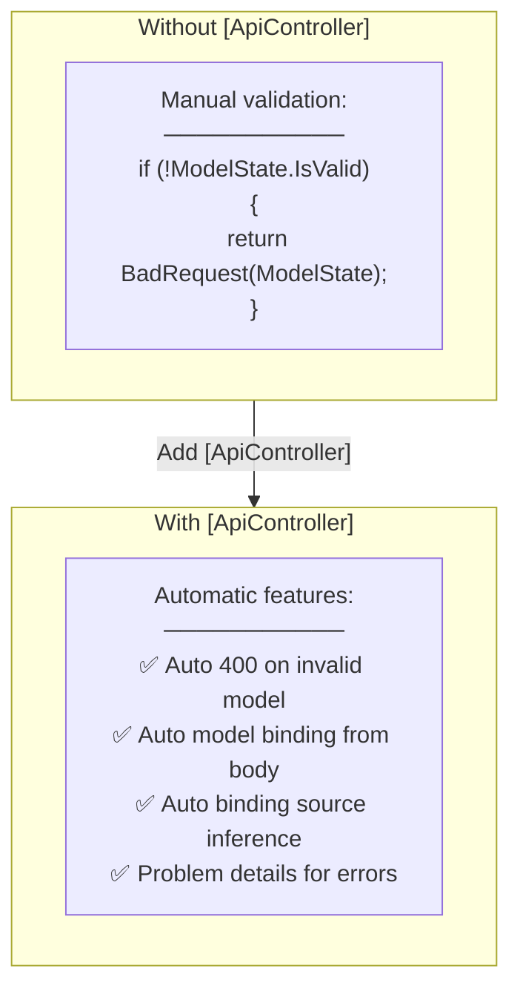

---

## [Authorize] Attribute Flow

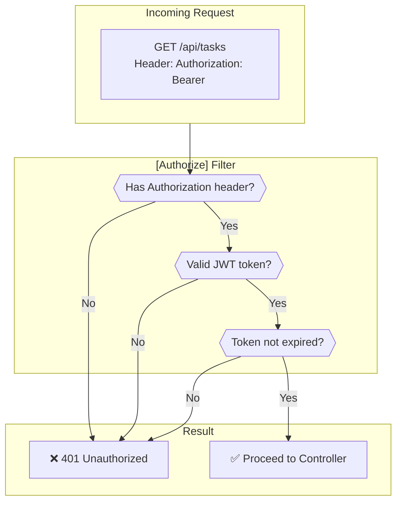

---

## CreatedAtAction Pattern

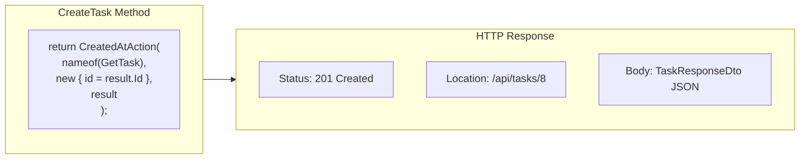

**Purpose:** REST convention - POST returns `201 Created` with `Location` header pointing to the new resource.

---

## Exception Handling Pattern

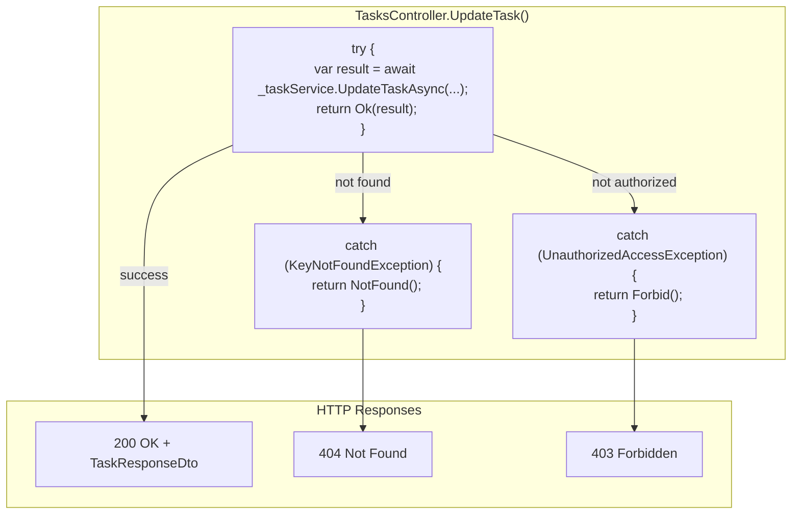

---

## Thin Controller Pattern

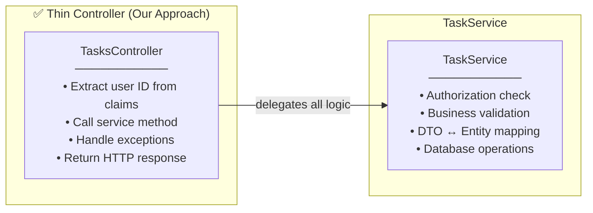

**Key Points:**
- Controller: ~10-15 lines per method
- No business logic in controller
- No direct repository access
- Only HTTP concerns (status codes, headers)
