# Design Patterns & SOLID Principles

## Design Patterns Used

### 1. Repository Pattern

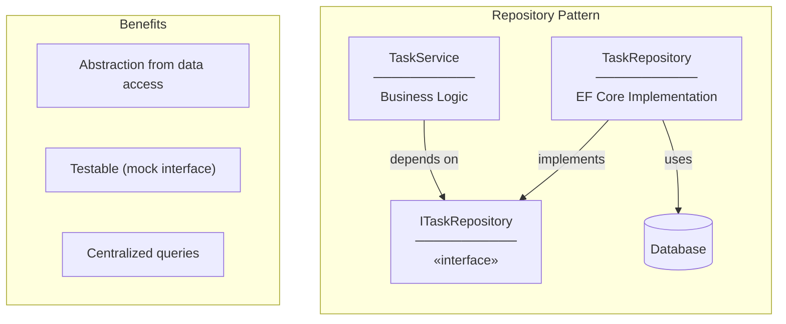

**Implementation:**
```csharp
// Interface (contract)
public interface ITaskRepository : IRepository<TaskItem>
{
    Task<(IEnumerable<TaskItem> Items, int TotalCount)> GetPagedAsync(...);
}

// Implementation (hidden from service)
public class TaskRepository : Repository<TaskItem>, ITaskRepository
{
    public async Task<(IEnumerable<TaskItem>, int)> GetPagedAsync(...)
    {
        // EF Core specific code here
    }
}
```

---

### 2. Unit of Work Pattern

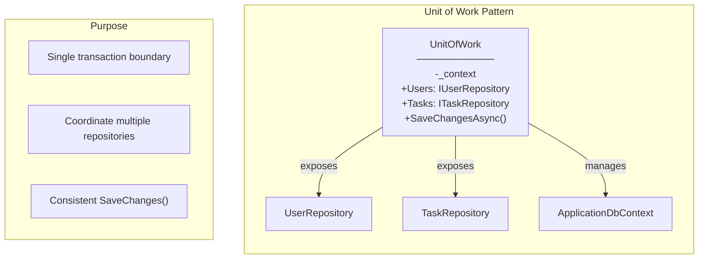

**Implementation:**
```csharp
public class UnitOfWork : IUnitOfWork
{
    private readonly ApplicationDbContext _context;
    public IUserRepository Users { get; }
    public ITaskRepository Tasks { get; }

    public async Task<int> SaveChangesAsync()
    {
        return await _context.SaveChangesAsync();
    }
}
```

---

### 3. DTO Pattern (Data Transfer Object)

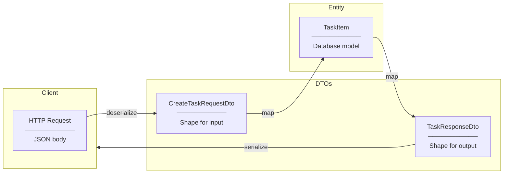

**Why DTOs?**
- Don't expose entity structure to API
- Different shapes for different operations
- Validation attributes on request DTOs
- Prevent over-posting attacks

---

### 4. Dependency Injection Pattern

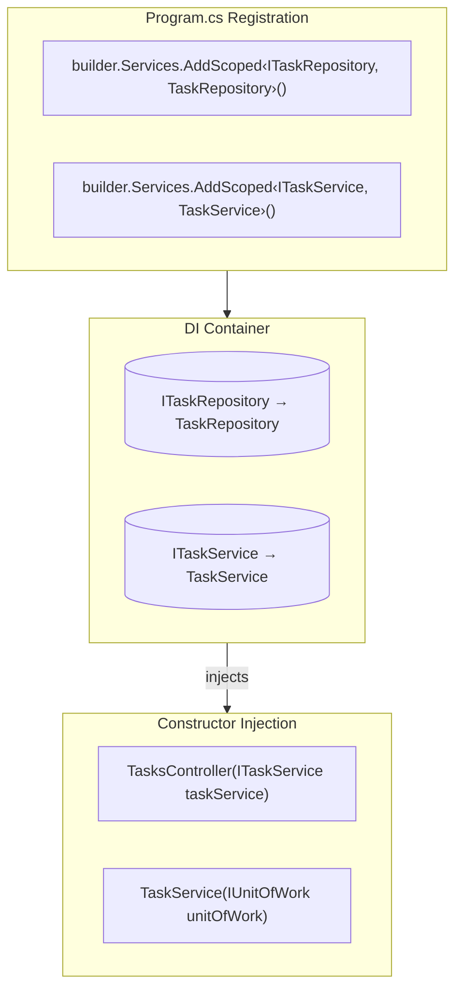

**Benefits:**
- Loose coupling
- Easy to swap implementations
- Enables unit testing with mocks

---

### 5. Thin Controller Pattern

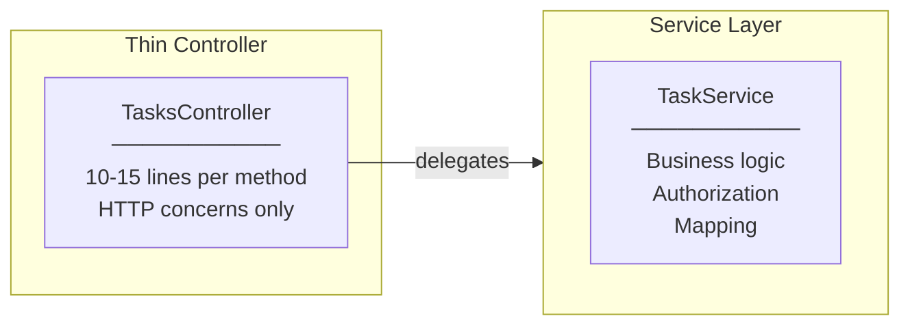

**Controller responsibility:**
- Extract request data
- Call service
- Map exceptions to HTTP status codes
- Return response

**NOT controller responsibility:**
- Business logic
- Authorization rules
- Database access
- Complex validation

---

## SOLID Principles Applied

### S - Single Responsibility Principle

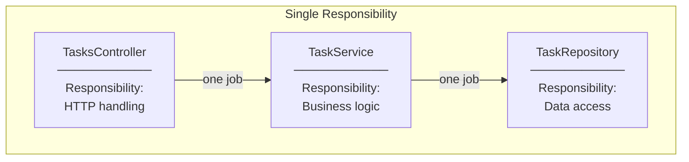

**Examples:**
- `TasksController`: Only handles HTTP requests/responses
- `TaskService`: Only contains business logic and authorization
- `TaskRepository`: Only handles database queries

---

### O - Open/Closed Principle

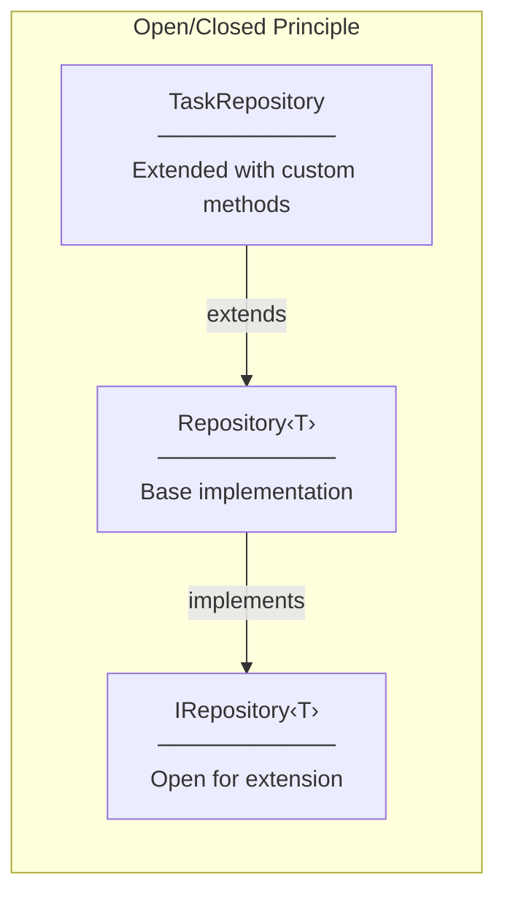

**How it applies:**
- `Repository<T>` is closed for modification
- `TaskRepository` extends without changing base class
- Add new repository types without modifying existing code

---

### L - Liskov Substitution Principle

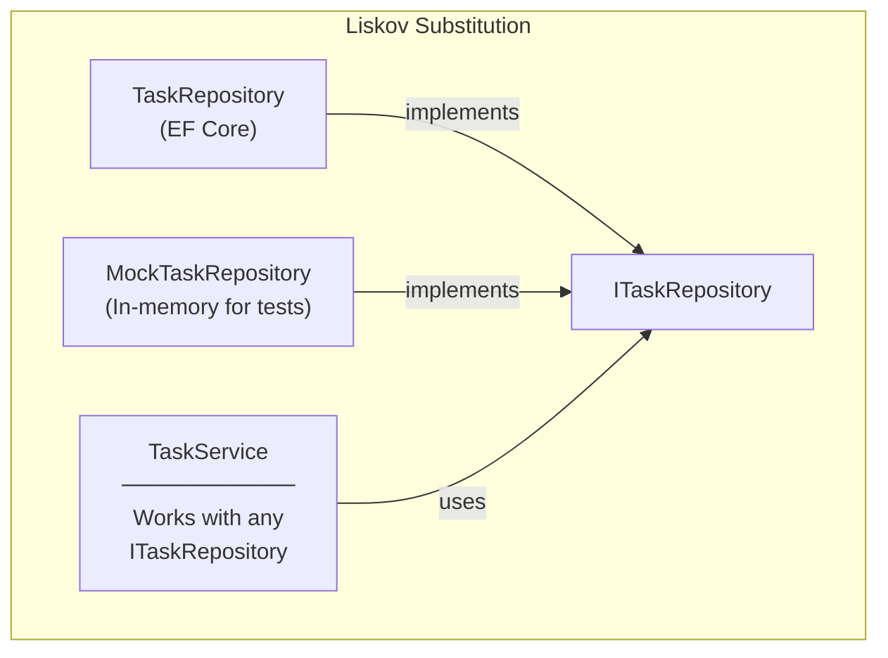

**Principle:**
- Any implementation of `ITaskRepository` can substitute another
- `TaskService` doesn't know or care which implementation is used
- Essential for unit testing with mocks

---

### I - Interface Segregation Principle

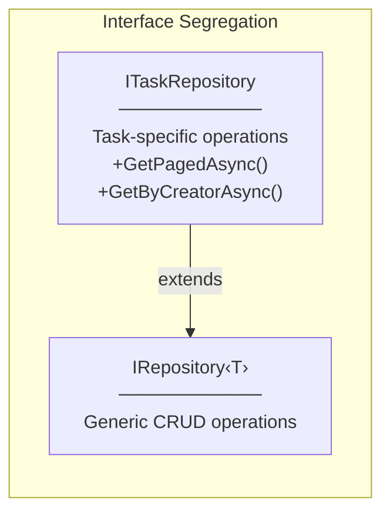

**How it applies:**
- `IRepository<T>`: Basic CRUD (small, focused)
- `ITaskRepository`: Task-specific methods (extends, doesn't bloat base)
- Clients depend only on interfaces they need

---

### D - Dependency Inversion Principle

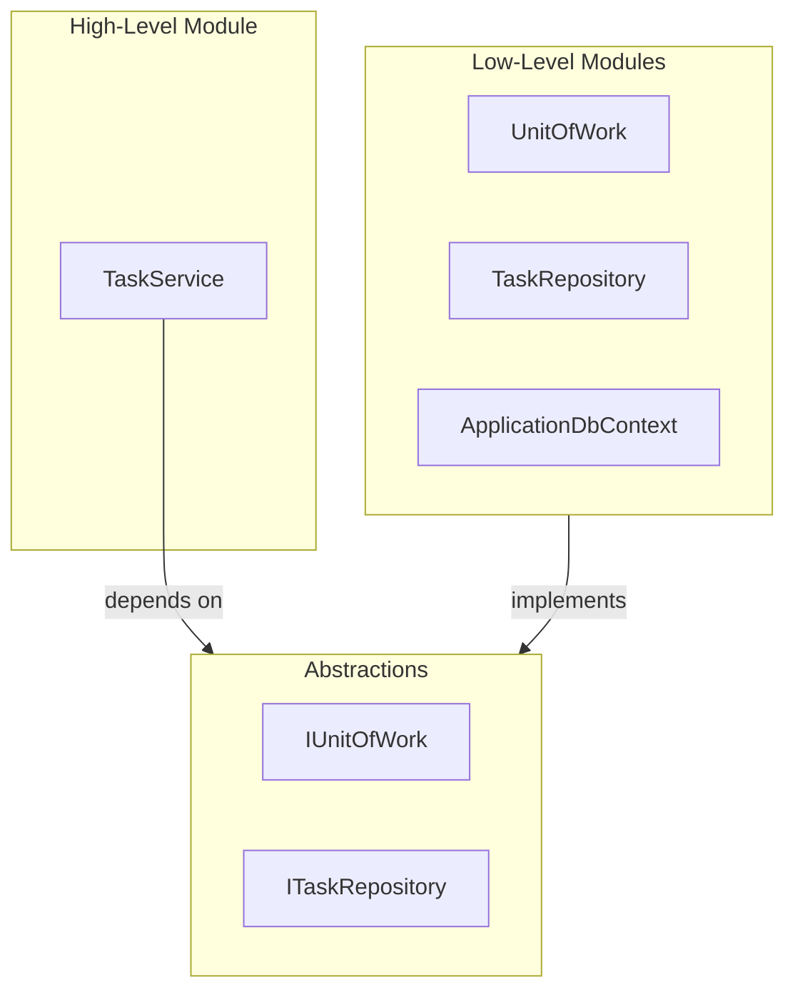

**Key Points:**
- High-level modules (`TaskService`) depend on abstractions (`IUnitOfWork`)
- Low-level modules (`TaskRepository`) implement abstractions
- Both depend on abstractions, not on each other

---

## Pattern Interactions

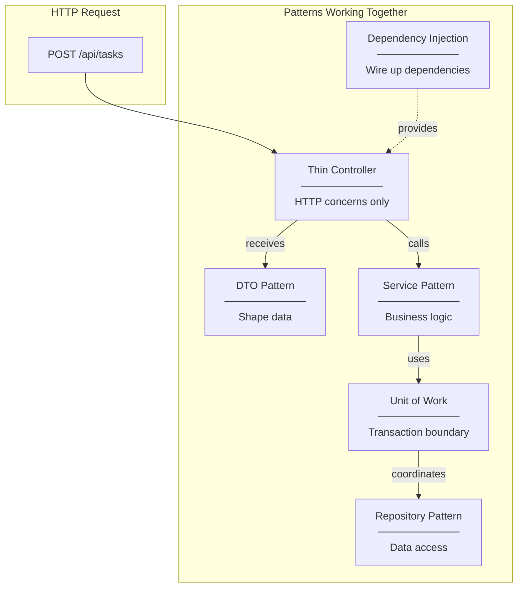

---

## Anti-Patterns Avoided

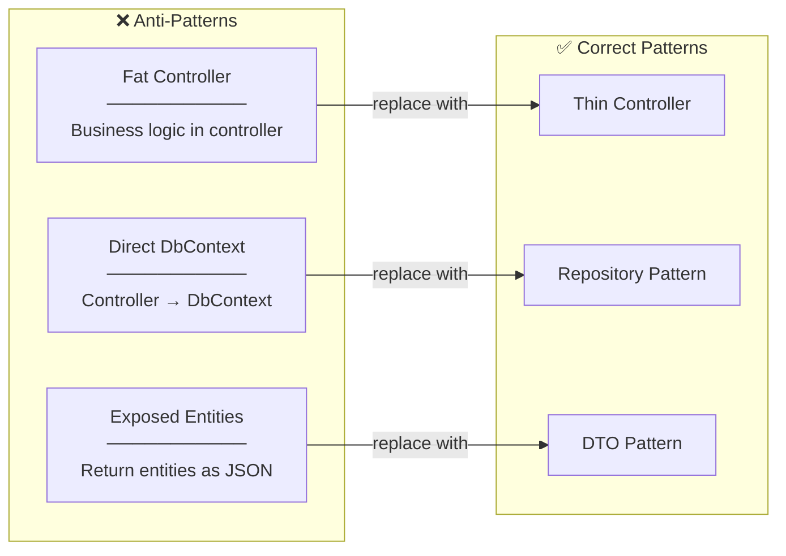
