# Programming Concepts

## Entity Framework Core Concepts

### 1. Navigation Properties

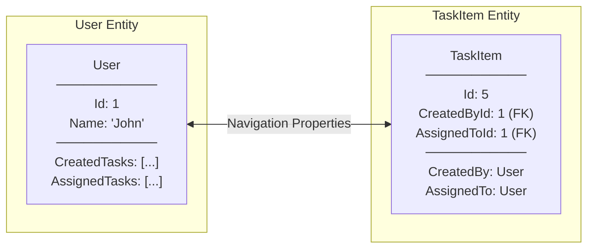

**Definition:**
- Properties that reference related entities
- Enable traversing relationships in code
- Two types: Reference (single) and Collection (many)

**Code:**
```csharp
// In TaskItem entity
public int CreatedById { get; set; }              // Foreign Key
public User CreatedBy { get; set; } = null!;      // Navigation Property

public int? AssignedToId { get; set; }            // Nullable FK
public User? AssignedTo { get; set; }             // Nullable Navigation
```

```csharp
// In User entity
public ICollection<TaskItem> CreatedTasks { get; set; }  // Collection Navigation
public ICollection<TaskItem> AssignedTasks { get; set; } // Collection Navigation
```

---

### 2. Eager Loading with Include()

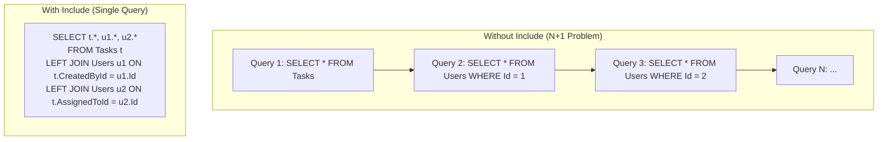

**Code:**
```csharp
// Eager loading - single query with JOINs
var tasks = await _context.Tasks
    .Include(t => t.CreatedBy)
    .Include(t => t.AssignedTo)
    .ToListAsync();
```

**When to use:**
- When you know you'll need related data
- To avoid N+1 query problem
- For API responses that include related entities

---

### 3. Fluent API Configuration

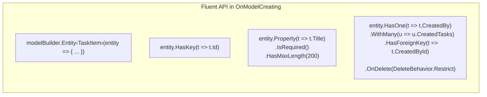

**Why Fluent API vs Data Annotations?**
- More control over configuration
- Keep entity classes clean (POCO)
- Configure relationships clearly
- Required for complex scenarios

**Delete Behaviors:**
| Behavior | Description |
|----------|-------------|
| `Cascade` | Delete related entities |
| `Restrict` | Prevent delete if related exists |
| `SetNull` | Set FK to null on delete |
| `NoAction` | Do nothing (may fail at DB) |

---

### 4. DbSet and DbContext

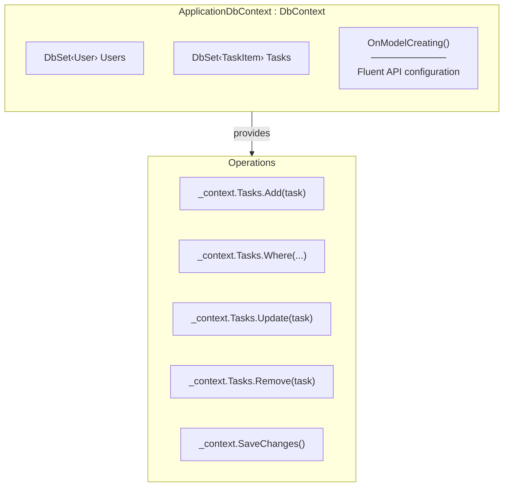

---

## C# Language Features

### 1. Tuple Return Types

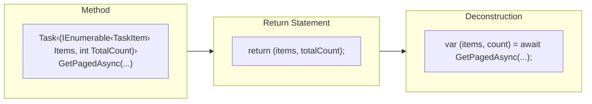

**Why Tuples?**
- Return multiple values without creating a class
- Named elements for clarity
- Deconstructed at call site

---

### 2. Nullable Reference Types

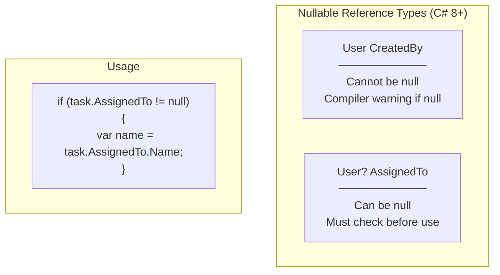

**In our code:**
```csharp
public int? AssignedToId { get; set; }        // Nullable value type
public User? AssignedTo { get; set; }          // Nullable reference type

// Safe access
AssignedTo = task.AssignedTo != null
    ? MapToUserSummary(task.AssignedTo)
    : null
```

---

### 3. LINQ Query Methods

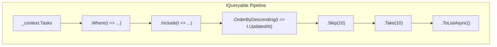

**Key LINQ Methods:**
| Method | Purpose |
|--------|---------|
| `Where()` | Filter records |
| `Include()` | Eager load relations |
| `OrderBy()` / `OrderByDescending()` | Sort results |
| `Skip()` | Skip N records |
| `Take()` | Take N records |
| `Select()` | Project/transform |
| `FirstOrDefaultAsync()` | Get single or null |
| `ToListAsync()` | Execute and materialize |
| `CountAsync()` | Count records |

---

### 4. Async/Await Pattern

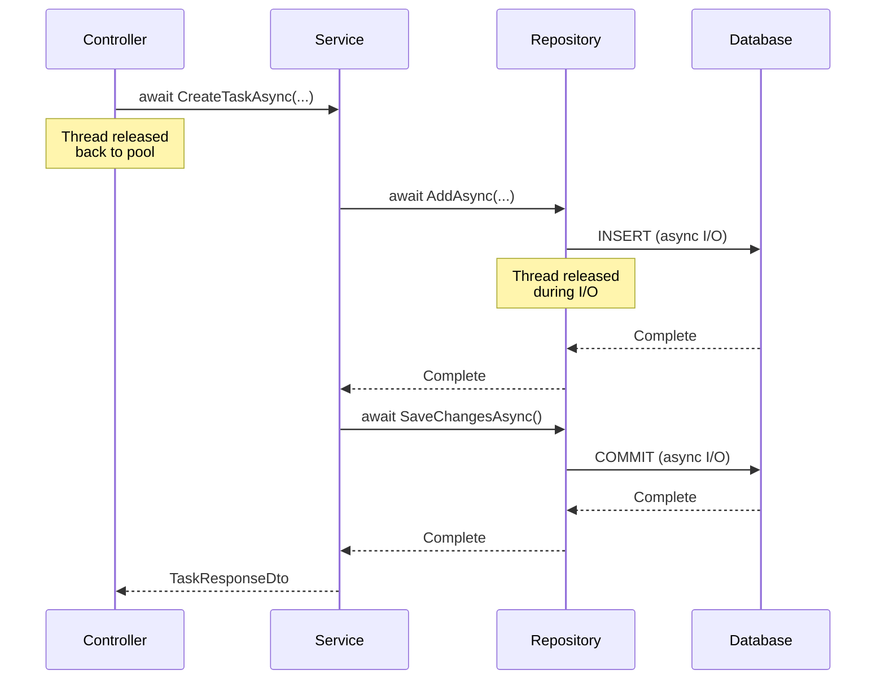

**Key Points:**
- `async` marks method as asynchronous
- `await` pauses execution until task completes
- Thread is released during I/O operations
- Better scalability for web applications

---

### 5. Expression-bodied Members

```csharp
// Traditional method
public async Task<TaskResponseDto?> GetTaskByIdAsync(int id)
{
    var task = await _unitOfWork.Tasks.GetByIdWithDetailsAsync(id);
    return task != null ? MapToResponseDto(task) : null;
}

// Can use expression body for simple methods
private UserSummaryDto MapToUserSummary(User user) => new UserSummaryDto
{
    Id = user.Id,
    Name = user.Name,
    Email = user.Email
};
```

---

## ASP.NET Core Concepts

### 1. Model Binding

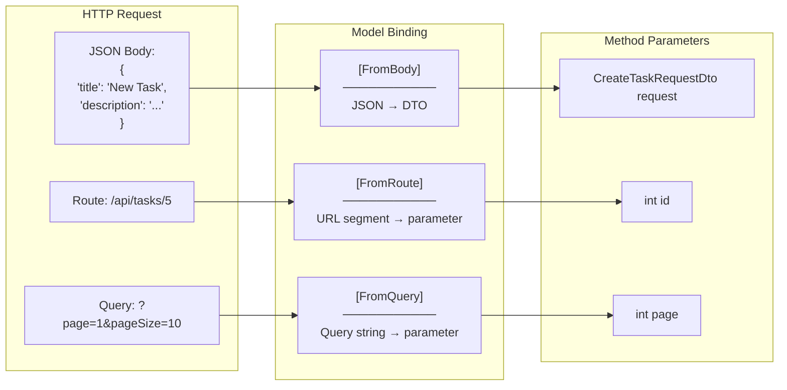

---

### 2. Model Validation with [ApiController]

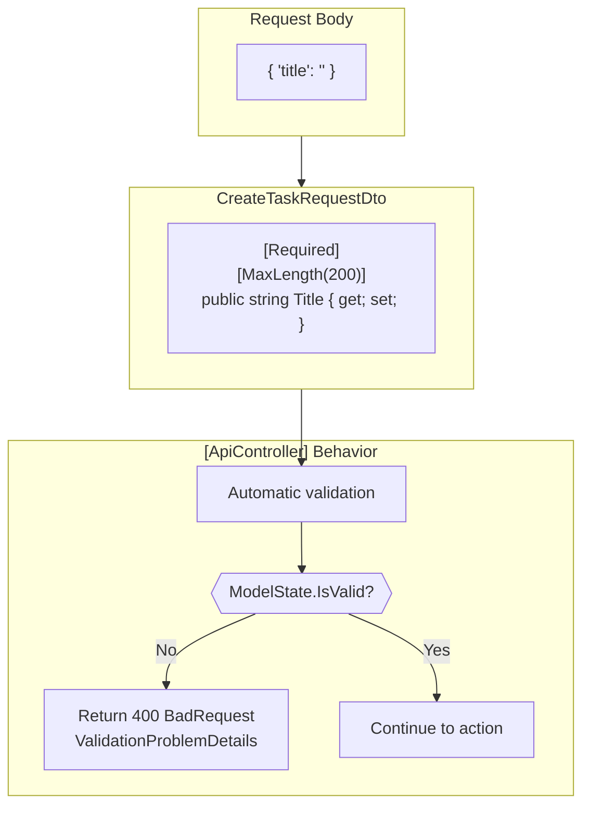

---

### 3. Action Results

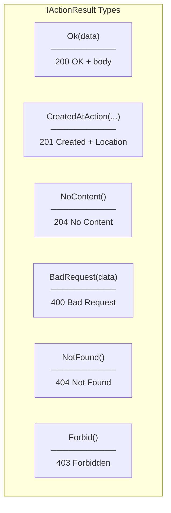

**Usage:**
```csharp
return Ok(result);                           // 200
return CreatedAtAction(nameof(GetTask), new { id }, result);  // 201
return NoContent();                          // 204
return BadRequest(error);                    // 400
return NotFound();                           // 404
return Forbid();                             // 403
```

---

### 4. Claims-Based Identity

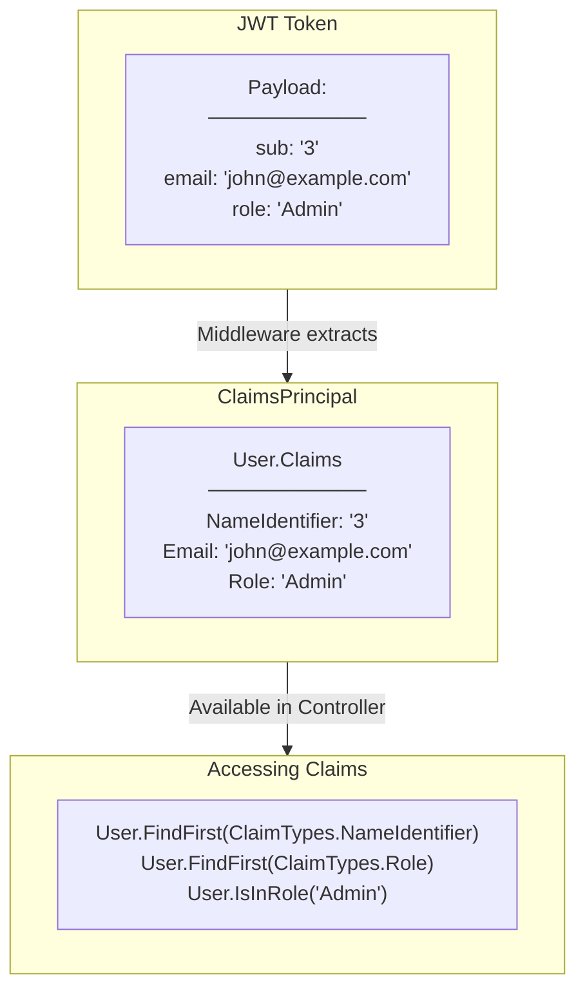

---

### 5. Dependency Injection Lifetimes

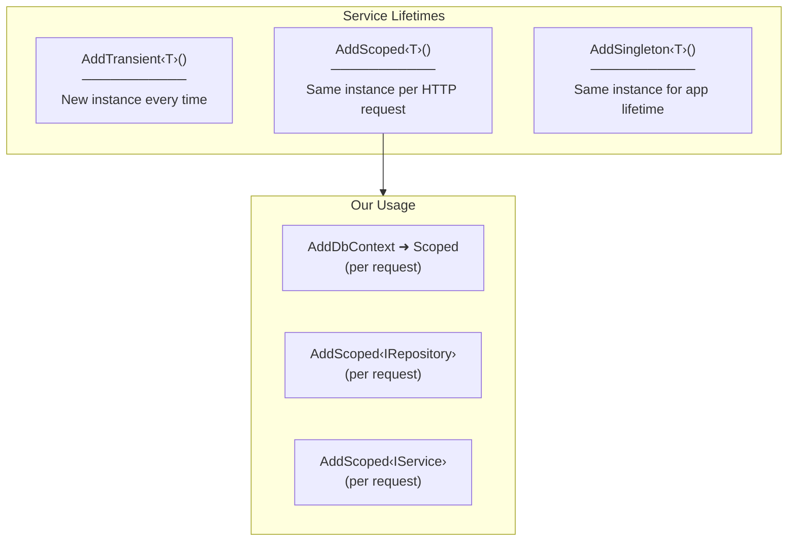

**Why Scoped for DbContext?**
- Unit of Work pattern: one transaction per request
- Prevents connection leaks
- Ensures consistent state within request

---

## Database Concepts

### 1. Foreign Keys

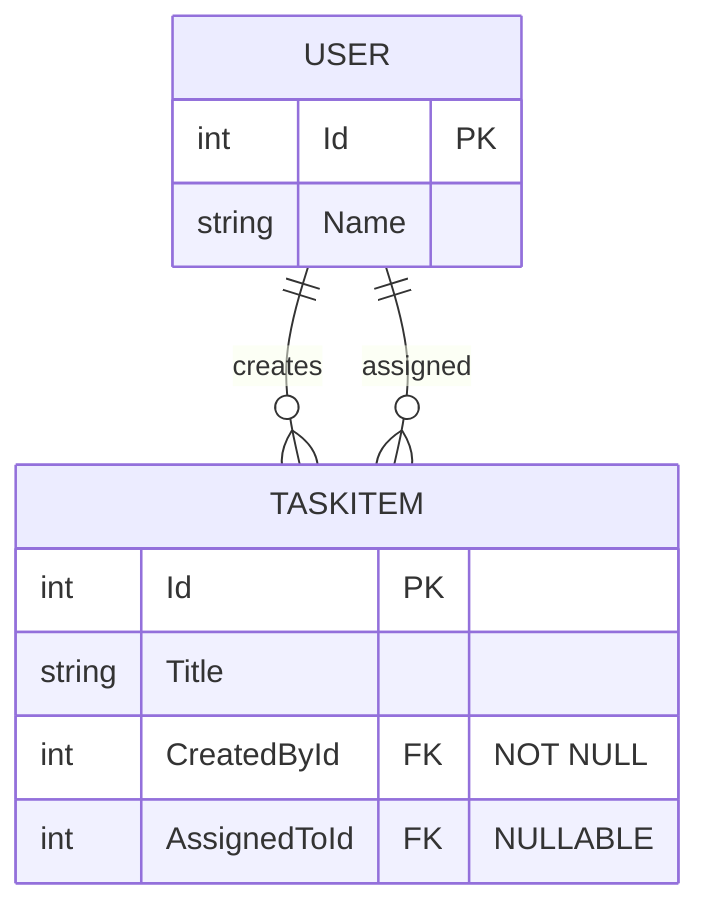

**FK Constraints:**
- `CreatedById`: Required (every task has a creator)
- `AssignedToId`: Optional (task may not be assigned)

---

### 2. Pagination with OFFSET-FETCH

```sql
-- Skip first 10, take next 10
SELECT *
FROM Tasks
ORDER BY UpdatedAt DESC
OFFSET 10 ROWS
FETCH NEXT 10 ROWS ONLY;
```

**C# equivalent:**
```csharp
.Skip((page - 1) * pageSize)
.Take(pageSize)
```

---

### 3. Indexes

```csharp
// In ApplicationDbContext
entity.HasIndex(u => u.Email).IsUnique();
entity.HasIndex(u => u.Username).IsUnique();
```

**Why indexes?**
- Speed up lookups by indexed column
- Unique indexes enforce uniqueness
- Important for frequently queried columns

---

## HTTP Concepts

### 1. RESTful Resource Naming

```
GET    /api/tasks          → List all tasks
GET    /api/tasks/5        → Get task with ID 5
POST   /api/tasks          → Create new task
PUT    /api/tasks/5        → Update task 5
DELETE /api/tasks/5        → Delete task 5
```

**Conventions:**
- Nouns for resources (`tasks`, not `getTasks`)
- Plural names (`tasks`, not `task`)
- HTTP verbs for actions
- ID in URL path, not query string

---

### 2. HTTP Status Code Categories

| Range | Category | Examples |
|-------|----------|----------|
| 2xx | Success | 200 OK, 201 Created, 204 No Content |
| 4xx | Client Error | 400 Bad Request, 401 Unauthorized, 403 Forbidden, 404 Not Found |
| 5xx | Server Error | 500 Internal Server Error |

---

### 3. Content Negotiation

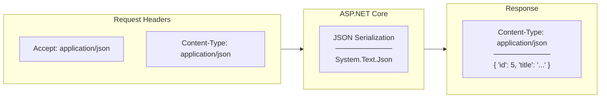

**[ApiController] automatically:**
- Deserializes JSON request body
- Serializes response to JSON
- Sets Content-Type header
