# Design Patterns - GoF (Gang of Four)

## Overview

The Gang of Four (GoF) patterns are 23 classic design patterns documented in "Design Patterns: Elements of Reusable Object-Oriented Software" (1994) by Gamma, Helm, Johnson, and Vlissides.

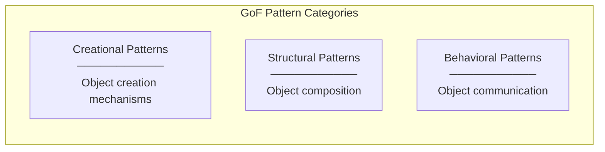

---

## Creational Patterns Used

### 1. Factory Method Pattern

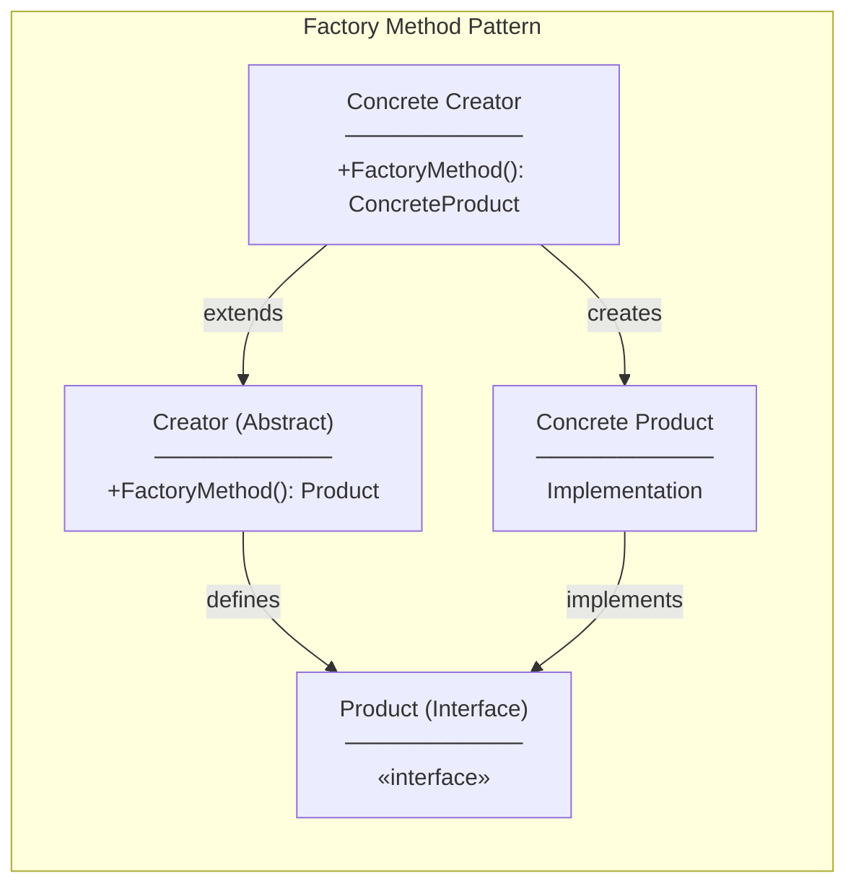

**In Our Code (Implicit via DI):**
```csharp
// Program.cs acts as a factory configuration
builder.Services.AddScoped<ITaskRepository, TaskRepository>();
builder.Services.AddScoped<ITaskService, TaskService>();

// DI Container is the "Factory" that creates instances
public class TasksController
{
    // Factory Method: DI resolves ITaskService → TaskService
    public TasksController(ITaskService taskService) { }
}
```

**GoF Definition:** Define an interface for creating an object, but let subclasses decide which class to instantiate.

---

### 2. Singleton Pattern

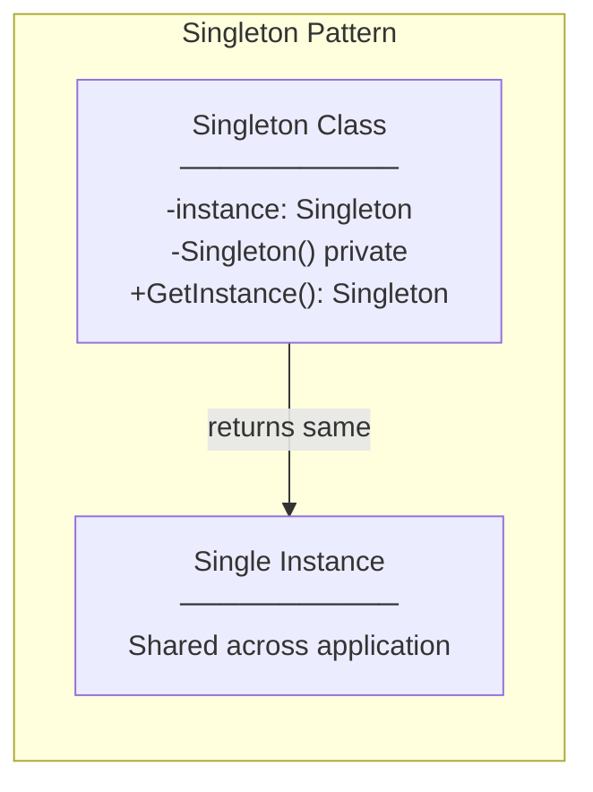

**In Our Code (via DI):**
```csharp
// AddSingleton - same instance for entire application lifetime
builder.Services.AddSingleton<IConfiguration>(configuration);

// Note: We use AddScoped for most services (one per request)
// but the pattern concept is the same
```

**GoF Definition:** Ensure a class has only one instance and provide a global point of access to it.

---

### 3. Abstract Factory Pattern (Conceptual)

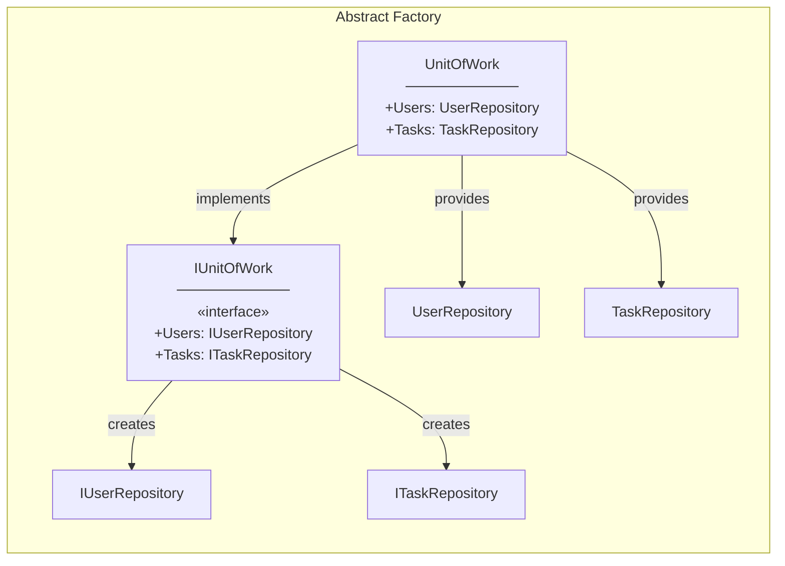

**In Our Code:**
```csharp
public interface IUnitOfWork
{
    IUserRepository Users { get; }  // Abstract Product
    ITaskRepository Tasks { get; }  // Abstract Product
}

public class UnitOfWork : IUnitOfWork
{
    public IUserRepository Users { get; }  // Concrete Product
    public ITaskRepository Tasks { get; }  // Concrete Product
}
```

**GoF Definition:** Provide an interface for creating families of related objects without specifying their concrete classes.

---

## Structural Patterns Used

### 4. Adapter Pattern

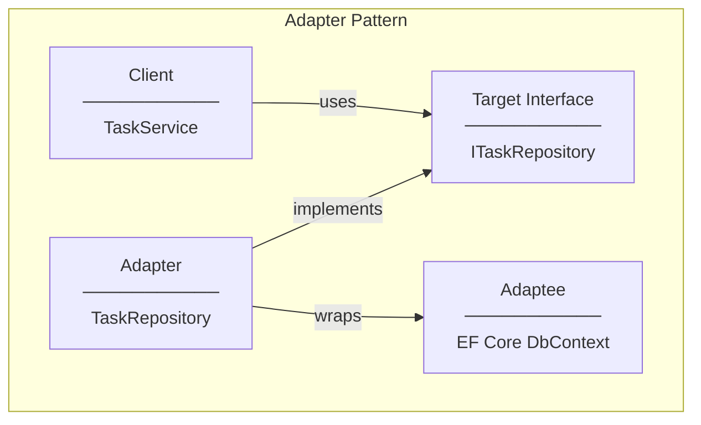

**In Our Code:**
```csharp
// TaskRepository adapts EF Core DbContext to our ITaskRepository interface
public class TaskRepository : ITaskRepository
{
    private readonly ApplicationDbContext _context;  // Adaptee

    // Adapts DbContext operations to our interface
    public async Task<TaskItem?> GetByIdAsync(int id)
    {
        return await _context.Tasks.FindAsync(id);
    }
}
```

**GoF Definition:** Convert the interface of a class into another interface clients expect.

---

### 5. Facade Pattern

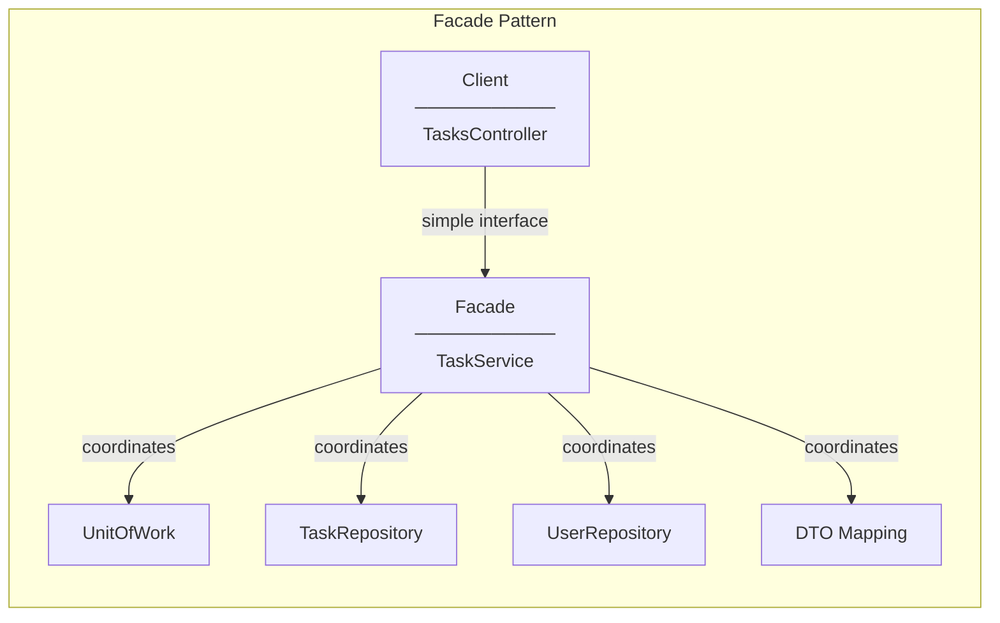

**In Our Code:**
```csharp
// TaskService is a Facade - provides simple interface to complex subsystem
public class TaskService : ITaskService
{
    public async Task<TaskResponseDto> CreateTaskAsync(CreateTaskRequestDto request, int userId)
    {
        // Hides complexity:
        // 1. Entity creation
        // 2. Repository operations
        // 3. SaveChanges coordination
        // 4. Reloading with relations
        // 5. DTO mapping
    }
}

// Controller only sees simple interface
await _taskService.CreateTaskAsync(request, userId);
```

**GoF Definition:** Provide a unified interface to a set of interfaces in a subsystem.

---

### 6. Composite Pattern (Conceptual)

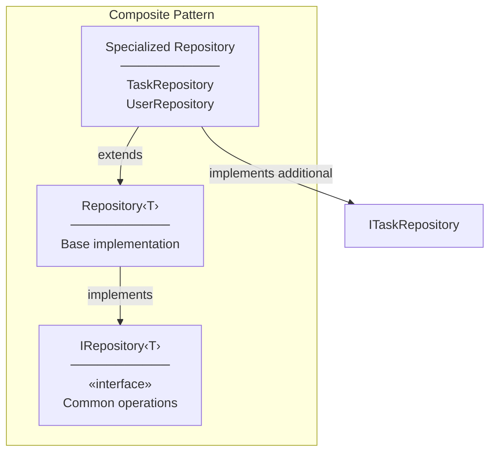

**GoF Definition:** Compose objects into tree structures to represent part-whole hierarchies.

---

## Behavioral Patterns Used

### 7. Strategy Pattern

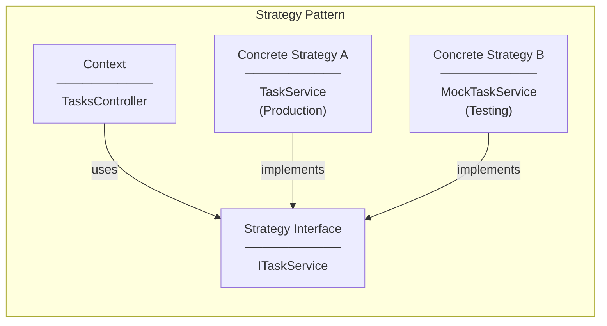

**In Our Code:**
```csharp
// Strategy interface
public interface ITaskService
{
    Task<TaskResponseDto> CreateTaskAsync(CreateTaskRequestDto request, int userId);
}

// Context uses strategy via DI - can swap implementations
public class TasksController
{
    private readonly ITaskService _taskService;  // Strategy

    public TasksController(ITaskService taskService)
    {
        _taskService = taskService;
    }
}

// Swap strategy in tests
services.AddScoped<ITaskService, MockTaskService>();
```

**GoF Definition:** Define a family of algorithms, encapsulate each one, and make them interchangeable.

---

### 8. Template Method Pattern

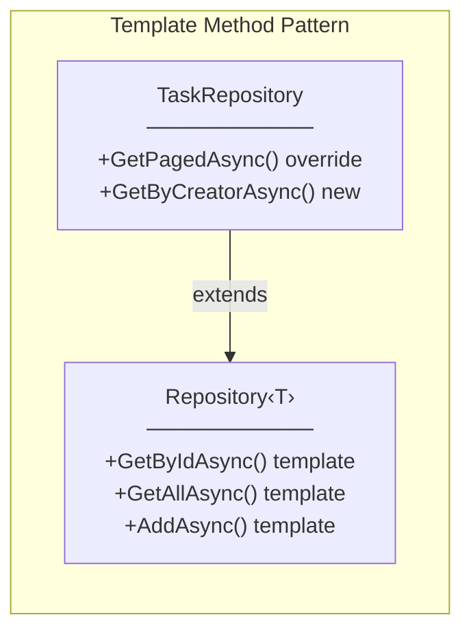

**In Our Code:**
```csharp
// Abstract class with template methods
public class Repository<T> : IRepository<T> where T : class
{
    protected readonly ApplicationDbContext _context;
    protected readonly DbSet<T> _dbSet;

    // Template methods - same for all entities
    public virtual async Task<T?> GetByIdAsync(int id)
    {
        return await _dbSet.FindAsync(id);
    }
}

// Concrete class can override or add methods
public class TaskRepository : Repository<TaskItem>, ITaskRepository
{
    // Uses inherited template methods
    // Adds specialized methods
    public async Task<TaskItem?> GetByIdWithDetailsAsync(int id)
    {
        return await _context.Tasks
            .Include(t => t.CreatedBy)
            .FirstOrDefaultAsync(t => t.Id == id);
    }
}
```

**GoF Definition:** Define the skeleton of an algorithm, deferring some steps to subclasses.

---

### 9. Iterator Pattern (Built-in)

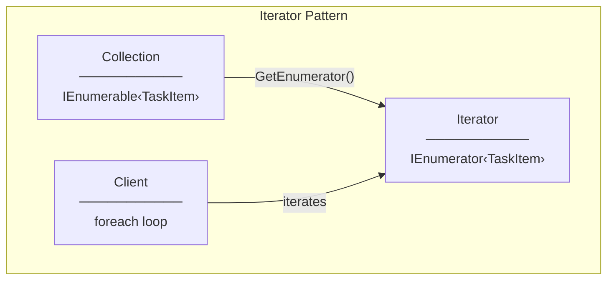

**In Our Code:**
```csharp
// IEnumerable is Iterator pattern in C#
public async Task<(IEnumerable<TaskItem> Items, int TotalCount)> GetPagedAsync(...)
{
    var items = await query.ToListAsync();  // Returns IEnumerable
    return (items, totalCount);
}

// Usage - foreach uses iterator
foreach (var task in items)
{
    yield return MapToResponseDto(task);
}
```

**GoF Definition:** Provide a way to access elements of a collection sequentially without exposing its underlying representation.

---

### 10. Observer Pattern (Future: SignalR)

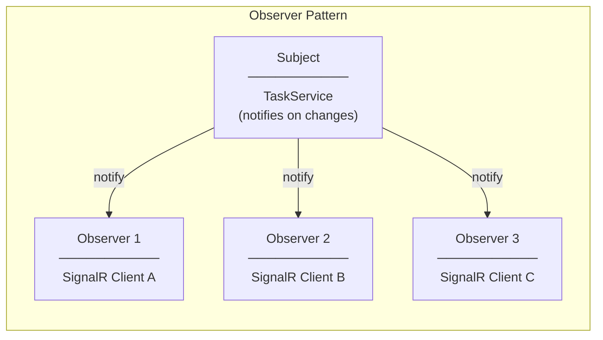

**Future Implementation (SignalR):**
```csharp
// Subject notifies observers
public async Task<TaskResponseDto> UpdateTaskAsync(...)
{
    // ... update logic ...

    // Notify all observers (connected clients)
    await _hubContext.Clients.All.SendAsync("TaskUpdated", result);

    return result;
}
```

**GoF Definition:** Define a one-to-many dependency so that when one object changes state, all dependents are notified.

---

## Pattern Summary Table

| Pattern | Category | Used In | Purpose |
|---------|----------|---------|---------|
| Factory Method | Creational | DI Container | Object creation |
| Singleton | Creational | Configuration | Single instance |
| Abstract Factory | Creational | IUnitOfWork | Related object families |
| Adapter | Structural | Repository | Interface conversion |
| Facade | Structural | TaskService | Simplified interface |
| Strategy | Behavioral | Service injection | Swappable algorithms |
| Template Method | Behavioral | Repository‹T› | Algorithm skeleton |
| Iterator | Behavioral | IEnumerable | Sequential access |
| Observer | Behavioral | SignalR (future) | Change notification |

---

## GoF Patterns Not Used (and Why)

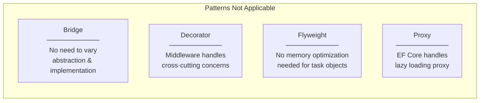

---

## Pattern Interaction Diagram

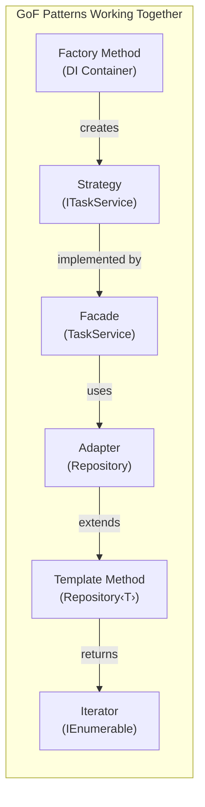
