# Programming Concepts Recap (Language Agnostic)

## Overview

These are fundamental programming concepts that apply across all programming languages. Understanding these concepts helps you write better code in any language.

---

## 1. Abstraction

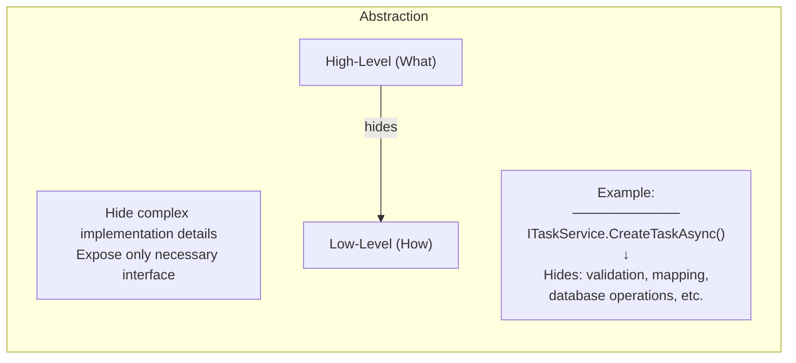

**Concept:**
- Hide complexity behind simple interfaces
- User of abstraction doesn't need to know implementation
- Change implementation without affecting clients

**Real-World Analogy:**
- Driving a car: You use steering wheel and pedals (interface)
- You don't need to know how engine works (implementation)

---

## 2. Encapsulation

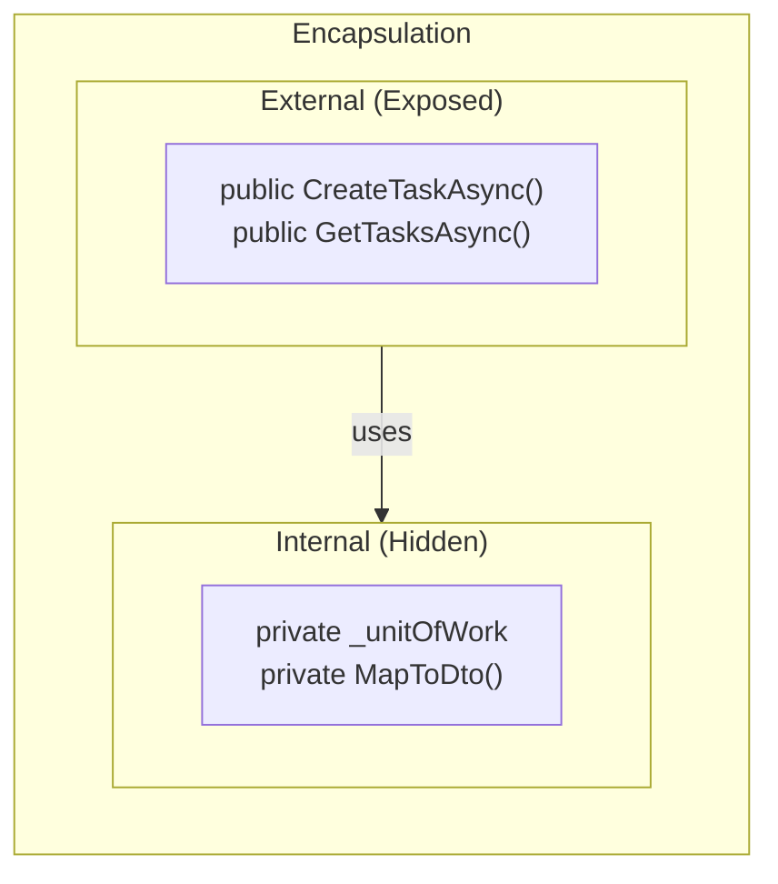

**Concept:**
- Bundle data and methods that operate on that data
- Restrict direct access to internal state
- Control how data is modified

**Access Levels (Common):**
| Level | Visibility |
|-------|------------|
| Public | Anywhere |
| Private | Same class only |
| Protected | Same class + subclasses |
| Internal | Same module/assembly |

---

## 3. Inheritance

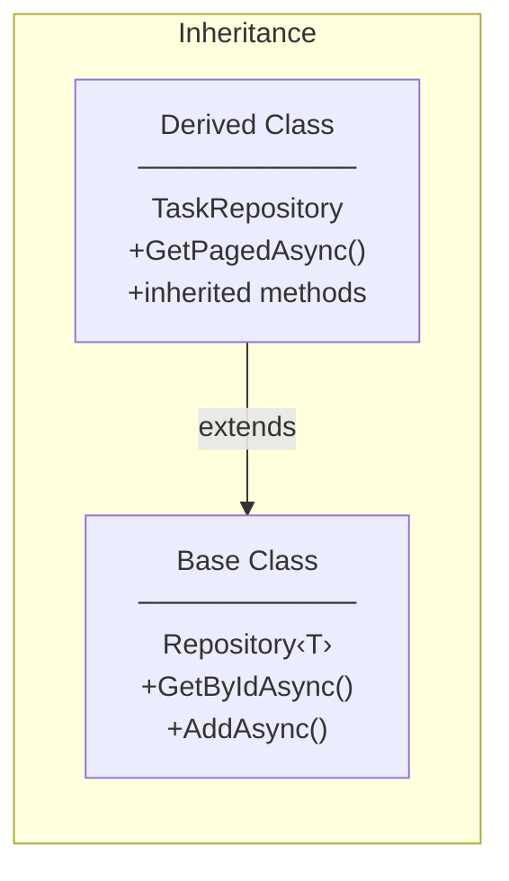

**Concept:**
- Create new class based on existing class
- Inherit properties and methods from parent
- Add or override behavior in child

**Types:**
- Single Inheritance: One parent class
- Multiple Inheritance: Multiple parents (interfaces in most languages)
- Hierarchical: One parent, multiple children

---

## 4. Polymorphism

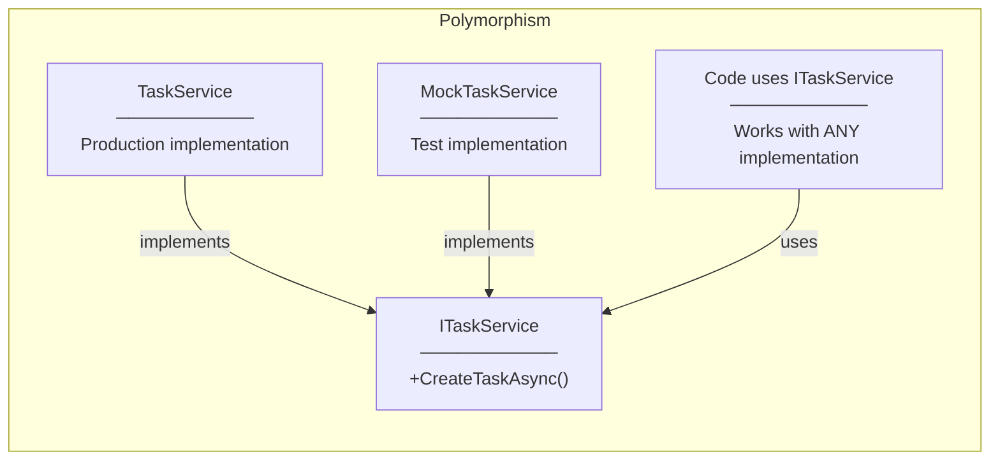

**Concept:**
- "Many forms" - same interface, different implementations
- Code works with base type, gets specific behavior
- Enables flexibility and extensibility

**Types:**
- Compile-time (Method Overloading)
- Runtime (Method Overriding, Interfaces)

---

## 5. Composition over Inheritance

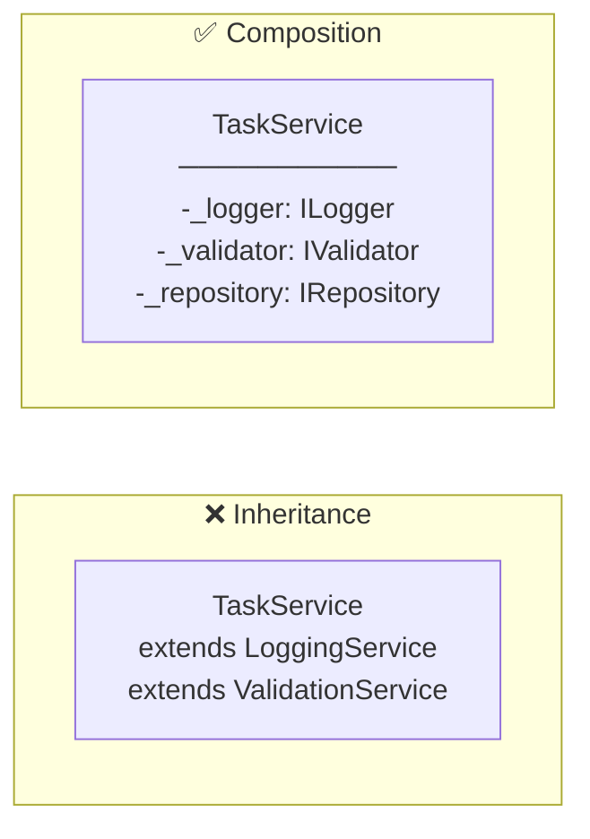

**Concept:**
- Prefer "has-a" relationships over "is-a"
- Combine simple objects to build complex ones
- More flexible than deep inheritance hierarchies

**Benefits:**
- Looser coupling
- Easier to change
- More testable

---

## 6. Separation of Concerns (SoC)

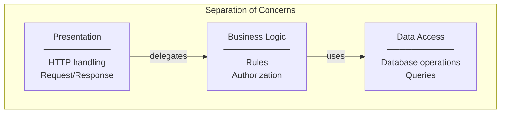

**Concept:**
- Each module handles one concern
- Don't mix unrelated responsibilities
- Changes in one area don't affect others

**Our Implementation:**
| Layer | Concern |
|-------|---------|
| Controller | HTTP |
| Service | Business Logic |
| Repository | Data Access |
| Entity | Data Structure |
| DTO | Data Transfer |

---

## 7. DRY (Don't Repeat Yourself)

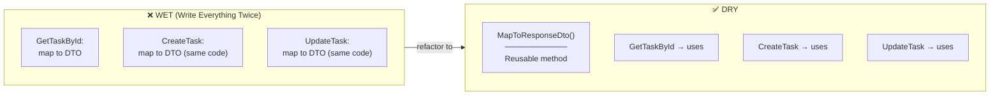

**Concept:**
- Every piece of knowledge has single representation
- Avoid code duplication
- Extract common logic into reusable units

**Caveat:**
- Don't over-DRY: premature abstraction is also bad
- Some duplication is acceptable if contexts are different

---

## 8. KISS (Keep It Simple, Stupid)

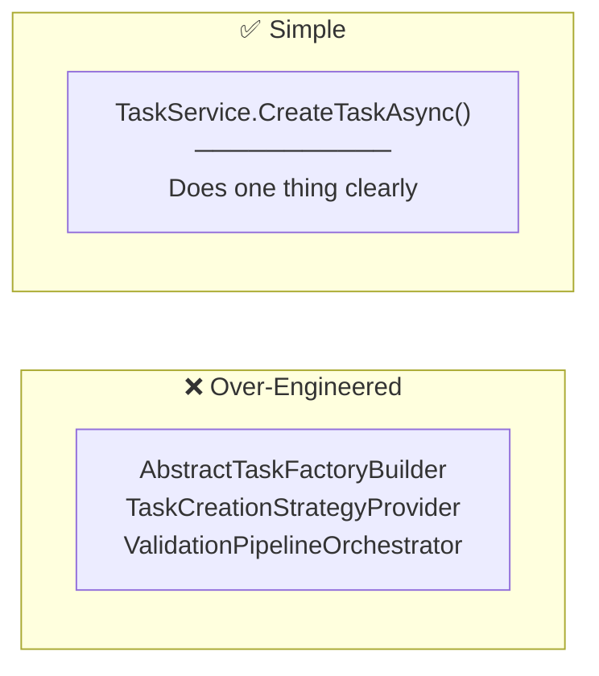

**Concept:**
- Simplest solution that works
- Avoid unnecessary complexity
- Easy to understand = easy to maintain

**Questions to Ask:**
- Do I really need this abstraction?
- Can someone else understand this easily?
- Am I solving a real problem or imaginary one?

---

## 9. YAGNI (You Aren't Gonna Need It)

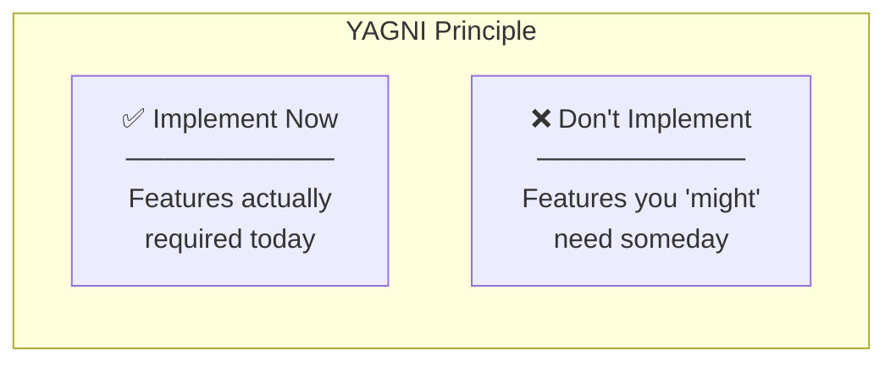

**Concept:**
- Don't implement features until needed
- Avoid speculative development
- Requirements change - don't waste time

**Examples:**
- Don't add caching "just in case"
- Don't create abstract factory for single implementation
- Don't add configuration for hardcoded values

---

## 10. Dependency Inversion

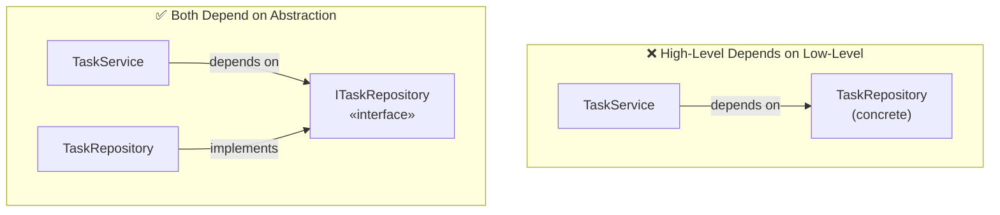

**Concept:**
- High-level modules shouldn't depend on low-level modules
- Both should depend on abstractions
- Abstractions shouldn't depend on details

---

## 11. Cohesion and Coupling

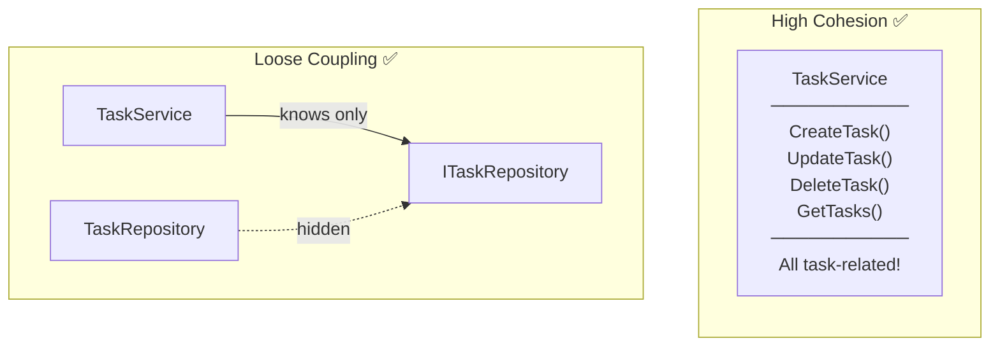

**Cohesion:**
- How related are elements within a module
- High cohesion = module does one thing well
- Low cohesion = module does unrelated things

**Coupling:**
- How dependent are modules on each other
- Loose coupling = easy to change independently
- Tight coupling = changes ripple through system

---

## 12. Single Source of Truth (SSOT)

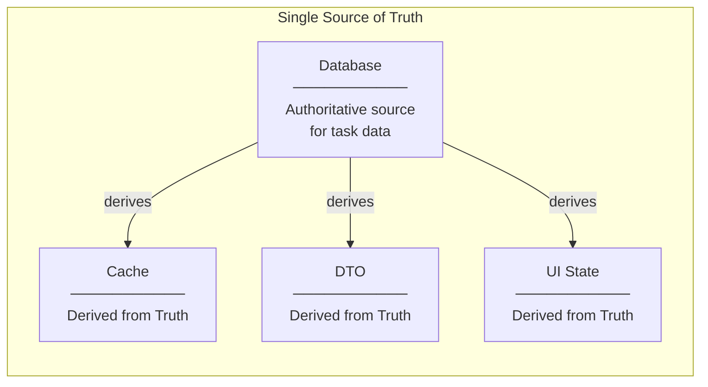

**Concept:**
- One authoritative source for each piece of data
- Other representations are derived
- Prevents inconsistency

---

## 13. Fail Fast

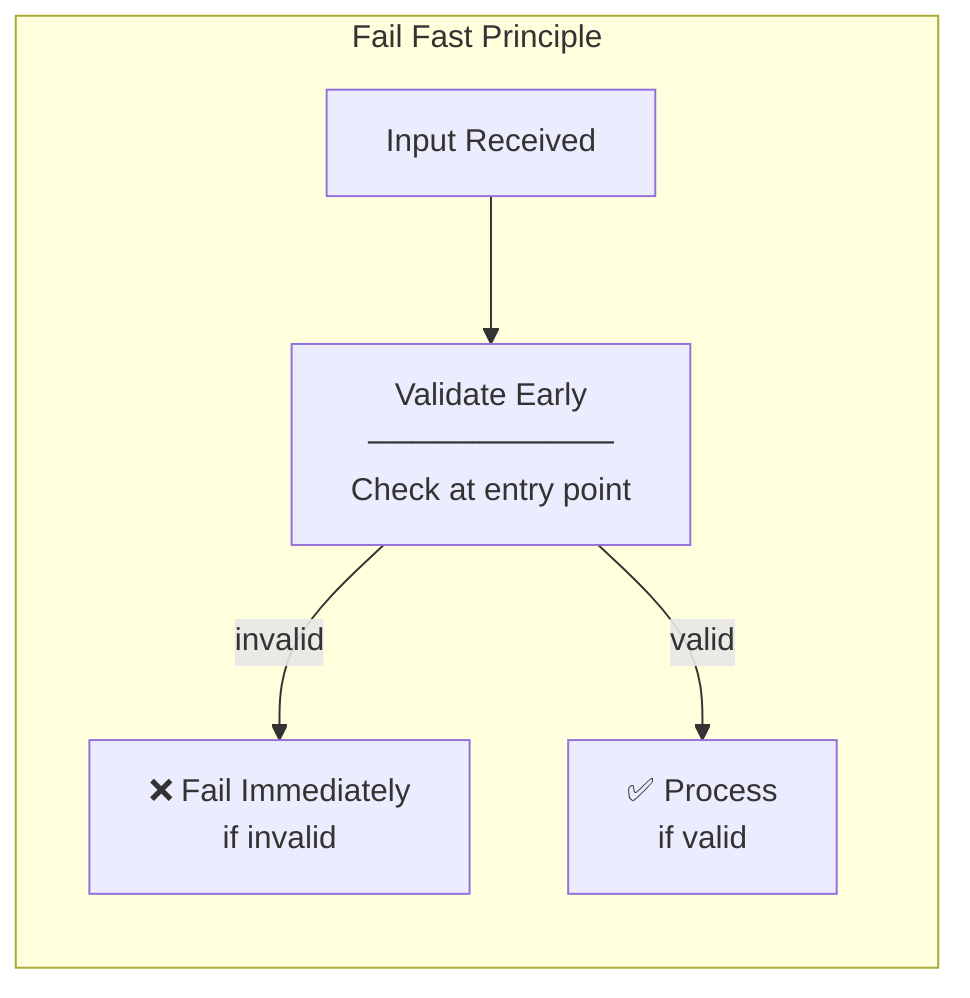

**Concept:**
- Detect and report errors as early as possible
- Don't let invalid data propagate
- Clear error messages at point of failure

**Example:**
```
// Fail fast - check at API entry
[ApiController] validates request immediately
→ 400 Bad Request with clear error

// vs. failing later
Save to database
→ Cryptic database constraint error
```

---

## 14. Idempotency

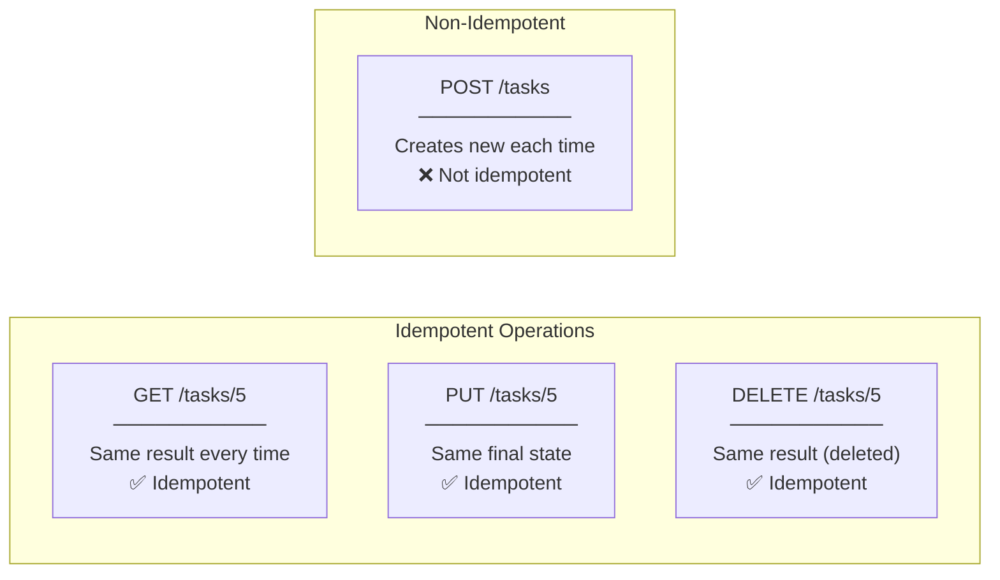

**Concept:**
- Operation can be applied multiple times with same result
- Important for retry logic and reliability
- HTTP: GET, PUT, DELETE are idempotent; POST is not

---

## 15. Immutability

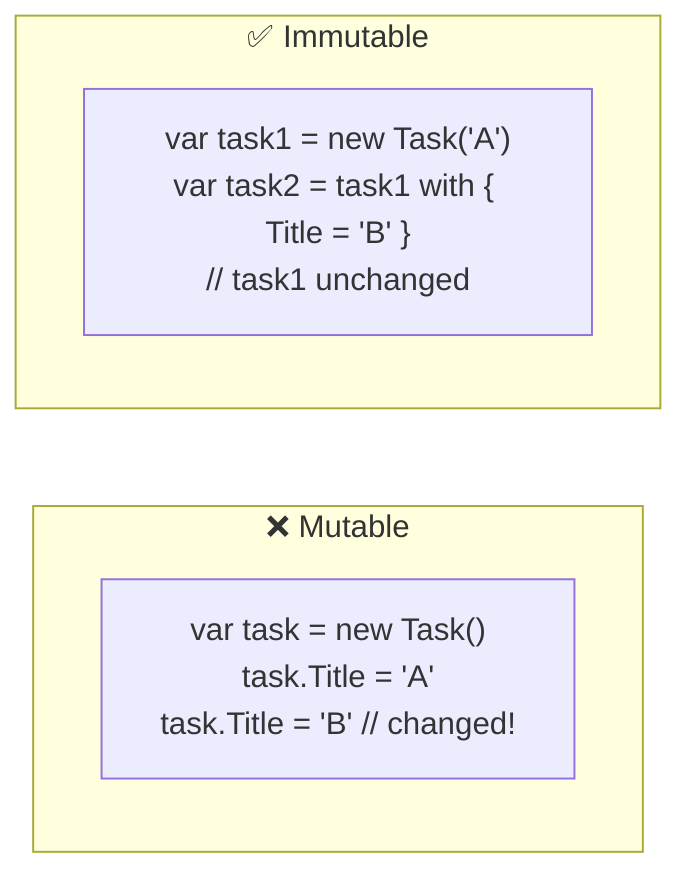

**Concept:**
- Once created, object cannot be modified
- Create new object instead of modifying
- Prevents unexpected side effects

**Benefits:**
- Thread-safe by default
- Easier to reason about
- No defensive copying needed

---

## 16. Error Handling Strategies

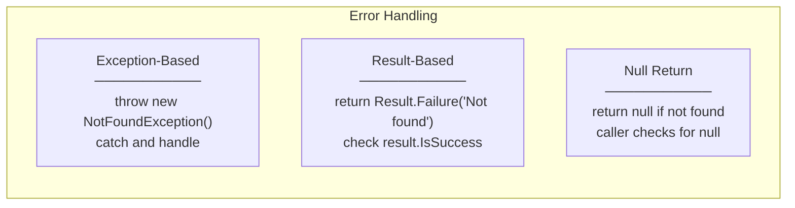

**Our Approach (Exception-Based):**
```
Service: throw KeyNotFoundException
    ↓
Controller: catch → return NotFound()
    ↓
Client: 404 response
```

**Trade-offs:**
| Strategy | Pros | Cons |
|----------|------|------|
| Exception | Clear flow control | Performance overhead |
| Result | Explicit, no throw | Verbose, must check |
| Null | Simple | Null reference risks |

---

## Concept Relationships

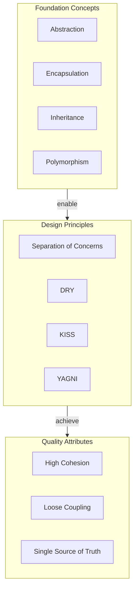

---

## Summary Table

| Concept | One-Line Definition |
|---------|---------------------|
| Abstraction | Hide complexity, show only what's needed |
| Encapsulation | Bundle data + behavior, control access |
| Inheritance | Create new types based on existing ones |
| Polymorphism | Same interface, different implementations |
| Composition | Build complex from simple (has-a) |
| SoC | One module, one responsibility |
| DRY | Single representation of knowledge |
| KISS | Simplest solution that works |
| YAGNI | Don't build what you don't need yet |
| Dependency Inversion | Depend on abstractions, not concretions |
| Cohesion | Elements in module are related |
| Coupling | Modules are independent |
| SSOT | One authoritative data source |
| Fail Fast | Detect errors early |
| Idempotency | Same operation, same result |
| Immutability | Objects don't change after creation |
