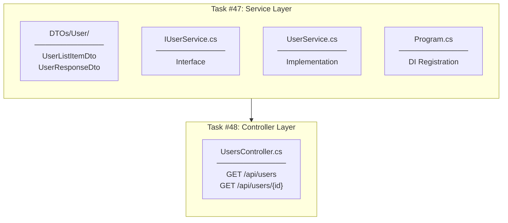
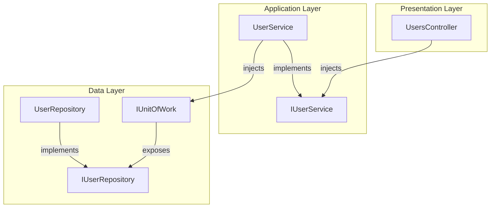

# User Service & Controller Implementation Plan

## Overview

Story #46: User List for Task Assignment - Backend portion (Tasks #47-48)

## Implementation Flow



---

## File-by-File Implementation Order

### Task #47: Implement UserService

#### 1.1 UserListItemDto.cs

**Location:** `Controllers/DTOs/User/UserListItemDto.cs`

**Purpose:** Lightweight user data for dropdown selection

**Properties:**
| Property | Type | Description |
|----------|------|-------------|
| `Id` | int | User identifier |
| `Name` | string | Display name |
| `Initials` | string | Avatar initials (e.g., "JD") |

---

#### 1.2 UserResponseDto.cs

**Location:** `Controllers/DTOs/User/UserResponseDto.cs`

**Purpose:** Detailed user information for single user endpoint

**Properties:**
| Property | Type | Description |
|----------|------|-------------|
| `Id` | int | User identifier |
| `Name` | string | Display name |
| `Email` | string | Email address |
| `Initials` | string | Avatar initials |
| `CreatedAt` | DateTime | Registration date |

---

#### 1.3 IUserService.cs

**Location:** `Services/Interfaces/IUserService.cs`

**Methods:**
| Method | Return | Description |
|--------|--------|-------------|
| `GetAllUsersAsync()` | `Task<IEnumerable<UserListItemDto>>` | All users for dropdown |
| `GetUserByIdAsync(int id)` | `Task<UserResponseDto?>` | Single user details |

---

#### 1.4 UserService.cs

**Location:** `Services/UserService.cs`

**Features:**
- Implements `IUserService`
- Injects `IUnitOfWork`
- Uses existing `IUserRepository.GetAllAsync()` and `GetByIdAsync()`
- `GetInitials()` helper method (same pattern as TaskService)

---

#### 1.5 Program.cs DI Registration

**Location:** `Program.cs` (after ITaskService registration)

```csharp
builder.Services.AddScoped<IUserService, UserService>();
```

---

### Task #48: Implement UsersController

#### 2.1 UsersController.cs

**Location:** `Controllers/UsersController.cs`

**Endpoints:**
| Method | Route | Response | Status Codes |
|--------|-------|----------|--------------|
| GET | `/api/users` | `UserListItemDto[]` | 200, 401 |
| GET | `/api/users/{id}` | `UserResponseDto` | 200, 401, 404 |

**Attributes:**
- `[Route("api/[controller]")]`
- `[ApiController]`
- `[Authorize]` - JWT authentication required

---

## Layer Dependencies



---

## Reusing Existing Infrastructure

| Component | Already Exists | Used By |
|-----------|----------------|---------|
| `IUserRepository` | Yes | AuthService |
| `UserRepository` | Yes | AuthService |
| `IUnitOfWork.Users` | Yes | AuthService |
| `GetAllAsync()` | Yes (IRepository<T>) | UserService |
| `GetByIdAsync()` | Yes (IRepository<T>) | UserService |

**No new repository methods needed!**

---

## Checklist

- [x] 1.1 Create UserListItemDto.cs
- [x] 1.2 Create UserResponseDto.cs
- [x] 1.3 Create IUserService.cs interface
- [x] 1.4 Create UserService.cs implementation
- [x] 1.5 Register IUserService in Program.cs
- [x] 2.1 Create UsersController.cs
- [ ] Build verification
