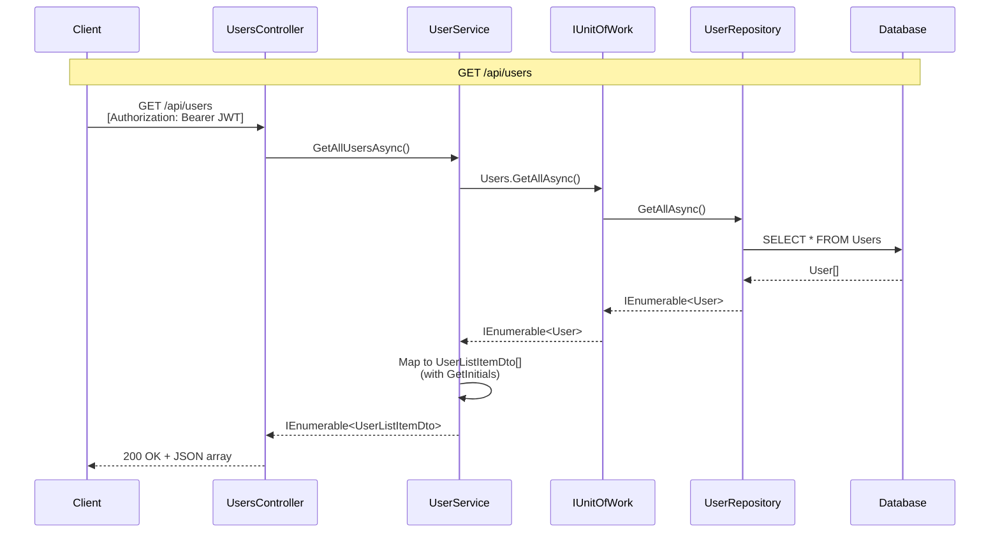
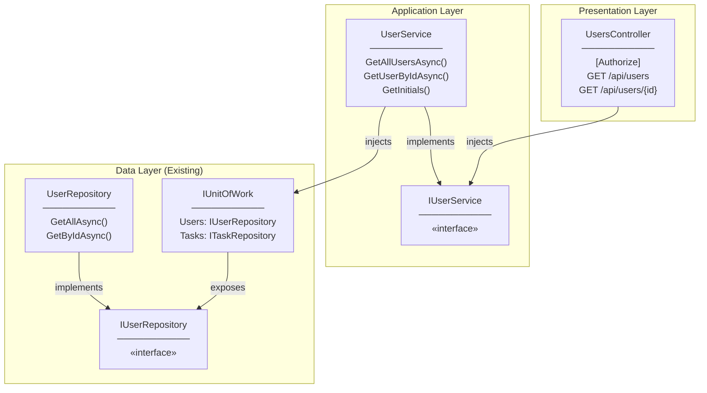
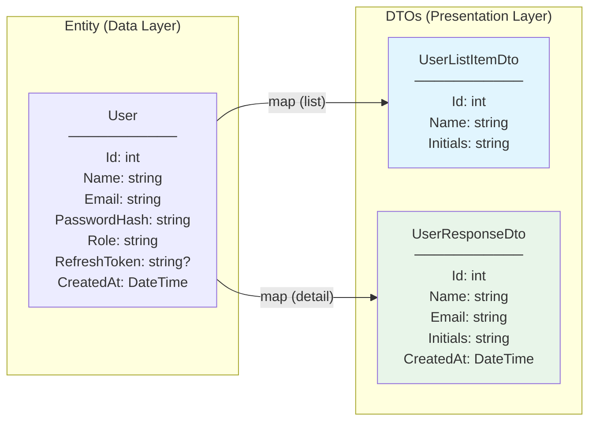
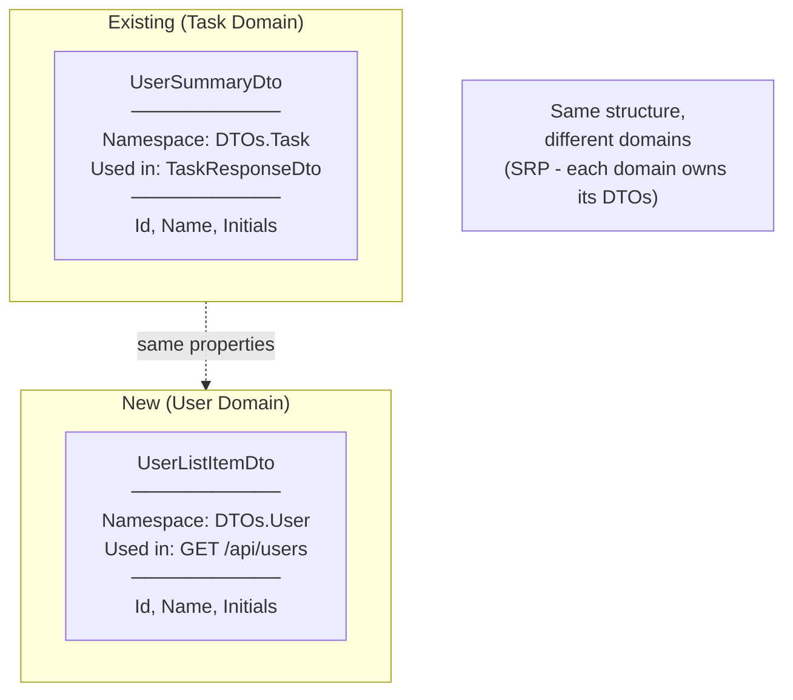

# Architecture Diagram

## Request Flow



---

## Layer Architecture



---

## File Structure

```
Backend/TaskCollaborationApp.API/
├── Controllers/
│   ├── DTOs/
│   │   ├── Task/
│   │   │   └── UserSummaryDto.cs      (existing, similar structure)
│   │   └── User/                       (NEW folder)
│   │       ├── UserListItemDto.cs     (NEW)
│   │       └── UserResponseDto.cs     (NEW)
│   ├── TasksController.cs             (existing, pattern reference)
│   └── UsersController.cs             (NEW)
├── Services/
│   ├── Interfaces/
│   │   ├── ITaskService.cs            (existing, pattern reference)
│   │   └── IUserService.cs            (NEW)
│   ├── TaskService.cs                 (existing, pattern reference)
│   └── UserService.cs                 (NEW)
└── Program.cs                         (MODIFIED - add DI)
```

---

## DTO Relationships



---

## Comparison: UserSummaryDto vs UserListItemDto



**Why separate DTOs?**
- Single Responsibility: Each domain owns its DTOs
- Future flexibility: User domain may add properties later
- Clear namespace organization
