# Design Patterns & SOLID Principles

## Design Patterns Used

### 1. Service Layer Pattern

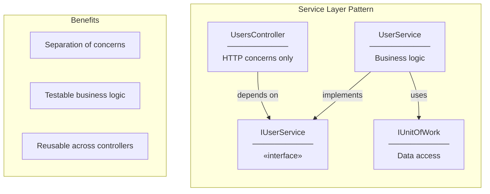

**Implementation:**
```csharp
// Interface (contract)
public interface IUserService
{
    Task<IEnumerable<UserListItemDto>> GetAllUsersAsync();
    Task<UserResponseDto?> GetUserByIdAsync(int id);
}

// Implementation (business logic)
public class UserService : IUserService
{
    private readonly IUnitOfWork _unitOfWork;

    public async Task<IEnumerable<UserListItemDto>> GetAllUsersAsync()
    {
        var users = await _unitOfWork.Users.GetAllAsync();
        return users.Select(u => new UserListItemDto { ... });
    }
}
```

---

### 2. DTO Pattern (Data Transfer Object)

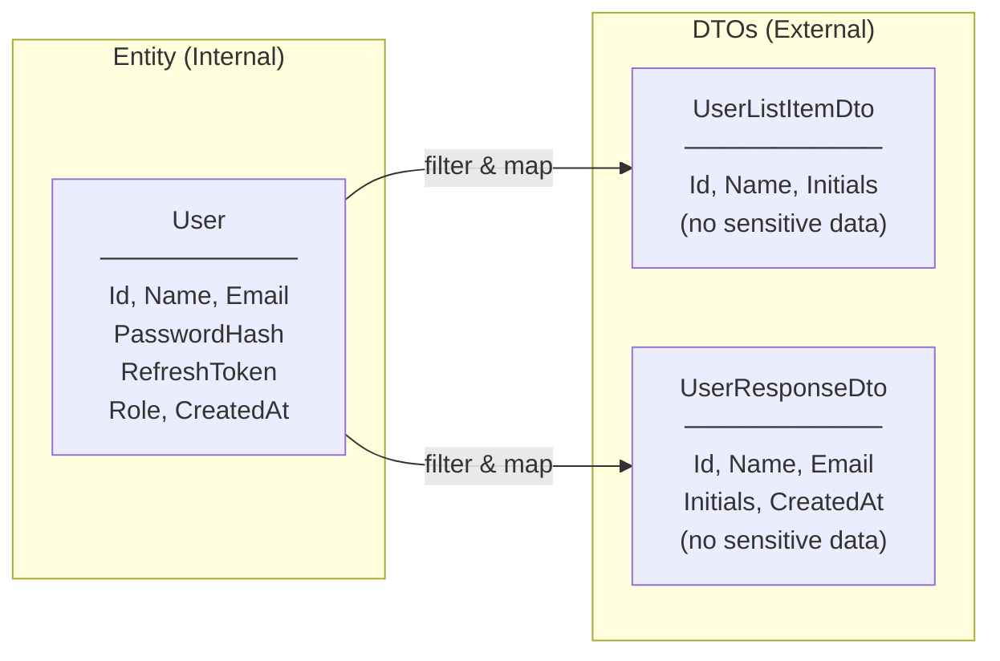

**Why DTOs for User?**
- **Security**: Never expose `PasswordHash`, `RefreshToken`
- **API Contract**: Stable interface regardless of entity changes
- **Flexibility**: Different shapes for different use cases

---

### 3. Thin Controller Pattern

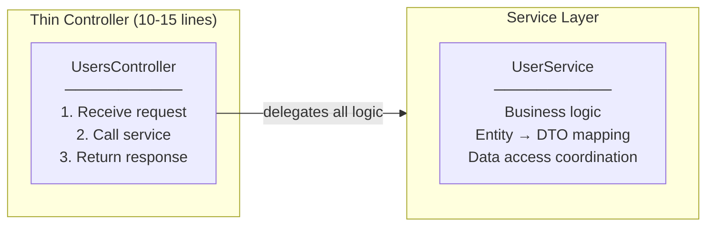

**UsersController Example:**
```csharp
[HttpGet]
public async Task<IActionResult> GetUsers()
{
    var users = await _userService.GetAllUsersAsync();  // Delegate
    return Ok(users);                                    // Return
}
```

---

### 4. Dependency Injection Pattern

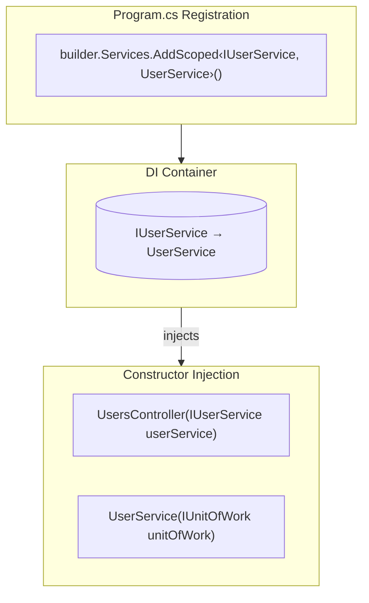

**Scoped Lifetime:**
- One instance per HTTP request
- Matches DbContext lifetime
- Fresh state for each request

---

### 5. Reuse of Existing Infrastructure

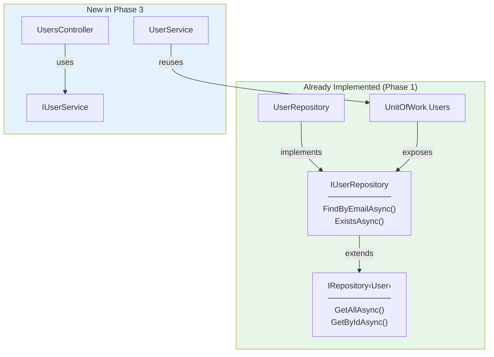

**No new repository code needed!**
- `GetAllAsync()` - inherited from `IRepository<T>`
- `GetByIdAsync()` - inherited from `IRepository<T>`

---

## SOLID Principles Applied

### S - Single Responsibility Principle

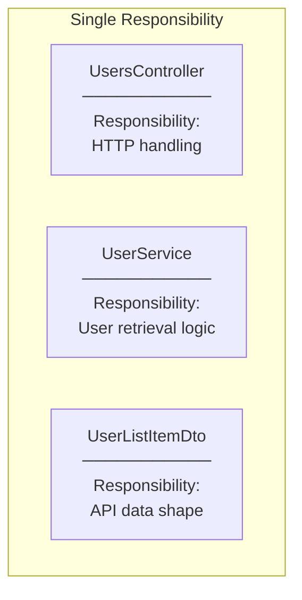

**Each class has ONE job:**
- `UsersController`: Handle HTTP requests/responses
- `UserService`: Coordinate user retrieval and mapping
- `UserListItemDto`: Define API response shape

---

### O - Open/Closed Principle

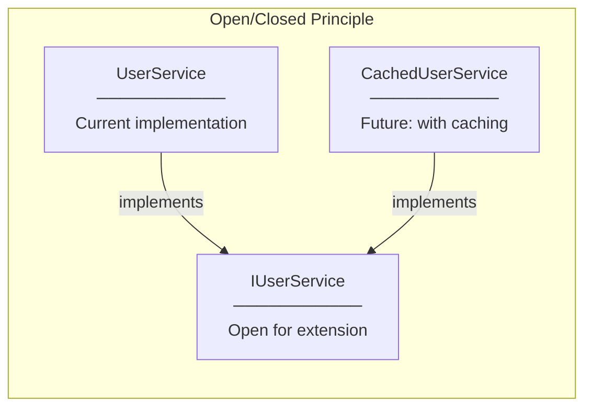

**Future extensibility:**
- Add caching without modifying `UserService`
- Add filtering without changing interface
- Swap implementations via DI

---

### L - Liskov Substitution Principle

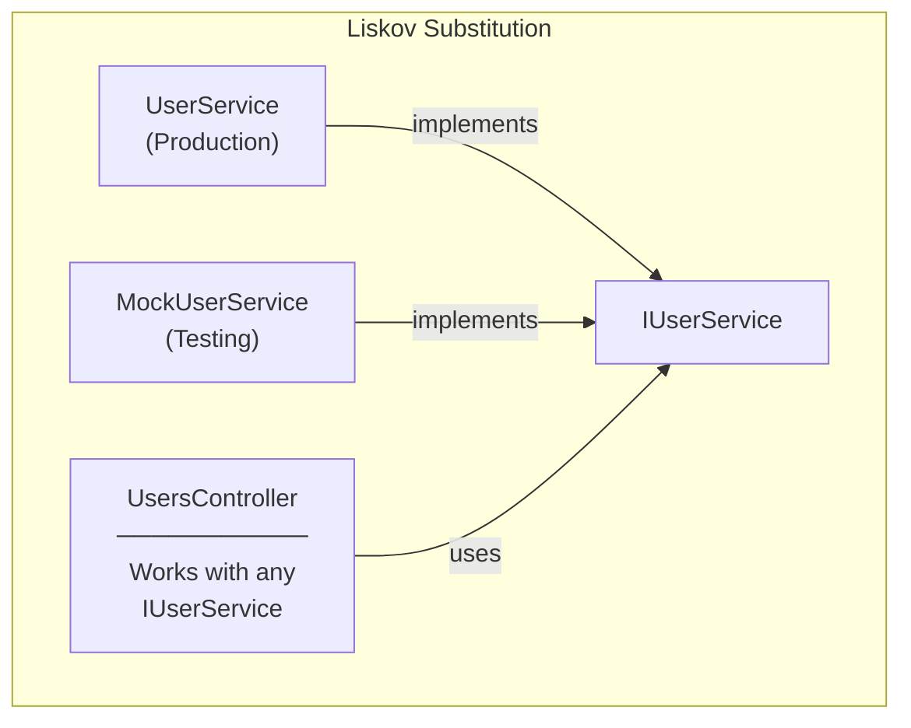

**Any implementation works:**
- Production: `UserService`
- Testing: `MockUserService`
- Controller doesn't know the difference

---

### I - Interface Segregation Principle

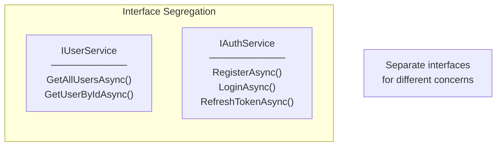

**Small, focused interfaces:**
- `IUserService`: User retrieval (read-only)
- `IAuthService`: Authentication (write operations)
- Clients depend only on what they need

---

### D - Dependency Inversion Principle

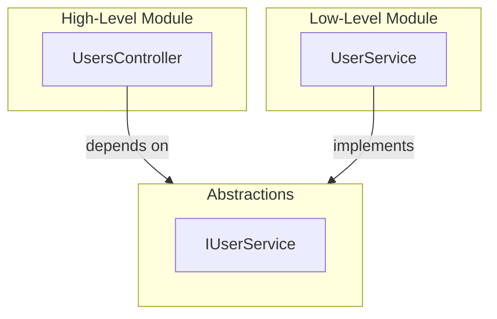

**Key Points:**
- Controller depends on `IUserService` (abstraction)
- Not on `UserService` (implementation)
- Easy to change implementation without touching controller

---

## Pattern Summary

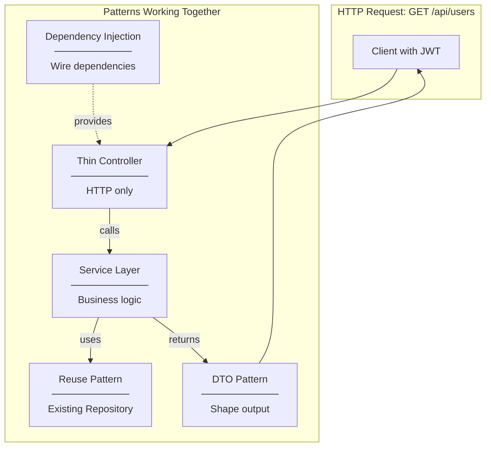
