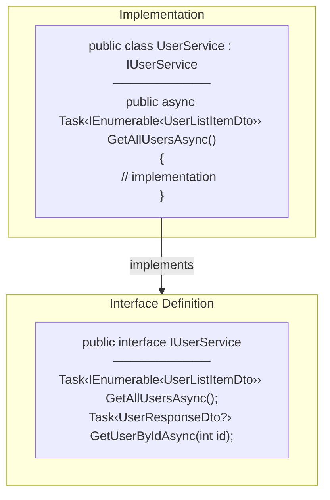
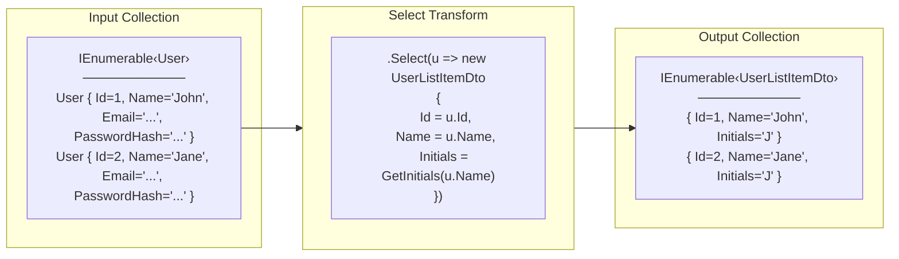
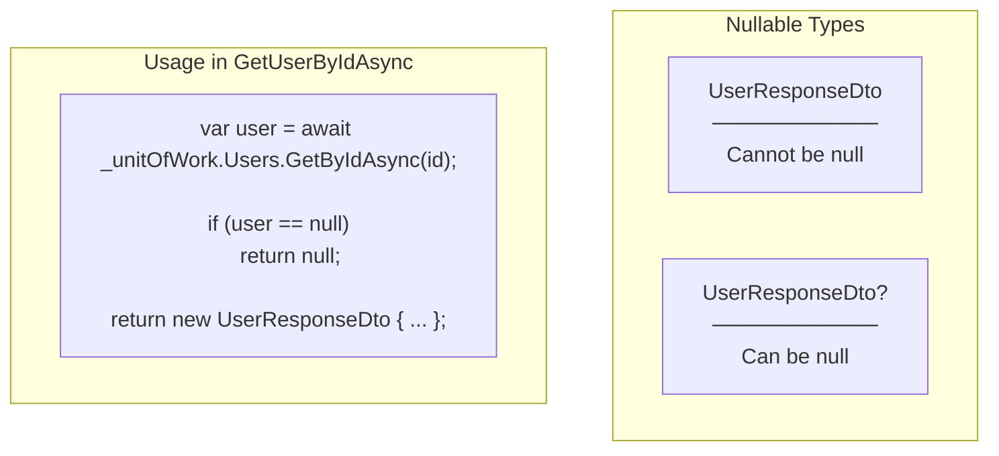
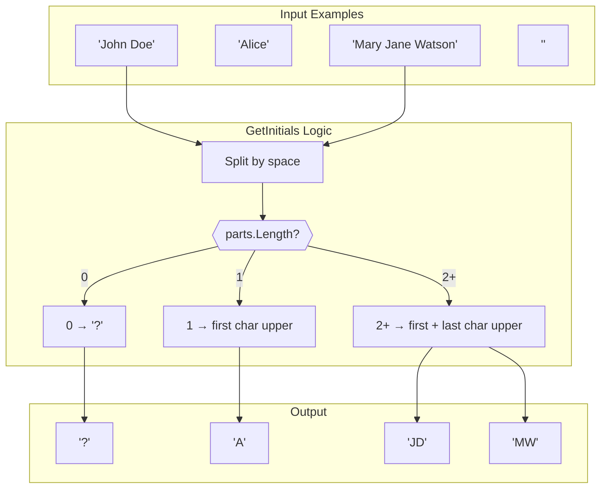
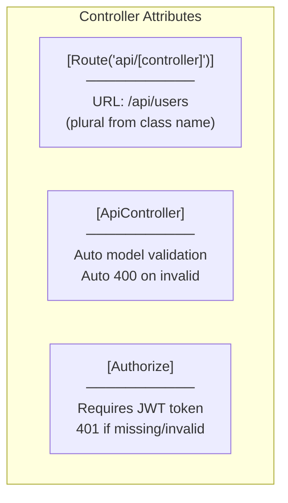
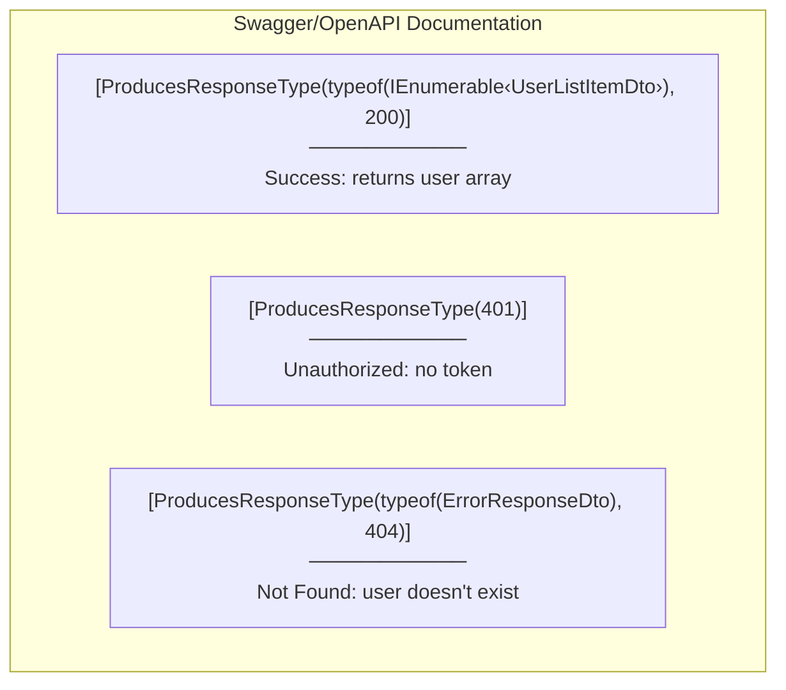
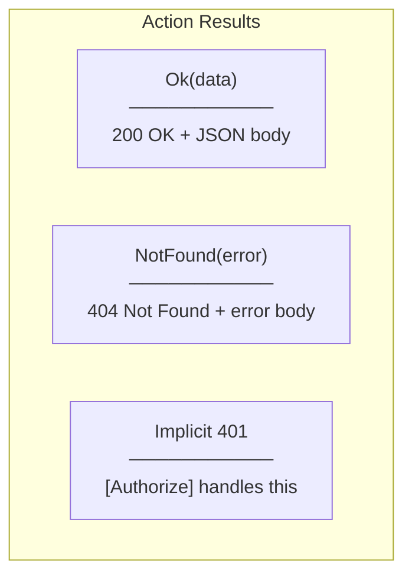
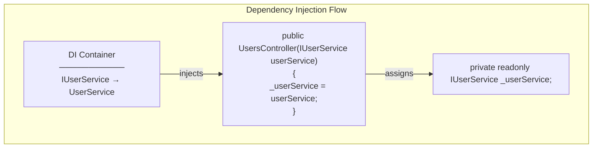
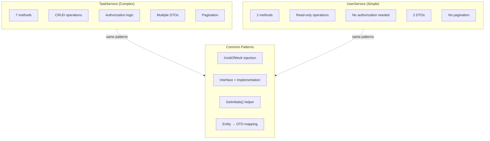
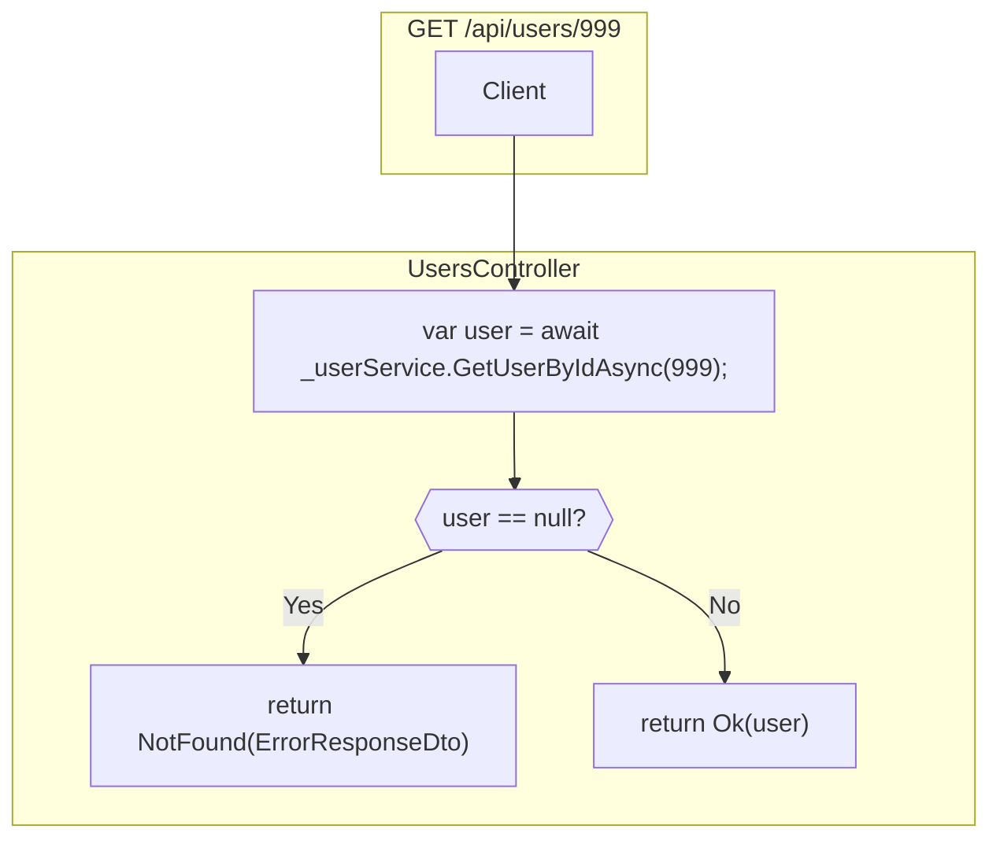

# Programming Concepts

## C# Language Features

### 1. Interface Implementation



**Key Points:**
- Interface defines the contract (what)
- Class provides the implementation (how)
- `: IUserService` indicates implementation

---

### 2. LINQ Select (Projection)



**Code:**
```csharp
var users = await _unitOfWork.Users.GetAllAsync();

return users.Select(u => new UserListItemDto
{
    Id = u.Id,
    Name = u.Name,
    Initials = GetInitials(u.Name)
});
```

**Why Select?**
- Transform each element
- Project to different type
- Filter out unwanted properties

---

### 3. Nullable Reference Types



**Method Signature:**
```csharp
public async Task<UserResponseDto?> GetUserByIdAsync(int id)
//                              ^ nullable return type
```

**Why nullable return?**
- User might not exist
- Caller must handle null case
- Compiler enforces null checks

---

### 4. GetInitials Helper Method



**Code:**
```csharp
private static string GetInitials(string name)
{
    var parts = name.Split(' ', StringSplitOptions.RemoveEmptyEntries);

    if (parts.Length == 0) return "?";
    if (parts.Length == 1) return parts[0][0].ToString().ToUpper();

    return $"{parts[0][0]}{parts[^1][0]}".ToUpper();
}
```

**Explanation:**
- `Split(' ', StringSplitOptions.RemoveEmptyEntries)`: Split and remove empty entries
- `parts[0][0]`: First character of first word
- `parts[^1][0]`: First character of last word (`^1` = index from end)
- `.ToUpper()`: Convert to uppercase

---

### 5. String Interpolation

```csharp
// String interpolation with $
return $"{parts[0][0]}{parts[^1][0]}".ToUpper();

// Equivalent to:
return (parts[0][0].ToString() + parts[^1][0].ToString()).ToUpper();
```

**Benefits:**
- More readable
- Type-safe
- Compile-time checked

---

## ASP.NET Core Concepts

### 1. Controller Attributes



**Combined Effect:**
```csharp
[Route("api/[controller]")]  // /api/users
[ApiController]               // Auto-validation
[Authorize]                   // Require JWT
public class UsersController : ControllerBase
```

---

### 2. ProducesResponseType Attribute



**Purpose:**
- Documents API responses
- Generates Swagger UI
- Helps API consumers

---

### 3. IActionResult Return Types



**Usage Pattern:**
```csharp
[HttpGet("{id}")]
public async Task<IActionResult> GetUser(int id)
{
    var user = await _userService.GetUserByIdAsync(id);

    if (user == null)
    {
        return NotFound(new ErrorResponseDto
        {
            Error = "Not found",
            Message = "User not found"
        });
    }

    return Ok(user);
}
```

---

### 4. Constructor Injection



**Best Practices:**
- `readonly` field prevents reassignment
- Private field with underscore prefix
- Interface type (not concrete)

---

## Comparison: TaskService vs UserService



**UserService is intentionally simple:**
- Read-only (no create/update/delete)
- All authenticated users can access
- No complex business rules
- Reuses existing repository

---

## Error Handling Pattern



**Consistent Error Response:**
```csharp
return NotFound(new ErrorResponseDto
{
    Error = "Not found",
    Message = "User not found"
});
```

**Same pattern as TasksController** for consistency.

---

## HTTP Status Codes Summary

| Endpoint | Success | Errors |
|----------|---------|--------|
| `GET /api/users` | 200 + array | 401 (no token) |
| `GET /api/users/{id}` | 200 + object | 401, 404 |

**Why no 403?**
- All authenticated users can view user list
- No role-based restrictions on this endpoint
- Used for task assignment dropdown (everyone needs it)
