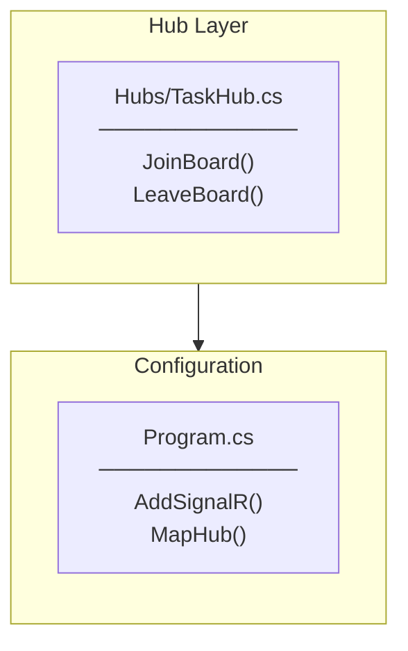

# SignalR Hub Implementation Plan

## Overview

Task #51: Create TaskHub for real-time task notifications (Story #50)

## Implementation Flow



---

## File-by-File Implementation Order

### 1. TaskHub.cs

**Location:** `Hubs/TaskHub.cs`

**Purpose:** SignalR Hub for real-time task notifications

**Methods:**
| Method | Return | Description |
|--------|--------|-------------|
| `JoinBoard()` | `Task` | Join TaskBoard group |
| `LeaveBoard()` | `Task` | Leave TaskBoard group |
| `OnConnectedAsync()` | `Task` | Handle client connection |
| `OnDisconnectedAsync()` | `Task` | Handle client disconnection |

---

### 2. Program.cs Modifications

**Changes:**
| Change | Description |
|--------|-------------|
| using | Add `TaskCollaborationApp.API.Hubs` |
| Service | Add `builder.Services.AddSignalR()` |
| Endpoint | Add `app.MapHub<TaskHub>("/hubs/tasks")` |

---

## Folder Structure

```
TaskCollaborationApp.API/
├── Hubs/                    (NEW folder)
│   └── TaskHub.cs           (NEW)
└── Program.cs               (MODIFIED)
```

---

## Checklist

- [x] Create Hubs folder
- [x] Create TaskHub.cs
- [x] Add JoinBoard() method
- [x] Add LeaveBoard() method
- [x] Add OnConnectedAsync/OnDisconnectedAsync
- [x] Program.cs AddSignalR()
- [x] Program.cs MapHub
- [x] Backend build success
