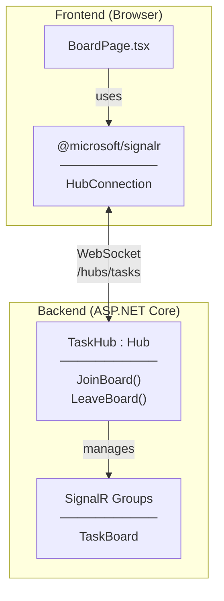
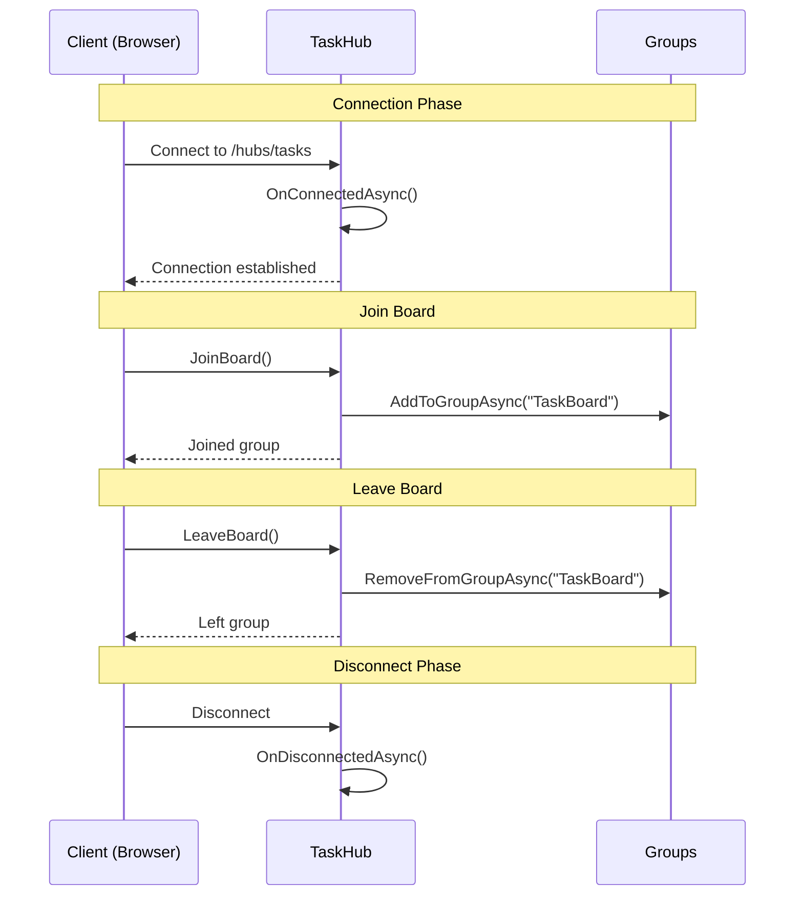
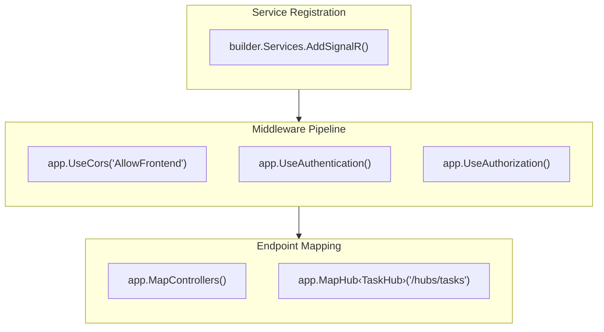
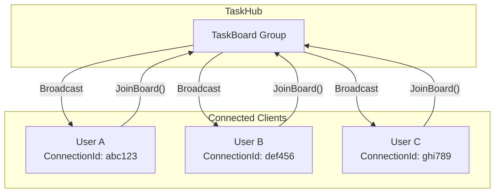
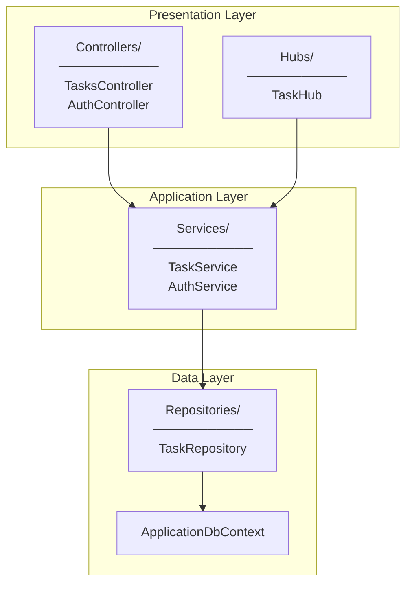
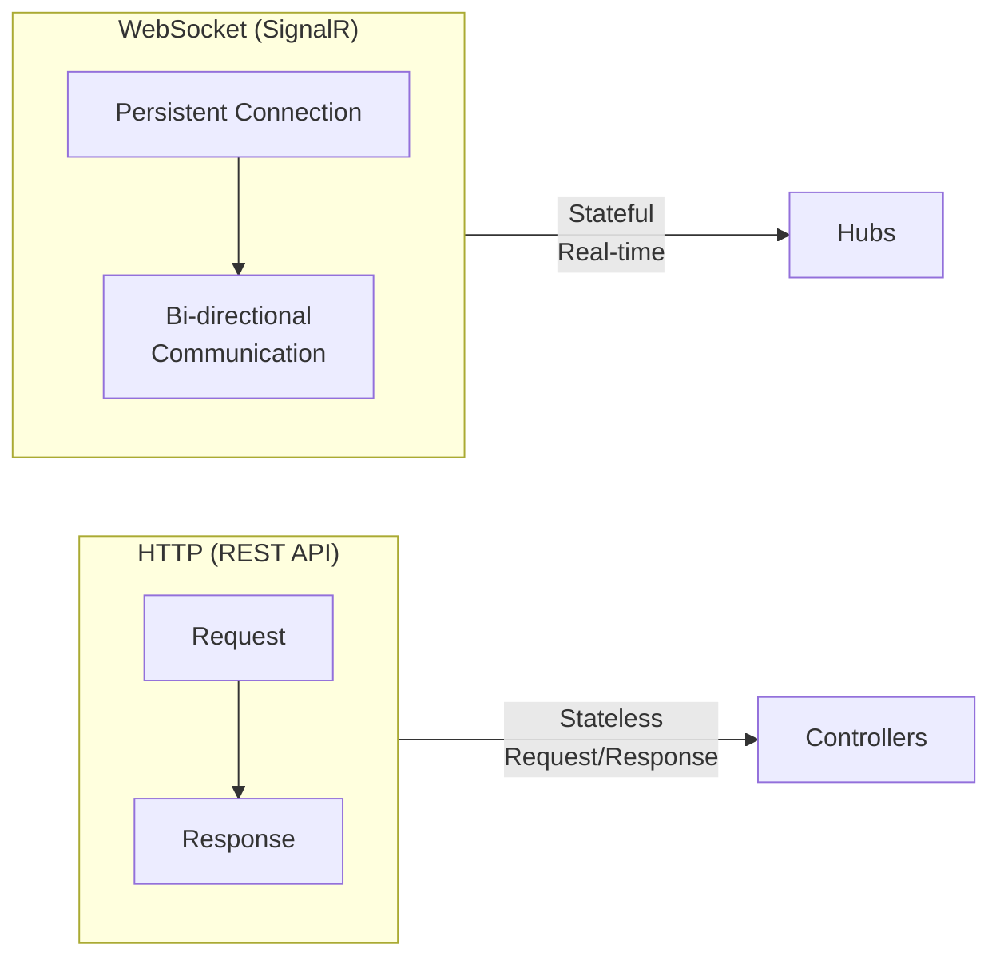

# Architecture Diagram

## SignalR Overview

---

## Hub Connection Flow

---

## Program.cs Configuration Flow

---

## SignalR Groups Concept

**Why Groups?**
- Send messages to specific subset of clients
- Users on BoardPage join "TaskBoard" group
- When task changes, broadcast only to group members
- Efficient: no need to track individual connections

---

## Layer Architecture

**Note:** Hubs are part of Presentation Layer, same level as Controllers

---

## WebSocket vs HTTP

| Feature | HTTP | WebSocket (SignalR) |
|---------|------|---------------------|
| Connection | New per request | Persistent |
| Direction | Client → Server | Bi-directional |
| Use case | CRUD operations | Real-time updates |
| State | Stateless | Stateful |
