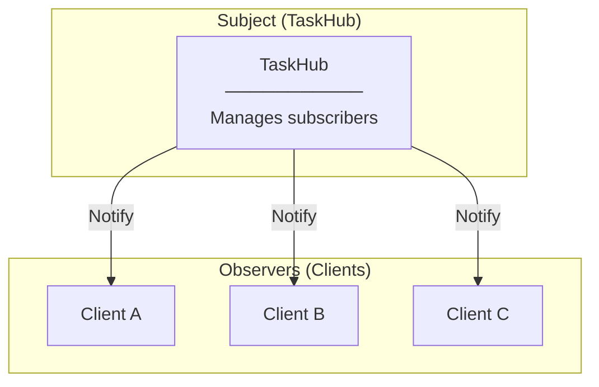
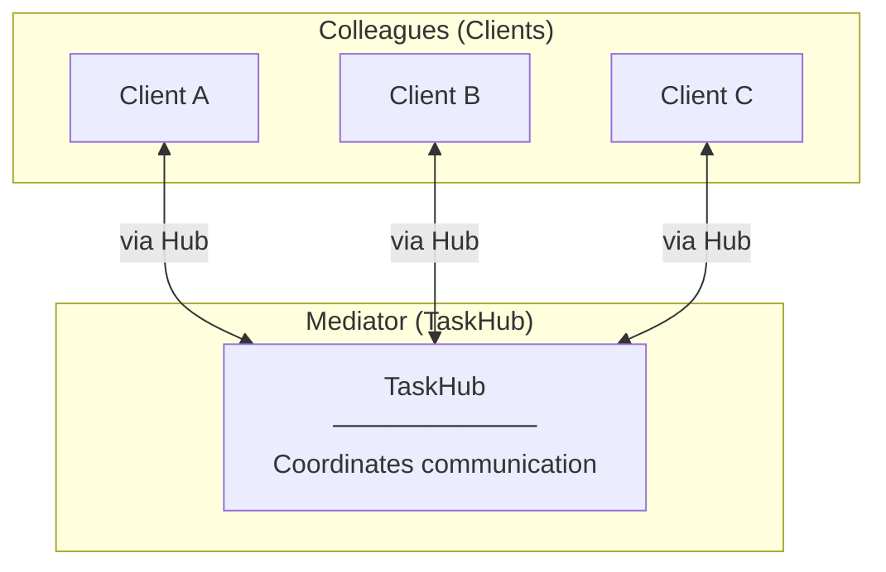
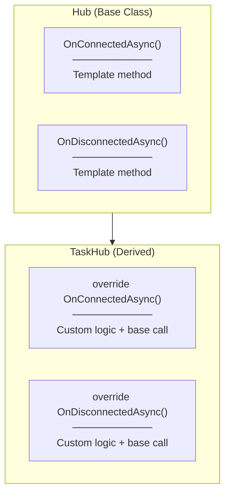
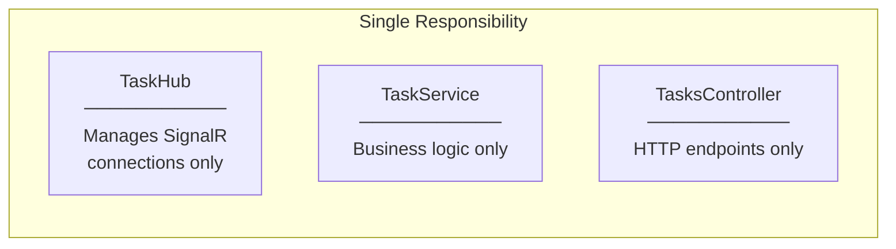
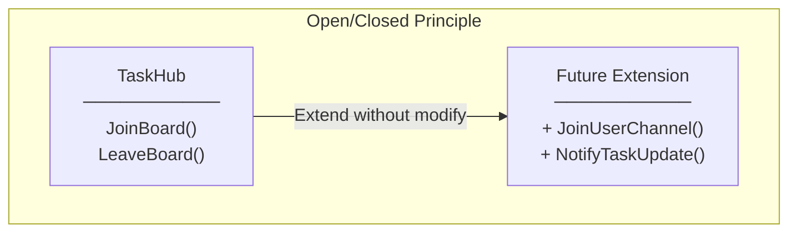
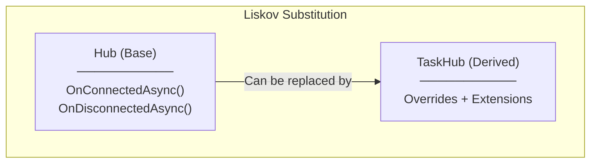
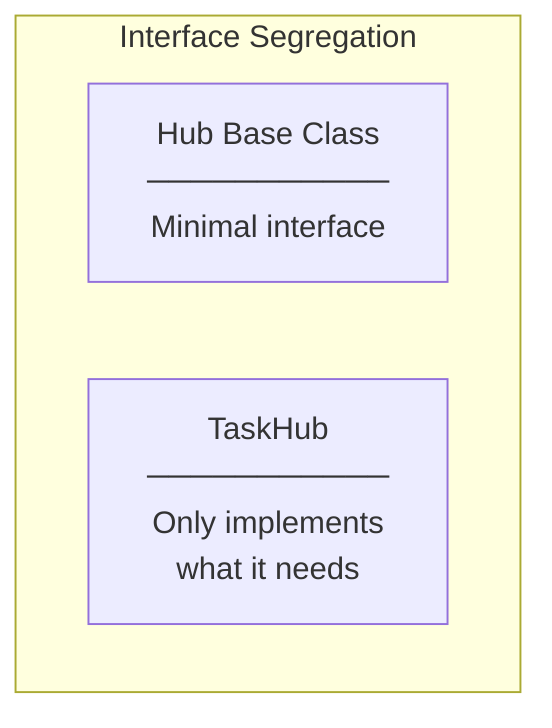
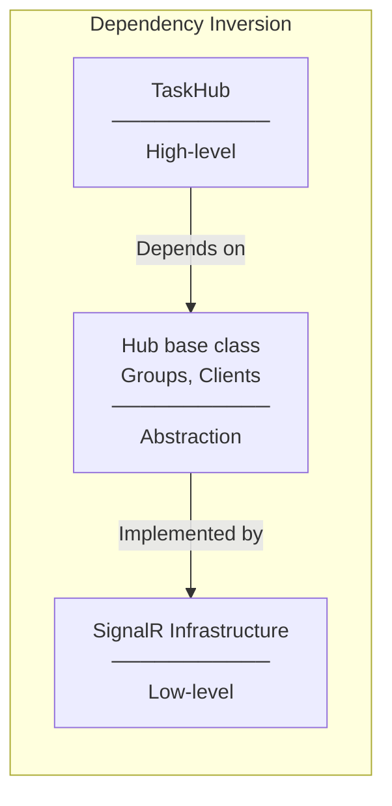
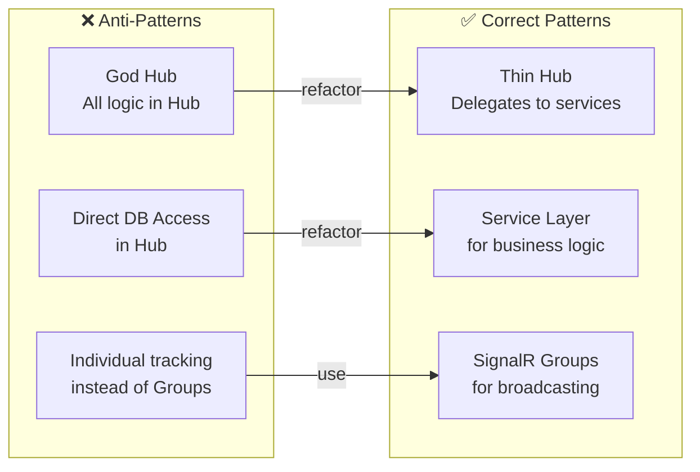

# Design Patterns and SOLID

## Design Patterns Used

### 1. Observer Pattern (via SignalR Groups)



**How SignalR implements Observer:**
- Clients "subscribe" by joining a group (`JoinBoard()`)
- Hub "notifies" all subscribers via `Clients.Group("TaskBoard").SendAsync()`
- Clients "unsubscribe" by leaving group (`LeaveBoard()`)

---

### 2. Mediator Pattern



**How TaskHub acts as Mediator:**
- Clients don't communicate directly with each other
- All communication goes through the Hub
- Hub decides who receives which messages
- Decouples clients from each other

---

### 3. Template Method Pattern



**Implementation:**
```csharp
public override async Task OnConnectedAsync()
{
    // Custom logic here (if needed)
    await base.OnConnectedAsync();  // Call base template
}
```

---

## SOLID Principles Applied

### S - Single Responsibility



**TaskHub responsibilities:**
- Manage client connections
- Handle group membership
- NOT: business logic, data access

---

### O - Open/Closed



**How:** Add new methods without changing existing ones

---

### L - Liskov Substitution



**TaskHub extends Hub without breaking its contract**

---

### I - Interface Segregation



**Hub provides:**
- `Clients` - Send to clients
- `Groups` - Manage groups
- `Context` - Connection info

**TaskHub uses only what it needs**

---

### D - Dependency Inversion



**TaskHub doesn't know about:**
- WebSocket implementation details
- Transport layer (WebSocket, Long Polling, SSE)
- Connection management internals

---

## Anti-Patterns Avoided


