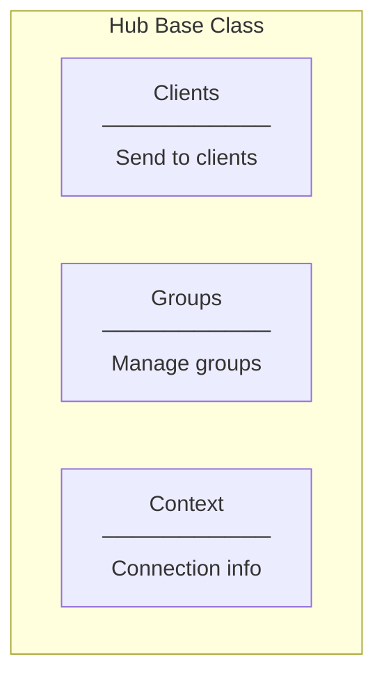
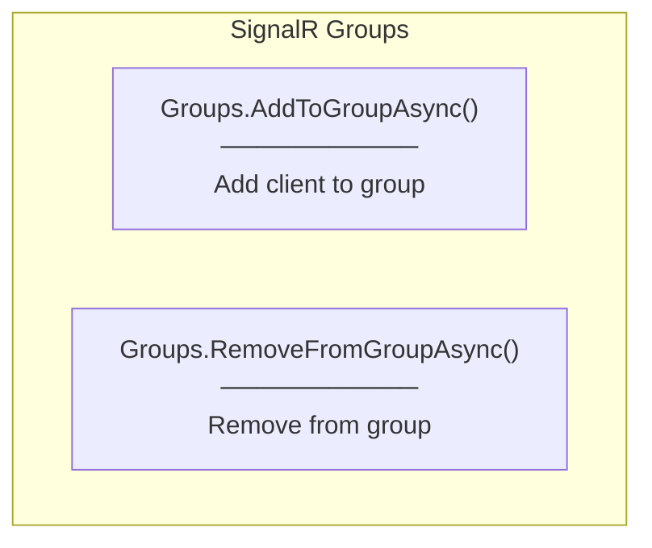
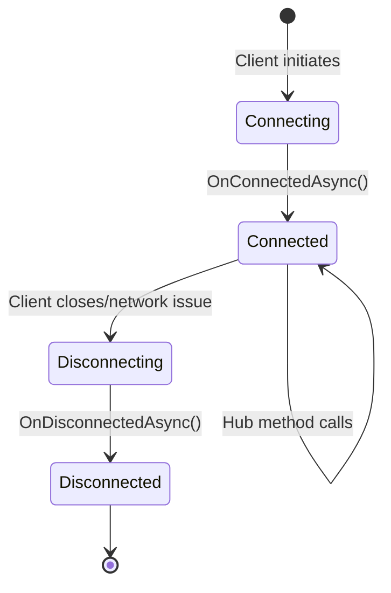
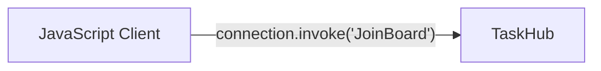
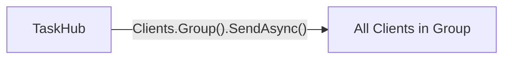

# Programming Concepts

## SignalR Core Concepts

### 1. Hub Class



**Implementation:**
```csharp
public class TaskHub : Hub
{
    // Access via inherited properties
    // this.Clients - send messages
    // this.Groups - manage groups
    // this.Context - connection info
}
```

---

### 2. Groups Management



**Implementation:**
```csharp
// Join group
public async Task JoinBoard()
{
    await Groups.AddToGroupAsync(Context.ConnectionId, "TaskBoard");
}

// Leave group
public async Task LeaveBoard()
{
    await Groups.RemoveFromGroupAsync(Context.ConnectionId, "TaskBoard");
}
```

**Key Points:**
- `Context.ConnectionId` - Unique ID for each connection
- Group names are strings
- Groups are created automatically when first client joins
- Groups are deleted when last client leaves

---

### 3. Connection Lifecycle



**Override Lifecycle Methods:**
```csharp
public override async Task OnConnectedAsync()
{
    // Called when client connects
    // Context.ConnectionId is available
    await base.OnConnectedAsync();
}

public override async Task OnDisconnectedAsync(Exception? exception)
{
    // Called when client disconnects
    // exception is null for graceful disconnect
    await base.OnDisconnectedAsync(exception);
}
```

---

### 4. const for Group Names

```csharp
private const string BoardGroup = "TaskBoard";
```

**Why const?**
- Compile-time constant
- No runtime allocation
- Prevents typos in group names
- Single source of truth

---

## ASP.NET Core Integration

### 1. Service Registration

```csharp
// Program.cs
builder.Services.AddSignalR();
```

**What this does:**
- Registers SignalR services in DI container
- Enables Hub resolution
- Configures default options

---

### 2. Endpoint Mapping

```csharp
// Program.cs
app.MapHub<TaskHub>("/hubs/tasks");
```

**What this does:**
- Maps TaskHub to URL path `/hubs/tasks`
- Client connects to `wss://localhost:5001/hubs/tasks`
- Enables WebSocket upgrade at this endpoint

---

### 3. CORS for SignalR

```csharp
builder.Services.AddCors(options =>
{
    options.AddPolicy("AllowFrontend", policy =>
    {
        policy.WithOrigins("http://localhost:5173")
              .AllowAnyMethod()
              .AllowAnyHeader()
              .AllowCredentials();  // Required for SignalR
    });
});
```

**Why AllowCredentials()?**
- SignalR uses cookies/auth tokens
- WebSocket handshake requires credentials
- Without this, cross-origin connections fail

---

## Authorization

### 1. [Authorize] Attribute

```csharp
[Authorize]
public class TaskHub : Hub
```

**What this does:**
- Requires valid JWT token to connect
- Unauthenticated clients get 401
- Same as Controller authorization

---

### 2. Accessing User Info

```csharp
public override async Task OnConnectedAsync()
{
    // Get user ID from JWT claims
    var userId = Context.User?.FindFirst(ClaimTypes.NameIdentifier)?.Value;

    // Get connection ID
    var connectionId = Context.ConnectionId;

    await base.OnConnectedAsync();
}
```

---

## async/await in Hub

### Pattern: All Hub methods are async

```csharp
// ✅ Correct - async Task
public async Task JoinBoard()
{
    await Groups.AddToGroupAsync(Context.ConnectionId, BoardGroup);
}

// ❌ Wrong - void (fire and forget)
public void JoinBoard()
{
    Groups.AddToGroupAsync(Context.ConnectionId, BoardGroup);
}
```

**Why async?**
- Network operations are inherently async
- Prevents thread blocking
- Allows server to handle more connections

---

## Method Invocation

### Client → Server



**Client calls:**
```typescript
await connection.invoke("JoinBoard");
```

**Server receives:**
```csharp
public async Task JoinBoard()
{
    // This method is called
}
```

---

### Server → Client (Future)



**Server sends:**
```csharp
await Clients.Group("TaskBoard").SendAsync("TaskUpdated", taskDto);
```

**Client receives:**
```typescript
connection.on("TaskUpdated", (task) => {
    // Handle update
});
```

---

## Namespace Convention

```csharp
namespace TaskCollaborationApp.API.Hubs
{
    public class TaskHub : Hub
    {
        // ...
    }
}
```

**Convention:**
- `{Project}.{Layer}.{Folder}`
- Hubs folder → Hubs namespace
- Matches project structure
