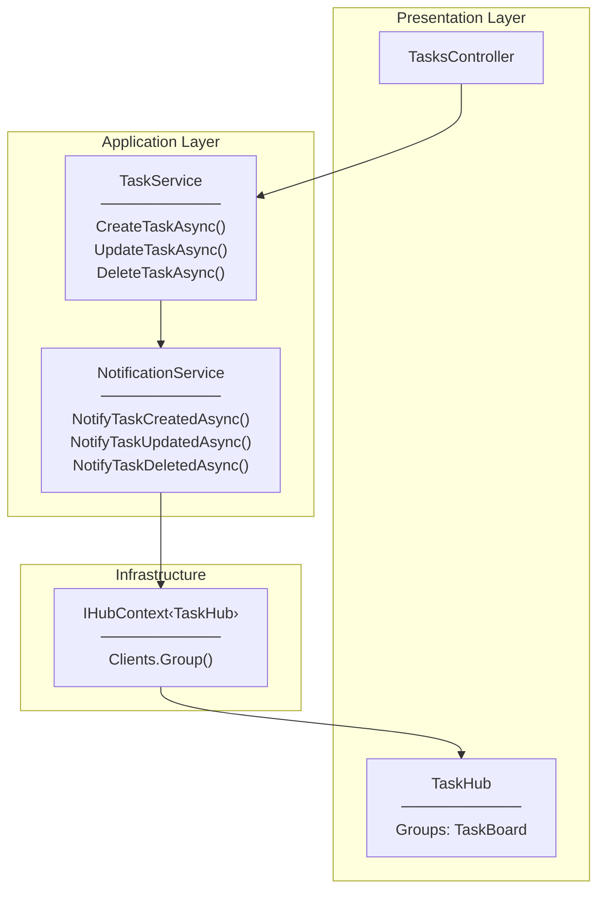
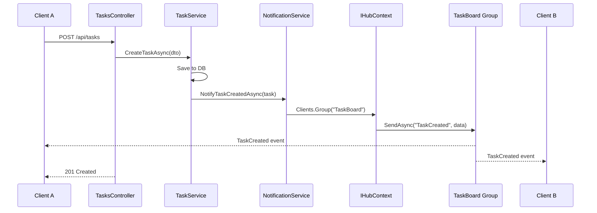
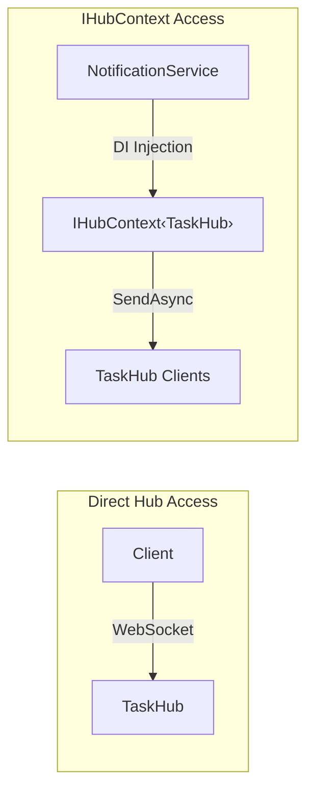
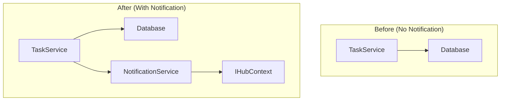
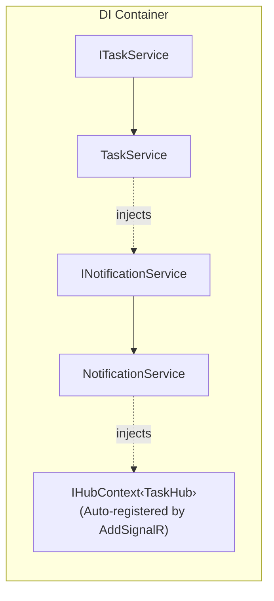

# Architecture Diagram

## NotificationService Overview

---

## Notification Flow (Task Creation)

---

## IHubContext vs Hub

| Approach | Use Case |
|----------|----------|
| Hub | Client-initiated actions (JoinBoard, LeaveBoard) |
| IHubContext | Server-initiated broadcasts (NotificationService) |

---

## Service Layer Integration

---

## DI Container Registration

