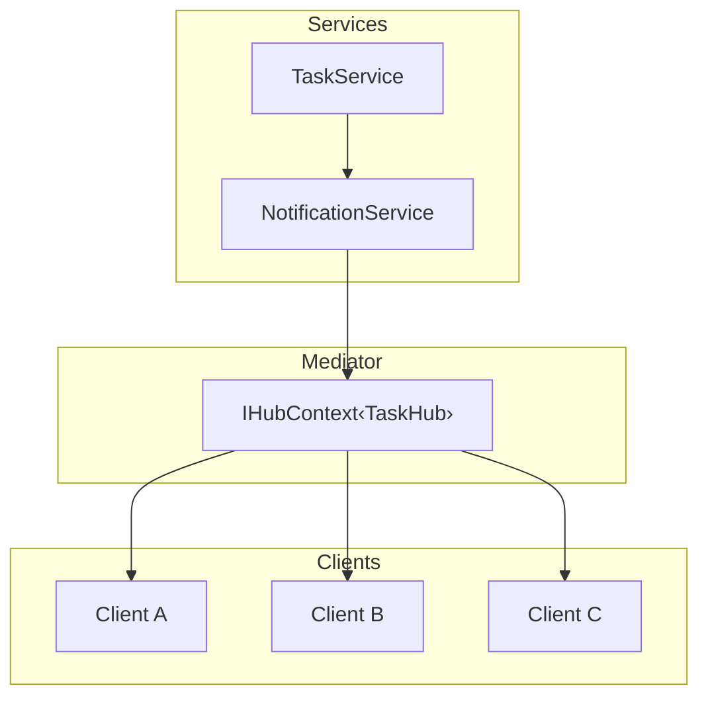
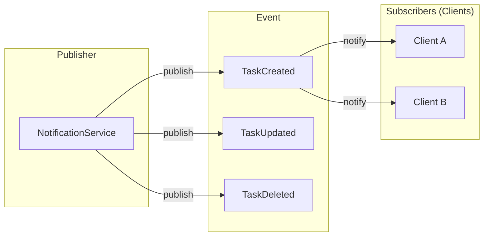
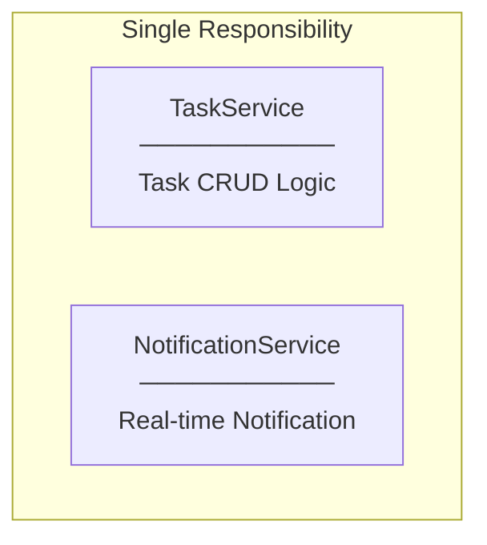
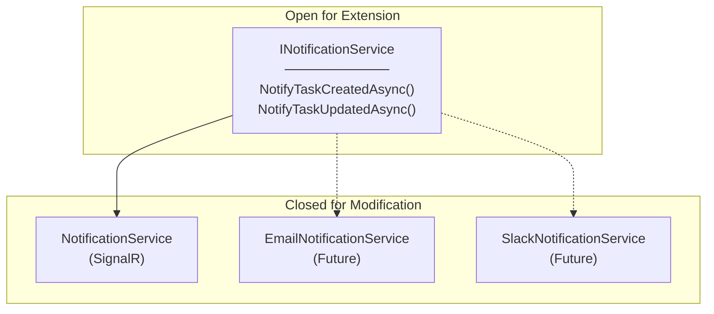
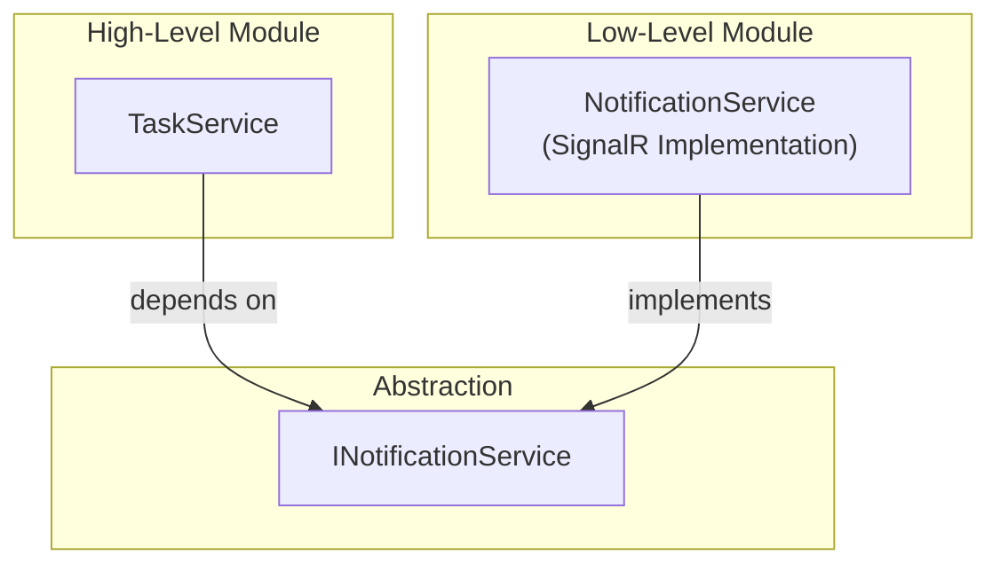

# Design Patterns and SOLID Principles

## Design Patterns

### 1. Mediator Pattern (via IHubContext)

**Why Mediator?**
- Services don't know about individual clients
- IHubContext acts as mediator between services and clients
- Decouples notification logic from connection management

---

### 2. Observer Pattern (Publish-Subscribe)

**Why Observer?**
- One-to-many notification
- Publishers don't know subscribers
- Loose coupling between event source and handlers

---

## SOLID Principles

### S - Single Responsibility Principle

| Service | Responsibility |
|---------|----------------|
| TaskService | Task business logic (CRUD) |
| NotificationService | Real-time notification delivery |

**Before:** TaskService handles both CRUD and notification
**After:** Each service has one reason to change

---

### O - Open/Closed Principle

**Benefit:** Add new notification channels without modifying TaskService

---

### D - Dependency Inversion Principle

**Key:** TaskService depends on abstraction (INotificationService), not concrete implementation
