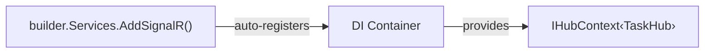
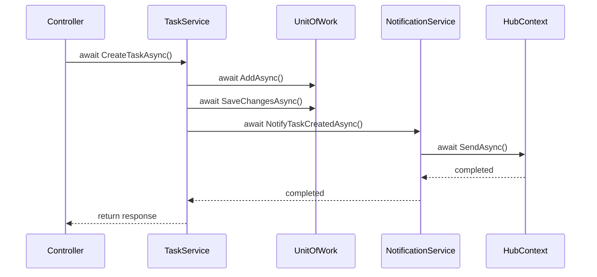

# Programming Concepts

## 1. IHubContext<THub> Injection

```csharp
public class NotificationService : INotificationService
{
    private readonly IHubContext<TaskHub> _hubContext;

    public NotificationService(IHubContext<TaskHub> hubContext)
    {
        _hubContext = hubContext;
    }
}
```

**What is IHubContext?**
- ASP.NET Core automatically registers `IHubContext<THub>` when `AddSignalR()` is called
- Allows sending messages to hub clients from outside the Hub class
- Provides access to `Clients`, `Groups` properties



---

## 2. Group Broadcasting

```csharp
await _hubContext.Clients.Group(BoardGroup)
    .SendAsync("TaskCreated", new { Task = task, CreatedBy = createdByName });
```

**Breakdown:**

| Part | Description |
|------|-------------|
| `Clients.Group(BoardGroup)` | Target all clients in "TaskBoard" group |
| `SendAsync("TaskCreated", ...)` | Invoke "TaskCreated" method on clients |
| `new { Task = task, ... }` | Anonymous object as payload |

**Client Methods:**
- `Clients.All` - All connected clients
- `Clients.Group(name)` - Clients in specific group
- `Clients.User(userId)` - Specific user (requires IUserIdProvider)
- `Clients.Client(connectionId)` - Specific connection

---

## 3. Service Composition

```csharp
public class TaskService : ITaskService
{
    private readonly IUnitOfWork _unitOfWork;
    private readonly INotificationService _notificationService;

    public TaskService(IUnitOfWork unitOfWork, INotificationService notificationService)
    {
        _unitOfWork = unitOfWork;
        _notificationService = notificationService;
    }

    public async Task<TaskResponseDto> CreateTaskAsync(...)
    {
        // 1. Business logic
        await _unitOfWork.Tasks.AddAsync(task);
        await _unitOfWork.SaveChangesAsync();

        // 2. Side effect (notification)
        await _notificationService.NotifyTaskCreatedAsync(response, createdByName);

        return response;
    }
}
```

**Pattern:** Primary action -> Side effects (notifications, logging, caching)

---

## 4. Anonymous Types in C#

```csharp
new { Task = task, CreatedBy = createdByName }
```

**What is Anonymous Type?**
- Compiler-generated class with read-only properties
- No explicit class definition needed
- Serialized to JSON automatically

**Equivalent explicit class:**
```csharp
public class TaskCreatedPayload
{
    public TaskResponseDto Task { get; set; }
    public string CreatedBy { get; set; }
}
```

---

## 5. const vs readonly

```csharp
public class NotificationService : INotificationService
{
    private readonly IHubContext<TaskHub> _hubContext;  // readonly
    private const string BoardGroup = "TaskBoard";      // const
}
```

| Modifier | When Set | Can Change | Use Case |
|----------|----------|------------|----------|
| `const` | Compile time | Never | Fixed values ("TaskBoard") |
| `readonly` | Runtime (constructor) | Never after set | Injected dependencies |

---

## 6. Async/Await in Service Chain



**Key:** Each `await` yields thread back to thread pool until I/O completes
