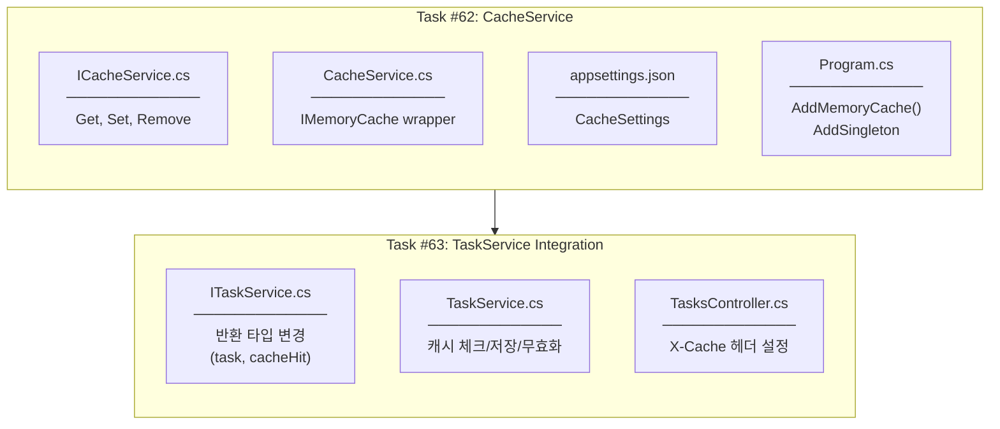
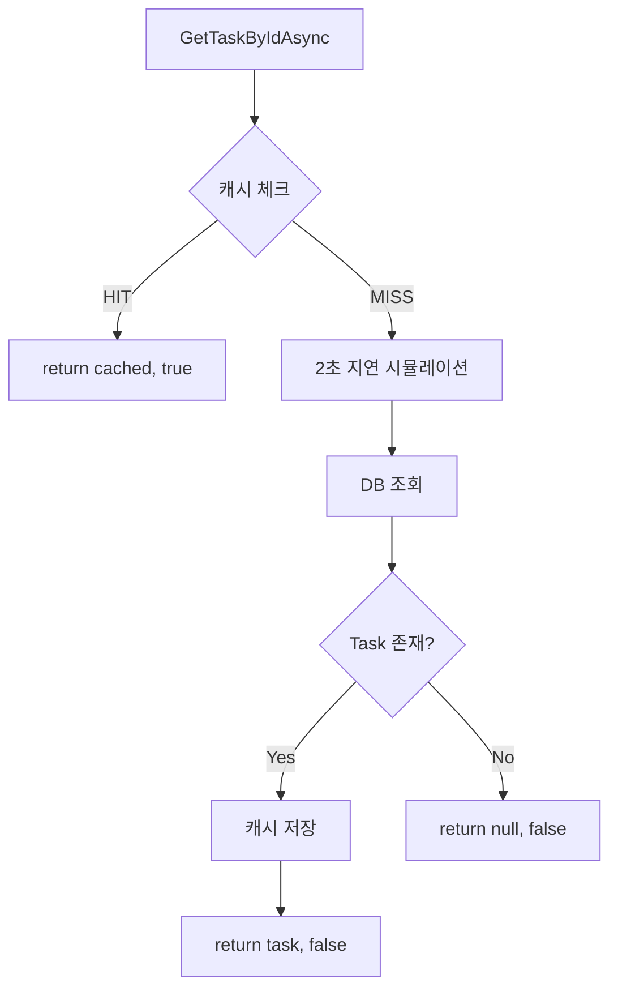

# Story #61: Task Caching with X-Cache Header

## Overview

Task 조회 성능 향상을 위한 IMemoryCache 기반 캐싱 시스템 구현

## Implementation Flow



---

## Task #62: CacheService 구현

### 1. ICacheService.cs

**Location:** `Services/Interfaces/ICacheService.cs`

**Methods:**
| Method | Return | Description |
|--------|--------|-------------|
| `Get<T>(key)` | `T?` | 캐시에서 값 조회 |
| `Set<T>(key, value, ttl?)` | `void` | 캐시에 값 저장 |
| `Remove(key)` | `void` | 캐시에서 값 삭제 |

---

### 2. CacheService.cs

**Location:** `Services/CacheService.cs`

**Dependencies:**
- `IMemoryCache` - .NET 내장 메모리 캐시
- `IConfiguration` - TTL 설정 읽기

**Key Features:**
- `MemoryCacheEntryOptions`로 TTL 설정
- Configuration에서 기본 TTL 읽기

---

### 3. appsettings.json

```json
"CacheSettings": {
  "TaskCacheTTLMinutes": 5,
  "SimulatedDelaySeconds": 2
}
```

---

### 4. Program.cs DI 등록

```csharp
builder.Services.AddMemoryCache();
builder.Services.AddSingleton<ICacheService, CacheService>();
```

**왜 Singleton?**
- 메모리 캐시는 앱 전체에서 공유
- Scoped로 하면 요청마다 새 인스턴스 → 캐시 무의미

---

## Task #63: TaskService 캐싱 적용

### 1. ITaskService 변경

**기존:**
```csharp
Task<TaskResponseDto?> GetTaskByIdAsync(int id);
```

**변경:**
```csharp
Task<(TaskResponseDto? task, bool cacheHit)> GetTaskByIdAsync(int id);
```

**왜 Tuple?**
- 캐시 HIT/MISS 정보를 Controller로 전달
- Controller에서 X-Cache 헤더 설정에 사용

---

### 2. TaskService 캐싱 로직



**캐시 무효화:**
- `UpdateTaskAsync` → 수정 후 `_cacheService.Remove()`
- `DeleteTaskAsync` → 삭제 후 `_cacheService.Remove()`

---

### 3. TasksController X-Cache 헤더

```csharp
var (task, cacheHit) = await _taskService.GetTaskByIdAsync(id);
Response.Headers["X-Cache"] = cacheHit ? "HIT" : "MISS";
```

---

## Caching Rules

| Rule | Value |
|------|-------|
| Cache Key Format | `task_{id}` |
| TTL | 5분 (설정 가능) |
| Invalidate On | PUT, DELETE |
| Response Header | `X-Cache: HIT` or `MISS` |
| Demo Delay | 2초 (Cache MISS 시) |

---

## Performance Demo

**첫 번째 요청 (Cache MISS):**
```
GET /api/tasks/5
Response Time: ~2050ms (2초 지연 + DB 조회)
Header: X-Cache: MISS
```

**두 번째 요청 (Cache HIT):**
```
GET /api/tasks/5
Response Time: ~5ms (메모리에서 즉시)
Header: X-Cache: HIT
```

**업데이트 후 (Cache Invalidated):**
```
PUT /api/tasks/5 → 캐시 삭제

GET /api/tasks/5
Response Time: ~2040ms (다시 Cache MISS)
Header: X-Cache: MISS
```

---

## Files Summary

| File | Action | Task |
|------|--------|------|
| `Services/Interfaces/ICacheService.cs` | 생성 | #62 |
| `Services/CacheService.cs` | 생성 | #62 |
| `appsettings.json` | 수정 | #62 |
| `Program.cs` | 수정 | #62 |
| `Services/Interfaces/ITaskService.cs` | 수정 | #63 |
| `Services/TaskService.cs` | 수정 | #63 |
| `Controllers/TasksController.cs` | 수정 | #63 |

---

## Checklist

- [x] ICacheService 인터페이스 생성
- [x] CacheService 구현
- [x] appsettings.json에 CacheSettings 추가
- [x] Program.cs에 DI 등록
- [x] ITaskService 반환 타입 변경
- [x] TaskService에 캐싱 로직 추가
- [x] TasksController에 X-Cache 헤더 추가
