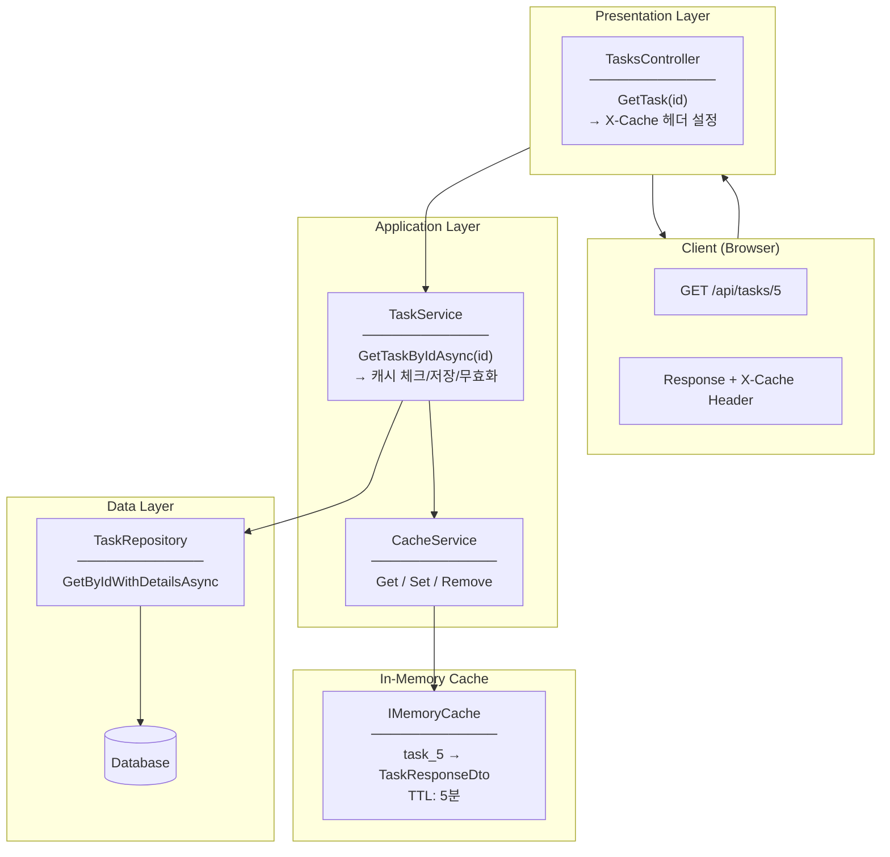
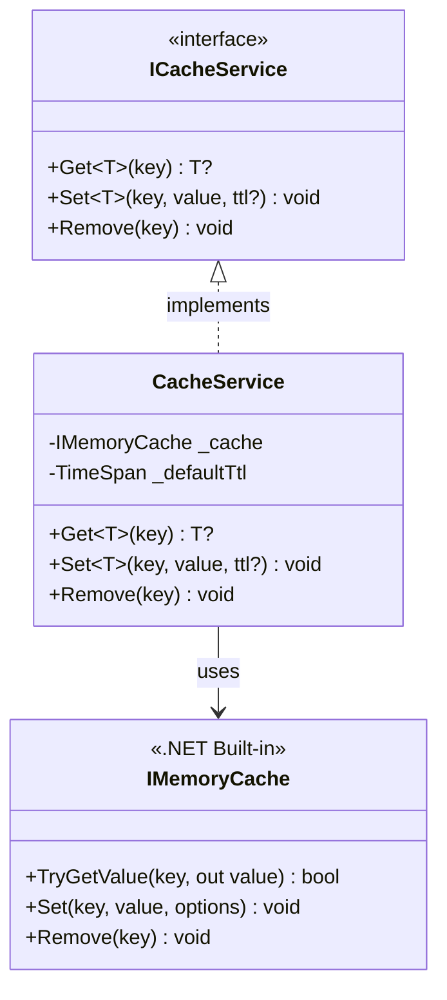
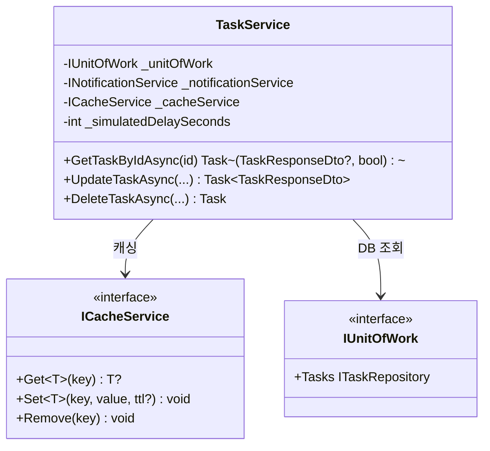
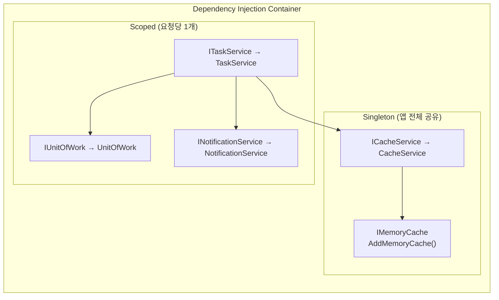
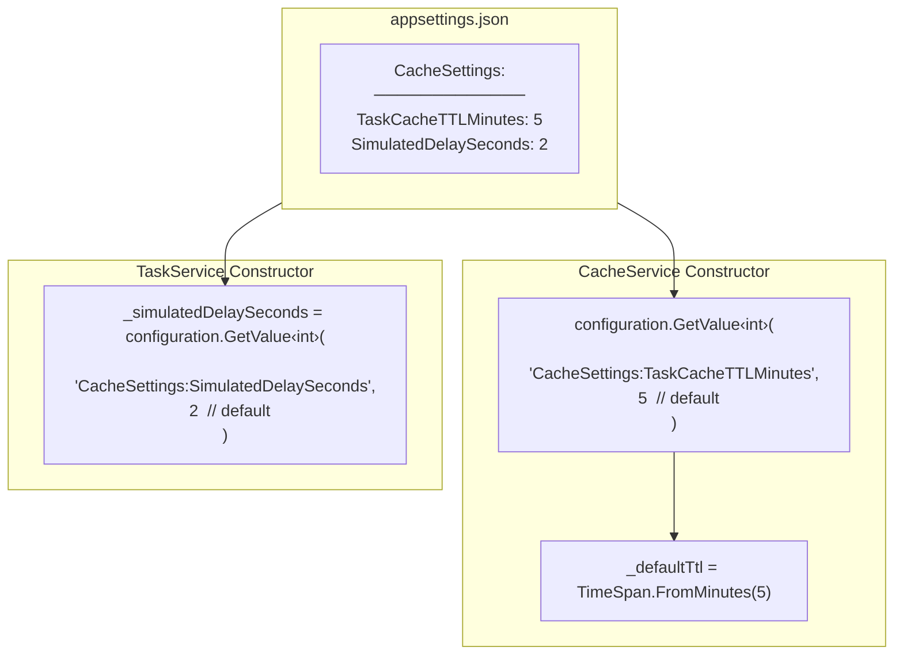

# Cache Service Architecture

## 전체 아키텍처

---

## Cache Service 구조

---

## TaskService with Cache

---

## DI Container 구성

**Singleton vs Scoped:**
- `CacheService`: Singleton - 모든 요청이 같은 캐시 인스턴스 공유
- `TaskService`: Scoped - 요청마다 새 인스턴스 (DB 트랜잭션 분리)

---

## 레이어별 책임

```mermaid
flowchart LR
    subgraph PRESENTATION["Presentation Layer"]
        direction TB
        P1["TasksController"]
        P2["• 요청 처리"]
        P3["• X-Cache 헤더 설정"]
        P4["• HTTP 응답 반환"]
    end

    subgraph APPLICATION["Application Layer"]
        direction TB
        A1["TaskService"]
        A2["• 비즈니스 로직"]
        A3["• 캐시 HIT/MISS 판단"]
        A4["• 캐시 무효화"]

        A5["CacheService"]
        A6["• 캐시 추상화"]
        A7["• TTL 관리"]
    end

    subgraph DATA["Data Layer"]
        direction TB
        D1["Repository"]
        D2["• DB 조회"]
        D3["• Entity 반환"]
    end

    PRESENTATION --> APPLICATION --> DATA
```

---

## Configuration 구조

