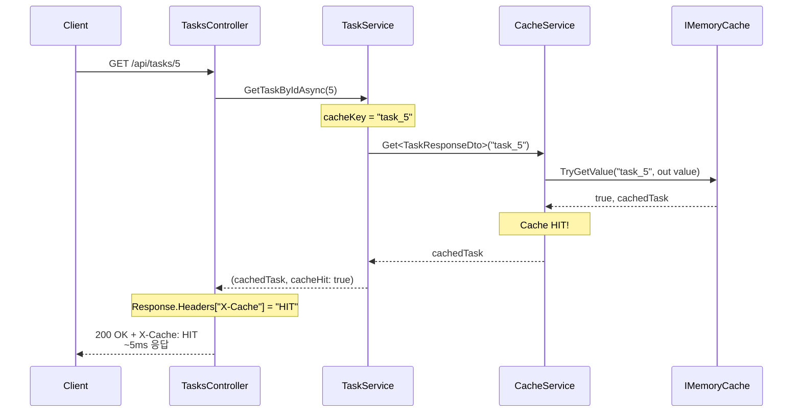
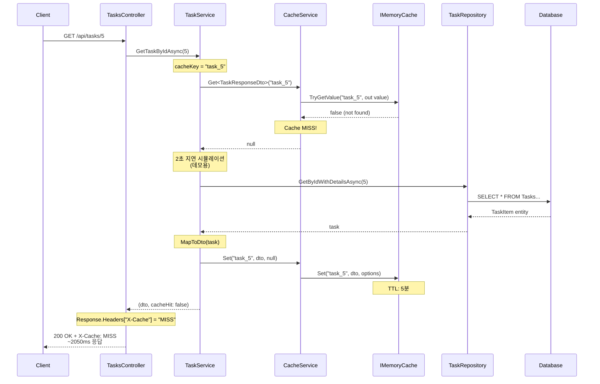
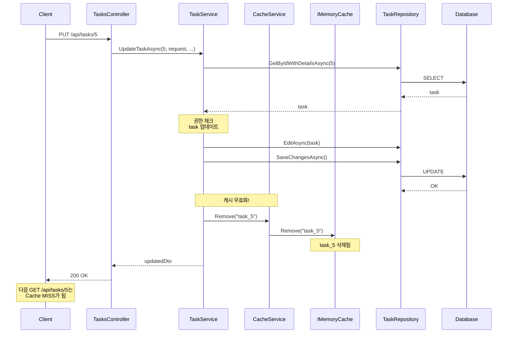
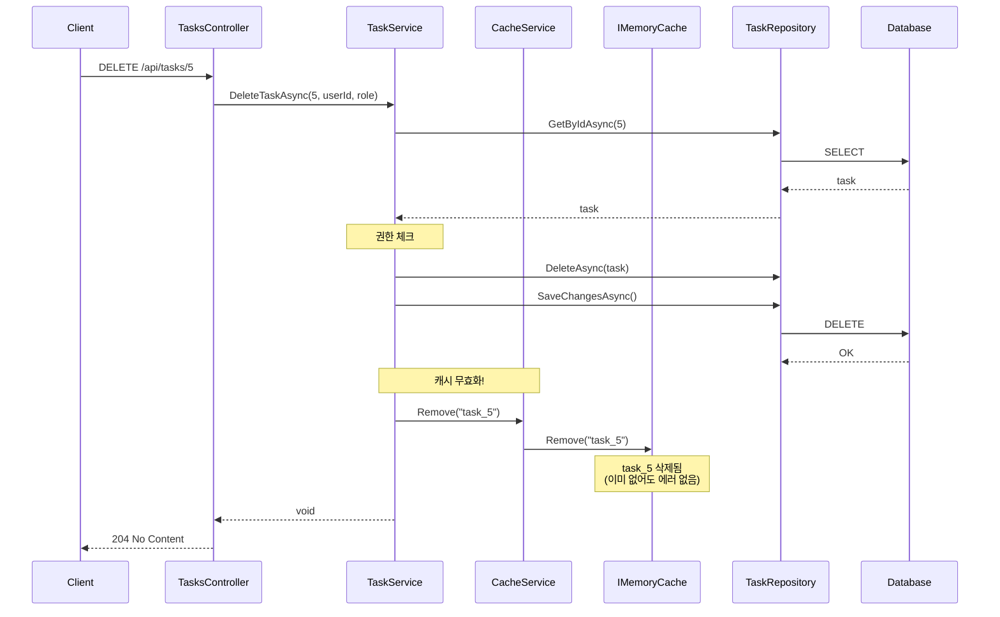
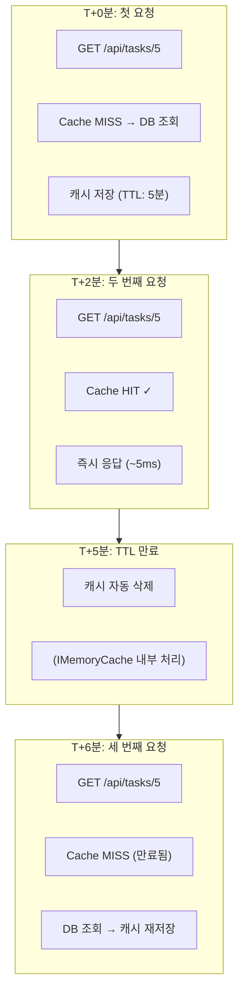

# Cache Flow Diagrams

## Cache HIT Flow (빠른 응답)



**결과:**
- 응답 시간: ~5ms
- DB 조회: 없음
- X-Cache: HIT

---

## Cache MISS Flow (느린 응답)



**결과:**
- 응답 시간: ~2050ms (2초 지연 + DB 조회)
- DB 조회: 있음
- X-Cache: MISS
- 캐시에 저장됨

---

## Cache Invalidation Flow (Update)



---

## Cache Invalidation Flow (Delete)



---

## TTL Expiration Flow



---

## 전체 Cache Key 구조

```
┌─────────────────────────────────────────────────────────────┐
│                    IMemoryCache                              │
├─────────────────────────────────────────────────────────────┤
│                                                              │
│  Key: "task_1"  →  Value: TaskResponseDto { Id: 1, ... }   │
│                    Expiry: 2024-01-15 10:05:00              │
│                                                              │
│  Key: "task_5"  →  Value: TaskResponseDto { Id: 5, ... }   │
│                    Expiry: 2024-01-15 10:07:30              │
│                                                              │
│  Key: "task_12" →  Value: TaskResponseDto { Id: 12, ... }  │
│                    Expiry: 2024-01-15 10:08:45              │
│                                                              │
└─────────────────────────────────────────────────────────────┘

Cache Key Format: task_{id}
TTL: 5분 (AbsoluteExpirationRelativeToNow)
```
