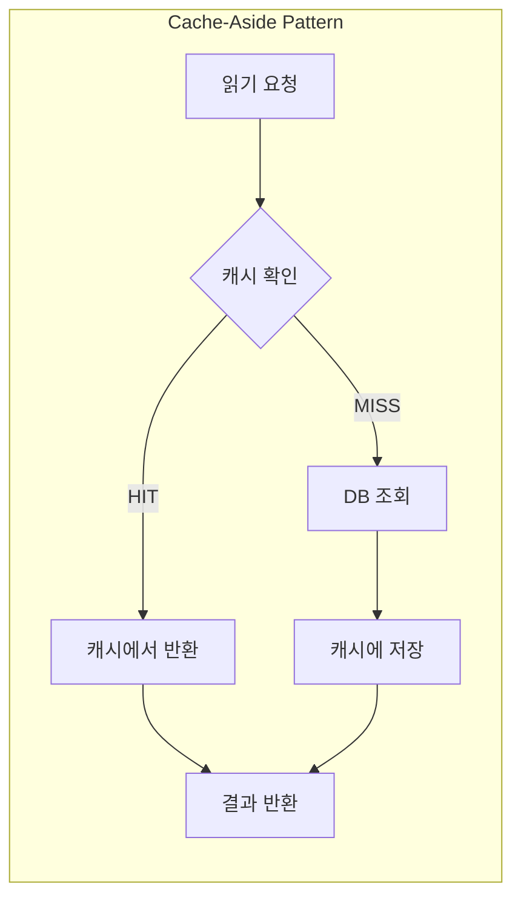
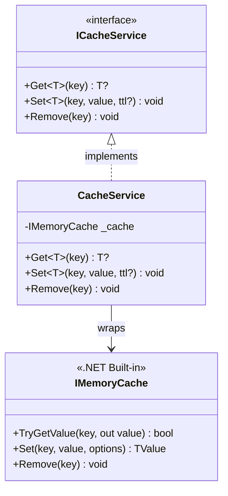
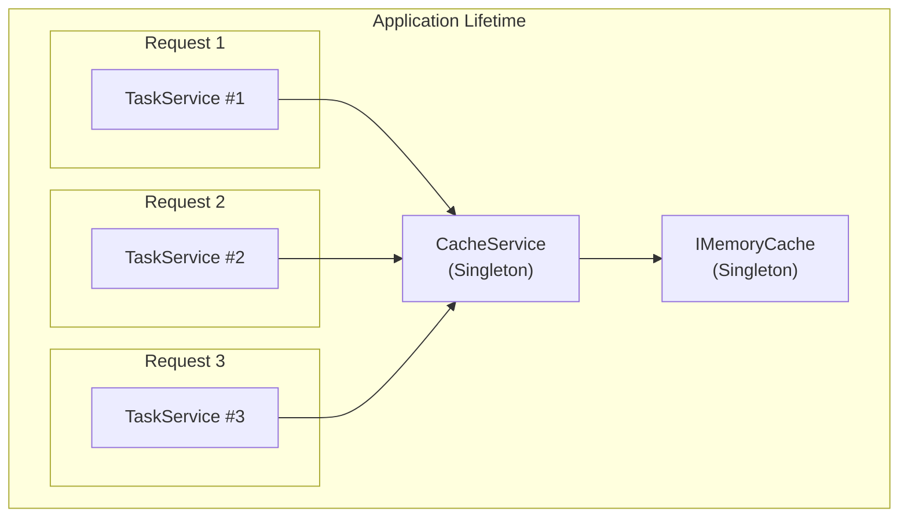
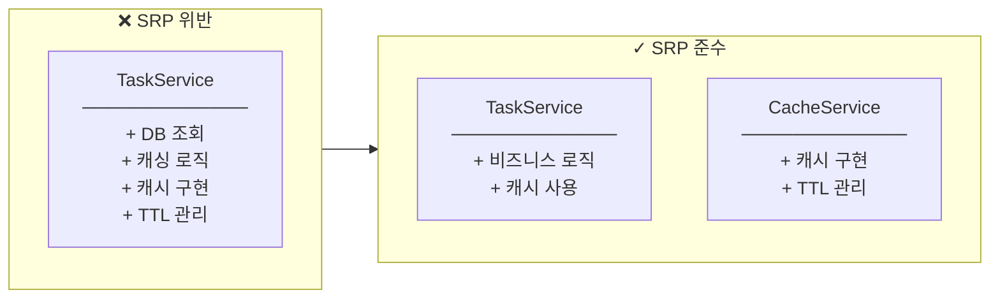
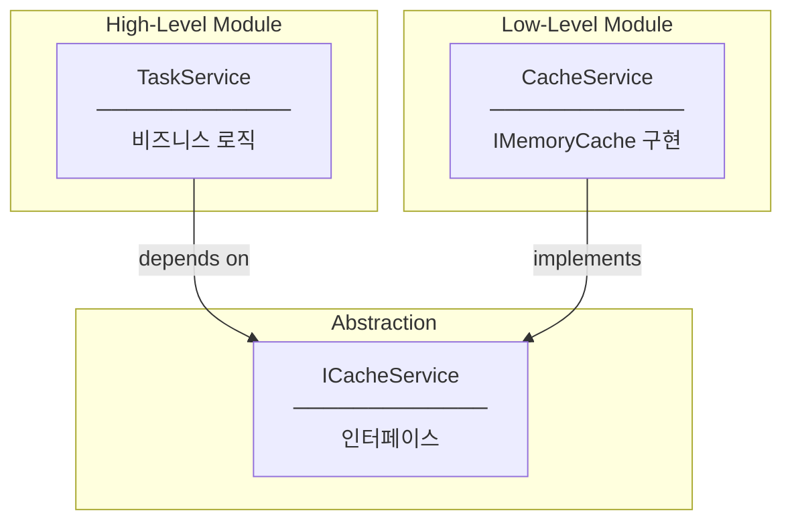
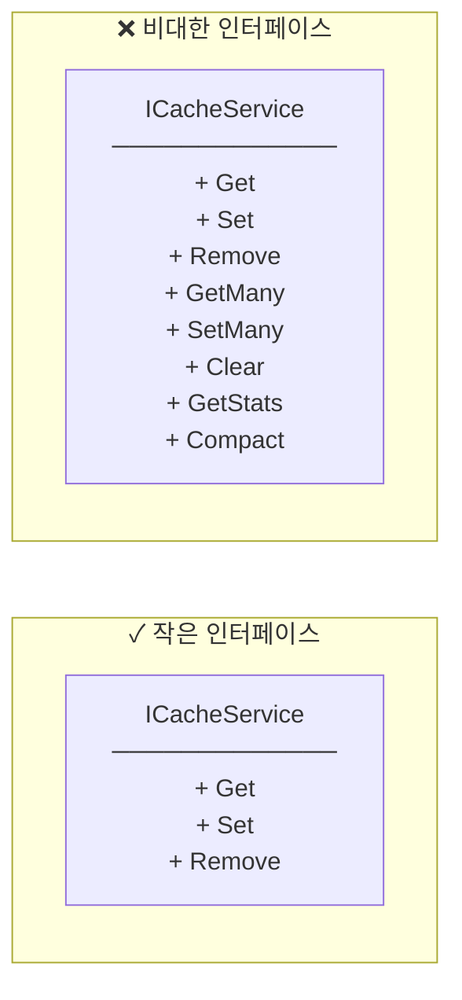

# Design Patterns & SOLID Principles

## Design Patterns

### 1. Cache-Aside Pattern (Lazy Loading)



**정의:**
- 애플리케이션이 캐시 관리를 직접 담당
- 캐시 미스 시 DB 조회 후 캐시에 저장
- "Cache-Aside" = 캐시를 옆에 두고 필요할 때 사용

**우리 코드:**
```csharp
public async Task<(TaskResponseDto? task, bool cacheHit)> GetTaskByIdAsync(int id)
{
    var cacheKey = $"task_{id}";

    // 1. 캐시 확인
    var cachedTask = _cacheService.Get<TaskResponseDto>(cacheKey);
    if (cachedTask != null)
    {
        return (cachedTask, true);  // HIT
    }

    // 2. DB 조회
    var task = await _unitOfWork.Tasks.GetByIdWithDetailsAsync(id);
    if (task == null) return (null, false);

    var dto = MapToDto(task);

    // 3. 캐시에 저장
    _cacheService.Set(cacheKey, dto);

    return (dto, false);  // MISS
}
```

**vs Write-Through:**
| Pattern | 설명 | 사용 시점 |
|---------|------|----------|
| Cache-Aside | 읽기 시 캐시 채움 | 읽기 위주 |
| Write-Through | 쓰기 시 캐시+DB 동시 저장 | 쓰기 위주 |

---

### 2. Adapter Pattern (Wrapper)



**정의:**
- 기존 인터페이스를 새로운 인터페이스로 변환
- 복잡한 API를 단순화
- 의존성 교체 용이

**우리 코드:**
```csharp
// CacheService가 IMemoryCache를 래핑
public class CacheService : ICacheService
{
    private readonly IMemoryCache _cache;

    // 복잡한 IMemoryCache API를 단순화
    public T? Get<T>(string key)
    {
        _cache.TryGetValue(key, out T? value);
        return value;
    }

    public void Set<T>(string key, T value, TimeSpan? ttl = null)
    {
        var options = new MemoryCacheEntryOptions
        {
            AbsoluteExpirationRelativeToNow = ttl ?? _defaultTtl
        };
        _cache.Set(key, value, options);
    }
}
```

**장점:**
- `IMemoryCache`를 나중에 Redis 등으로 교체 가능
- 비즈니스 코드는 `ICacheService`만 알면 됨

---

### 3. Singleton Pattern (DI Lifetime)



**DI 등록:**
```csharp
// Singleton: 앱 전체에서 인스턴스 1개
builder.Services.AddMemoryCache();
builder.Services.AddSingleton<ICacheService, CacheService>();

// Scoped: 요청마다 새 인스턴스
builder.Services.AddScoped<ITaskService, TaskService>();
```

**왜 Singleton?**
- 캐시는 모든 요청이 공유해야 함
- Scoped로 하면 요청마다 새 캐시 → 의미 없음
- 메모리 캐시 특성상 단일 인스턴스 필요

---

## SOLID Principles

### 1. Single Responsibility Principle (SRP)



**우리 설계:**
- `CacheService`: 캐싱만 담당
- `TaskService`: 비즈니스 로직 + 캐시 사용
- 각 클래스가 하나의 책임만 가짐

---

### 2. Open/Closed Principle (OCP)

```mermaid
flowchart TB
    subgraph OCP["확장에 열림, 수정에 닫힘"]
        ICacheService["ICacheService<br/>─────────────<br/>(추상화)"]

        MemoryCache["MemoryCacheService<br/>─────────────<br/>현재 구현"]

        RedisCache["RedisCacheService<br/>─────────────<br/>미래 확장"]

        HybridCache["HybridCacheService<br/>─────────────<br/>미래 확장"]
    end

    ICacheService <|-- MemoryCache
    ICacheService <|-- RedisCache
    ICacheService <|-- HybridCache
```

**확장 시나리오:**
```csharp
// 현재: 메모리 캐시
builder.Services.AddSingleton<ICacheService, CacheService>();

// 미래: Redis로 교체 (TaskService 수정 없음!)
builder.Services.AddSingleton<ICacheService, RedisCacheService>();
```

---

### 3. Dependency Inversion Principle (DIP)



**우리 코드:**
```csharp
// TaskService는 ICacheService (추상화)에 의존
public class TaskService : ITaskService
{
    private readonly ICacheService _cacheService;  // 인터페이스!

    public TaskService(ICacheService cacheService)  // DI
    {
        _cacheService = cacheService;
    }
}
```

**장점:**
- 테스트 시 Mock 주입 가능
- 구현체 교체 용이
- 느슨한 결합

---

### 4. Interface Segregation Principle (ISP)



**우리 설계:**
- 딱 필요한 3개 메서드만 정의
- 클라이언트가 사용하지 않는 메서드 강제 X

---

## Pattern Summary

| Pattern/Principle | 적용 위치 | 효과 |
|-------------------|----------|------|
| Cache-Aside | TaskService | 읽기 시 캐시 자동 채움 |
| Adapter | CacheService | IMemoryCache 래핑 |
| Singleton | DI 등록 | 캐시 공유 |
| SRP | CacheService 분리 | 단일 책임 |
| OCP | ICacheService | 구현 교체 용이 |
| DIP | TaskService → ICacheService | 추상화 의존 |
| ISP | 3개 메서드만 | 최소 인터페이스 |
