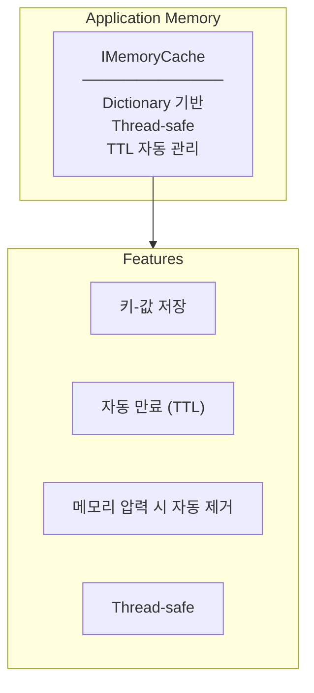
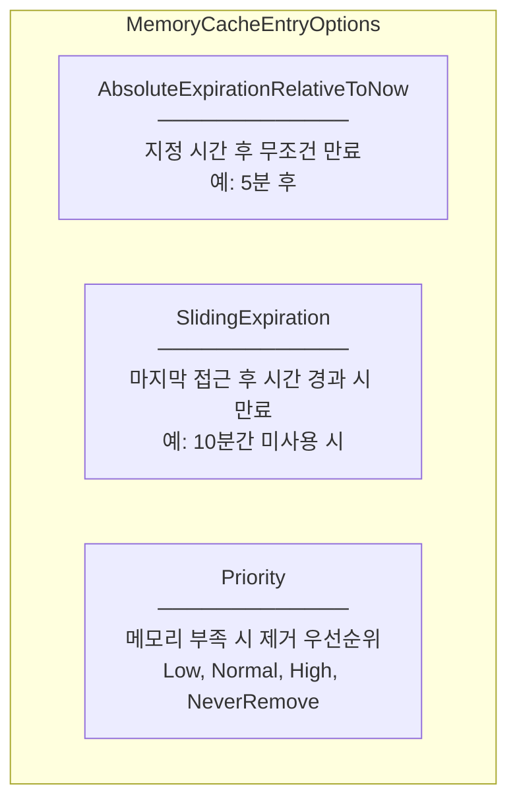
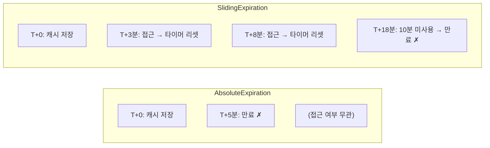
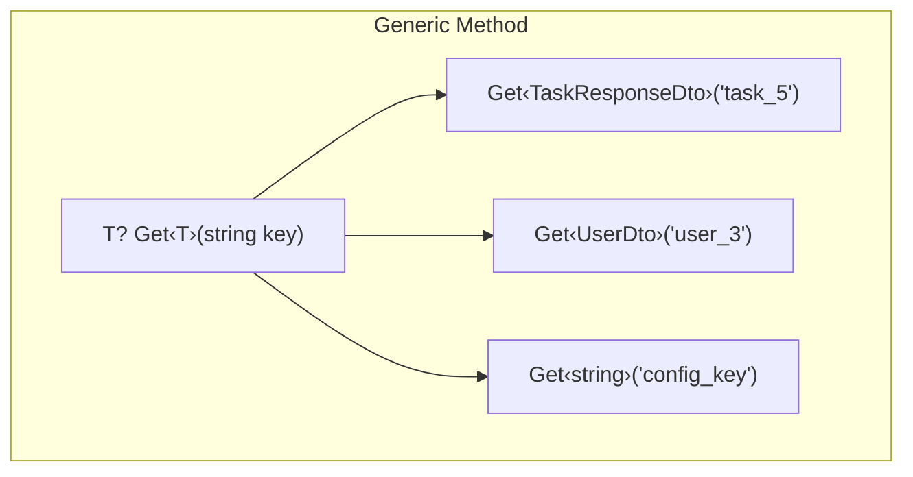
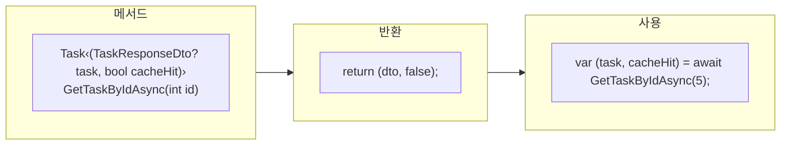
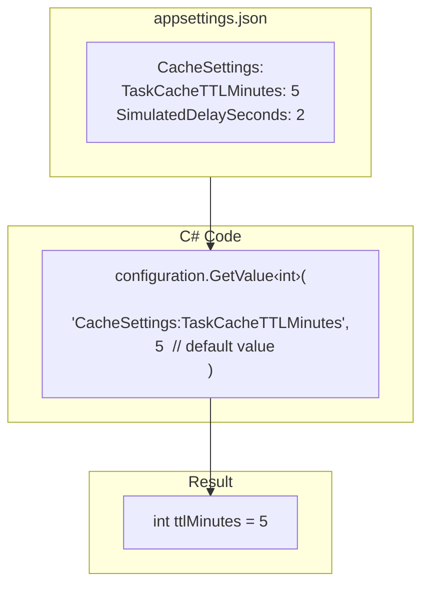
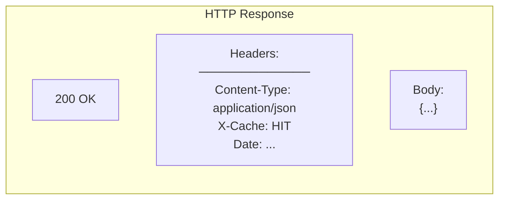
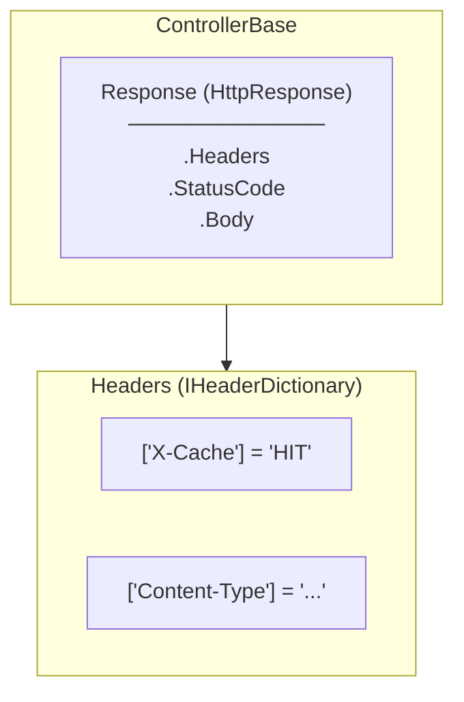
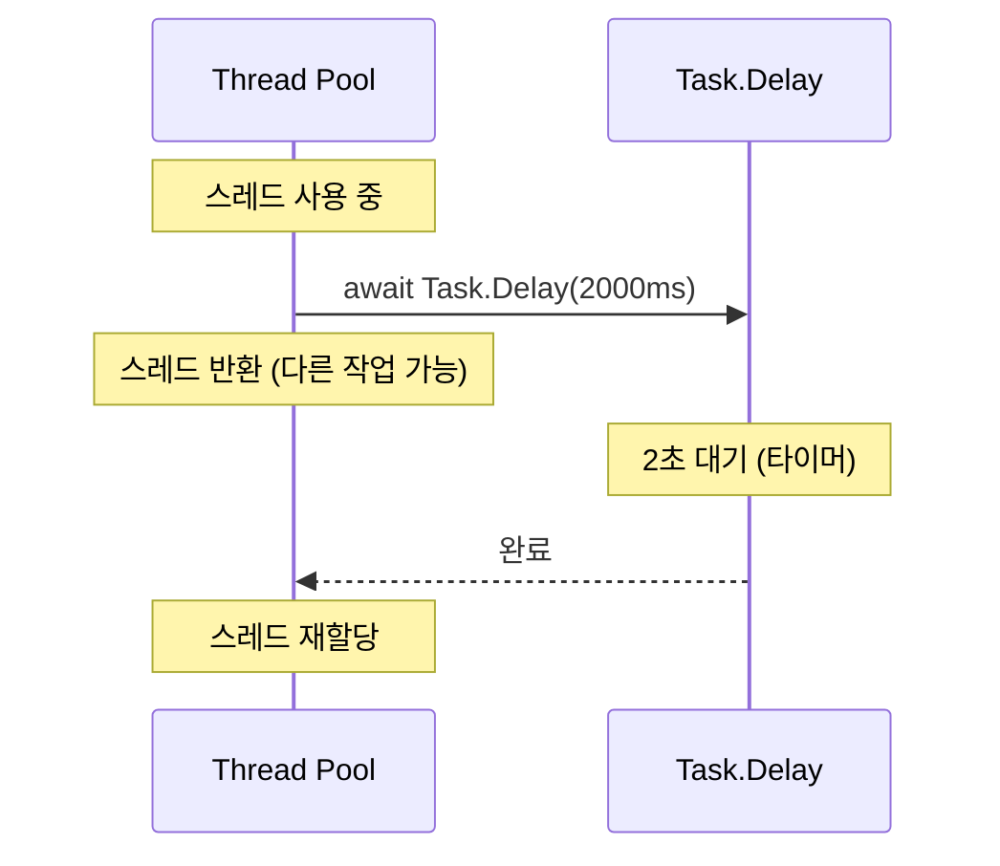

# Programming Concepts

## 1. IMemoryCache (.NET Built-in)

### 개념

.NET에서 제공하는 인메모리 캐싱 라이브러리



### 등록

```csharp
// Program.cs
builder.Services.AddMemoryCache();  // IMemoryCache 등록
```

이 한 줄로:
- `IMemoryCache` 인터페이스를 DI 컨테이너에 등록
- Singleton lifetime으로 등록됨
- 내부적으로 `MemoryCache` 구현체 사용

### 주요 메서드

```csharp
// 값 조회 (out 파라미터 사용)
bool found = _cache.TryGetValue("key", out MyType value);

// 값 저장 (옵션과 함께)
_cache.Set("key", value, options);

// 값 삭제
_cache.Remove("key");

// 값 조회 또는 생성 (GetOrCreate)
var value = _cache.GetOrCreate("key", entry => {
    entry.AbsoluteExpirationRelativeToNow = TimeSpan.FromMinutes(5);
    return ComputeValue();
});
```

---

## 2. MemoryCacheEntryOptions (캐시 옵션)

### 개념

캐시 항목의 만료 정책을 설정하는 클래스



### 만료 정책 비교



### 우리 코드

```csharp
public void Set<T>(string key, T value, TimeSpan? ttl = null)
{
    var options = new MemoryCacheEntryOptions
    {
        // 현재 시간 기준 TTL 후 만료
        AbsoluteExpirationRelativeToNow = ttl ?? _defaultTtl
    };
    _cache.Set(key, value, options);
}
```

**왜 Absolute?**
- 데이터 신선도 보장 (5분마다 DB에서 최신 데이터)
- Sliding은 계속 접근하면 영원히 만료 안 됨

---

## 3. Generic Method (제네릭 메서드)

### 개념

타입을 파라미터로 받는 메서드



### 코드 비교

```csharp
// ❌ 제네릭 없이 - 타입마다 메서드 필요
TaskResponseDto? GetTask(string key);
UserDto? GetUser(string key);
string? GetString(string key);

// ✓ 제네릭 사용 - 하나의 메서드로 모든 타입
T? Get<T>(string key);

// 호출
var task = _cache.Get<TaskResponseDto>("task_5");
var user = _cache.Get<UserDto>("user_3");
```

### 우리 코드

```csharp
public T? Get<T>(string key)
{
    _cache.TryGetValue(key, out T? value);
    return value;
}

public void Set<T>(string key, T value, TimeSpan? ttl = null)
{
    // ...
    _cache.Set(key, value, options);
}
```

**장점:**
- 타입 안전성 (컴파일 타임 체크)
- 코드 재사용
- 캐스팅 불필요

---

## 4. Tuple Return Type (튜플 반환)

### 개념

여러 값을 하나의 메서드에서 반환



### 왜 Tuple?

```csharp
// ❌ 별도 클래스 생성 (과도한 보일러플레이트)
public class GetTaskResult
{
    public TaskResponseDto? Task { get; set; }
    public bool CacheHit { get; set; }
}

// ✓ Tuple 사용 (간결함)
public async Task<(TaskResponseDto? task, bool cacheHit)> GetTaskByIdAsync(int id)
{
    // Cache HIT
    return (cachedTask, true);

    // Cache MISS
    return (dto, false);
}
```

### Deconstruction (분해)

```csharp
// Controller에서 사용
var (task, cacheHit) = await _taskService.GetTaskByIdAsync(id);

// 개별 변수로 분해됨
// task: TaskResponseDto? → 응답 데이터
// cacheHit: bool → X-Cache 헤더 결정
```

---

## 5. Configuration Binding

### 개념

appsettings.json의 값을 코드에서 읽기



### IConfiguration 주입

```csharp
public class CacheService : ICacheService
{
    public CacheService(IMemoryCache cache, IConfiguration configuration)
    {
        _cache = cache;

        // Configuration에서 값 읽기 (기본값 5)
        var ttlMinutes = configuration.GetValue<int>(
            "CacheSettings:TaskCacheTTLMinutes",
            5  // appsettings.json에 없으면 기본값
        );

        _defaultTtl = TimeSpan.FromMinutes(ttlMinutes);
    }
}
```

### 키 형식

```
"CacheSettings:TaskCacheTTLMinutes"
     ↑               ↑
  섹션 이름       속성 이름

// 중첩 가능
"Logging:LogLevel:Default"
```

---

## 6. Response Headers

### 개념

HTTP 응답에 메타데이터 추가



### 우리 코드

```csharp
public async Task<IActionResult> GetTask(int id)
{
    var (task, cacheHit) = await _taskService.GetTaskByIdAsync(id);

    // 커스텀 헤더 추가
    Response.Headers["X-Cache"] = cacheHit ? "HIT" : "MISS";

    return Ok(task);
}
```

### Response 객체



**X-Cache 헤더:**
- 표준 아님 (커스텀 헤더)
- `X-` 접두사: 비표준 헤더 관례
- CDN, 프록시 캐시에서도 널리 사용

---

## 7. Task.Delay (비동기 지연)

### 개념

비동기적으로 실행을 일시 중지



### 우리 코드

```csharp
// Cache MISS 시 2초 지연 (데모용)
await Task.Delay(TimeSpan.FromSeconds(_simulatedDelaySeconds));
```

### vs Thread.Sleep

```csharp
// ❌ Thread.Sleep - 스레드 블로킹
Thread.Sleep(2000);  // 스레드가 2초간 아무것도 못 함

// ✓ Task.Delay - 비동기 대기
await Task.Delay(2000);  // 스레드 반환, 다른 요청 처리 가능
```

**왜 중요?**
- 웹 서버는 제한된 스레드 풀
- 블로킹 = 스레드 낭비 = 확장성 저하
- 비동기 = 스레드 효율적 사용

---

## Summary Table

| Concept | Purpose | 파일 |
|---------|---------|------|
| IMemoryCache | .NET 내장 캐시 | CacheService.cs |
| MemoryCacheEntryOptions | TTL 설정 | CacheService.cs |
| Generic Method `<T>` | 타입 재사용 | ICacheService.cs |
| Tuple Return | 다중 값 반환 | ITaskService.cs |
| IConfiguration | 설정 읽기 | CacheService.cs |
| Response.Headers | 커스텀 헤더 | TasksController.cs |
| Task.Delay | 비동기 지연 | TaskService.cs |
