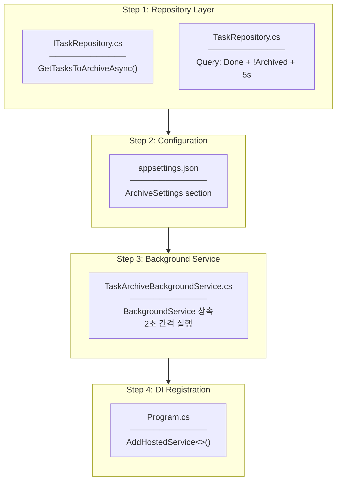
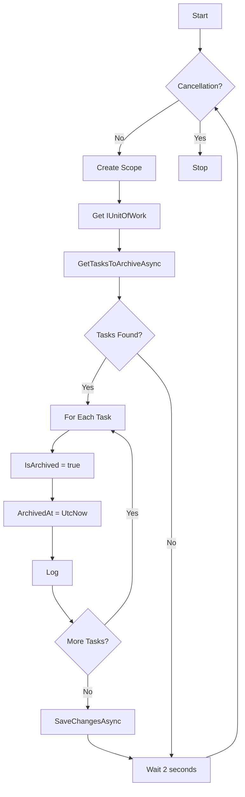
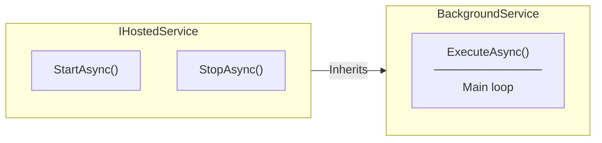
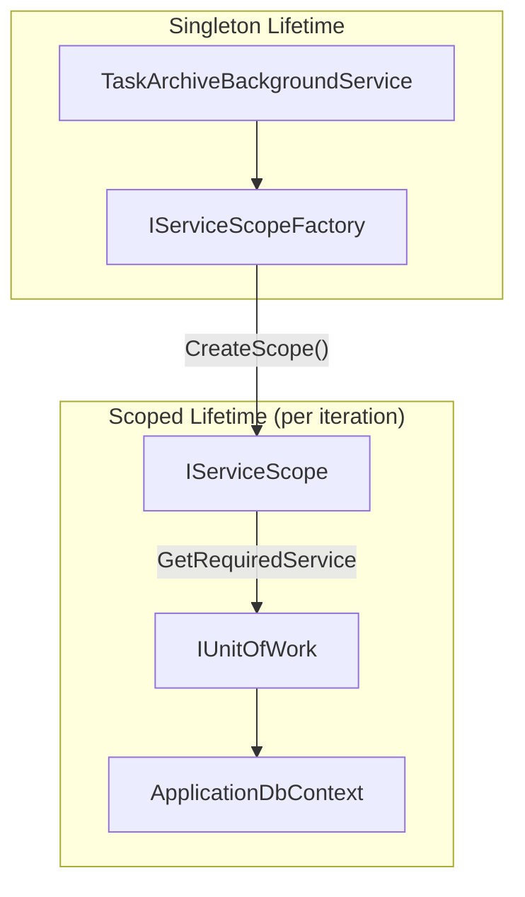

# Task Archive Background Service Implementation Plan

## Overview

Task #66: Implement TaskArchiveBackgroundService - automatic task archiving after Done status for 5 seconds.

## Implementation Flow



---

## File-by-File Implementation Order

### Step 1: Repository Layer

#### 1.1 ITaskRepository.cs

**Location:** `Repositories/Interfaces/ITaskRepository.cs`

**Added Method:**
```csharp
/// <summary>
/// Gets tasks that are ready to be archived.
/// Conditions: Status == Done, IsArchived == false, UpdatedAt older than specified delay.
/// </summary>
Task<IEnumerable<TaskItem>> GetTasksToArchiveAsync();
```

---

#### 1.2 TaskRepository.cs

**Location:** `Repositories/TaskRepository.cs`

**Implementation:**
```csharp
public async Task<IEnumerable<TaskItem>> GetTasksToArchiveAsync()
{
    var archiveThreshold = DateTime.UtcNow.AddSeconds(-5);

    return await _dbSet
        .Where(t => t.Status == TaskStatus.Done &&
                    !t.IsArchived &&
                    t.UpdatedAt < archiveThreshold)
        .ToListAsync();
}
```

**Query Conditions:**
| Condition | Description |
|-----------|-------------|
| `Status == Done` | Task must be completed |
| `!IsArchived` | Not already archived |
| `UpdatedAt < threshold` | At least 5 seconds since last update |

---

### Step 2: Configuration

#### 2.1 appsettings.json

**Location:** `appsettings.json`

**Added:**
```json
"ArchiveSettings": {
  "IntervalSeconds": 2,
  "DelaySeconds": 5
}
```

| Setting | Value | Description |
|---------|-------|-------------|
| `IntervalSeconds` | 2 | Background service execution interval |
| `DelaySeconds` | 5 | Time after Done status before archiving |

---

### Step 3: Background Service

#### 3.1 TaskArchiveBackgroundService.cs

**Location:** `BackgroundServices/TaskArchiveBackgroundService.cs`

**Base Class:** `BackgroundService` (Microsoft.Extensions.Hosting)

**Dependencies:**
| Dependency | Purpose |
|------------|---------|
| `IServiceScopeFactory` | Create scoped services in singleton |
| `ILogger` | Logging archive operations |
| `IConfiguration` | Read settings |

**ExecuteAsync Logic:**


---

### Step 4: DI Registration

#### 4.1 Program.cs

**Location:** `Program.cs`

**Added:**
```csharp
// Background Services
builder.Services.AddHostedService<TaskArchiveBackgroundService>();
```

---

## Key Concepts

### BackgroundService vs IHostedService



**BackgroundService** is an abstract class that implements `IHostedService` and provides:
- `ExecuteAsync()` method to override
- Automatic start/stop lifecycle management
- CancellationToken handling

---

### IServiceScopeFactory Pattern



**Why IServiceScopeFactory?**
- BackgroundService is **Singleton** (one instance for app lifetime)
- IUnitOfWork/DbContext are **Scoped** (one instance per request)
- Cannot inject Scoped into Singleton directly
- ScopeFactory creates manual scope for each iteration

---

## Logging

| Event | Level | Message |
|-------|-------|---------|
| Service started | Information | "TaskArchiveBackgroundService started" |
| Task archived | Information | "Archived task {Id}: {Title}" |
| Batch completed | Debug | "Archived {count} tasks" |
| Error | Error | "Error archiving tasks: {message}" |
| Service stopped | Information | "TaskArchiveBackgroundService stopped" |

---

## Timeline Example

```
T+0s:  User marks task as "Done"
       → Task.Status = Done
       → Task.UpdatedAt = T+0s

T+2s:  Background service runs
       → Checks: UpdatedAt (T+0s) < Now-5s (T-3s)? NO
       → Task NOT archived

T+4s:  Background service runs
       → Checks: UpdatedAt (T+0s) < Now-5s (T-1s)? NO
       → Task NOT archived

T+6s:  Background service runs
       → Checks: UpdatedAt (T+0s) < Now-5s (T+1s)? YES
       → Task IS archived
       → IsArchived = true
       → ArchivedAt = T+6s
```

---

## Checklist

- [x] 1.1 Add GetTasksToArchiveAsync to ITaskRepository
- [x] 1.2 Implement GetTasksToArchiveAsync in TaskRepository
- [x] 2.1 Add ArchiveSettings to appsettings.json
- [x] 3.1 Create TaskArchiveBackgroundService.cs
- [x] 4.1 Register AddHostedService in Program.cs
- [x] Build verification
