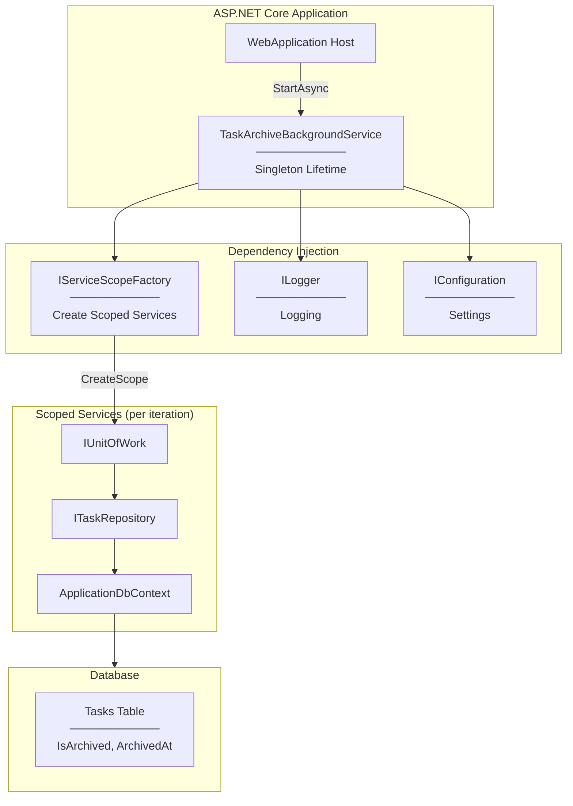
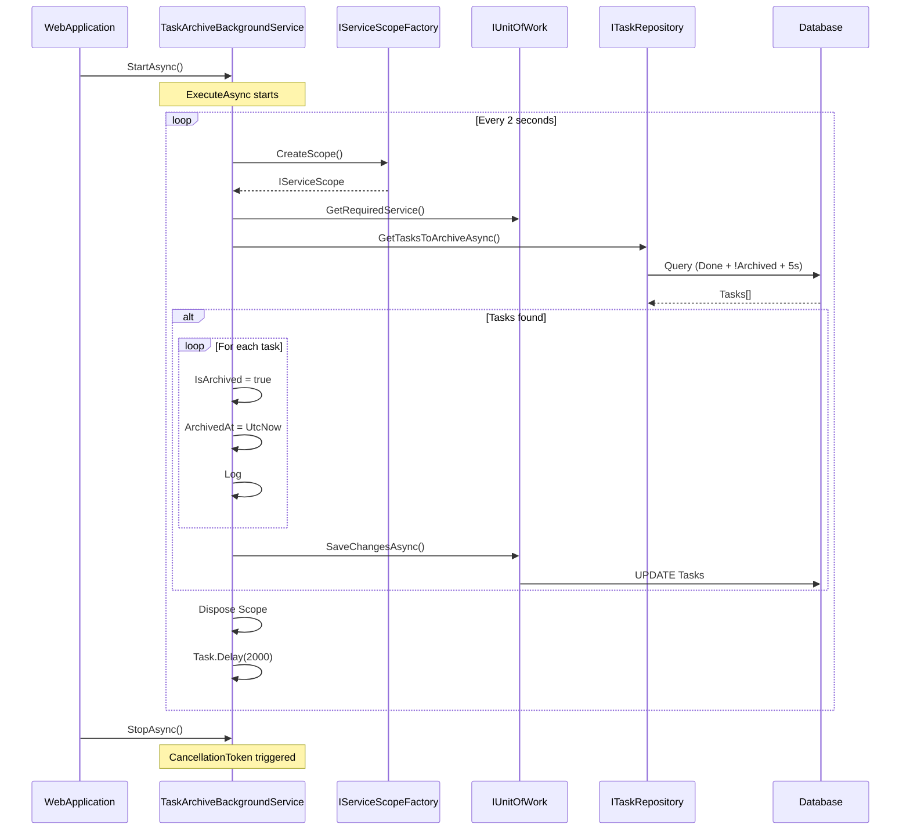
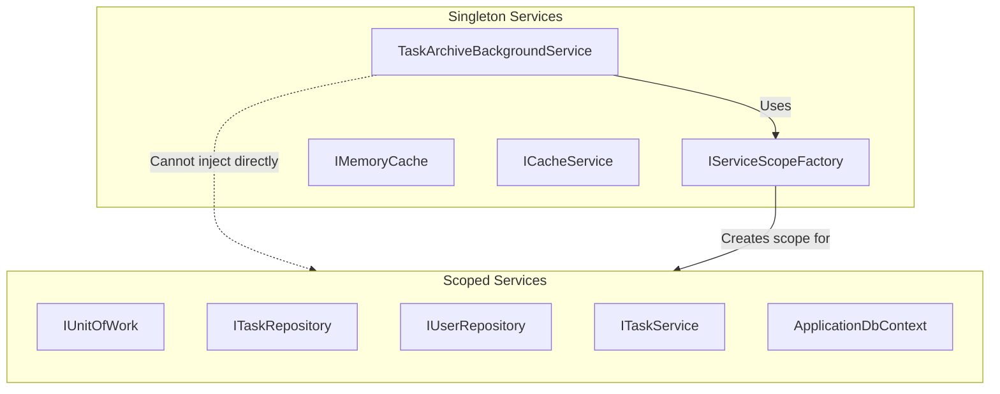
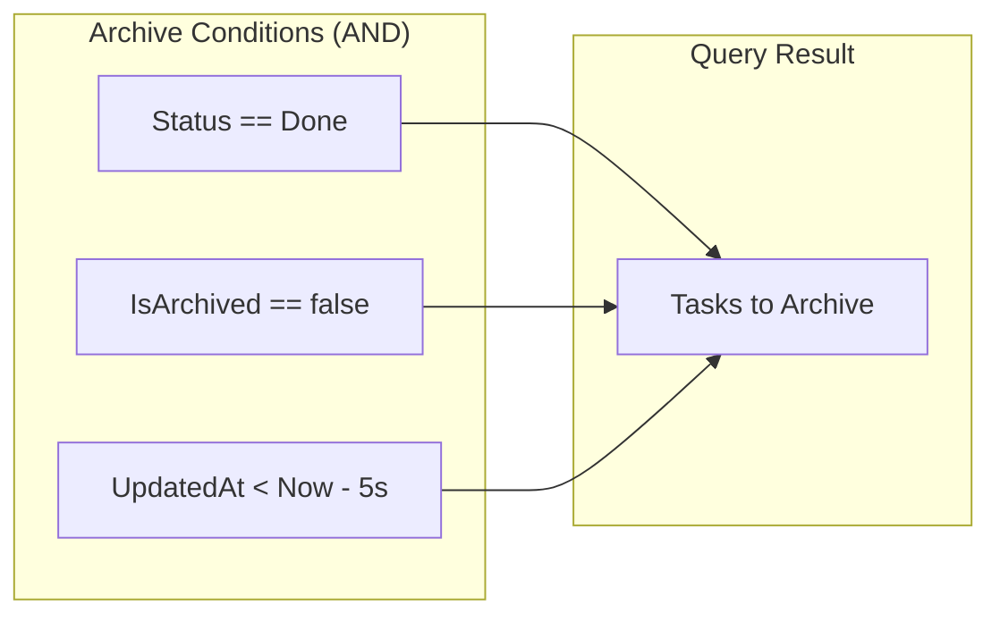
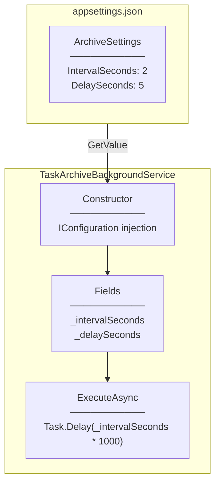
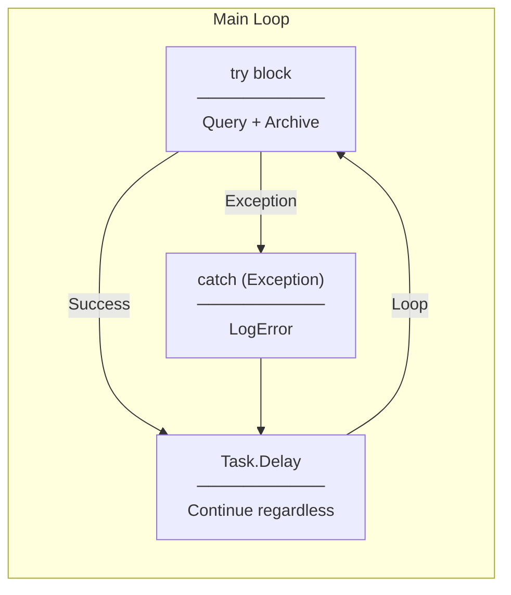
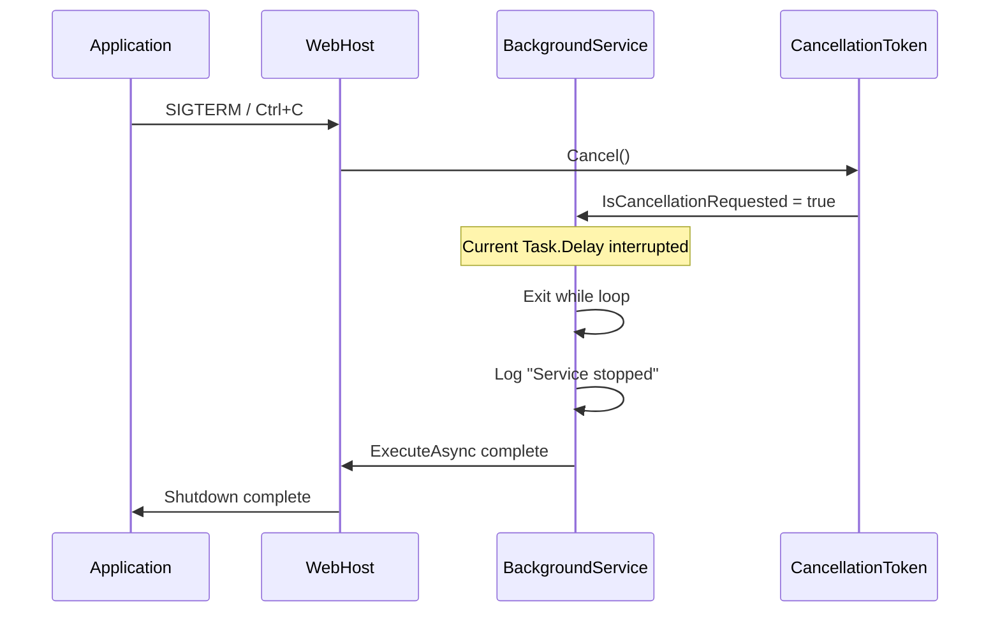

# Architecture Diagram

## Background Service Overview

---

## Service Lifecycle

---

## DI Container Structure

---

## Archive Query Condition

---

## Configuration Flow

---

## Error Handling Flow

**Design Decision:** Service continues running even after errors to ensure eventual archiving.

---

## Graceful Shutdown

