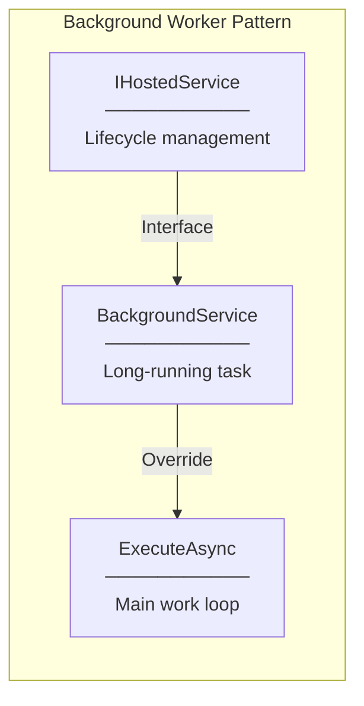
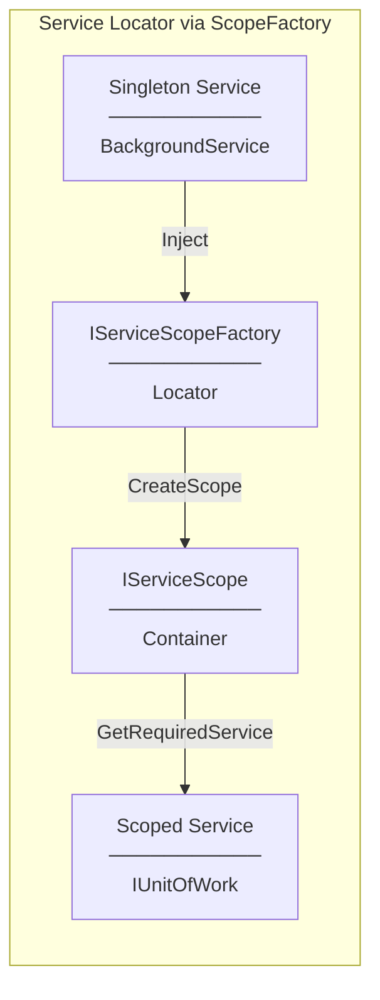
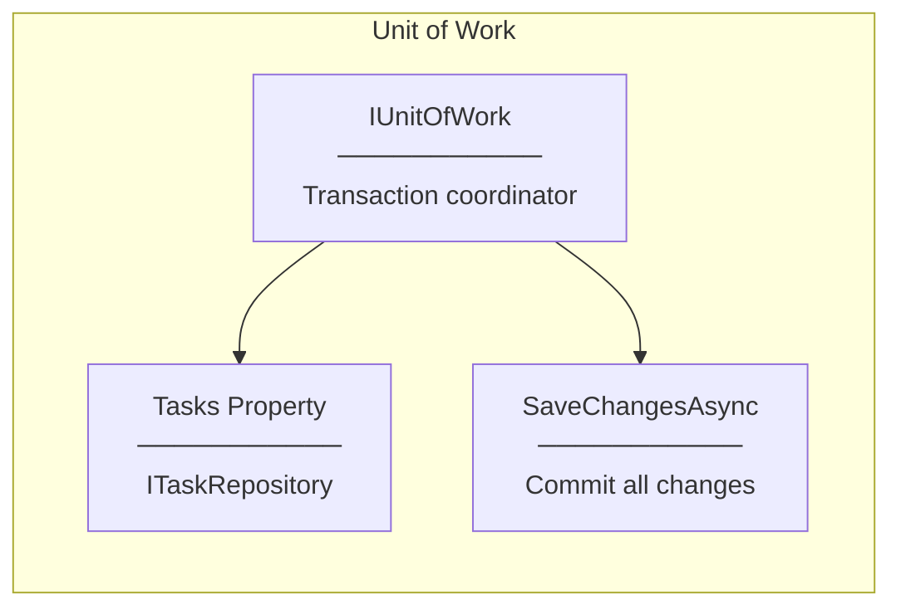
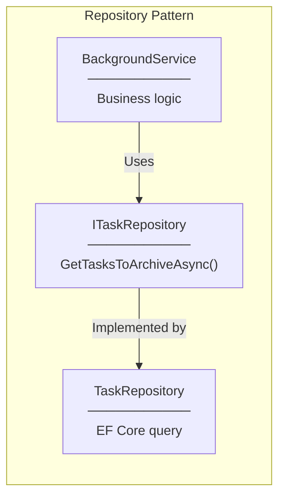
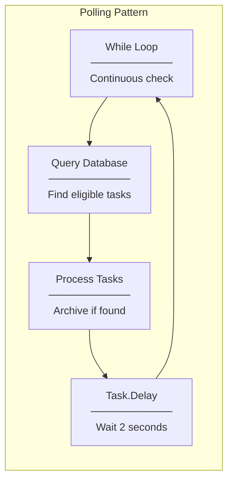
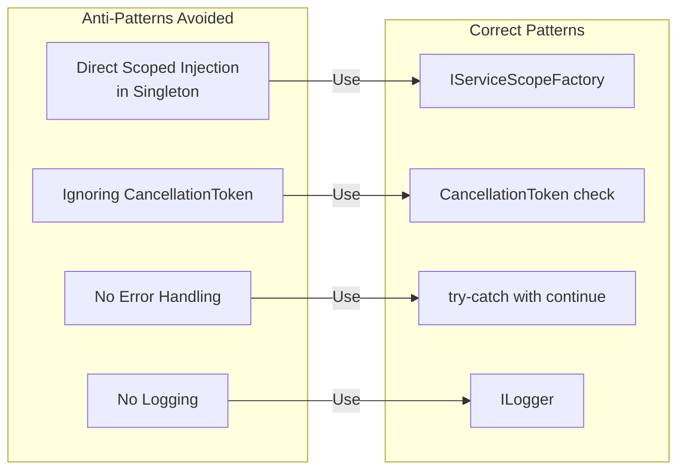

# Design Patterns

## Patterns Used

### 1. Background Worker Pattern



**Implementation:**
```csharp
public class TaskArchiveBackgroundService : BackgroundService
{
    protected override async Task ExecuteAsync(CancellationToken stoppingToken)
    {
        while (!stoppingToken.IsCancellationRequested)
        {
            // Do work
            await Task.Delay(2000, stoppingToken);
        }
    }
}
```

**Benefits:**
- Automatic start on application startup
- Graceful shutdown with CancellationToken
- Runs independently of HTTP request lifecycle

---

### 2. Service Locator Pattern (via IServiceScopeFactory)



**Implementation:**
```csharp
using var scope = _scopeFactory.CreateScope();
var unitOfWork = scope.ServiceProvider.GetRequiredService<IUnitOfWork>();
```

**Why Service Locator here?**
- BackgroundService is Singleton
- IUnitOfWork/DbContext are Scoped
- Cannot use Constructor Injection for Scoped → Singleton
- ScopeFactory is the approved pattern for this scenario

---

### 3. Unit of Work Pattern



**Implementation:**
```csharp
var tasksToArchive = await unitOfWork.Tasks.GetTasksToArchiveAsync();

foreach (var task in tasksToArchive)
{
    task.IsArchived = true;
    task.ArchivedAt = DateTime.UtcNow;
}

await unitOfWork.SaveChangesAsync(); // Single commit for all changes
```

**Benefits:**
- All archive operations committed together
- Atomic transaction
- DbContext change tracking handles updates

---

### 4. Repository Pattern



**Implementation:**
```csharp
// Interface
Task<IEnumerable<TaskItem>> GetTasksToArchiveAsync();

// Implementation
public async Task<IEnumerable<TaskItem>> GetTasksToArchiveAsync()
{
    var archiveThreshold = DateTime.UtcNow.AddSeconds(-5);
    return await _dbSet
        .Where(t => t.Status == TaskStatus.Done &&
                    !t.IsArchived &&
                    t.UpdatedAt < archiveThreshold)
        .ToListAsync();
}
```

---

### 5. Polling Pattern



**Implementation:**
```csharp
while (!stoppingToken.IsCancellationRequested)
{
    // Poll: Check for tasks to archive
    var tasks = await unitOfWork.Tasks.GetTasksToArchiveAsync();

    // Process: Archive found tasks
    foreach (var task in tasks) { /* ... */ }

    // Wait: Sleep before next poll
    await Task.Delay(_intervalSeconds * 1000, stoppingToken);
}
```

**Alternative Patterns Not Used:**
| Pattern | Description | Why Not Used |
|---------|-------------|--------------|
| Event-Driven | React to status change event | More complex, requires event infrastructure |
| Timer-Based | System.Threading.Timer | Less control over lifecycle |
| Message Queue | RabbitMQ, Azure Service Bus | Overkill for simple archiving |

---

## Anti-Patterns Avoided


