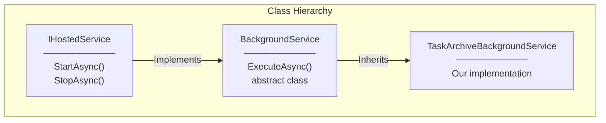
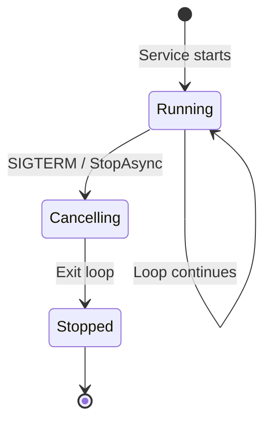
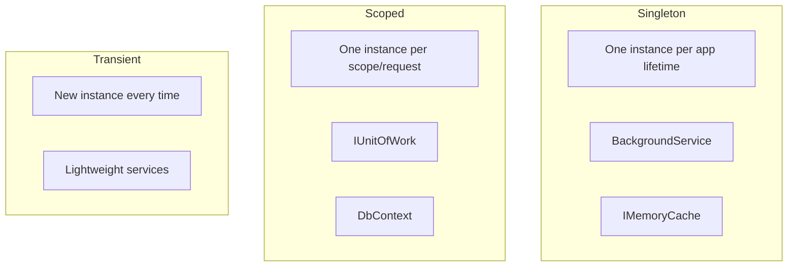
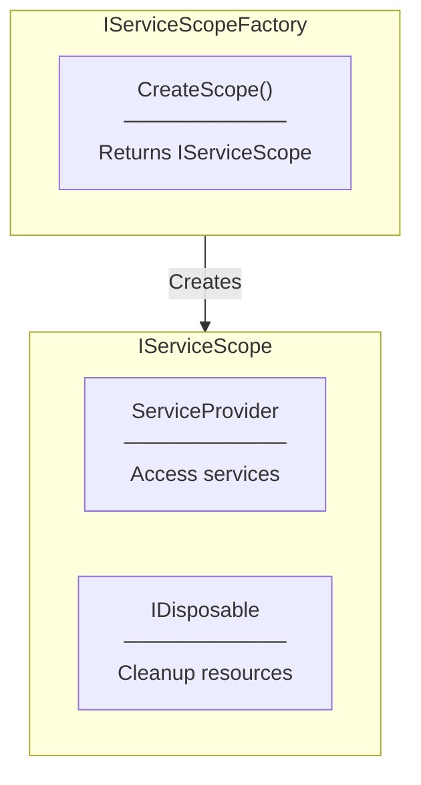
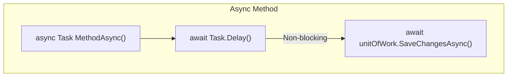
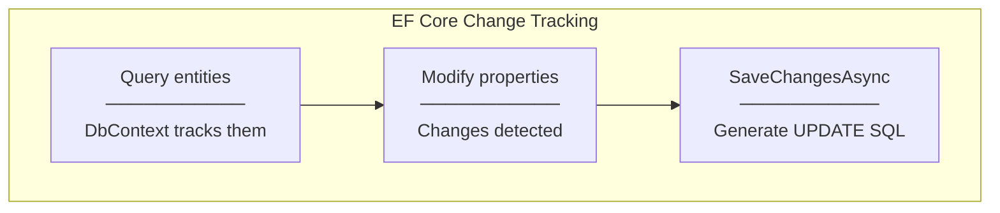

# Programming Concepts

## .NET Hosting Concepts

### 1. BackgroundService Abstract Class



**Key Methods:**
| Method | Description |
|--------|-------------|
| `ExecuteAsync(CancellationToken)` | Override this for your work logic |
| `StartAsync(CancellationToken)` | Called on app startup (inherited) |
| `StopAsync(CancellationToken)` | Called on app shutdown (inherited) |

---

### 2. IHostedService Registration

```csharp
// Program.cs
builder.Services.AddHostedService<TaskArchiveBackgroundService>();
```

**What this does:**
- Registers as Singleton
- Adds to IHostedService collection
- Host starts all IHostedService on startup
- Host stops all on shutdown

---

### 3. CancellationToken



**Implementation:**
```csharp
protected override async Task ExecuteAsync(CancellationToken stoppingToken)
{
    while (!stoppingToken.IsCancellationRequested)
    {
        // Work...
        await Task.Delay(2000, stoppingToken); // Throws on cancel
    }
}
```

**Key Points:**
- `stoppingToken.IsCancellationRequested` - Check before work
- `Task.Delay(ms, token)` - Cancellable delay
- Thrown `OperationCanceledException` is handled by framework

---

## Dependency Injection Concepts

### 4. Service Lifetimes



**Problem:**
```csharp
// This FAILS - cannot inject Scoped into Singleton
public class TaskArchiveBackgroundService : BackgroundService
{
    public TaskArchiveBackgroundService(IUnitOfWork unitOfWork) // ERROR!
    {
    }
}
```

**Solution:**
```csharp
public class TaskArchiveBackgroundService : BackgroundService
{
    private readonly IServiceScopeFactory _scopeFactory;

    public TaskArchiveBackgroundService(IServiceScopeFactory scopeFactory)
    {
        _scopeFactory = scopeFactory;
    }

    protected override async Task ExecuteAsync(CancellationToken stoppingToken)
    {
        using var scope = _scopeFactory.CreateScope();
        var unitOfWork = scope.ServiceProvider.GetRequiredService<IUnitOfWork>();
    }
}
```

---

### 5. IServiceScopeFactory



**Usage Pattern:**
```csharp
using var scope = _scopeFactory.CreateScope(); // using = auto-dispose
var service = scope.ServiceProvider.GetRequiredService<IService>();
// Use service...
// Scope disposed at end of block, DbContext cleaned up
```

---

## Configuration Concepts

### 6. IConfiguration.GetValue<T>

```csharp
// appsettings.json
{
  "ArchiveSettings": {
    "IntervalSeconds": 2,
    "DelaySeconds": 5
  }
}

// Reading values
_intervalSeconds = configuration.GetValue<int>("ArchiveSettings:IntervalSeconds", 2);
//                                             ^path                              ^default
```

**Path Syntax:**
- Use `:` to navigate nested JSON
- `GetValue<T>(path, defaultValue)` returns default if not found

---

## Async/Await Concepts

### 7. async Task Pattern



**Key Points:**
- `async Task` - Returns Task (void-like for async)
- `await` - Non-blocking wait
- Thread returns to pool during delay
- Efficient resource usage

---

### 8. Task.Delay vs Thread.Sleep

| Method | Behavior |
|--------|----------|
| `await Task.Delay(ms)` | Non-blocking, releases thread |
| `Thread.Sleep(ms)` | Blocking, holds thread |

**Always use `Task.Delay` in async code:**
```csharp
// Correct
await Task.Delay(2000, stoppingToken);

// Wrong - blocks thread
Thread.Sleep(2000);
```

---

## Entity Framework Concepts

### 9. Change Tracking



**Implementation:**
```csharp
var tasks = await unitOfWork.Tasks.GetTasksToArchiveAsync(); // Tracked

foreach (var task in tasks)
{
    task.IsArchived = true;      // Change detected
    task.ArchivedAt = DateTime.UtcNow;
}

await unitOfWork.SaveChangesAsync(); // Generates UPDATE statements
```

---

### 10. DateTime.UtcNow

```csharp
var archiveThreshold = DateTime.UtcNow.AddSeconds(-5);
```

**Why UTC?**
- Server-agnostic time
- No timezone issues
- Database stores UTC
- Convert to local only for display

---

## Logging Concepts

### 11. ILogger<T> Structured Logging

```csharp
private readonly ILogger<TaskArchiveBackgroundService> _logger;

_logger.LogInformation("Archived task {Id}: {Title}", task.Id, task.Title);
//                     ^message template        ^parameters (not string interpolation!)
```

**Structured Logging Benefits:**
- Parameters captured as structured data
- Searchable in log aggregators (Seq, ELK)
- Better performance than string interpolation

**Log Levels:**
| Level | Usage |
|-------|-------|
| `LogDebug` | Detailed diagnostic info |
| `LogInformation` | Normal flow events |
| `LogWarning` | Unexpected but handled |
| `LogError` | Exceptions, failures |
| `LogCritical` | App crash scenarios |
