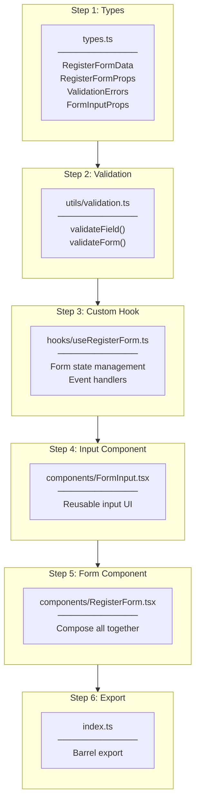
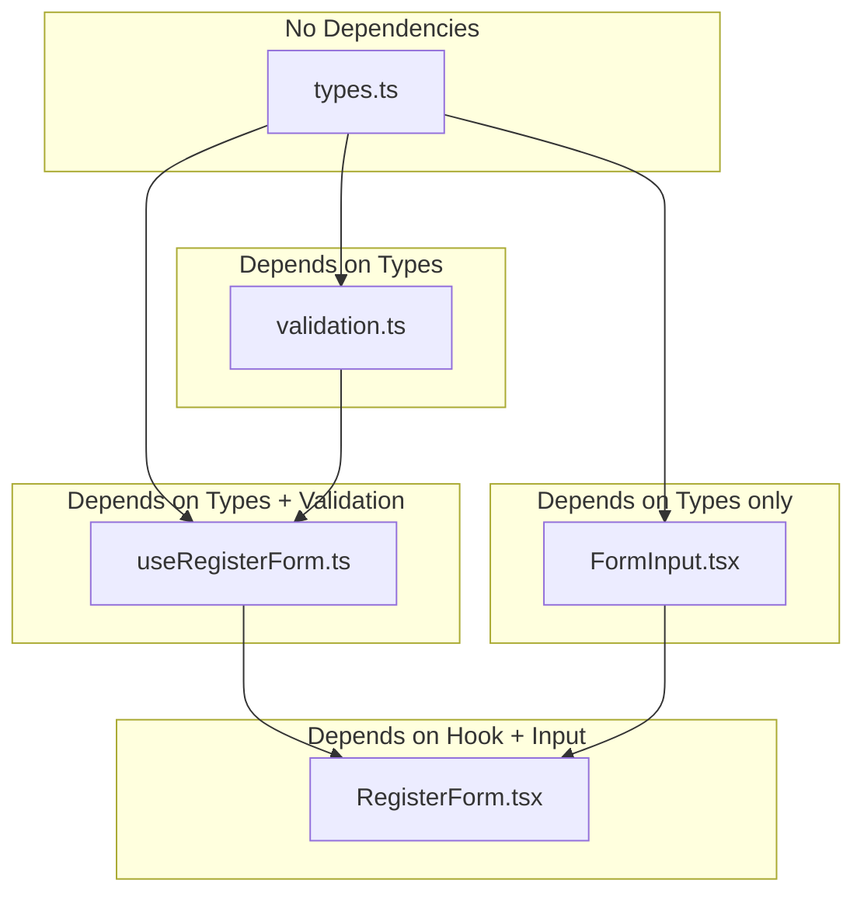
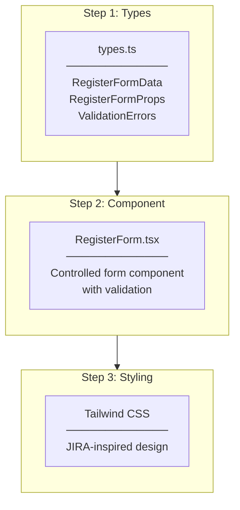

# RegisterForm Implementation Plan

## Changes from Original Plan

### Tailwind CSS v3 Setup (Infrastructure)

**Issue:** Tailwind CSS was not installed in the project

**Error Encountered:**
- Tailwind classes (`bg-gray-100`, `shadow`, `rounded-lg`) had no effect
- Form rendered without styling

**Solution:**
1. Installed Tailwind CSS v3 (not v4 - different config approach, less documentation)
2. Created configuration files
3. Updated CSS with Tailwind directives

**Commands:**
```bash
npm install -D tailwindcss@3 postcss autoprefixer
npx tailwindcss init -p
```

**Files Added:**

| File | Purpose |
|------|---------|
| `tailwind.config.js` | Content paths for Tailwind to scan |
| `postcss.config.js` | PostCSS plugin configuration |

**Why v3 over v4:**
- More documentation and tutorials available
- Stable configuration approach (`tailwind.config.js`)
- v4 uses CSS-based configuration (newer, less community support)

---

### Refactored to SRP-based File Structure

**Original Plan:** All logic in single `RegisterForm.tsx` component

**Revised Plan:** Separated by Single Responsibility Principle (SRP)

**Why Changed:**
- **Single Responsibility Principle (SRP)** - Each file has one reason to change
  - `types.ts` → Type definitions only
  - `validation.ts` → Validation rules only
  - `useRegisterForm.ts` → State management only
  - `FormInput.tsx` → Input UI only
  - `RegisterForm.tsx` → Form composition only
- **Testability** - Each unit can be tested independently
- **Reusability** - `FormInput`, `validation` can be reused in LoginForm, etc.
- **Clarity** - Clear separation of concerns, easier to understand

**Original File Structure:**
```
src/features/auth/
├── components/
│   └── RegisterForm.tsx    ← Everything in one file
├── types.ts
└── index.ts
```

**Revised File Structure:**
```
src/features/auth/
├── components/
│   ├── FormInput.tsx         ← Input UI only
│   └── RegisterForm.tsx      ← Form composition only
├── hooks/
│   └── useRegisterForm.ts    ← State + Handlers only
├── utils/
│   └── validation.ts         ← Validation rules only
├── types.ts                  ← Type definitions only
└── index.ts                  ← Barrel export
```

**Comparison:**

| Aspect | Original (1 file) | Revised (5 files) |
|--------|-------------------|-------------------|
| SRP | ❌ Mixed concerns | ✅ Single responsibility |
| Testability | ❌ Hard to unit test | ✅ Each file testable |
| Reusability | ❌ Copy-paste needed | ✅ Import and reuse |
| Readability | ❌ 180+ lines | ✅ 30-50 lines each |

---

## Overview

Task #8: Create RegisterForm React component with form fields for Name, Email, Username, Password, and client-side validation matching backend requirements.

## Implementation Flow (Revised)



---

## Dependency Flow



---

## File-by-File Implementation

### Step 1: types.ts

**Location:** `src/features/auth/types.ts`

**Responsibility:** Type definitions only

**Types:**

```typescript
// Form field values
export interface RegisterFormData {
  name: string;
  email: string;
  username: string;
  password: string;
  confirmPassword: string;
}

// Validation error messages
export interface ValidationErrors {
  name?: string;
  email?: string;
  username?: string;
  password?: string;
  confirmPassword?: string;
}

// RegisterForm component props
export interface RegisterFormProps {
  onSubmit: (data: RegisterFormData) => void;
  loading?: boolean;
  error?: string | null;
}

// FormInput component props
export interface FormInputProps {
  name: string;
  label: string;
  type?: 'text' | 'email' | 'password';
  value: string;
  error?: string;
  disabled?: boolean;
  onChange: (e: React.ChangeEvent<HTMLInputElement>) => void;
  onBlur: (e: React.FocusEvent<HTMLInputElement>) => void;
}
```

---

### Step 2: utils/validation.ts

**Location:** `src/features/auth/utils/validation.ts`

**Responsibility:** Validation rules only (pure functions)

**Functions:**

```typescript
import type { RegisterFormData, ValidationErrors } from '../types';

// Validate single field
export const validateField = (
  name: keyof RegisterFormData,
  value: string,
  formData?: RegisterFormData
): string | undefined => {
  switch (name) {
    case 'name':
      if (!value.trim()) return 'Name is required';
      if (value.length > 100) return 'Name cannot exceed 100 characters';
      return undefined;

    case 'email':
      if (!value.trim()) return 'Email is required';
      if (!/^[^\s@]+@[^\s@]+\.[^\s@]+$/.test(value)) return 'Invalid email format';
      return undefined;

    // ... other fields
  }
};

// Validate entire form
export const validateForm = (data: RegisterFormData): ValidationErrors => {
  // Returns all errors
};
```

**Why Pure Functions:**
- No side effects
- Easy to test: `expect(validateField('email', 'invalid')).toBe('Invalid email format')`
- Reusable in other forms

---

### Step 3: hooks/useRegisterForm.ts

**Location:** `src/features/auth/hooks/useRegisterForm.ts`

**Responsibility:** State management + Event handlers only

**Returns:**

```typescript
import { useState } from 'react';
import type { RegisterFormData, ValidationErrors } from '../types';
import { validateField, validateForm } from '../utils/validation';

export const useRegisterForm = (onSubmit: (data: RegisterFormData) => void) => {
  const [formData, setFormData] = useState<RegisterFormData>({...});
  const [errors, setErrors] = useState<ValidationErrors>({});
  const [touched, setTouched] = useState<Record<string, boolean>>({});

  const handleChange = (e: React.ChangeEvent<HTMLInputElement>) => {...};
  const handleBlur = (e: React.FocusEvent<HTMLInputElement>) => {...};
  const handleSubmit = (e: React.FormEvent) => {...};

  return {
    formData,
    errors,
    touched,
    handleChange,
    handleBlur,
    handleSubmit,
  };
};
```

**Why Custom Hook:**
- Encapsulates all state logic
- Component only renders, doesn't manage state
- Reusable: `useLoginForm` could share similar logic

---

### Step 4: components/FormInput.tsx

**Location:** `src/features/auth/components/FormInput.tsx`

**Responsibility:** Input UI rendering only

**Props:** `FormInputProps` (from types.ts)

```typescript
import type { FormInputProps } from '../types';

export const FormInput = ({
  name,
  label,
  type = 'text',
  value,
  error,
  disabled,
  onChange,
  onBlur,
}: FormInputProps) => {
  return (
    <div>
      <label htmlFor={name}>{label}</label>
      <input
        type={type}
        id={name}
        name={name}
        value={value}
        onChange={onChange}
        onBlur={onBlur}
        disabled={disabled}
        className={error ? 'error-style' : 'normal-style'}
      />
      {error && <p className="error-text">{error}</p>}
    </div>
  );
};
```

**Why Separate Component:**
- Reusable: Same input style across all forms
- Single place to change input styling
- Easy to test: Just check props → render

---

### Step 5: components/RegisterForm.tsx

**Location:** `src/features/auth/components/RegisterForm.tsx`

**Responsibility:** Form composition only (no logic)

```typescript
import type { RegisterFormProps } from '../types';
import { useRegisterForm } from '../hooks/useRegisterForm';
import { FormInput } from './FormInput';

export const RegisterForm = ({ onSubmit, loading, error }: RegisterFormProps) => {
  const {
    formData,
    errors,
    touched,
    handleChange,
    handleBlur,
    handleSubmit,
  } = useRegisterForm(onSubmit);

  const showError = (field: string) => touched[field] ? errors[field] : undefined;

  return (
    <form onSubmit={handleSubmit}>
      {error && <div className="server-error">{error}</div>}

      <FormInput name="name" label="Name" value={formData.name} error={showError('name')} ... />
      <FormInput name="email" label="Email" type="email" value={formData.email} ... />
      <FormInput name="username" label="Username" value={formData.username} ... />
      <FormInput name="password" label="Password" type="password" value={formData.password} ... />
      <FormInput name="confirmPassword" label="Confirm Password" type="password" ... />

      <button type="submit" disabled={loading}>
        {loading ? 'Registering...' : 'Register'}
      </button>
    </form>
  );
};
```

**Why Thin Component:**
- Only composes other pieces
- Easy to read: Just see which inputs exist
- Logic is in hook, UI is in FormInput

---

### Step 6: index.ts

**Location:** `src/features/auth/index.ts`

**Responsibility:** Barrel export only

```typescript
// Components
export { RegisterForm } from './components/RegisterForm';
export { FormInput } from './components/FormInput';

// Hooks
export { useRegisterForm } from './hooks/useRegisterForm';

// Types
export type {
  RegisterFormData,
  RegisterFormProps,
  ValidationErrors,
  FormInputProps,
} from './types';
```

---

## Validation Rules (Matching Backend)

| Field | Backend Rule | Frontend Validation |
|-------|--------------|---------------------|
| Name | `[Required]`, `[MaxLength(100)]` | Required, max 100 |
| Email | `[Required]`, `[EmailAddress]` | Required, email regex |
| Username | `[Required]`, `[MinLength(3)]`, `[MaxLength(50)]` | Required, 3-50 chars |
| Password | `[Required]`, `[MinLength(8)]` | Required, min 8 |
| Confirm Password | N/A (frontend only) | Must match password |

---

## Styling Guidelines

**Design System:** JIRA-inspired (Tailwind CSS)

| Element | Tailwind Classes |
|---------|------------------|
| Form Container | `max-w-md mx-auto p-6 bg-white rounded-lg shadow` |
| Input | `w-full px-3 py-2 border rounded focus:outline-none focus:ring-2 focus:ring-blue-500` |
| Input Error | `border-red-500 focus:ring-red-500` |
| Error Text | `text-sm text-red-600 mt-1` |
| Label | `block text-sm font-medium text-gray-700 mb-1` |
| Button | `w-full py-2 bg-blue-600 text-white rounded hover:bg-blue-700` |
| Button Disabled | `bg-blue-400 cursor-not-allowed` |
| Server Error | `p-3 bg-red-50 border border-red-200 rounded text-red-700 text-sm` |

---

## Checklist

- [x] 1.1 Create types.ts (RegisterFormData, ValidationErrors, RegisterFormProps, FormInputProps)
- [x] 2.1 Create utils/validation.ts (validateField, validateForm)
- [x] 3.1 Create hooks/useRegisterForm.ts (state, handlers)
- [x] 4.1 Create components/FormInput.tsx (reusable input)
- [x] 5.1 Create components/RegisterForm.tsx (composition)
- [x] 6.1 Create index.ts (barrel export)
- [x] 7.1 Install and configure Tailwind CSS v3
- [x] 7.2 Apply Tailwind styling
- [x] 8.1 Build verification

---

---

# Original Plan (Archived)

> The following was the original plan before refactoring to SRP-based structure.

## Original Implementation Flow



## Original File Structure

```
src/features/auth/
├── components/
│   └── RegisterForm.tsx    ← Main component (Task #8)
├── types.ts                ← Type definitions
└── index.ts                ← Barrel export
```

## Original Checklist

- [ ] 1.1 Create types.ts with RegisterFormData, RegisterFormProps, ValidationErrors
- [ ] 2.1 Create RegisterForm.tsx component structure
- [ ] 2.2 Implement controlled inputs with useState
- [ ] 2.3 Add validation functions
- [ ] 2.4 Implement handleChange, handleBlur, handleSubmit
- [ ] 2.5 Display inline error messages
- [ ] 2.6 Disable submit button during loading
- [ ] 2.7 Display server error message
- [ ] 3.1 Apply Tailwind styling (JIRA-inspired)
- [ ] Build verification
