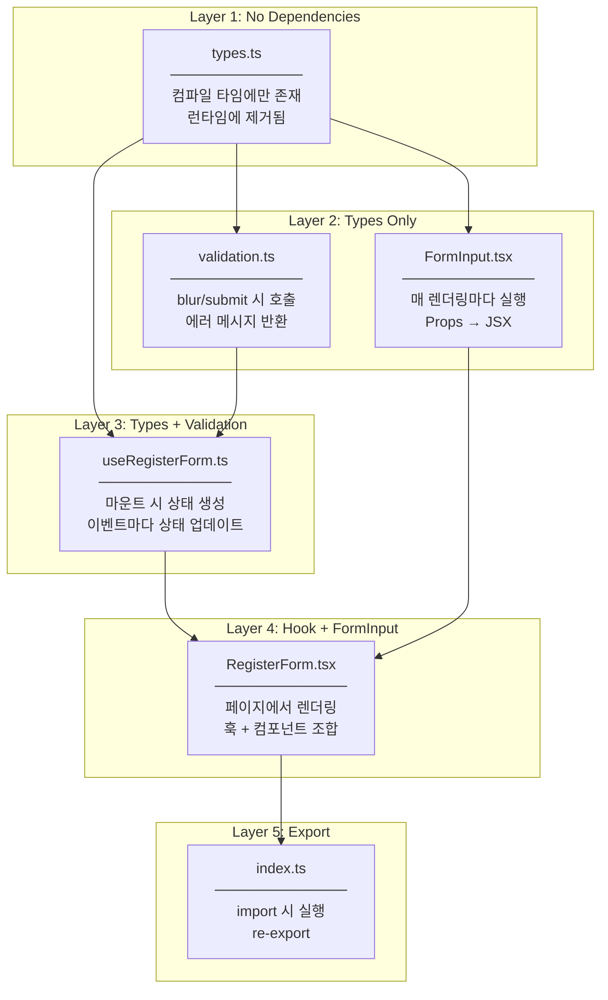

# RegisterForm Implementation Plan

## Overview

Task #8: Create RegisterForm React component with form fields for Name, Email, Username, Password, and client-side validation matching backend requirements.

---

## Changes from Original Plan

### Tailwind CSS v3 Setup (Infrastructure)

**Issue:** Tailwind CSS was not installed in the project

**Error Encountered:**
- Tailwind classes (`bg-gray-100`, `shadow`, `rounded-lg`) had no effect
- Form rendered without styling

**Solution:**
1. Installed Tailwind CSS v3 (not v4 - different config approach, less documentation)
2. Created configuration files
3. Updated CSS with Tailwind directives

**Commands:**
```bash
npm install -D tailwindcss@3 postcss autoprefixer
npx tailwindcss init -p
```

**Files Added:**

| File | Purpose |
|------|---------|
| `tailwind.config.js` | Content paths for Tailwind to scan |
| `postcss.config.js` | PostCSS plugin configuration |

**Why v3 over v4:**
- More documentation and tutorials available
- Stable configuration approach (`tailwind.config.js`)
- v4 uses CSS-based configuration (newer, less community support)

---

### Refactored to SRP-based File Structure

**Original Plan:** All logic in single `RegisterForm.tsx` component

**Revised Plan:** Separated by Single Responsibility Principle (SRP)

**Why Changed:**
- **Single Responsibility Principle (SRP)** - Each file has one reason to change
- **Testability** - Each unit can be tested independently
- **Reusability** - `FormInput`, `validation` can be reused in LoginForm, etc.
- **Clarity** - Clear separation of concerns, easier to understand

**Comparison:**

| Aspect | Original (1 file) | Revised (5 files) |
|--------|-------------------|-------------------|
| SRP | Mixed concerns | Single responsibility |
| Testability | Hard to unit test | Each file testable |
| Reusability | Copy-paste needed | Import and reuse |
| Readability | 180+ lines | 30-50 lines each |

---

## File Structure (SRP-based)

```
src/features/auth/
├── components/
│   ├── FormInput.tsx         ← Input UI only
│   └── RegisterForm.tsx      ← Form composition only
├── hooks/
│   └── useRegisterForm.ts    ← State + Handlers only
├── utils/
│   └── validation.ts         ← Validation rules only
├── types.ts                  ← Type definitions only
└── index.ts                  ← Barrel export
```

---

## File Responsibilities (SRP)

### types.ts

| Aspect | Description |
|--------|-------------|
| **Responsibility** | Form 관련 타입 정의 |
| **Logic 관점** | 데이터 구조의 계약 - FormData가 어떤 필드를 가지는지, Props가 뭘 받는지 정의 |
| **Runtime 관점** | 실행 시점에는 존재하지 않음 (컴파일 타임에만 사용, JS 변환 시 제거됨) |
| **Changes when** | 폼 필드 추가/제거, Props 변경 |
| **Does NOT do** | 로직 실행, 유효성 검사, 렌더링 |

**Why separate?** 타입은 "이 데이터는 이런 모양이어야 한다"는 계약입니다. 필드가 바뀌면 이 파일만 수정합니다.

---

### utils/validation.ts

| Aspect | Description |
|--------|-------------|
| **Responsibility** | 유효성 검사 규칙 정의 |
| **Logic 관점** | "이름은 필수, 이메일은 형식 검사, 비밀번호는 8자 이상" 등 비즈니스 규칙 |
| **Runtime 관점** | handleBlur나 handleSubmit에서 호출됨. 입력값을 받아 에러 메시지 또는 undefined 반환 |
| **Changes when** | 유효성 규칙 변경 (예: 비밀번호 12자로 변경), 새 필드 추가 |
| **Does NOT do** | 상태 관리, UI 렌더링, API 호출 |

**Why pure functions?**
- Side effect 없음 → 테스트 용이
- 같은 입력 → 항상 같은 출력
- LoginForm에서도 재사용 가능

---

### hooks/useRegisterForm.ts

| Aspect | Description |
|--------|-------------|
| **Responsibility** | 폼 상태 관리 및 이벤트 핸들링 |
| **Logic 관점** | "formData 상태 관리, 타이핑하면 값 업데이트, blur하면 검증, submit하면 전체 검증 후 콜백" |
| **Runtime 관점** | RegisterForm이 마운트될 때 호출됨. useState로 상태 생성, 이벤트 핸들러 반환 |
| **Changes when** | 상태 구조 변경, 새 핸들러 추가, 검증 타이밍 변경 |
| **Does NOT do** | UI 렌더링, 검증 규칙 정의, API 호출 |

**Why custom hook?**
- 상태 로직을 컴포넌트에서 분리
- RegisterForm은 "무엇을 보여줄지"만 집중
- useLoginForm 등 유사한 훅 재사용 가능

---

### components/FormInput.tsx

| Aspect | Description |
|--------|-------------|
| **Responsibility** | 단일 입력 필드 UI 렌더링 |
| **Logic 관점** | "label, input, error message를 일관된 스타일로 렌더링" |
| **Runtime 관점** | RegisterForm에서 각 필드마다 렌더링됨. Props로 받은 값 표시, 이벤트를 부모에게 전달 |
| **Changes when** | 입력 필드 스타일 변경, 새 입력 타입 추가 (textarea 등) |
| **Does NOT do** | 상태 관리, 유효성 검사, 비즈니스 로직 |

**Why presentational component?**
- Props만 받아서 렌더링 (상태 없음)
- 입력 필드 스타일 변경 시 이 파일만 수정
- 모든 폼에서 동일한 입력 스타일 보장

---

### components/RegisterForm.tsx

| Aspect | Description |
|--------|-------------|
| **Responsibility** | 폼 구성 및 조합 |
| **Logic 관점** | "useRegisterForm 훅 사용, FormInput 5개 배치, 서버 에러 표시, 제출 버튼" |
| **Runtime 관점** | 페이지에서 렌더링됨. 훅에서 상태/핸들러 받아 FormInput들에 전달 |
| **Changes when** | 폼 레이아웃 변경, 필드 순서 변경, 새 섹션 추가 |
| **Does NOT do** | 상태 관리 (훅이 담당), 유효성 검사 (utils가 담당), 입력 스타일링 (FormInput이 담당) |

**Why thin component?**
- 조합만 담당하므로 코드가 짧고 명확
- "이 폼에 어떤 필드들이 있는지" 한눈에 파악
- 로직 변경 시 훅만 수정, UI 변경 시 FormInput만 수정

---

### index.ts

| Aspect | Description |
|--------|-------------|
| **Responsibility** | Public API 정의 (Barrel Export) |
| **Logic 관점** | "외부에서 이 feature의 무엇을 import할 수 있는지" 정의 |
| **Runtime 관점** | import 시점에 실행되어 re-export 수행 |
| **Changes when** | 새 컴포넌트/훅/타입을 외부에 노출할 때 |
| **Does NOT do** | 비즈니스 로직, 상태 관리, 렌더링 |

**Why barrel export?**
- `import { RegisterForm } from '@/features/auth'` 깔끔한 import
- 내부 구조 변경해도 외부 import 경로 유지
- 뭘 노출하고 뭘 숨길지 명시적 제어

---

## Dependency Flow



---

## State Design

| State | Logic 관점 | Runtime 관점 |
|-------|-----------|-------------|
| `formData` | 각 필드의 현재 입력값 | 타이핑할 때마다 업데이트, input의 value로 사용 |
| `errors` | 각 필드의 검증 에러 메시지 | blur/submit 시 업데이트, FormInput에 전달 |
| `touched` | 각 필드를 사용자가 건드렸는지 | blur 시 true로 변경, 에러 표시 여부 결정 |

**Why touched state?**
- 처음부터 모든 에러를 보여주면 UX가 나쁨
- 사용자가 필드를 떠날 때(blur)만 에러 표시
- Submit 시에는 모든 필드를 touched로 설정하여 전체 에러 표시

---

## Validation Rules (Matching Backend)

| Field | Backend Rule | Frontend Validation |
|-------|--------------|---------------------|
| Name | `[Required]`, `[MaxLength(100)]` | Required, max 100 |
| Email | `[Required]`, `[EmailAddress]` | Required, email regex |
| Username | `[Required]`, `[MinLength(3)]`, `[MaxLength(50)]` | Required, 3-50 chars |
| Password | `[Required]`, `[MinLength(8)]` | Required, min 8 |
| Confirm Password | N/A (frontend only) | Must match password |

---

## Checklist

- [x] 1.1 Create types.ts (RegisterFormData, ValidationErrors, RegisterFormProps, FormInputProps)
- [x] 2.1 Create utils/validation.ts (validateField, validateForm)
- [x] 3.1 Create hooks/useRegisterForm.ts (state, handlers)
- [x] 4.1 Create components/FormInput.tsx (reusable input)
- [x] 5.1 Create components/RegisterForm.tsx (composition)
- [x] 6.1 Create index.ts (barrel export)
- [x] 7.1 Install and configure Tailwind CSS v3
- [x] 7.2 Apply Tailwind styling
- [x] 8.1 Build verification

---

## Related Documentation

- [Architecture Diagram](./01-architecture-diagram.md)
- [Detailed Flow](./01-1-detailed-flow.md)
- [Method Connections](./01-2-method-connections.md)
- [Design Patterns & SOLID](./02-design-patterns-and-solid.md)
- [Programming Concepts](./03-programming-concepts.md)

---

---

# Original Plan (Archived)

> The following was the original plan before refactoring to SRP-based structure.

## Original File Structure

```
src/features/auth/
├── components/
│   └── RegisterForm.tsx    ← Everything in one file (180+ lines)
├── types.ts
└── index.ts
```

## Original Checklist

- [ ] 1.1 Create types.ts with RegisterFormData, RegisterFormProps, ValidationErrors
- [ ] 2.1 Create RegisterForm.tsx component structure
- [ ] 2.2 Implement controlled inputs with useState
- [ ] 2.3 Add validation functions
- [ ] 2.4 Implement handleChange, handleBlur, handleSubmit
- [ ] 2.5 Display inline error messages
- [ ] 2.6 Disable submit button during loading
- [ ] 2.7 Display server error message
- [ ] 3.1 Apply Tailwind styling (JIRA-inspired)
- [ ] Build verification
