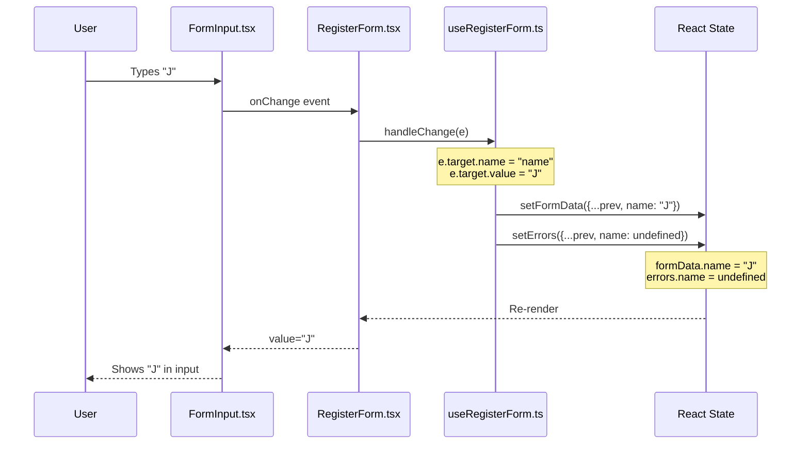
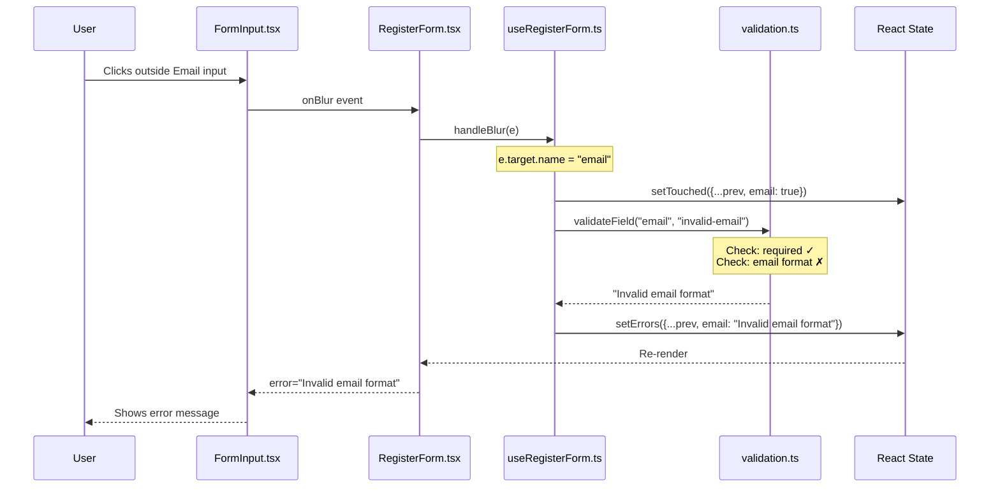
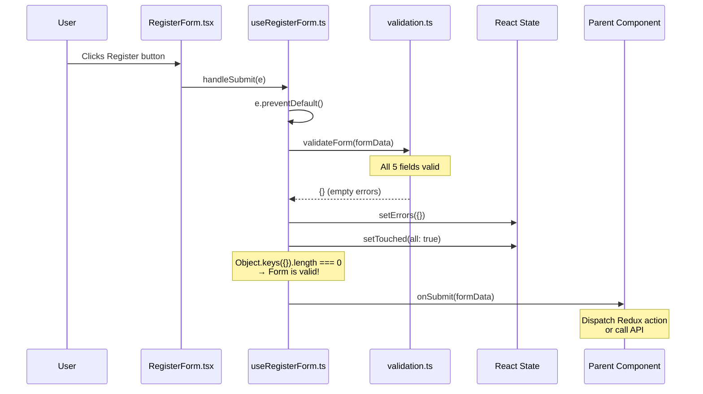
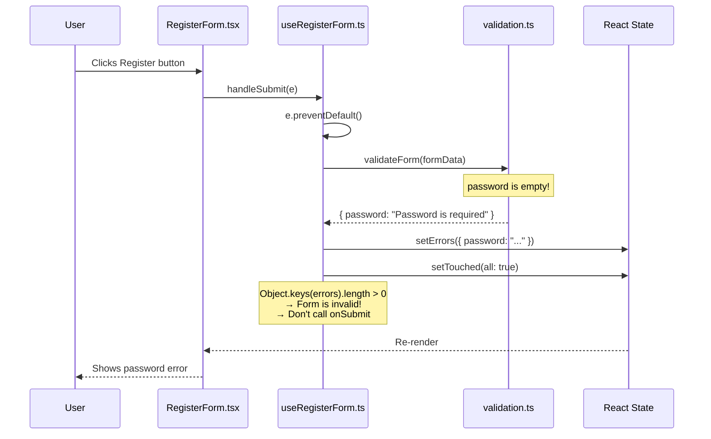
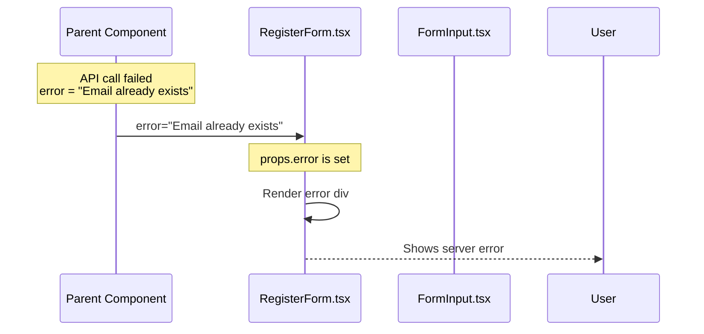

# RegisterForm - Detailed Flow by Use Case

## Use Case Scenarios

1. [User Types in Input Field](#1-user-types-in-input-field)
2. [User Leaves Input Field (Blur)](#2-user-leaves-input-field-blur)
3. [User Submits Form (Valid)](#3-user-submits-form-valid)
4. [User Submits Form (Invalid)](#4-user-submits-form-invalid)
5. [Server Returns Error](#5-server-returns-error)

---

## 1. User Types in Input Field

**Scenario:** User types "Jindo" in the Name input



### File-by-File Flow

| Step | File | Function/Code | What Happens |
|------|------|---------------|--------------|
| 1 | `FormInput.tsx` | `<input onChange={onChange} />` | DOM event captured |
| 2 | `RegisterForm.tsx` | `onChange={handleChange}` | Passes to hook handler |
| 3 | `useRegisterForm.ts` | `handleChange(e)` | Extracts name, value from event |
| 4 | `useRegisterForm.ts` | `setFormData(prev => ({...prev, [name]: value}))` | Updates form state |
| 5 | `useRegisterForm.ts` | `setErrors(prev => ({...prev, [name]: undefined}))` | Clears error for this field |
| 6 | React | Re-render cycle | Component re-renders with new value |
| 7 | `FormInput.tsx` | `value={value}` | Input displays new value |

### Code Trace

```typescript
// 1. FormInput.tsx - Input element
<input
  name={name}           // "name"
  value={value}         // "" → "J"
  onChange={onChange}   // handleChange from hook
/>

// 2. useRegisterForm.ts - Handler
const handleChange = (e: React.ChangeEvent<HTMLInputElement>) => {
  const { name, value } = e.target;  // name="name", value="J"

  // Update form data
  setFormData(prev => ({ ...prev, [name]: value }));
  // { name: "", email: "", ... } → { name: "J", email: "", ... }

  // Clear error when typing
  if (errors[name as keyof ValidationErrors]) {
    setErrors(prev => ({ ...prev, [name]: undefined }));
  }
};
```

---

## 2. User Leaves Input Field (Blur)

**Scenario:** User leaves Email field with value "invalid-email"



### File-by-File Flow

| Step | File | Function/Code | What Happens |
|------|------|---------------|--------------|
| 1 | `FormInput.tsx` | `<input onBlur={onBlur} />` | DOM blur event |
| 2 | `RegisterForm.tsx` | `onBlur={handleBlur}` | Passes to hook handler |
| 3 | `useRegisterForm.ts` | `handleBlur(e)` | Extracts field name |
| 4 | `useRegisterForm.ts` | `setTouched({...prev, [name]: true})` | Marks field as touched |
| 5 | `validation.ts` | `validateField("email", "invalid-email")` | Validates single field |
| 6 | `validation.ts` | `switch(name) case 'email':` | Runs email validation rules |
| 7 | `useRegisterForm.ts` | `setErrors({...prev, [name]: error})` | Sets error message |
| 8 | `RegisterForm.tsx` | `showError('email')` | Checks touched && error |
| 9 | `FormInput.tsx` | `{error && <p>{error}</p>}` | Renders error message |

### Code Trace

```typescript
// 1. FormInput.tsx
<input
  name="email"
  onBlur={onBlur}  // handleBlur from hook
/>

// 2. useRegisterForm.ts
const handleBlur = (e: React.FocusEvent<HTMLInputElement>) => {
  const { name } = e.target;  // "email"

  // Mark as touched
  setTouched(prev => ({ ...prev, [name]: true }));
  // { name: false, email: false, ... } → { name: false, email: true, ... }

  // Validate this field
  const error = validateField(
    name as keyof RegisterFormData,  // "email"
    formData[name as keyof RegisterFormData],  // "invalid-email"
    formData
  );

  if (error) {
    setErrors(prev => ({ ...prev, [name]: error }));
    // { } → { email: "Invalid email format" }
  }
};

// 3. validation.ts
export const validateField = (name, value, formData) => {
  switch (name) {
    case 'email':
      if (!value.trim()) return 'Email is required';
      if (!/^[^\s@]+@[^\s@]+\.[^\s@]+$/.test(value)) {
        return 'Invalid email format';  // ← Returns this
      }
      return undefined;
  }
};

// 4. RegisterForm.tsx
const showError = (field: keyof ValidationErrors) =>
  touched[field] ? errors[field] : undefined;
// touched.email = true, errors.email = "Invalid email format"
// Returns: "Invalid email format"

// 5. FormInput.tsx
{error && (
  <p className="mt-1 text-sm text-red-600">{error}</p>
  // Renders: "Invalid email format"
)}
```

---

## 3. User Submits Form (Valid)

**Scenario:** All fields valid, user clicks Register button



### File-by-File Flow

| Step | File | Function/Code | What Happens |
|------|------|---------------|--------------|
| 1 | `RegisterForm.tsx` | `<form onSubmit={handleSubmit}>` | Form submit event |
| 2 | `useRegisterForm.ts` | `e.preventDefault()` | Prevents page reload |
| 3 | `validation.ts` | `validateForm(formData)` | Validates all fields |
| 4 | `validation.ts` | Returns `{}` | No errors |
| 5 | `useRegisterForm.ts` | `Object.keys({}).length === 0` | Checks if valid |
| 6 | `useRegisterForm.ts` | `onSubmit(formData)` | Calls parent callback |
| 7 | Parent | Receives form data | Handles submission |

### Code Trace

```typescript
// 1. RegisterForm.tsx
<form onSubmit={handleSubmit}>
  {/* ... inputs ... */}
  <button type="submit">Register</button>
</form>

// 2. useRegisterForm.ts
const handleSubmit = (e: React.FormEvent) => {
  e.preventDefault();  // Don't reload page

  // Validate all fields
  const validationErrors = validateForm(formData);
  // formData = { name: "Jindo", email: "j@x.com", ... }

  setErrors(validationErrors);  // {}

  // Mark all as touched
  setTouched({
    name: true,
    email: true,
    username: true,
    password: true,
    confirmPassword: true,
  });

  // Check if valid
  if (Object.keys(validationErrors).length === 0) {
    onSubmit(formData);  // ← Call parent!
  }
};

// 3. validation.ts
export const validateForm = (data: RegisterFormData): ValidationErrors => {
  const errors: ValidationErrors = {};

  // Each field returns undefined (valid)
  const nameError = validateField('name', data.name);
  // undefined - don't add to errors

  const emailError = validateField('email', data.email);
  // undefined - don't add to errors

  // ... all fields valid ...

  return errors;  // {} empty object
};

// 4. Parent Component (future RegisterPage)
<RegisterForm
  onSubmit={(data) => {
    console.log('Form submitted:', data);
    // dispatch(register(data));
  }}
/>
```

---

## 4. User Submits Form (Invalid)

**Scenario:** User submits with empty Password field



### File-by-File Flow

| Step | File | Function/Code | What Happens |
|------|------|---------------|--------------|
| 1 | `RegisterForm.tsx` | `<form onSubmit={handleSubmit}>` | Form submit event |
| 2 | `useRegisterForm.ts` | `validateForm(formData)` | Validates all fields |
| 3 | `validation.ts` | `validateField('password', '')` | Password is empty |
| 4 | `validation.ts` | Returns `"Password is required"` | Error message |
| 5 | `useRegisterForm.ts` | `setErrors({ password: "..." })` | Sets error state |
| 6 | `useRegisterForm.ts` | `setTouched(all: true)` | All fields touched |
| 7 | `useRegisterForm.ts` | `Object.keys(errors).length > 0` | Invalid - skip onSubmit |
| 8 | `FormInput.tsx` | Shows error | Password field shows error |

### Code Trace

```typescript
// useRegisterForm.ts
const handleSubmit = (e: React.FormEvent) => {
  e.preventDefault();

  const validationErrors = validateForm(formData);
  // { password: "Password is required" }

  setErrors(validationErrors);
  setTouched({ /* all true */ });

  // Check if valid
  if (Object.keys(validationErrors).length === 0) {
    // length is 1, not 0
    // This block is SKIPPED!
    onSubmit(formData);
  }
  // Form stays on page with error shown
};
```

---

## 5. Server Returns Error

**Scenario:** Server returns "Email already exists" error



### File-by-File Flow

| Step | File | Function/Code | What Happens |
|------|------|---------------|--------------|
| 1 | Parent | API call fails | Gets error from server |
| 2 | Parent | Sets error state | `error = "Email already exists"` |
| 3 | `RegisterForm.tsx` | `error` prop | Receives error |
| 4 | `RegisterForm.tsx` | `{error && <div>...</div>}` | Renders error message |

### Code Trace

```typescript
// Parent Component
const [error, setError] = useState<string | null>(null);

const handleSubmit = async (data: RegisterFormData) => {
  try {
    await api.register(data);
  } catch (e) {
    setError("Email already exists");  // From server
  }
};

<RegisterForm
  onSubmit={handleSubmit}
  error={error}  // ← Passed as prop
/>

// RegisterForm.tsx
export const RegisterForm = ({ onSubmit, loading, error }: RegisterFormProps) => {
  return (
    <form>
      {/* Server error message */}
      {error && (
        <div className="mb-4 p-3 bg-red-50 border border-red-200 rounded text-red-700">
          {error}
        </div>
      )}
      {/* ... rest of form ... */}
    </form>
  );
};
```

---

## Summary: File Responsibilities in Each Flow

| File | Typing | Blur | Submit Valid | Submit Invalid | Server Error |
|------|--------|------|--------------|----------------|--------------|
| `FormInput.tsx` | Captures event | Captures event | - | Shows error | - |
| `RegisterForm.tsx` | Passes to hook | Passes to hook | Triggers submit | Shows errors | Shows error |
| `useRegisterForm.ts` | Updates state | Validates field | Validates all, calls onSubmit | Validates all, sets errors | - |
| `validation.ts` | - | Single field | All fields | All fields | - |
| `types.ts` | Type safety | Type safety | Type safety | Type safety | Type safety |
| Parent | - | - | Receives data | - | Passes error |
