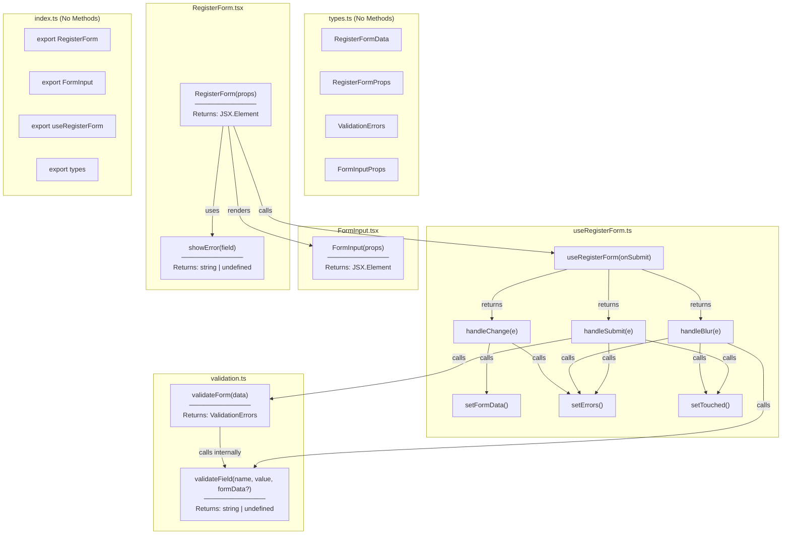
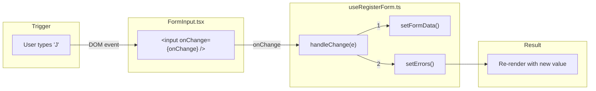
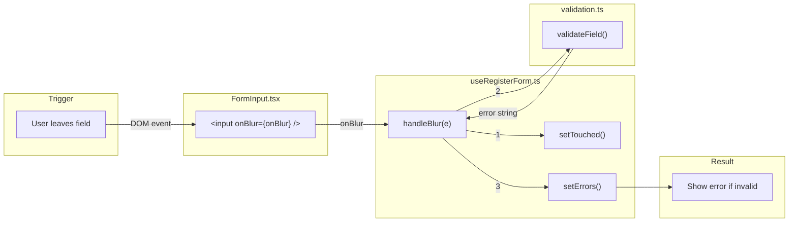
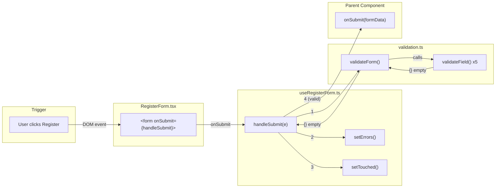
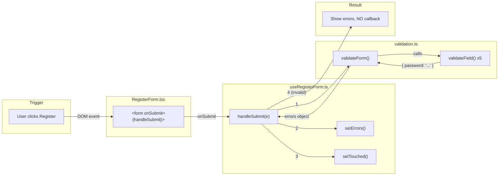
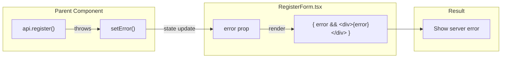
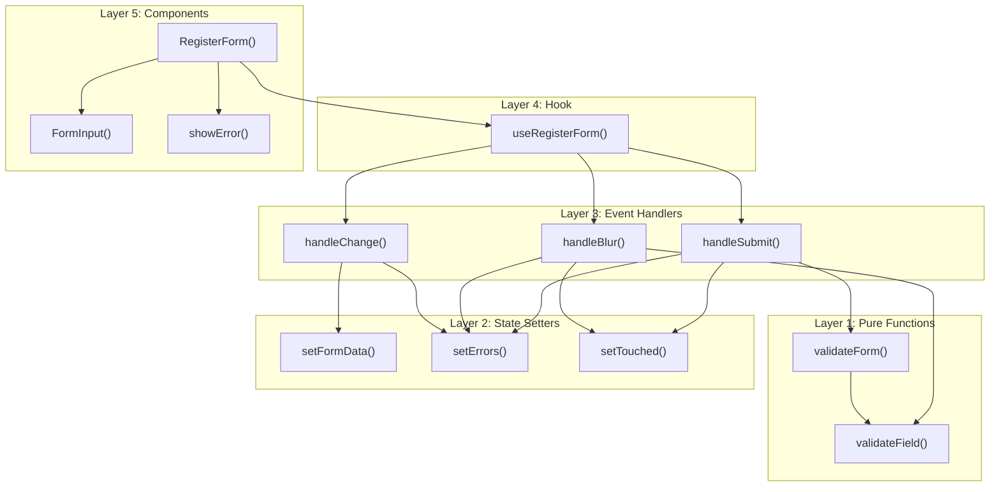

# RegisterForm - Method Connections

## Complete Method Map by File

---

## Use Case 1: User Types in Input

**Method Chain:** `onChange` → `handleChange()` → `setFormData()` → `setErrors()`

---

## Use Case 2: User Leaves Input (Blur)

**Method Chain:** `onBlur` → `handleBlur()` → `setTouched()` → `validateField()` → `setErrors()`

---

## Use Case 3: User Submits Form (Valid)

**Method Chain:** `onSubmit` → `handleSubmit()` → `validateForm()` → `validateField()` x5 → `setErrors()` → `setTouched()` → `onSubmit(callback)`

---

## Use Case 4: User Submits Form (Invalid)

**Method Chain:** `onSubmit` → `handleSubmit()` → `validateForm()` → `validateField()` x5 → `setErrors()` → `setTouched()` → **STOP**

---

## Use Case 5: Server Returns Error

**Method Chain:** `api.register()` → `catch` → `setError()` → `error prop` → JSX render

---

## Method Dependency Graph

---

## Summary: Methods per File

| File | Methods | Called By | Calls |
|------|---------|-----------|-------|
| `types.ts` | (none - types only) | - | - |
| `validation.ts` | `validateField()`, `validateForm()` | useRegisterForm | - |
| `useRegisterForm.ts` | `handleChange()`, `handleBlur()`, `handleSubmit()` | RegisterForm | validation, setState |
| `FormInput.tsx` | `FormInput()` | RegisterForm | - |
| `RegisterForm.tsx` | `RegisterForm()`, `showError()` | Parent | useRegisterForm, FormInput |
| `index.ts` | (none - exports only) | - | - |
