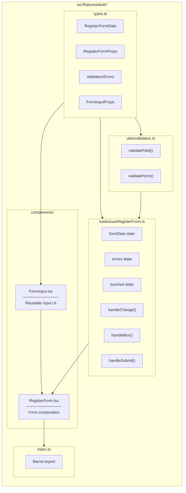
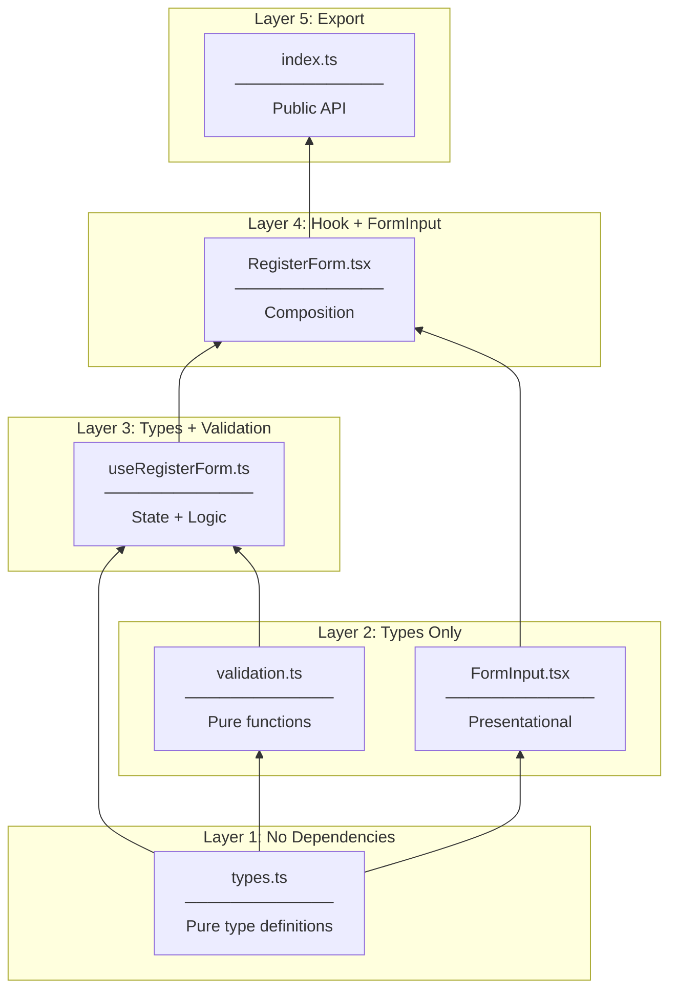
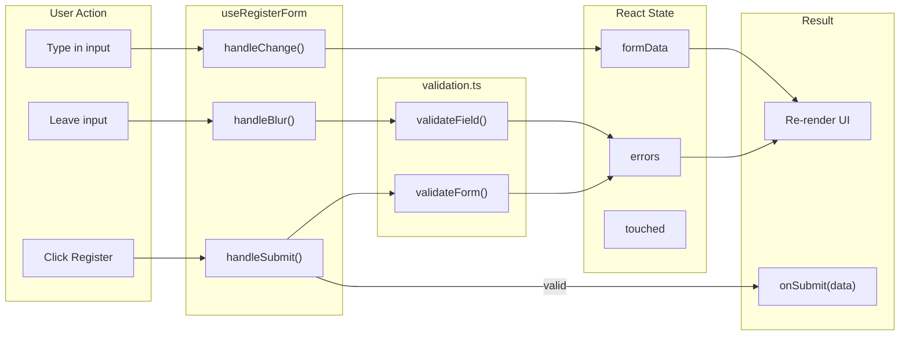
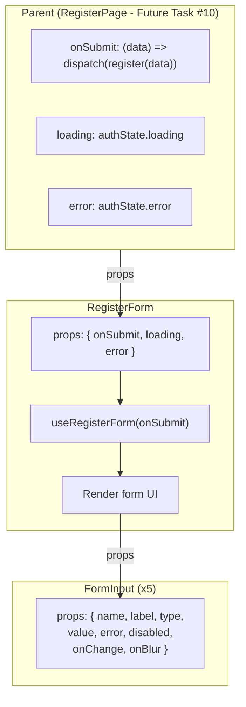
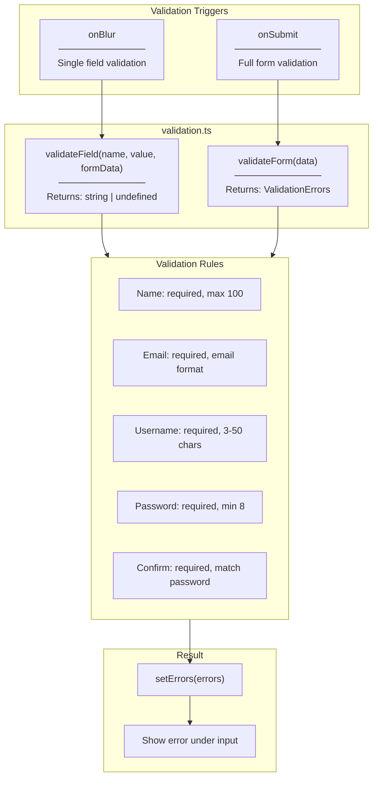
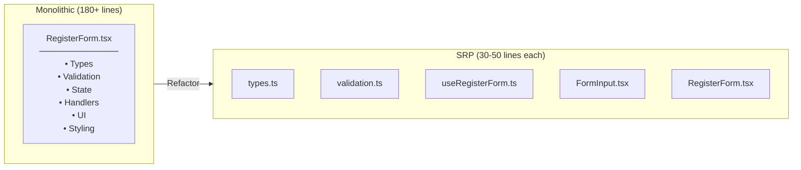

# RegisterForm - Architecture Diagram

## File Structure

```
src/features/auth/
├── components/
│   ├── FormInput.tsx         ← Reusable input UI
│   └── RegisterForm.tsx      ← Form composition
├── hooks/
│   └── useRegisterForm.ts    ← State management
├── utils/
│   └── validation.ts         ← Validation logic
├── types.ts                  ← Type definitions
└── index.ts                  ← Barrel export
```

---

## Component Architecture



---

## Dependency Flow (Bottom-Up)



---

## Data Flow



---

## Component Composition

```mermaid
flowchart TB
    subgraph REGISTERFORM["RegisterForm.tsx"]
        direction TB

        subgraph HOOK_CALL["useRegisterForm(onSubmit)"]
            Returns["returns: formData, errors, touched,<br/>handleChange, handleBlur, handleSubmit"]
        end

        subgraph JSX["JSX Structure"]
            Form["<form onSubmit={handleSubmit}>"]

            subgraph INPUTS["FormInput Components"]
                I1["<FormInput name='name' ... />"]
                I2["<FormInput name='email' ... />"]
                I3["<FormInput name='username' ... />"]
                I4["<FormInput name='password' ... />"]
                I5["<FormInput name='confirmPassword' ... />"]
            end

            Button["<button type='submit'>Register</button>"]
        end
    end

    HOOK_CALL --> JSX
    Form --> INPUTS --> Button
```



---

## Props Flow



---

## Validation Flow



---

## File Responsibilities (SRP)

| File | Single Responsibility |
|------|----------------------|
| `types.ts` | Type definitions only |
| `validation.ts` | Validation rules only (pure functions) |
| `useRegisterForm.ts` | Form state management only |
| `FormInput.tsx` | Input UI rendering only |
| `RegisterForm.tsx` | Form composition only |
| `index.ts` | Public API export only |

---

## Comparison: Monolithic vs SRP



| Aspect | Monolithic | SRP |
|--------|------------|-----|
| Lines per file | 180+ | 30-50 |
| Testability | Hard | Easy |
| Reusability | Copy-paste | Import |
| Readability | Scroll a lot | Clear focus |
| Maintenance | One change affects all | Isolated changes |
