# RegisterForm - Design Patterns & SOLID Principles

## SOLID Principles Applied

### S - Single Responsibility Principle

Each file has **one reason to change**:

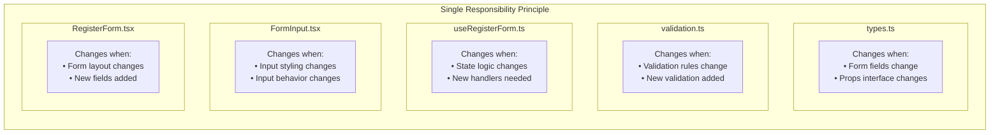

**Comparison:**

| File | Responsibility | Lines | Reason to Change |
|------|----------------|-------|------------------|
| `types.ts` | Type definitions | ~30 | Data structure changes |
| `validation.ts` | Validation rules | ~50 | Business rules change |
| `useRegisterForm.ts` | State management | ~50 | Form logic changes |
| `FormInput.tsx` | Input UI | ~40 | UI styling changes |
| `RegisterForm.tsx` | Composition | ~50 | Form layout changes |

**Benefit:** Change validation rules? Only touch `validation.ts`. Change input styling? Only touch `FormInput.tsx`.

---

### O - Open/Closed Principle

**Open for extension, closed for modification.**

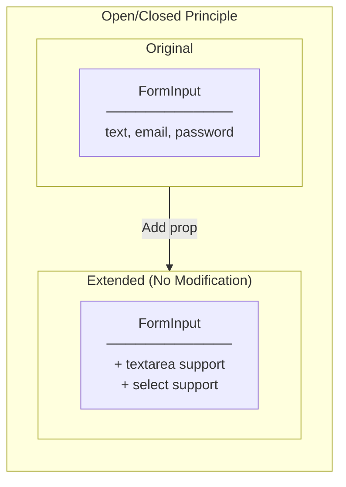

**Example: Adding Textarea Support**

```typescript
// FormInput.tsx - BEFORE (closed for modification)
export interface FormInputProps {
  type?: 'text' | 'email' | 'password';
  // ...
}

// FormInput.tsx - AFTER (extended, not modified)
export interface FormInputProps {
  type?: 'text' | 'email' | 'password' | 'textarea';
  // ...
}

// Component handles new type without breaking existing usage
{type === 'textarea' ? (
  <textarea {...props} />
) : (
  <input type={type} {...props} />
)}
```

---

### L - Liskov Substitution Principle

**Subtypes must be substitutable for their base types.**

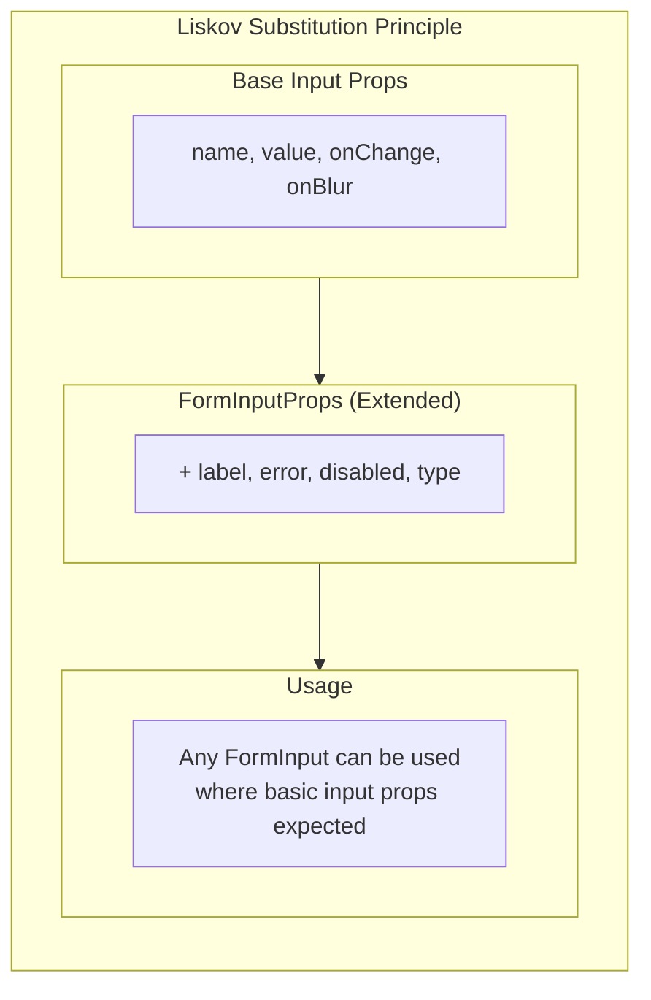

**In Our Code:**

```typescript
// FormInputProps extends standard input behavior
interface FormInputProps {
  // Standard input props (LSP compliant)
  name: string;
  value: string;
  onChange: (e: React.ChangeEvent<HTMLInputElement>) => void;
  onBlur: (e: React.FocusEvent<HTMLInputElement>) => void;

  // Extended props
  label: string;
  error?: string;
}

// FormInput behaves like a standard input + extra features
// Can be used anywhere a standard input is expected
```

---

### I - Interface Segregation Principle

**Clients should not depend on interfaces they don't use.**

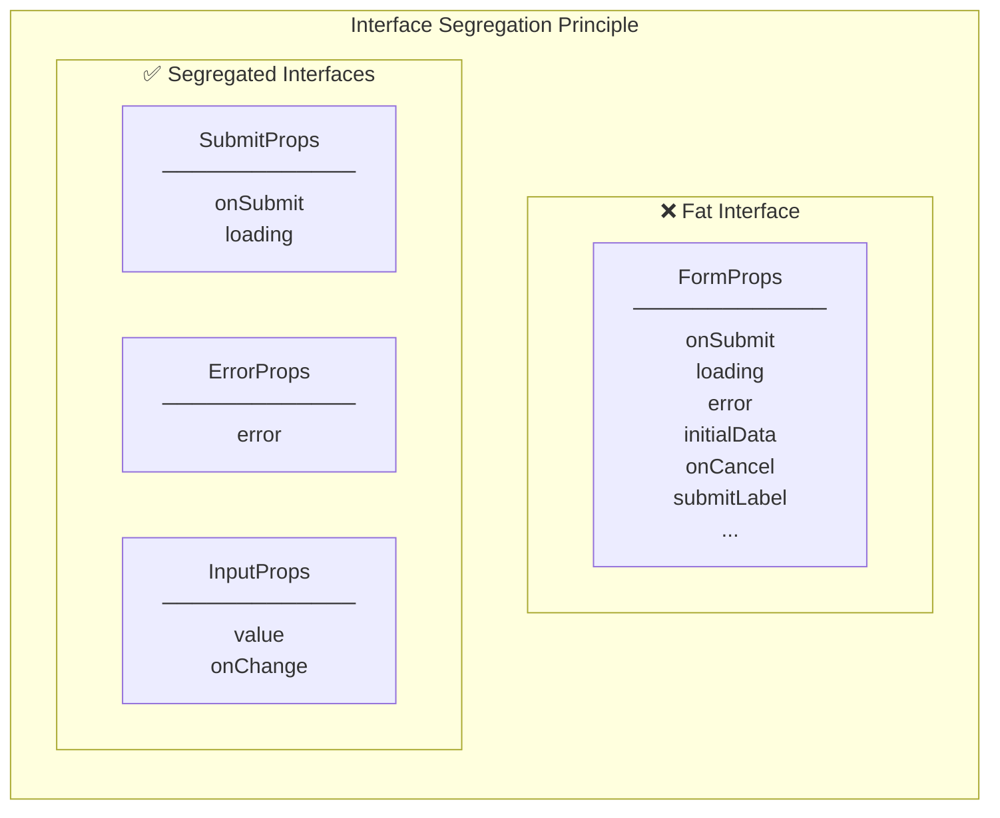

**In Our Code:**

```typescript
// ✅ Segregated - FormInput only needs what it uses
interface FormInputProps {
  name: string;
  label: string;
  type?: 'text' | 'email' | 'password';
  value: string;
  error?: string;
  disabled?: boolean;
  onChange: (e: React.ChangeEvent<HTMLInputElement>) => void;
  onBlur: (e: React.FocusEvent<HTMLInputElement>) => void;
}

// ✅ Segregated - RegisterForm only needs what it uses
interface RegisterFormProps {
  onSubmit: (data: RegisterFormData) => void;
  loading?: boolean;
  error?: string | null;
}

// Each interface is focused on its specific need
```

---

### D - Dependency Inversion Principle

**Depend on abstractions, not concretions.**

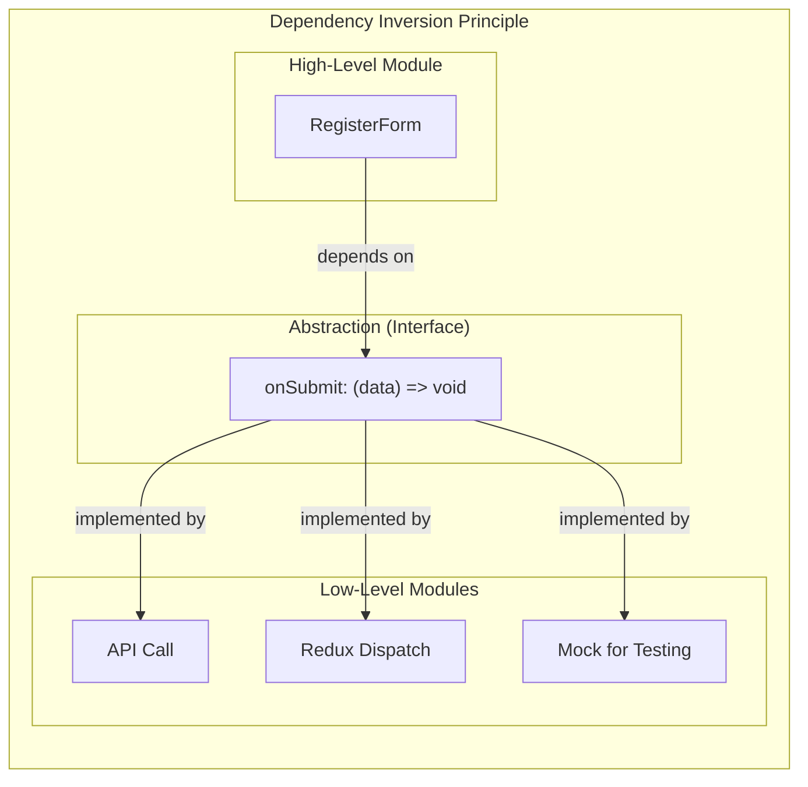

**In Our Code:**

```typescript
// RegisterForm depends on abstraction (callback interface)
interface RegisterFormProps {
  onSubmit: (data: RegisterFormData) => void;  // Abstraction
}

// Parent provides concrete implementation
// Option 1: API call
<RegisterForm onSubmit={(data) => api.register(data)} />

// Option 2: Redux dispatch
<RegisterForm onSubmit={(data) => dispatch(register(data))} />

// Option 3: Mock for testing
<RegisterForm onSubmit={(data) => console.log(data)} />
```

**Benefit:** RegisterForm doesn't know or care HOW data is submitted. It just calls `onSubmit`.

---

## Design Patterns Applied

### 1. Container/Presentational Pattern

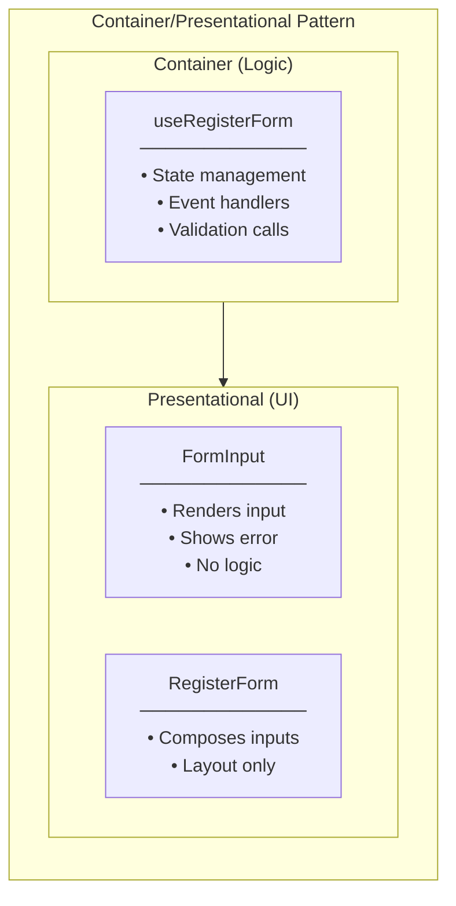

| Aspect | Container (useRegisterForm) | Presentational (FormInput) |
|--------|----------------------------|---------------------------|
| Contains | State, Logic | JSX, Styles |
| Knows about | Business rules | How to render |
| Data source | Creates state | Props only |
| Side effects | Yes (validation) | No |

---

### 2. Custom Hook Pattern

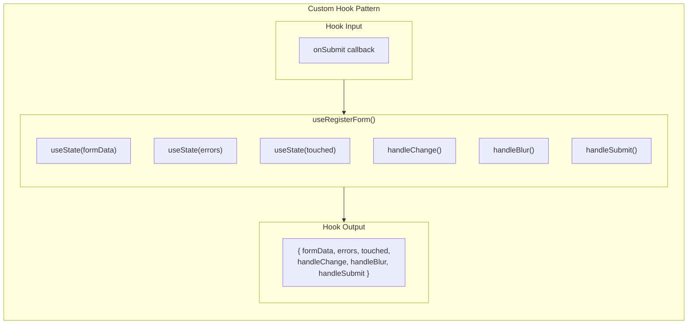

**Benefits:**
- Encapsulates all stateful logic
- Reusable across components
- Testable in isolation
- Separates concerns

---

### 3. Controlled Component Pattern

```mermaid
flowchart LR
    subgraph CONTROLLED["Controlled Component Pattern"]
        direction TB

        subgraph STATE["React State"]
            S["formData.name = 'J'"]
        end

        subgraph INPUT["Input Element"]
            I["<input value={formData.name} />"]
        end

        subgraph HANDLER["Event Handler"]
            H["handleChange → setFormData"]
        end

        STATE -->|"value"| INPUT
        INPUT -->|"onChange"| HANDLER
        HANDLER -->|"updates"| STATE
    end
```

**Uncontrolled vs Controlled:**

| Aspect | Uncontrolled | Controlled (Our Approach) |
|--------|--------------|--------------------------|
| Data source | DOM | React state |
| Get value | `ref.current.value` | `formData.name` |
| Validation | On submit only | On change/blur |
| Predictability | Low | High |

---

### 4. Composition Pattern

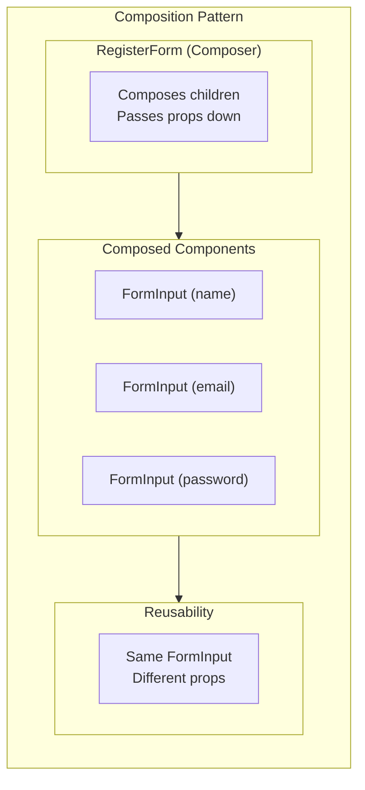

**In Our Code:**

```tsx
// RegisterForm COMPOSES multiple FormInputs
<form onSubmit={handleSubmit}>
  <FormInput name="name" label="Name" {...} />
  <FormInput name="email" label="Email" type="email" {...} />
  <FormInput name="password" label="Password" type="password" {...} />
</form>

// vs Inheritance (not used)
class NameInput extends FormInput {}
class EmailInput extends FormInput {}
```

---

### 5. Props Drilling vs Context (Trade-off)

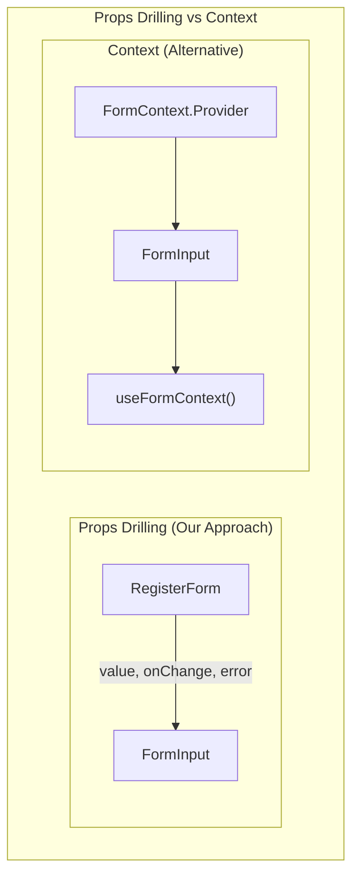

**Why Props Drilling for This Case:**
- Only 1 level deep (RegisterForm → FormInput)
- Explicit data flow (easy to trace)
- No unnecessary complexity
- Context would be overkill

**When to use Context:**
- Deep nesting (3+ levels)
- Many components need same data
- Avoid prop drilling through intermediary components

---

## Pattern Summary

| Pattern | Where Applied | Purpose |
|---------|---------------|---------|
| Single Responsibility | All files | One reason to change per file |
| Open/Closed | FormInput | Extensible without modification |
| Dependency Inversion | onSubmit prop | Depend on abstraction |
| Container/Presentational | Hook + Components | Separate logic from UI |
| Custom Hook | useRegisterForm | Encapsulate state logic |
| Controlled Component | FormInput | React controls input value |
| Composition | RegisterForm | Build from smaller pieces |

---

## Anti-Patterns Avoided

### 1. God Component (Avoided)

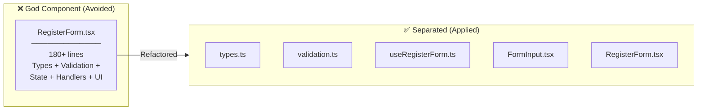

### 2. Prop Mutation (Avoided)

```typescript
// ❌ Bad: Mutating props
const handleChange = (e) => {
  props.formData.name = e.target.value;  // NEVER DO THIS
};

// ✅ Good: Immutable update
const handleChange = (e) => {
  setFormData(prev => ({ ...prev, [name]: value }));
};
```

### 3. Business Logic in UI (Avoided)

```typescript
// ❌ Bad: Validation in JSX
<input
  onChange={(e) => {
    if (e.target.value.length < 8) {
      setError('Too short');
    }
  }}
/>

// ✅ Good: Validation in separate function
// validation.ts
export const validateField = (name, value) => {
  if (name === 'password' && value.length < 8) {
    return 'Password must be at least 8 characters';
  }
};
```
