# RegisterForm - Programming Concepts

## React Concepts

### 1. useState Hook

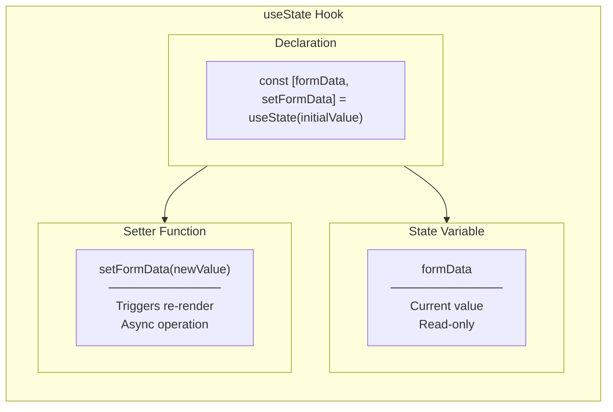

**In Our Code:**

```typescript
// Three separate state pieces
const [formData, setFormData] = useState<RegisterFormData>({
  name: '',
  email: '',
  username: '',
  password: '',
  confirmPassword: '',
});

const [errors, setErrors] = useState<ValidationErrors>({});

const [touched, setTouched] = useState<Record<string, boolean>>({});
```

**Why Three States (Not One)?**

| Approach | Code | Pros | Cons |
|----------|------|------|------|
| Combined | `useState({ formData, errors, touched })` | Single update | Complex updates, harder to read |
| Separated | Three `useState` | Clear purpose, simple updates | More declarations |

---

### 2. Event Handling

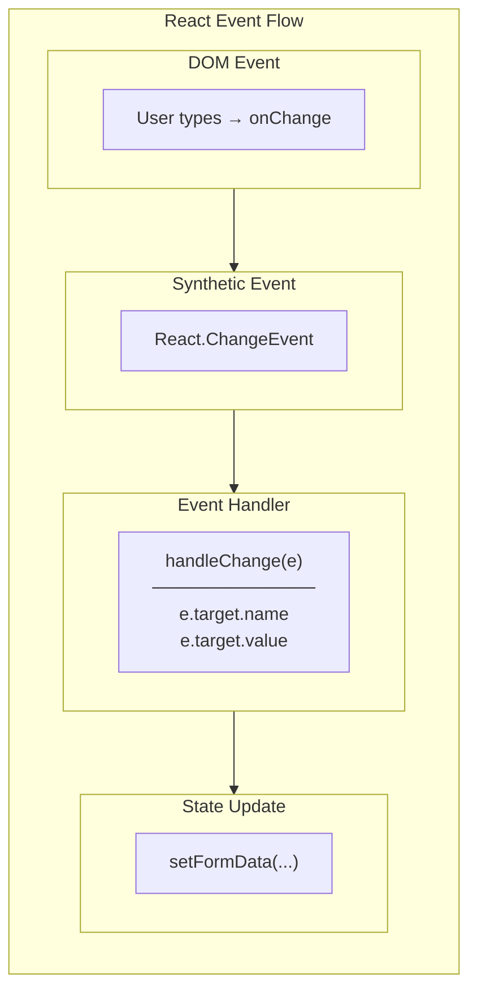

**Event Types Used:**

| Event | Type | Trigger |
|-------|------|---------|
| `onChange` | `React.ChangeEvent<HTMLInputElement>` | User types |
| `onBlur` | `React.FocusEvent<HTMLInputElement>` | User leaves field |
| `onSubmit` | `React.FormEvent` | Form submitted |

**Code Example:**

```typescript
// Type-safe event handling
const handleChange = (e: React.ChangeEvent<HTMLInputElement>) => {
  const { name, value } = e.target;  // Destructure
  setFormData(prev => ({ ...prev, [name]: value }));
};

// Prevent default form behavior
const handleSubmit = (e: React.FormEvent) => {
  e.preventDefault();  // Stop page reload
  // ... validation and submission
};
```

---

### 3. Controlled vs Uncontrolled Components

```mermaid
flowchart TB
    subgraph COMPARISON["Controlled vs Uncontrolled"]
        direction LR

        subgraph CONTROLLED["Controlled (Our Approach)"]
            direction TB
            C1["React State is Source of Truth"]
            C2["<input value={state} />"]
            C3["onChange updates state"]
            C1 --> C2 --> C3
        end

        subgraph UNCONTROLLED["Uncontrolled"]
            direction TB
            U1["DOM is Source of Truth"]
            U2["<input ref={inputRef} />"]
            U3["Read value on submit"]
            U1 --> U2 --> U3
        end
    end
```

**Why Controlled?**

```typescript
// ✅ Controlled - React controls value
<input
  value={formData.name}      // State → Input
  onChange={handleChange}     // Input → State
/>

// Benefits:
// 1. Instant validation possible
// 2. Can transform input (uppercase, format)
// 3. Can prevent certain characters
// 4. Single source of truth

// ❌ Uncontrolled - DOM controls value
const inputRef = useRef();
<input ref={inputRef} />
// Get value: inputRef.current.value
```

---

### 4. Custom Hooks

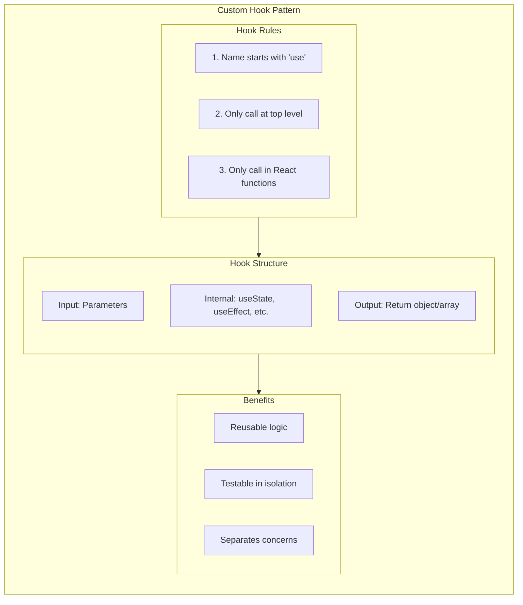

**Our Custom Hook:**

```typescript
// hooks/useRegisterForm.ts
export const useRegisterForm = (onSubmit: (data: RegisterFormData) => void) => {
  // Internal state (encapsulated)
  const [formData, setFormData] = useState<RegisterFormData>({...});
  const [errors, setErrors] = useState<ValidationErrors>({});
  const [touched, setTouched] = useState<Record<string, boolean>>({});

  // Internal handlers (encapsulated)
  const handleChange = (e: React.ChangeEvent<HTMLInputElement>) => {...};
  const handleBlur = (e: React.FocusEvent<HTMLInputElement>) => {...};
  const handleSubmit = (e: React.FormEvent) => {...};

  // Public API (what component can access)
  return {
    formData,
    errors,
    touched,
    handleChange,
    handleBlur,
    handleSubmit,
  };
};
```

---

## TypeScript Concepts

### 1. Interface vs Type

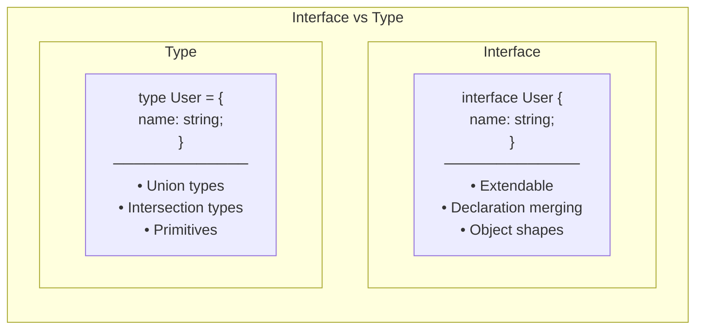

**Our Choice: Interface**

```typescript
// ✅ Using Interface (our approach)
export interface RegisterFormData {
  name: string;
  email: string;
  username: string;
  password: string;
  confirmPassword: string;
}

// Why interface?
// 1. Describing object shapes (form data)
// 2. Can be extended later if needed
// 3. Better error messages
// 4. Industry convention for object types
```

---

### 2. Generic Types

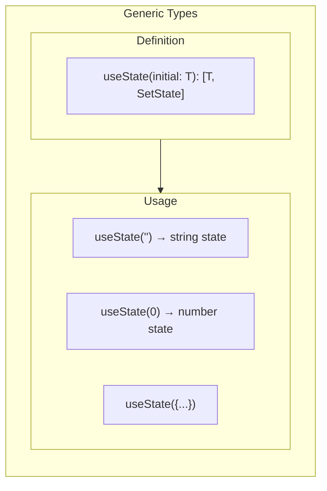

**In Our Code:**

```typescript
// Generic with our custom type
const [formData, setFormData] = useState<RegisterFormData>({
  name: '',
  email: '',
  // TypeScript knows these must be strings
});

// Generic with Record utility type
const [touched, setTouched] = useState<Record<string, boolean>>({});
// Record<K, V> = { [key: K]: V }
// So: { [key: string]: boolean }
```

---

### 3. keyof Operator

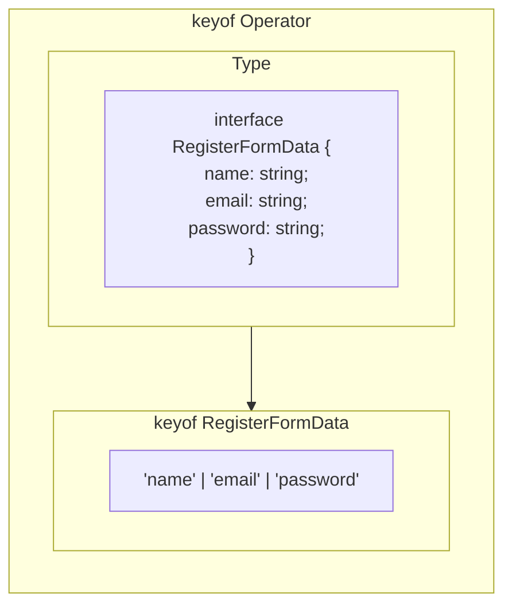

**In Our Code:**

```typescript
// validation.ts
export const validateField = (
  name: keyof RegisterFormData,  // Only 'name' | 'email' | 'username' | 'password' | 'confirmPassword'
  value: string,
  formData?: RegisterFormData
): string | undefined => {
  // TypeScript ensures 'name' is a valid field
};

// Usage
validateField('name', 'Jindo');       // ✅ OK
validateField('invalid', 'value');    // ❌ Error: 'invalid' is not a key
```

---

### 4. Optional Properties

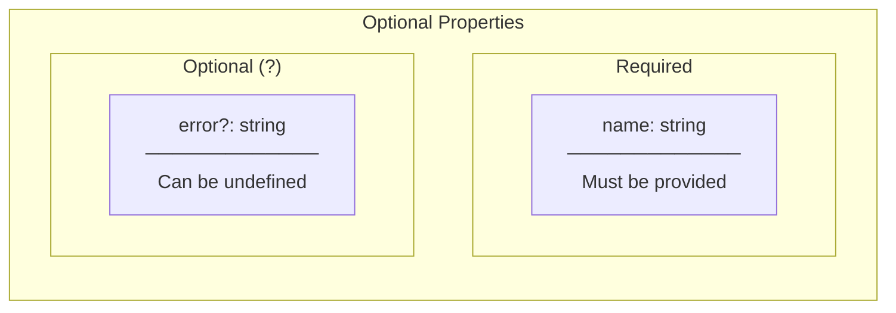

**In Our Code:**

```typescript
export interface FormInputProps {
  // Required - must provide
  name: string;
  label: string;
  value: string;
  onChange: (e: React.ChangeEvent<HTMLInputElement>) => void;
  onBlur: (e: React.FocusEvent<HTMLInputElement>) => void;

  // Optional - can omit
  type?: 'text' | 'email' | 'password';  // Defaults to 'text'
  error?: string;                         // May not have error
  disabled?: boolean;                     // Defaults to false
}

// Usage
<FormInput
  name="email"           // Required
  label="Email"          // Required
  value={formData.email} // Required
  onChange={handleChange} // Required
  onBlur={handleBlur}    // Required
  // type, error, disabled are optional
/>
```

---

### 5. Union Types

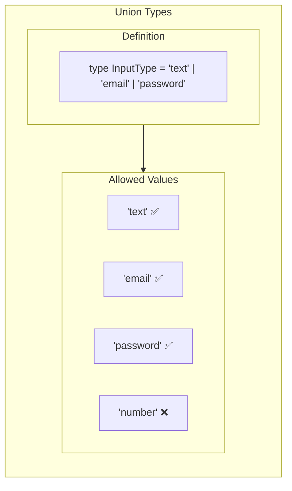

**In Our Code:**

```typescript
export interface FormInputProps {
  type?: 'text' | 'email' | 'password';  // Union type
  // ...
}

// TypeScript enforces valid values
<FormInput type="email" />     // ✅ OK
<FormInput type="password" />  // ✅ OK
<FormInput type="number" />    // ❌ Error
```

---

## JavaScript Concepts

### 1. Spread Operator

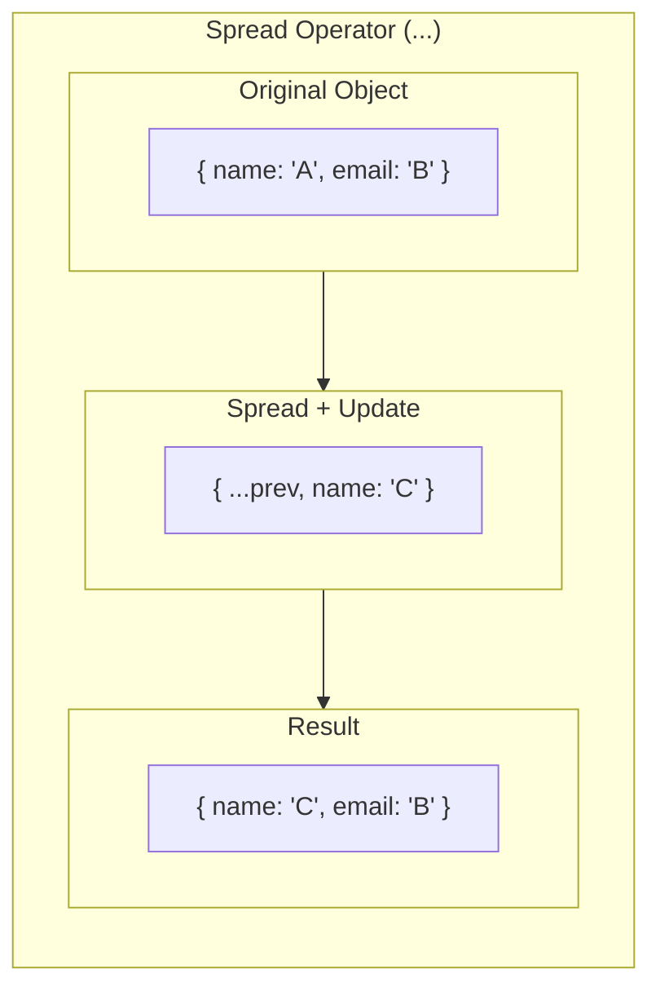

**In Our Code:**

```typescript
// Immutable state update
setFormData(prev => ({
  ...prev,           // Copy all existing properties
  [name]: value      // Override specific property
}));

// Example:
// prev = { name: 'John', email: 'j@x.com', ... }
// name = 'name', value = 'Jane'
// result = { name: 'Jane', email: 'j@x.com', ... }
```

---

### 2. Computed Property Names

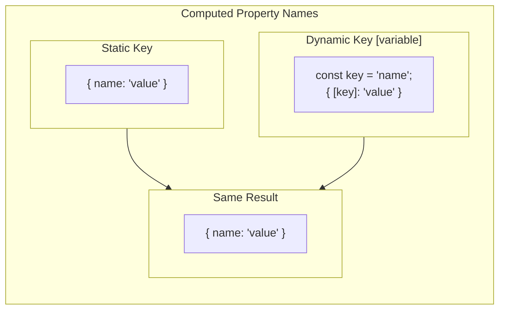

**In Our Code:**

```typescript
const handleChange = (e: React.ChangeEvent<HTMLInputElement>) => {
  const { name, value } = e.target;
  // name could be 'name', 'email', 'password', etc.

  setFormData(prev => ({
    ...prev,
    [name]: value  // [name] is computed property
  }));

  // If name = 'email' and value = 'test@x.com'
  // Result: { ...prev, email: 'test@x.com' }
};
```

---

### 3. Short-Circuit Evaluation

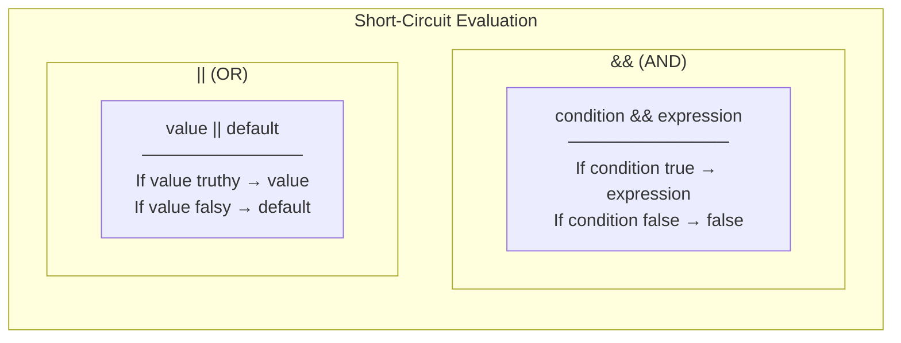

**In Our Code:**

```typescript
// In FormInput.tsx - Conditional rendering
{error && (
  <p className="text-red-600">{error}</p>
)}
// If error exists → render <p>
// If error undefined → render nothing

// In RegisterForm.tsx - Server error
{error && (
  <div className="bg-red-50">{error}</div>
)}
```

---

### 4. Destructuring

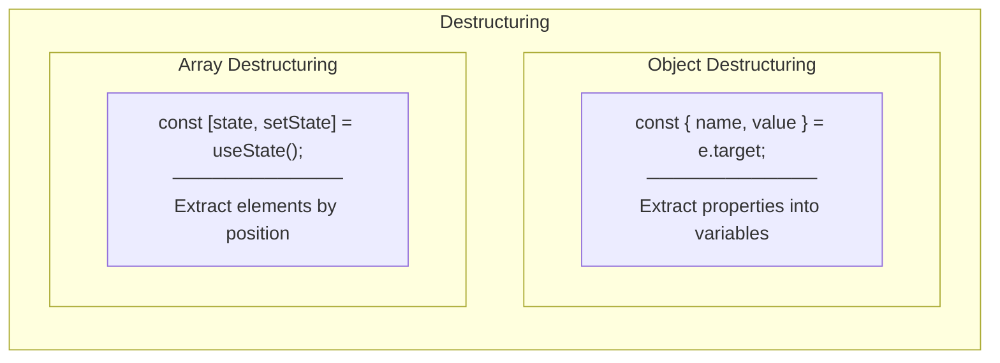

**In Our Code:**

```typescript
// Object destructuring - event target
const handleChange = (e: React.ChangeEvent<HTMLInputElement>) => {
  const { name, value } = e.target;
  // Instead of: e.target.name, e.target.value
};

// Object destructuring - props
export const FormInput = ({
  name,
  label,
  type = 'text',
  value,
  error,
  disabled,
  onChange,
  onBlur,
}: FormInputProps) => {
  // All props available as variables
};

// Array destructuring - useState
const [formData, setFormData] = useState<RegisterFormData>({...});
// First element: current state
// Second element: setter function
```

---

### 5. Arrow Functions

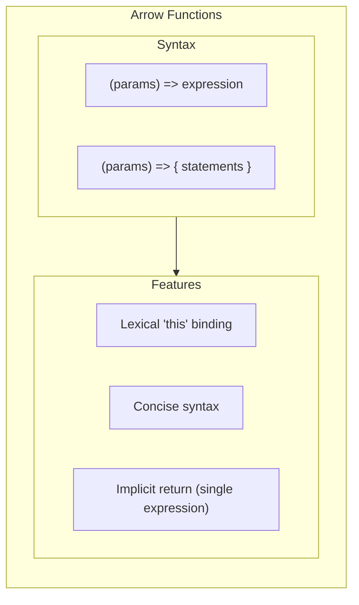

**In Our Code:**

```typescript
// Concise arrow function
const showError = (field: keyof ValidationErrors) =>
  touched[field] ? errors[field] : undefined;

// Arrow function with body
const handleSubmit = (e: React.FormEvent) => {
  e.preventDefault();
  const validationErrors = validateForm(formData);
  // ...
};

// Callback arrow functions
setFormData(prev => ({ ...prev, [name]: value }));
//         ^^^^ Arrow function as callback
```

---

## Concept Summary Table

| Category | Concept | Where Used | Purpose |
|----------|---------|------------|---------|
| React | useState | useRegisterForm | State management |
| React | Event Handling | handleChange, handleBlur | User interaction |
| React | Controlled Component | FormInput | Single source of truth |
| React | Custom Hook | useRegisterForm | Reusable logic |
| TypeScript | Interface | types.ts | Object shape definition |
| TypeScript | Generic | useState<T> | Type-safe state |
| TypeScript | keyof | validateField | Type-safe property access |
| TypeScript | Optional (?) | FormInputProps | Optional props |
| TypeScript | Union | type prop | Restricted values |
| JavaScript | Spread (...) | State updates | Immutable updates |
| JavaScript | Computed Property | [name]: value | Dynamic keys |
| JavaScript | Short-circuit | {error && ...} | Conditional render |
| JavaScript | Destructuring | Props, events | Clean extraction |
| JavaScript | Arrow Functions | All handlers | Concise syntax |
