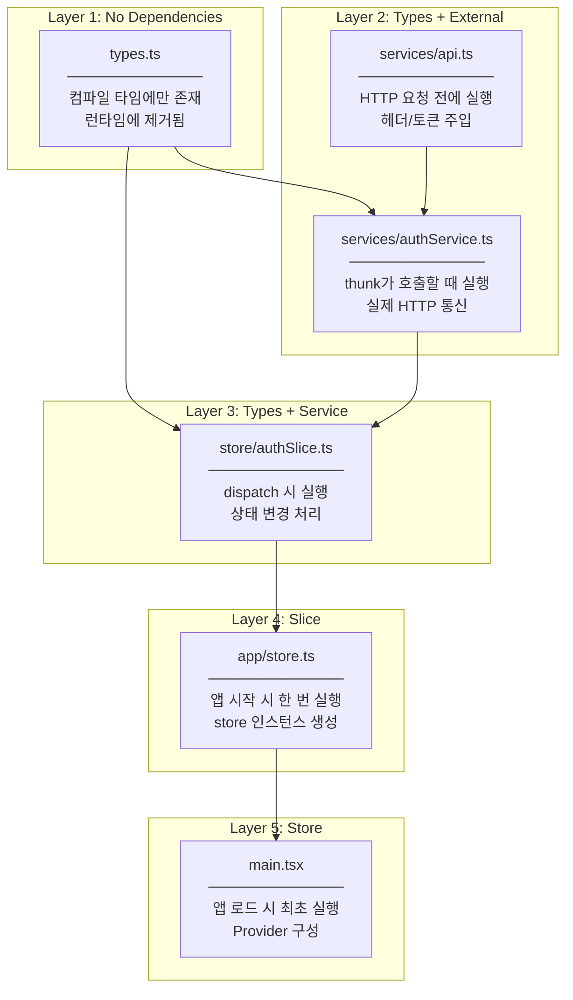

# authSlice Implementation Plan

## Overview

Task #9: Implement Redux Toolkit slice for authentication state management, including the register async thunk.

**GitHub Issue:** #9

---

## Why Redux for Auth State?

| Problem | Without Redux | With Redux |
|---------|--------------|------------|
| Auth state sharing | Props drilling through many components | Any component can access `state.auth` |
| Login status check | Pass `isAuthenticated` as prop everywhere | `useSelector(state => state.auth.isAuthenticated)` |
| After registration | Complex callback chains | Dispatch action, state updates automatically |
| Token management | Manual sync between localStorage and components | Centralized in slice, single source of truth |

---

## File Structure (SRP-based)

```
src/
├── app/
│   └── store.ts                    ← Redux store configuration
├── services/
│   └── api.ts                      ← Axios instance (base config)
├── features/auth/
│   ├── services/
│   │   └── authService.ts          ← Auth API calls
│   ├── store/
│   │   └── authSlice.ts            ← Redux slice
│   ├── types.ts                    ← + User, AuthState types
│   └── index.ts                    ← + exports
└── main.tsx                        ← + Provider wrapper
```

---

## File Responsibilities (SRP)

### types.ts

| Aspect | Description |
|--------|-------------|
| **Responsibility** | Auth 도메인의 타입 정의 |
| **Logic 관점** | 데이터 구조의 계약(contract) 정의 - User가 어떤 필드를 가지는지, API 응답이 어떤 형태인지 |
| **Runtime 관점** | 실행 시점에는 존재하지 않음 (컴파일 타임에만 사용, JavaScript로 변환 시 제거됨) |
| **Changes when** | Backend API 응답 구조 변경, User 필드 추가/제거 |
| **Does NOT do** | 로직 실행, API 호출, 상태 관리 |

**Why separate?** TypeScript 타입은 "이 데이터는 이런 모양이어야 한다"는 계약입니다. Backend에서 응답 형식이 바뀌면 이 파일만 수정하면 됩니다.

---

### services/api.ts

| Aspect | Description |
|--------|-------------|
| **Responsibility** | 모든 HTTP 요청의 공통 설정 |
| **Logic 관점** | "어디로(baseURL), 어떻게(headers), 무엇을 붙여서(token) 요청할지" 결정 |
| **Runtime 관점** | 매 API 호출 전에 실행되어 요청을 가공함. Token이 있으면 Authorization 헤더에 붙임 |
| **Changes when** | API 서버 URL 변경, 인증 헤더 방식 변경, 공통 에러 처리 추가 |
| **Does NOT do** | 특정 엔드포인트 호출, 비즈니스 로직 |

**Why at `src/services/`?** Auth뿐 아니라 Task, User 등 모든 feature가 이 axios instance를 공유합니다. App-wide 인프라입니다.

---

### services/authService.ts

| Aspect | Description |
|--------|-------------|
| **Responsibility** | Auth 관련 API 엔드포인트 호출 |
| **Logic 관점** | "register는 POST /api/auth/register로 이 데이터를 보낸다"는 것만 알고 있음 |
| **Runtime 관점** | authSlice의 thunk가 호출하면 실제 HTTP 요청을 보내고 응답을 반환 |
| **Changes when** | Auth API 엔드포인트 변경, 새 인증 방식 추가 (Google OAuth) |
| **Does NOT do** | 상태 관리, 에러 처리 정책 결정, localStorage 조작 |

**Why separate from authSlice?**
- Slice는 "상태를 어떻게 바꿀지" 담당
- Service는 "서버와 어떻게 통신할지" 담당
- 테스트 시 Service를 mock하면 Slice를 독립적으로 테스트 가능

---

### store/authSlice.ts

| Aspect | Description |
|--------|-------------|
| **Responsibility** | Auth 상태의 생명주기 관리 |
| **Logic 관점** | "register 요청 중이면 loading=true, 성공하면 user 저장, 실패하면 error 저장" |
| **Runtime 관점** | Component가 dispatch(register(data))하면 → pending/fulfilled/rejected 순으로 상태 변경 → 구독 중인 모든 component가 re-render |
| **Changes when** | 상태 구조 변경, 새 액션 추가 (login, logout), 상태 업데이트 로직 변경 |
| **Does NOT do** | API 호출 구현, UI 렌더링 |

**Thunk의 역할:**
1. `register.pending` → "요청 시작됨" 상태로 변경
2. `register.fulfilled` → "성공" 상태로 변경, user/token 저장
3. `register.rejected` → "실패" 상태로 변경, error 저장

**Why localStorage in thunk?** Reducer는 순수 함수여야 합니다 (side effect 금지). localStorage 조작은 side effect이므로 thunk에서 처리합니다.

---

### app/store.ts

| Aspect | Description |
|--------|-------------|
| **Responsibility** | 전체 Redux store 구성 |
| **Logic 관점** | "이 앱은 auth, task 등의 slice들을 하나의 store로 합친다" |
| **Runtime 관점** | 앱 시작 시 한 번 실행되어 store 인스턴스 생성. 모든 상태 변경은 이 store를 통해 발생 |
| **Changes when** | 새 feature slice 추가 (taskSlice, userSlice), middleware 설정 변경 |
| **Does NOT do** | 비즈니스 로직, 특정 slice 구현 |

**Why at `src/app/`?** 특정 feature에 속하지 않는 앱 전체 인프라입니다.

---

### main.tsx

| Aspect | Description |
|--------|-------------|
| **Responsibility** | 앱 진입점, Provider 구성 |
| **Logic 관점** | "이 앱의 모든 component는 Redux store에 접근할 수 있다" |
| **Runtime 관점** | 브라우저가 앱을 로드할 때 가장 먼저 실행. Provider가 store를 React Context로 제공 |
| **Changes when** | 새 Provider 추가 (Router, ThemeProvider), 앱 구조 변경 |
| **Does NOT do** | 비즈니스 로직, UI 렌더링 |

**Why Provider at root?** 하위의 모든 component가 `useSelector`, `useDispatch`로 store에 접근하려면 상위에서 Provider로 감싸야 합니다.

---

## Dependency Flow



---

## State Shape Design

| Property | Logic 관점 | Runtime 관점 |
|----------|-----------|-------------|
| `user` | 현재 로그인한 사용자 정보 | Header에 이름 표시, Admin 체크에 사용 |
| `token` | API 인증에 필요한 JWT | axios interceptor가 매 요청마다 읽어서 헤더에 붙임 |
| `isAuthenticated` | 인증 여부 플래그 | Route guard가 체크, 조건부 UI 렌더링 |
| `loading` | 비동기 작업 진행 중 여부 | 버튼 비활성화, 스피너 표시 |
| `error` | 마지막 작업의 에러 메시지 | 사용자에게 에러 표시 |

---

## Implementation Steps

### Step 1: Install Packages

```bash
npm install @reduxjs/toolkit react-redux axios
```

| Package | Logic 관점 | Runtime 관점 |
|---------|-----------|-------------|
| `@reduxjs/toolkit` | createSlice로 보일러플레이트 감소 | Immer로 불변 상태 업데이트 처리 |
| `react-redux` | useSelector, useDispatch 제공 | Component와 store 연결 |
| `axios` | HTTP 클라이언트 추상화 | 실제 네트워크 요청 처리 |

---

### Step 2~8: File Creation

각 파일은 위 "File Responsibilities" 섹션의 책임에 따라 구현합니다.

---

## Checklist

- [x] 1.1 Install @reduxjs/toolkit, react-redux, axios
- [x] 2.1 Add User, AuthState, AuthResponse, LoginCredentials types to types.ts
- [x] 3.1 Create src/services/api.ts (Axios instance)
- [x] 4.1 Create src/features/auth/services/authService.ts
- [x] 5.1 Create src/features/auth/store/authSlice.ts
- [x] 6.1 Create src/app/store.ts
- [x] 7.1 Update src/main.tsx with Provider
- [x] 8.1 Update src/features/auth/index.ts exports
- [x] 9.1 Build verification

---

## Related Documentation

- [Auth Frontend Feature](../../../frontend/Features/Auth.md)
- [Task #8 RegisterForm](../08-register-form/00-development-plan.md)
- [GitHub Issue #9](https://github.com/JindoKimKor/Task-Collaboration-System-Two-Tier-Architecture/issues/9)
