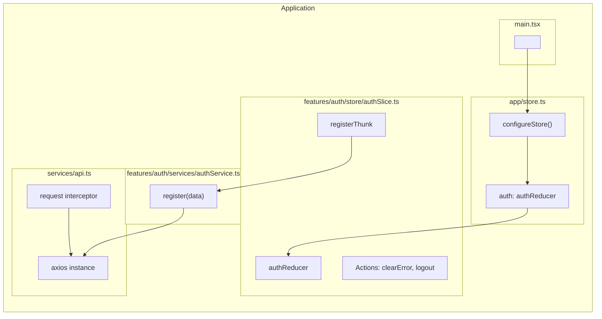
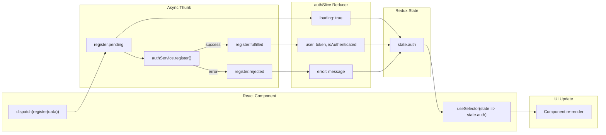
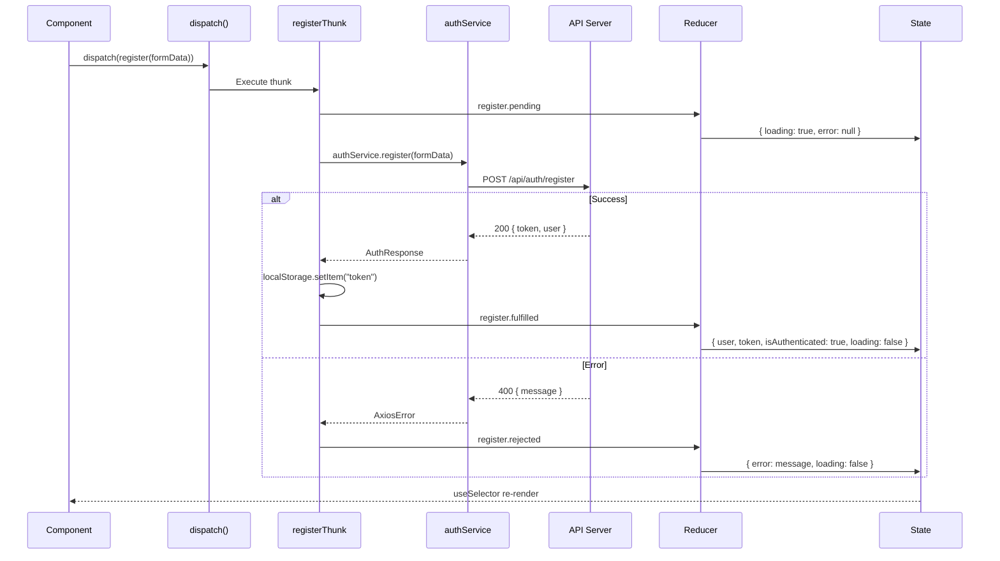
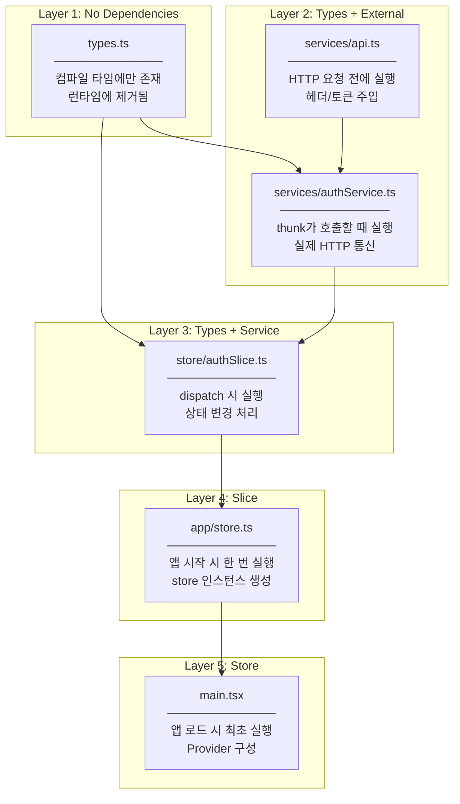
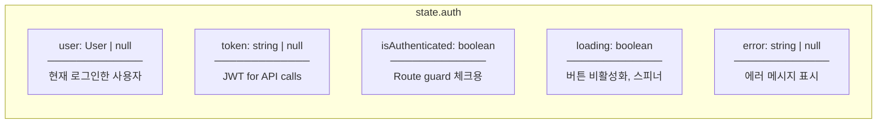
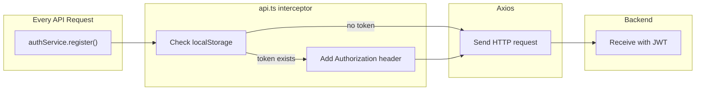
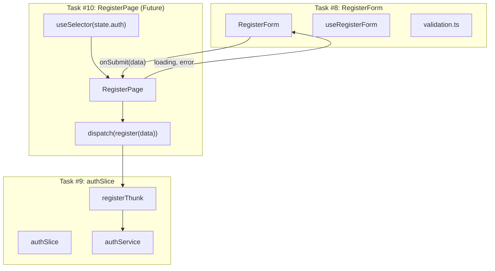
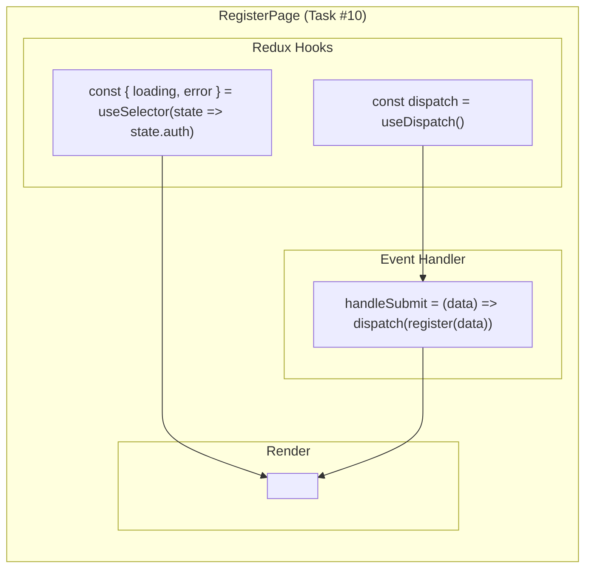
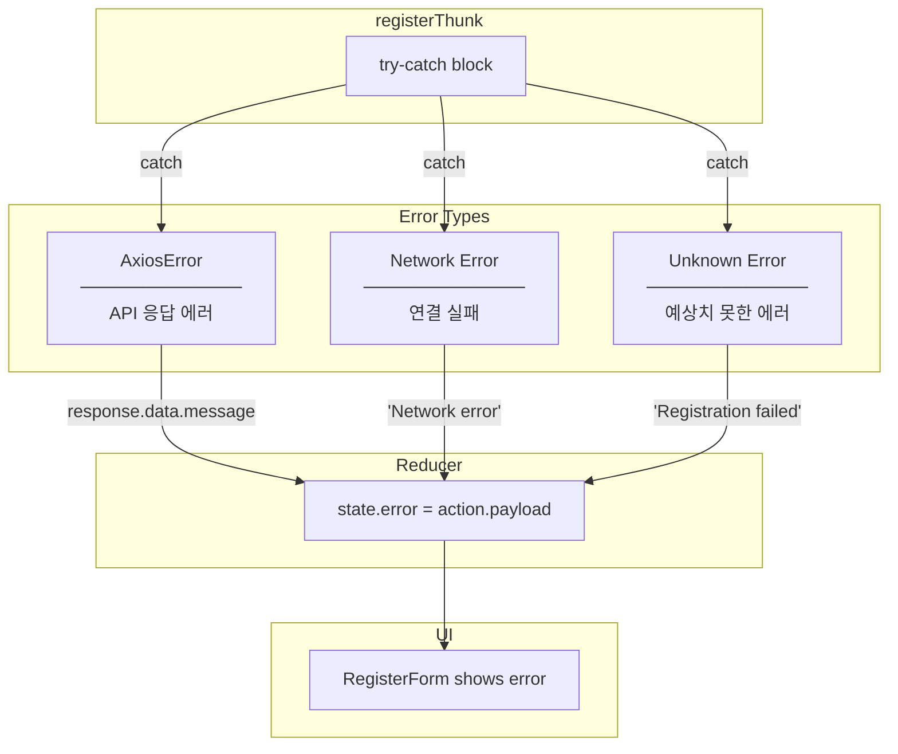

# authSlice - Architecture Diagram

## File Structure

```
src/
├── app/
│   └── store.ts                    ← Redux store configuration
├── services/
│   └── api.ts                      ← Axios instance (shared)
├── features/auth/
│   ├── services/
│   │   └── authService.ts          ← Auth API calls
│   ├── store/
│   │   └── authSlice.ts            ← Redux slice + thunks
│   ├── types.ts                    ← + User, AuthState types
│   └── index.ts                    ← + exports
└── main.tsx                        ← + Provider wrapper
```

---

## Redux Architecture Overview



---

## Redux Data Flow



---

## Thunk Lifecycle



---

## File Responsibilities (SRP)



---

## State Shape



| Property | Logic 관점 | Runtime 관점 |
|----------|-----------|-------------|
| `user` | 현재 로그인한 사용자 정보 | Header에 이름 표시, Admin 체크 |
| `token` | API 인증에 필요한 JWT | axios interceptor가 헤더에 붙임 |
| `isAuthenticated` | 인증 여부 플래그 | Route guard, 조건부 UI |
| `loading` | 비동기 작업 진행 중 | 버튼 비활성화, 스피너 |
| `error` | 마지막 작업의 에러 | 사용자에게 에러 표시 |

---

## Axios Interceptor Flow



---

## Integration with RegisterForm (Task #8)



---

## Component Usage Pattern



---

## Error Handling Flow



---

## File Comparison: Before vs After

```mermaid
flowchart LR
    subgraph BEFORE["Before Task #9"]
        direction TB
        B1["types.ts (form types only)"]
        B2["RegisterForm.tsx"]
        B3["No Redux"]
        B4["No API calls"]
    end

    subgraph AFTER["After Task #9"]
        direction TB
        A1["types.ts (+ User, AuthState)"]
        A2["RegisterForm.tsx"]
        A3["authSlice.ts (Redux)"]
        A4["authService.ts (API)"]
        A5["api.ts (Axios)"]
        A6["store.ts (Store)"]
        A7["main.tsx (Provider)"]
    end

    BEFORE -->|"Task #9"| AFTER
```



| Aspect | Before | After |
|--------|--------|-------|
| State Management | Local useState | Redux global state |
| API Calls | None | authService + axios |
| Token Storage | None | localStorage + interceptor |
| Error Handling | Client validation only | + Server errors |
| Loading State | Local | Global, shareable |
