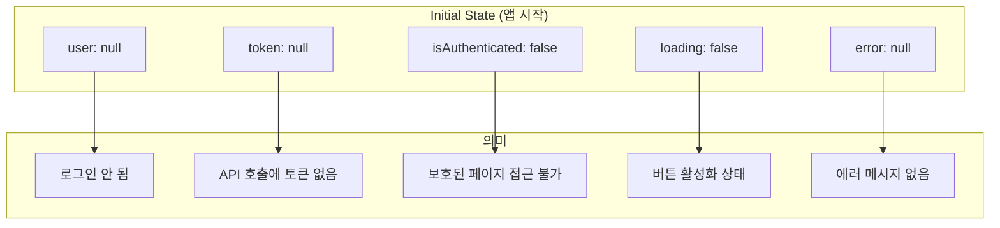
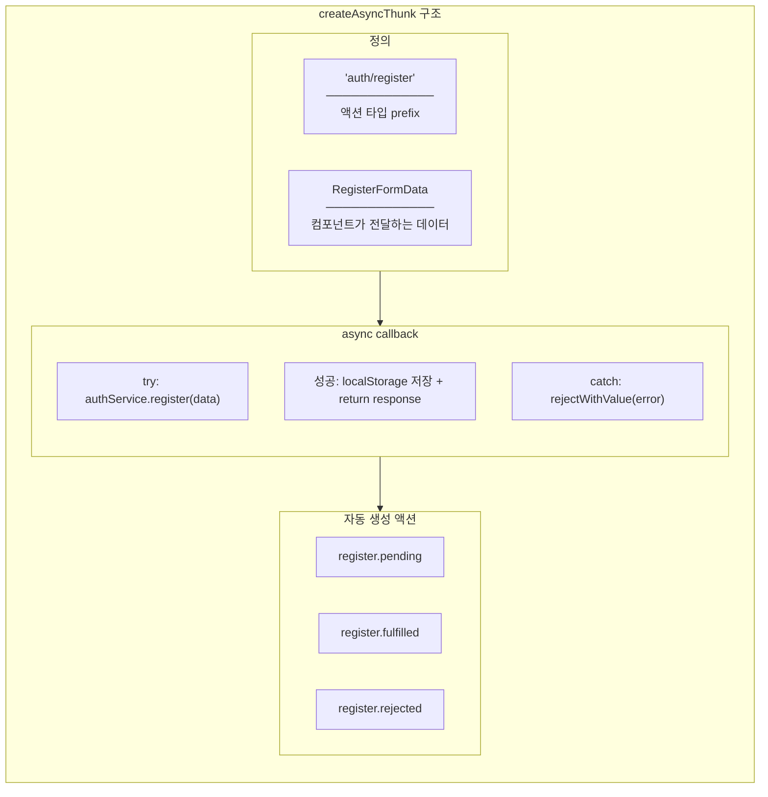
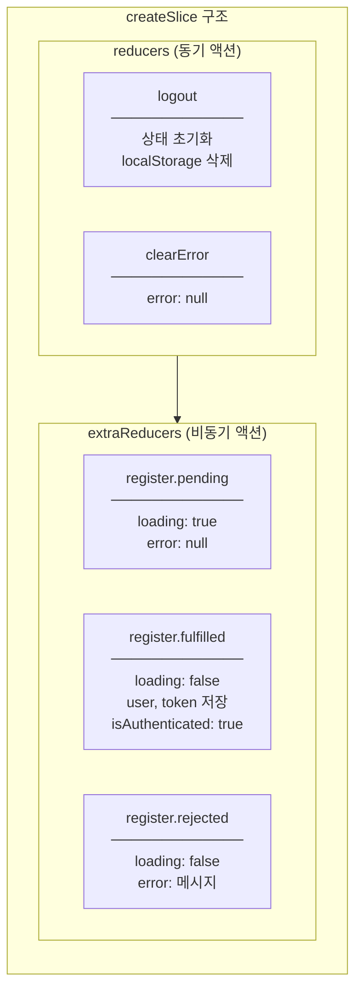
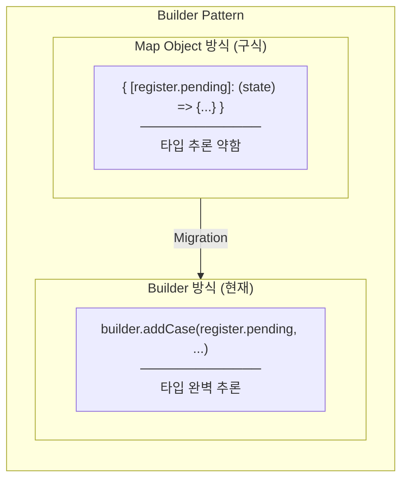
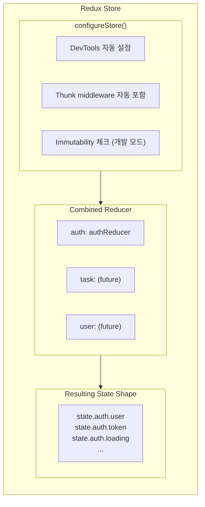
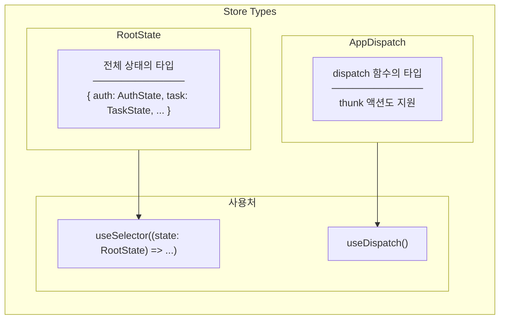
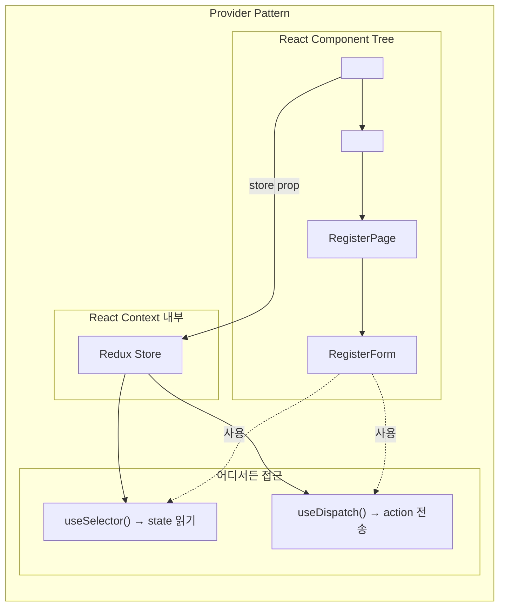
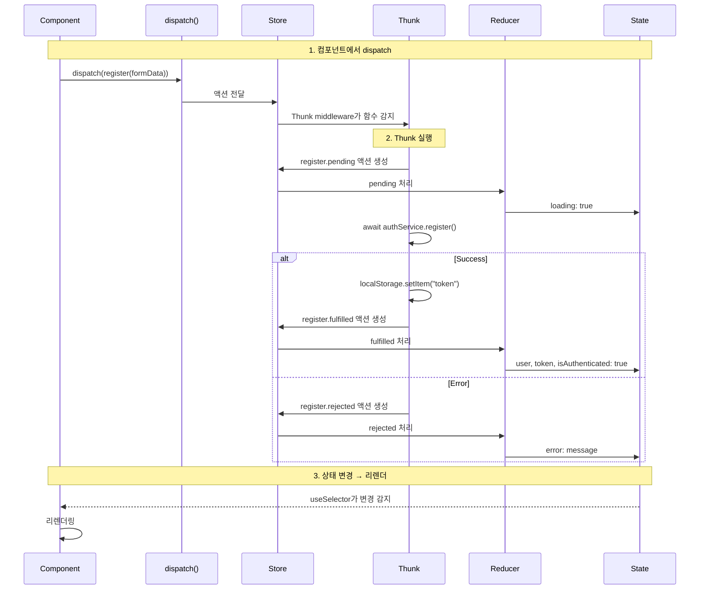

# authSlice - State Layer

## Overview

State Layer는 Redux를 사용하여 앱 전체의 인증 상태를 관리합니다.

| 파일 | 역할 |
|------|------|
| `store/authSlice.ts` | 상태 정의 + Reducer + Async Thunk |
| `app/store.ts` | Redux Store 구성 + 타입 정의 |
| `main.tsx` | Provider로 앱에 Store 주입 |

---

## authSlice.ts 분석

### 1. Initial State

```typescript
const initialState: AuthState = {
  user: null,          // 로그인한 사용자 정보
  token: null,         // JWT 토큰
  isAuthenticated: false,  // 인증 여부
  loading: false,      // 비동기 작업 중
  error: null,         // 에러 메시지
};
```



---

### 2. createAsyncThunk - register



**코드 분석:**

```typescript
export const register = createAsyncThunk(
  "auth/register",  // 액션 타입: auth/register/pending, auth/register/fulfilled, auth/register/rejected
  async (data: RegisterFormData, { rejectWithValue }) => {
    try {
      const response = await authService.register(data);
      localStorage.setItem("token", response.token);  // Side effect는 thunk에서
      return response;  // → fulfilled payload
    } catch (error: unknown) {
      // 에러 메시지 추출
      if (error instanceof Error && "response" in error) {
        const axiosError = error as { response?: { data?: { message?: string } } };
        return rejectWithValue(axiosError.response?.data?.message || "Registration failed");
      }
      return rejectWithValue("Registration failed");  // → rejected payload
    }
  }
);
```

**왜 localStorage를 thunk에서 처리하는가?**

| 위치 | 가능? | 이유 |
|------|-------|------|
| Reducer 안에서 | ❌ | Reducer는 순수 함수여야 함 (Side Effect 금지) |
| Thunk 안에서 | ✅ | Thunk는 Side Effect 허용 (비동기, API, localStorage 등) |

---

### 3. createSlice - Reducers



**extraReducers 코드:**

```typescript
extraReducers: (builder) => {
  builder
    .addCase(register.pending, (state) => {
      state.loading = true;
      state.error = null;
    })
    .addCase(register.fulfilled, (state, action) => {
      state.loading = false;
      state.user = action.payload.user;
      state.token = action.payload.token;
      state.isAuthenticated = true;
    })
    .addCase(register.rejected, (state, action) => {
      state.loading = false;
      state.error = action.payload as string;
    });
}
```

**Builder Pattern 사용 이유:**



---

### 4. 상태 변화 흐름

```mermaid
stateDiagram-v2
    [*] --> Initial: 앱 시작

    Initial --> Loading: dispatch(register(data))
    Loading --> Authenticated: API 성공
    Loading --> Error: API 실패

    Authenticated --> Initial: dispatch(logout())
    Error --> Loading: 재시도

    state Initial {
        user: null
        isAuthenticated: false
        loading: false
    }

    state Loading {
        loading: true
        error: null
    }

    state Authenticated {
        user: User
        token: JWT
        isAuthenticated: true
        loading: false
    }

    state Error {
        error: "message"
        loading: false
    }
```

---

## store.ts 분석

### 1. configureStore

```typescript
export const store = configureStore({
  reducer: {
    auth: authReducer,
    // task: taskReducer,  (미래)
    // user: userReducer,  (미래)
  },
});
```



**configureStore vs createStore:**

| 기능 | createStore (Legacy) | configureStore (RTK) |
|------|---------------------|---------------------|
| Redux DevTools | 수동 설정 필요 | 자동 |
| Thunk Middleware | 수동 추가 | 자동 포함 |
| Immutability 체크 | 없음 | 개발 모드에서 자동 |
| 코드량 | 많음 | 적음 |

---

### 2. Type Exports

```typescript
export type RootState = ReturnType<typeof store.getState>;
export type AppDispatch = typeof store.dispatch;
```



**왜 이 타입들이 필요한가?**

```typescript
// ❌ 타입 없이 - 자동완성 안 됨
const user = useSelector(state => state.auth.user);  // state: unknown

// ✅ RootState 사용 - 완벽한 타입 추론
const user = useSelector((state: RootState) => state.auth.user);  // state.auth.user: User | null

// ❌ 기본 Dispatch - thunk 액션 타입 오류
const dispatch = useDispatch();
dispatch(register(data));  // 타입 오류 가능

// ✅ AppDispatch 사용 - thunk 완벽 지원
const dispatch = useDispatch<AppDispatch>();
dispatch(register(data));  // OK
```

---

## main.tsx - Provider 연결

```typescript
import { Provider } from "react-redux";
import { store } from "./app/store";

createRoot(document.getElementById("root")!).render(
  <StrictMode>
    <Provider store={store}>
      <App />
    </Provider>
  </StrictMode>
);
```



**Provider 위치의 중요성:**

| Provider 위치 | 결과 |
|--------------|------|
| App 바깥 (현재) | 모든 컴포넌트에서 Redux 접근 가능 |
| App 안쪽 특정 부분 | 해당 부분만 Redux 접근 가능 |
| 없음 | useSelector/useDispatch 호출 시 오류 |

---

## State Layer 전체 흐름



---

## 핵심 개념 정리

| 개념 | 설명 | Task #9에서 |
|------|------|------------|
| **Slice** | 관련 상태 + 액션 + 리듀서를 하나로 묶음 | `authSlice` |
| **Async Thunk** | 비동기 로직 + 3가지 액션 자동 생성 | `register` thunk |
| **extraReducers** | 외부 액션(thunk 등)에 응답 | pending/fulfilled/rejected 처리 |
| **Store** | 전역 상태 보관소 | `configureStore` |
| **Provider** | React Context로 Store 주입 | `<Provider store={store}>` |
| **RootState** | 전체 상태의 타입 | `ReturnType<typeof store.getState>` |
| **AppDispatch** | Dispatch 함수의 타입 (thunk 지원) | `typeof store.dispatch` |

---

## 파일별 책임 (SRP)

| 파일 | 단일 책임 | 변경 시점 |
|------|----------|----------|
| `authSlice.ts` | Auth 상태의 생명주기 관리 | 상태 구조 변경, 새 액션 추가 |
| `store.ts` | 전체 Store 구성 | 새 feature slice 추가 |
| `main.tsx` | 앱 진입점, Provider 구성 | 새 Provider 추가 |
