# authSlice - Service Layer

## Overview

Service Layer는 API 통신을 담당합니다. Redux(State Layer)와 Backend 사이의 중간 계층입니다.

| 파일 | 역할 |
|------|------|
| `services/api.ts` | Axios 인스턴스 + Request Interceptor |
| `features/auth/services/authService.ts` | Auth 관련 API 엔드포인트 호출 |

---

## 레이어 구조

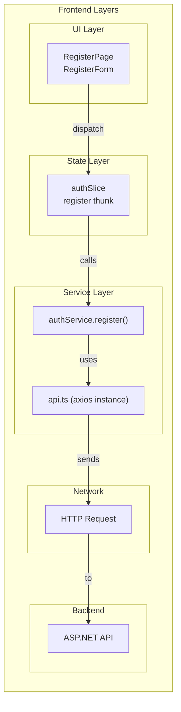

---

## api.ts 분석

### 1. Axios Instance 생성

```typescript
const api = axios.create({
  baseURL: import.meta.env.VITE_API_URL || "https://localhost:7001/api",
  headers: {
    "Content-Type": "application/json",
  },
});
```

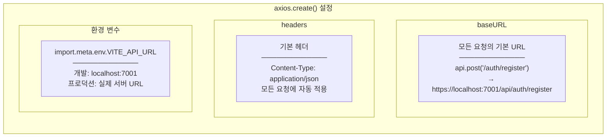

**왜 Instance를 만드는가?**

| 방식 | 코드 | 문제점 |
|------|------|--------|
| 직접 사용 | `axios.post('https://localhost:7001/api/auth/register')` | 매번 URL 반복, 설정 중복 |
| Instance 사용 | `api.post('/auth/register')` | 한 번 설정, 모든 곳에서 재사용 |

---

### 2. Request Interceptor

```typescript
api.interceptors.request.use((config) => {
  const token = localStorage.getItem("token");
  if (token) {
    config.headers.Authorization = `Bearer ${token}`;
  }
  return config;
});
```

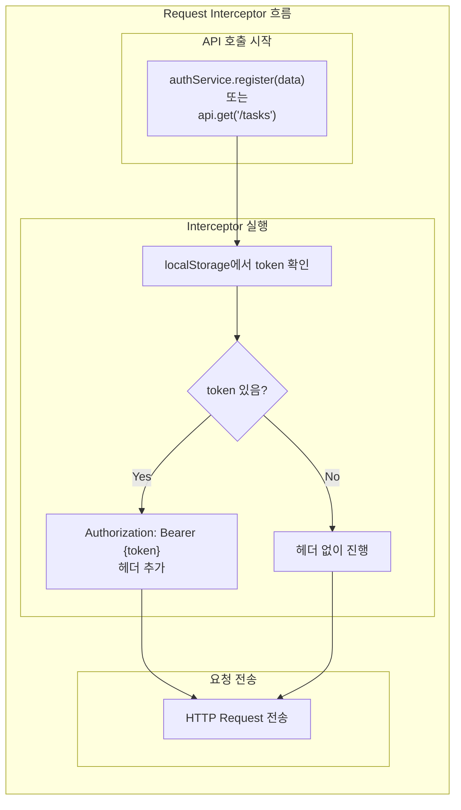

**Interceptor가 실행되는 시점:**

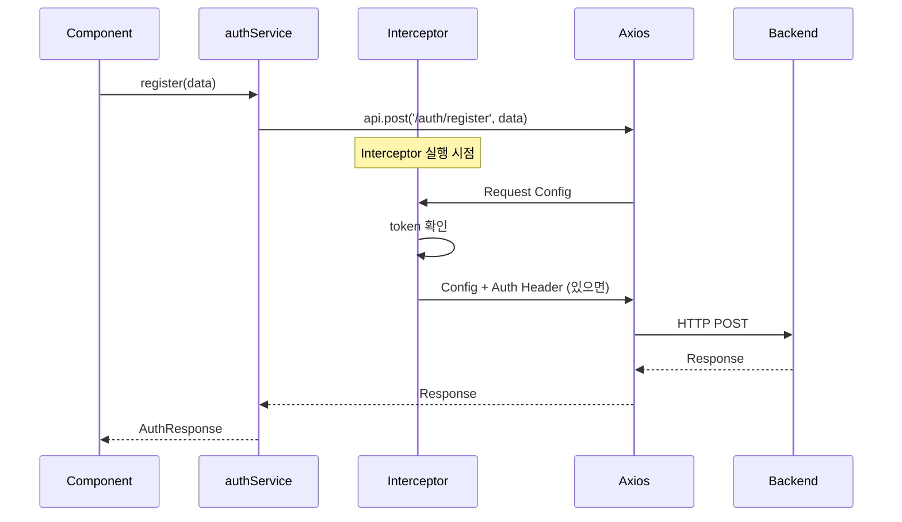

**토큰 유무에 따른 요청:**

| 상황 | localStorage | 헤더 |
|------|-------------|------|
| 로그인 전 (회원가입) | token 없음 | `Content-Type: application/json` 만 |
| 로그인 후 (Task 조회) | token 있음 | `Authorization: Bearer {token}` 추가 |

---

### 3. Interceptor의 장점

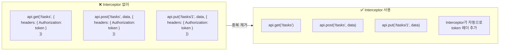

---

## authService.ts 분석

### 1. Service Object Pattern

```typescript
export const authService = {
  register: async (data: RegisterFormData): Promise<AuthResponse> => {
    const response = await api.post<AuthResponse>("/auth/register", {
      name: data.name,
      email: data.email,
      username: data.username,
      password: data.password,
    });
    return response.data;
  },

  // login은 Story 1.2에서 구현 예정
};
```

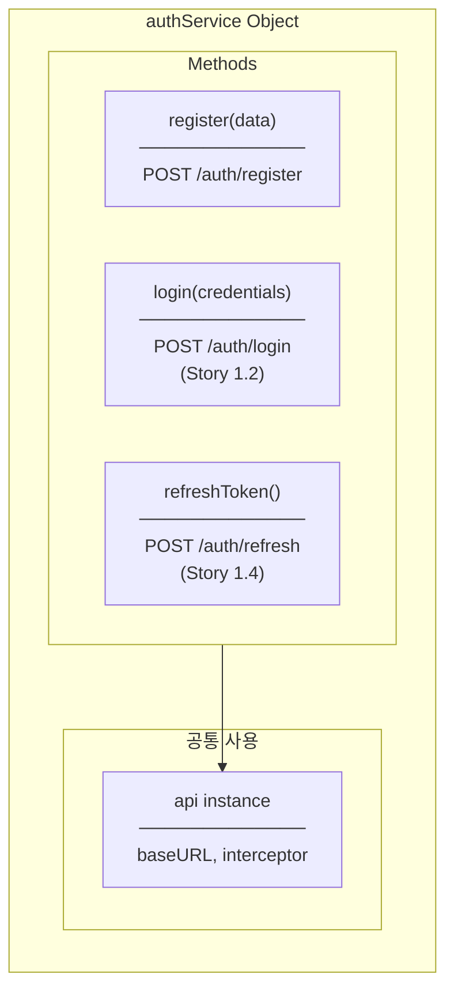

---

### 2. 데이터 변환

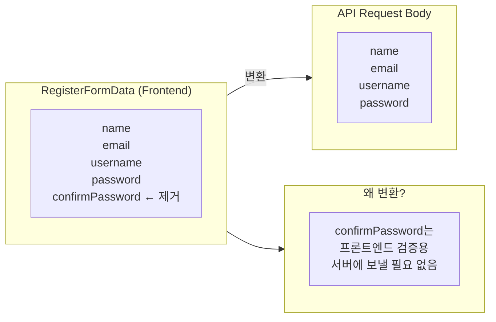

**코드에서 변환:**

```typescript
register: async (data: RegisterFormData): Promise<AuthResponse> => {
  const response = await api.post<AuthResponse>("/auth/register", {
    name: data.name,
    email: data.email,
    username: data.username,
    password: data.password,
    // confirmPassword는 보내지 않음 ← 의도적 제외
  });
  return response.data;
}
```

---

### 3. 타입 안전성

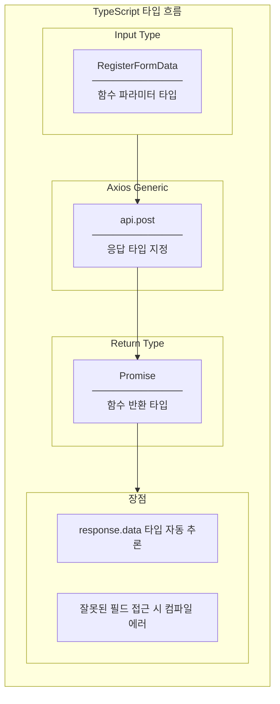

**타입 안전성 예시:**

```typescript
// ✅ 올바른 접근 - 타입 체크 통과
register: async (data: RegisterFormData): Promise<AuthResponse> => {
  const response = await api.post<AuthResponse>("/auth/register", {...});
  return response.data;  // AuthResponse 타입
}

// thunk에서 사용
const response = await authService.register(data);
response.token;  // ✅ string
response.user;   // ✅ User
response.foo;    // ❌ 컴파일 에러: Property 'foo' does not exist
```

---

## Service Layer 전체 흐름

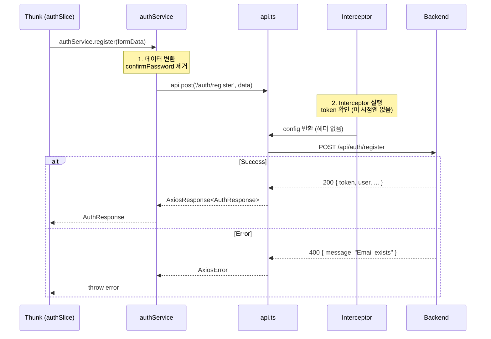

---

## api.ts vs authService.ts 비교

| 측면 | api.ts | authService.ts |
|------|--------|----------------|
| **위치** | `src/services/` | `src/features/auth/services/` |
| **범위** | App-wide (모든 feature) | Auth feature 전용 |
| **역할** | HTTP 인프라 설정 | 비즈니스 로직 (어떤 엔드포인트 호출) |
| **내용** | baseURL, headers, interceptor | register(), login(), ... |
| **변경 시점** | API 서버 URL 변경, 인증 방식 변경 | Auth 엔드포인트 변경, 새 인증 기능 추가 |

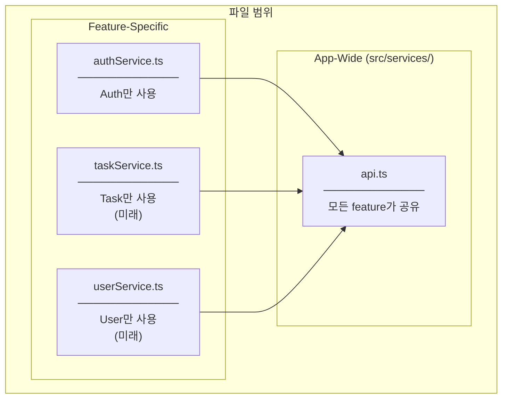

---

## 에러 처리 흐름

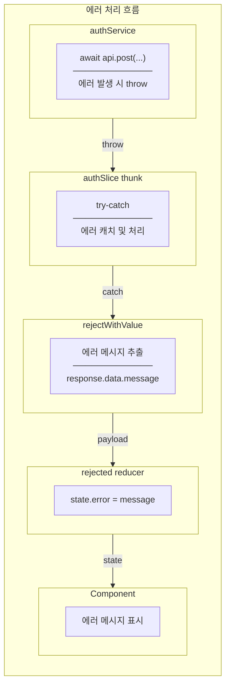

**왜 Service에서 에러를 처리하지 않는가?**

| 처리 위치 | 장점 | 단점 |
|----------|------|------|
| Service에서 | 한 곳에서 처리 | 호출자가 에러 유형 모름 |
| Thunk에서 (현재) | 상황별 다른 처리 가능 | 약간의 중복 |

현재 방식에서는 Thunk가 에러를 캐치하여:
1. 에러 메시지 추출
2. `rejectWithValue`로 Redux 상태에 반영
3. UI에서 상태를 읽어 표시

---

## 핵심 개념 정리

| 개념 | 설명 | Task #9에서 |
|------|------|------------|
| **Axios Instance** | 공통 설정을 가진 HTTP 클라이언트 | `api.ts` |
| **Request Interceptor** | 모든 요청 전에 실행되는 함수 | Token 자동 첨부 |
| **Service Object** | 관련 API 호출을 그룹화 | `authService` |
| **Data Transformation** | Frontend ↔ Backend 데이터 변환 | confirmPassword 제거 |
| **Type Safety** | 제네릭으로 응답 타입 지정 | `api.post<AuthResponse>` |

---

## 파일별 책임 (SRP)

| 파일 | 단일 책임 | 변경 시점 |
|------|----------|----------|
| `api.ts` | HTTP 인프라 설정 | API URL 변경, 인증 방식 변경 |
| `authService.ts` | Auth API 엔드포인트 호출 | Auth 엔드포인트 변경, 새 인증 기능 |
