# authSlice - Design Patterns & SOLID Principles

## SOLID Principles Applied

### S - Single Responsibility Principle

Each file has **one reason to change**.

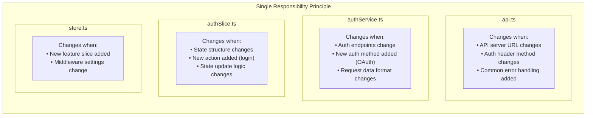

**Comparison:**

| File | Responsibility | Lines | Reason to Change |
|------|----------------|-------|------------------|
| `api.ts` | HTTP infrastructure | ~35 | Server settings change |
| `authService.ts` | Auth API calls | ~35 | Endpoint changes |
| `authSlice.ts` | Auth state management | ~115 | State logic changes |
| `store.ts` | Store configuration | ~40 | New slice added |

---

### O - Open/Closed Principle

**Open for extension, closed for modification.**

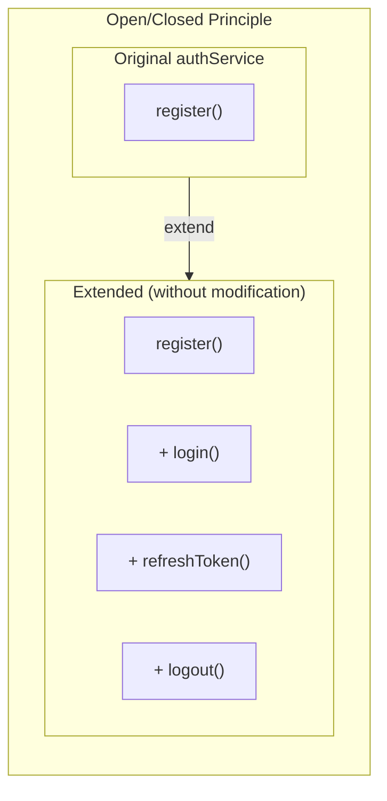

**Example: Adding new methods**

```typescript
// authService.ts - extend without modifying existing code
export const authService = {
  register: async (data: RegisterFormData) => { ... },  // existing

  // newly added (no changes to existing code)
  login: async (credentials: LoginCredentials) => {
    const response = await api.post<AuthResponse>("/auth/login", credentials);
    return response.data;
  },

  refreshToken: async () => {
    const response = await api.post<AuthResponse>("/auth/refresh");
    return response.data;
  },
};
```

**Extending authSlice:**

```typescript
// Add new thunk without modifying existing ones
export const login = createAsyncThunk("auth/login", async (credentials, { rejectWithValue }) => {
  // ...
});

// Add cases to extraReducers (no modification to existing cases)
.addCase(login.pending, ...)
.addCase(login.fulfilled, ...)
.addCase(login.rejected, ...)
```

---

### L - Liskov Substitution Principle

**Subtypes must be substitutable for their base types.**

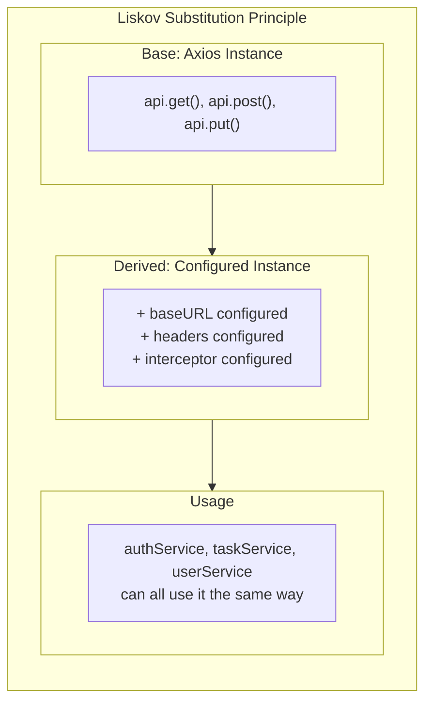

**Applied example:**

```typescript
// Can be used the same as base axios
import axios from "axios";
import api from "./services/api";

// Both have the same interface
axios.post("/auth/register", data);  // base
api.post("/auth/register", data);    // configured instance

// api behaves like a subtype of axios
// Can use api anywhere axios is expected
```

---

### I - Interface Segregation Principle

**Clients should not depend on interfaces they don't use.**

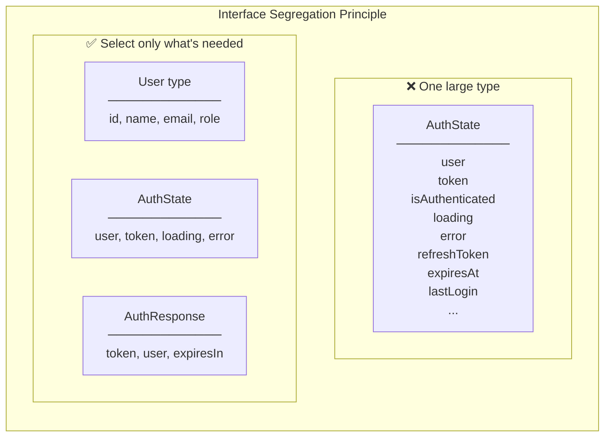

**Applied example:**

```typescript
// ✅ Segregated types
export interface User {
  id: number;
  name: string;
  email: string;
  username: string;
  role: "Admin" | "User";
}

export interface AuthState {
  user: User | null;
  token: string | null;
  isAuthenticated: boolean;
  loading: boolean;
  error: string | null;
}

export interface AuthResponse {
  token: string;
  refreshToken: string;
  expiresIn: number;
  user: User;
}

// Each component imports only the types it needs
// RegisterPage: uses AuthState
// Header: only needs User type
```

---

### D - Dependency Inversion Principle

**High-level modules should not depend on low-level modules. Both should depend on abstractions.**

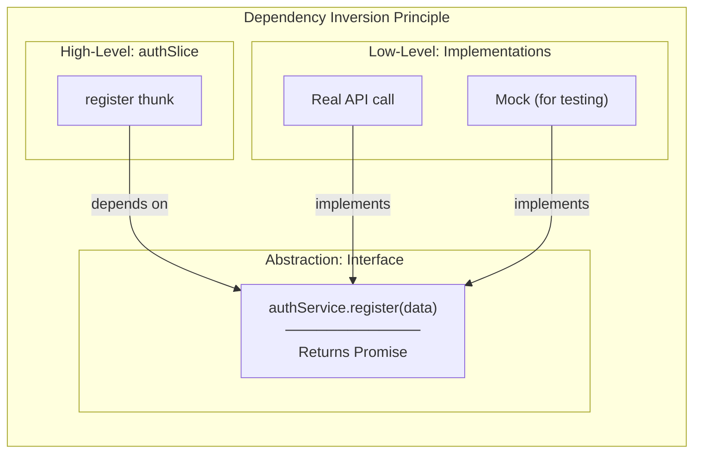

**Applied example:**

```typescript
// authSlice depends only on authService interface
export const register = createAsyncThunk(
  "auth/register",
  async (data: RegisterFormData, { rejectWithValue }) => {
    const response = await authService.register(data);  // depends on abstraction
    // ...
  }
);

// Can replace with mock during testing
const mockAuthService = {
  register: jest.fn().mockResolvedValue({ token: "test", user: {...} }),
};
```

---

## Design Patterns Applied

### 1. Flux / Redux Pattern

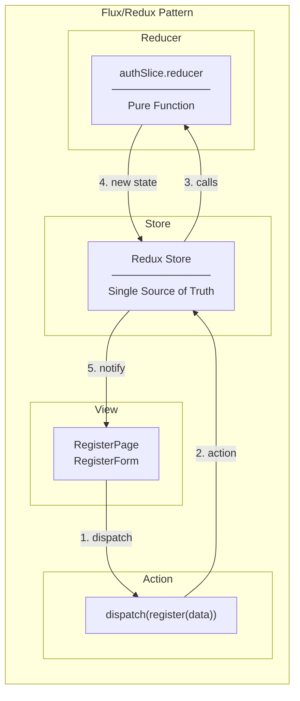

**Three Principles of Redux:**

| Principle | Description | In Task #9 |
|-----------|-------------|------------|
| Single Source of Truth | Entire state in one store | `configureStore` |
| State is Read-Only | State changes only via actions | `dispatch(register(...))` |
| Changes with Pure Functions | Reducers are pure functions | `authSlice.reducer` |

---

### 2. Thunk Pattern (Middleware)

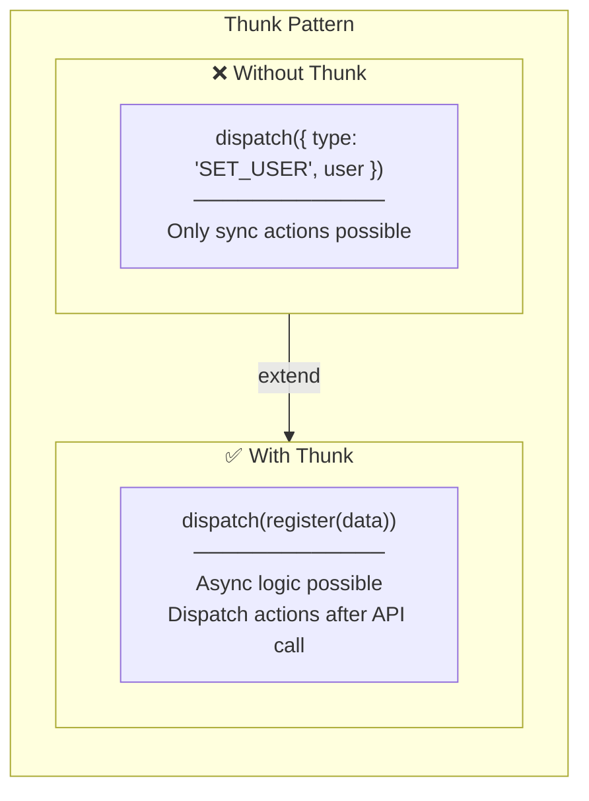

**How Thunk middleware works:**

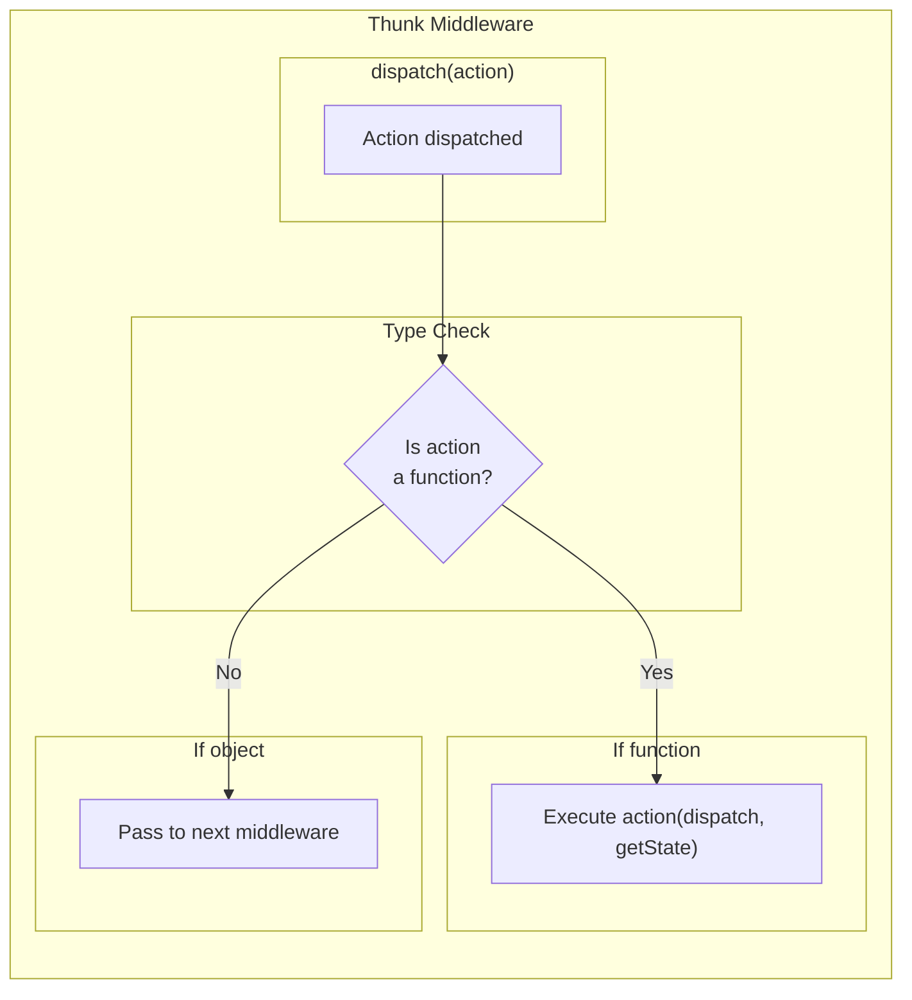

---

### 3. Provider Pattern (React Context)

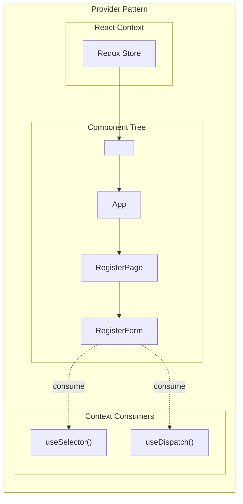

**Why Provider Pattern?**

| Approach | Code | Problem |
|----------|------|---------|
| Props Drilling | `<App store={store}>` → `<Page store={store}>` → ... | Intermediate components must pass props |
| Context (Provider) | `<Provider store={store}>` | Access from any depth |

---

### 4. Service Layer Pattern

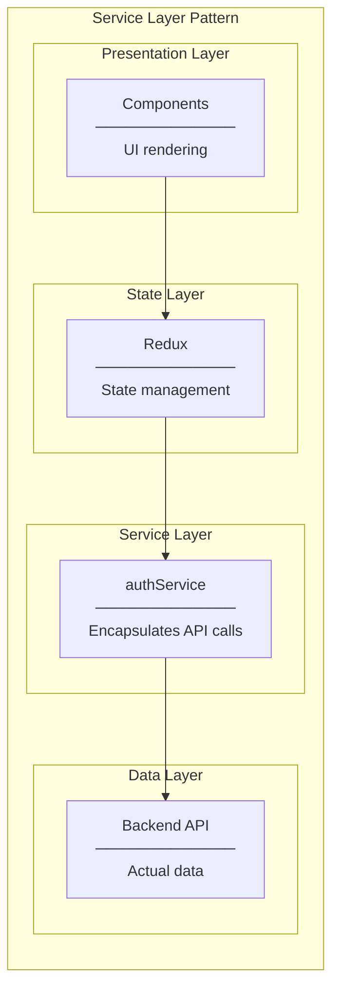

**Benefits:**

| Benefit | Description |
|---------|-------------|
| Separation of Concerns | Each layer handles only its responsibility |
| Testability | Mock Service to test State layer independently |
| Reusability | Same API call reused in multiple places |
| Change Isolation | API changes only affect Service |

---

### 5. Interceptor Pattern

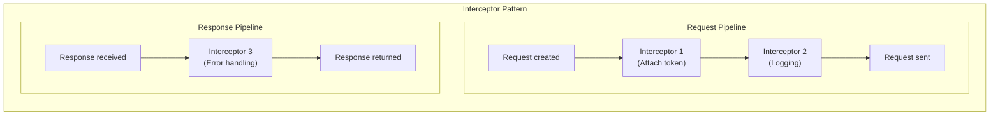

**Currently applied:**

```typescript
// Request Interceptor - Auto-attach token
api.interceptors.request.use((config) => {
  const token = localStorage.getItem("token");
  if (token) {
    config.headers.Authorization = `Bearer ${token}`;
  }
  return config;
});

// Future: Response Interceptor - Auto logout on 401
api.interceptors.response.use(
  (response) => response,
  (error) => {
    if (error.response?.status === 401) {
      store.dispatch(logout());
    }
    return Promise.reject(error);
  }
);
```

---

### 6. Builder Pattern (extraReducers)

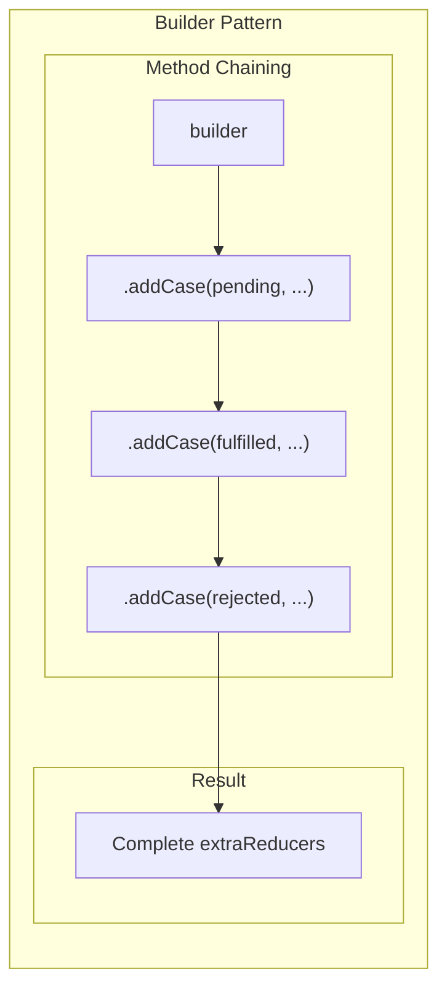

**Code example:**

```typescript
extraReducers: (builder) => {
  builder
    .addCase(register.pending, (state) => {
      state.loading = true;
    })
    .addCase(register.fulfilled, (state, action) => {
      state.user = action.payload.user;
    })
    .addCase(register.rejected, (state, action) => {
      state.error = action.payload as string;
    });
  // Chaining improves readability + perfect type inference
}
```

---

## Anti-Patterns Avoided

### 1. God Object (Avoided)

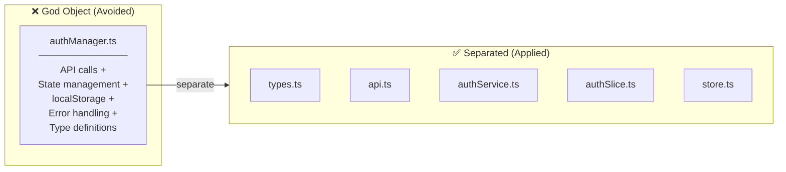

### 2. Direct State Mutation (Avoided)

```typescript
// ❌ Bad: Direct state mutation
state.user = newUser;  // Forbidden without Immer

// ✅ Good: Redux Toolkit + Immer
// Looks like "direct mutation" in authSlice.ts but
// Immer internally converts to immutable update
state.user = action.payload.user;  // OK (thanks to Immer)
```

### 3. Callback Hell (Avoided)

```typescript
// ❌ Bad: Callback hell
api.post('/register', data)
  .then(response => {
    localStorage.setItem('token', response.token);
    dispatch({ type: 'SET_USER', user: response.user });
  })
  .catch(error => {
    dispatch({ type: 'SET_ERROR', error: error.message });
  });

// ✅ Good: async/await + createAsyncThunk
export const register = createAsyncThunk("auth/register", async (data) => {
  const response = await authService.register(data);
  localStorage.setItem("token", response.token);
  return response;
});
```

---

## Pattern Summary

| Pattern | Applied In | Purpose |
|---------|------------|---------|
| **Flux/Redux** | Overall state management | Predictable state changes |
| **Thunk** | Async actions | State update after API calls |
| **Provider** | main.tsx | Inject Store into entire app |
| **Service Layer** | authService | Encapsulate API calls |
| **Interceptor** | api.ts | Intercept requests/responses |
| **Builder** | extraReducers | Type-safe case addition |
| **SRP** | All files | Single responsibility |
| **DIP** | thunk → service | Depend on abstractions |
