# authSlice - Programming Concepts

## Redux Toolkit Concepts

### 1. createSlice

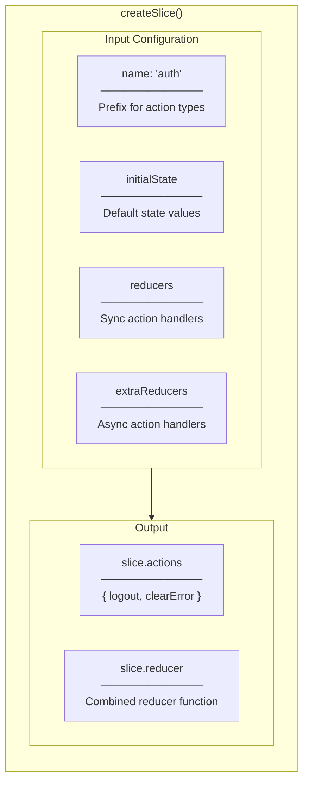
```mermaid
flowchart TB
    subgraph CREATESLICE["createSlice()"]
        direction TB

        subgraph INPUT["Input Configuration"]
            Name["name: 'auth'<br/>─────────────<br/>Prefix for action types"]
            Initial["initialState<br/>─────────────<br/>Default state values"]
            Reducers["reducers<br/>─────────────<br/>Sync action handlers"]
            Extra["extraReducers<br/>─────────────<br/>Async action handlers"]
        end

        subgraph OUTPUT["Output"]
            Actions["slice.actions<br/>─────────────<br/>{ logout, clearError }"]
            Reducer["slice.reducer<br/>─────────────<br/>Combined reducer function"]
        end
    end

    INPUT --> OUTPUT
```

**In Our Code:**

```typescript
const authSlice = createSlice({
  name: "auth",           // Action types: auth/logout, auth/clearError
  initialState,           // { user: null, token: null, ... }
  reducers: {
    logout: (state) => { ... },      // Generates: { type: 'auth/logout' }
    clearError: (state) => { ... },  // Generates: { type: 'auth/clearError' }
  },
  extraReducers: (builder) => {
    // Handle async thunk actions
  },
});

export const { logout, clearError } = authSlice.actions;
export default authSlice.reducer;
```

---

### 2. createAsyncThunk

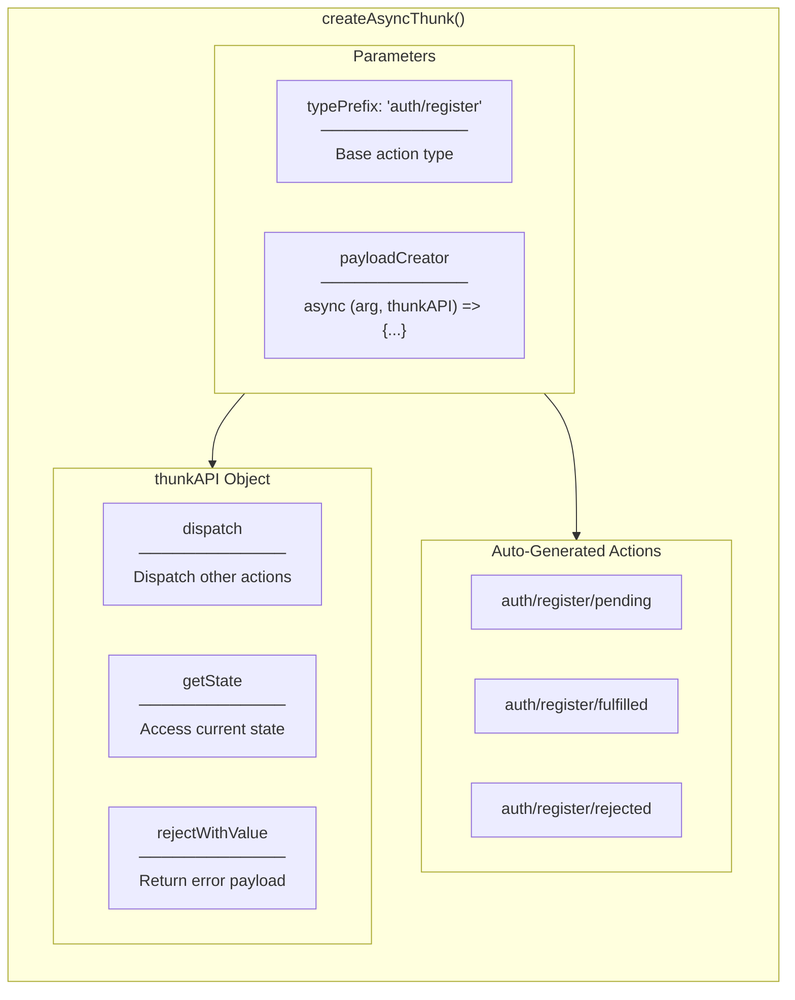
```mermaid
flowchart TB
    subgraph ASYNCTHUNK["createAsyncThunk()"]
        direction TB

        subgraph PARAMS["Parameters"]
            Type["typePrefix: 'auth/register'<br/>─────────────<br/>Base action type"]
            Payload["payloadCreator<br/>─────────────<br/>async (arg, thunkAPI) => {...}"]
        end

        subgraph GENERATED["Auto-Generated Actions"]
            Pending["auth/register/pending"]
            Fulfilled["auth/register/fulfilled"]
            Rejected["auth/register/rejected"]
        end

        subgraph THUNKAPI["thunkAPI Object"]
            Dispatch["dispatch<br/>─────────────<br/>Dispatch other actions"]
            GetState["getState<br/>─────────────<br/>Access current state"]
            Reject["rejectWithValue<br/>─────────────<br/>Return error payload"]
        end
    end

    PARAMS --> GENERATED
    PARAMS --> THUNKAPI
```

**In Our Code:**

```typescript
export const register = createAsyncThunk(
  "auth/register",  // typePrefix
  async (data: RegisterFormData, { rejectWithValue }) => {  // payloadCreator
    try {
      const response = await authService.register(data);
      localStorage.setItem("token", response.token);
      return response;  // → fulfilled payload
    } catch (error: unknown) {
      return rejectWithValue("Registration failed");  // → rejected payload
    }
  }
);
```

**Action Lifecycle:**

| Phase | Action Type | When |
|-------|-------------|------|
| Start | `auth/register/pending` | Immediately when dispatched |
| Success | `auth/register/fulfilled` | When async function resolves |
| Failure | `auth/register/rejected` | When async function rejects or rejectWithValue called |

---

### 3. Immer Integration

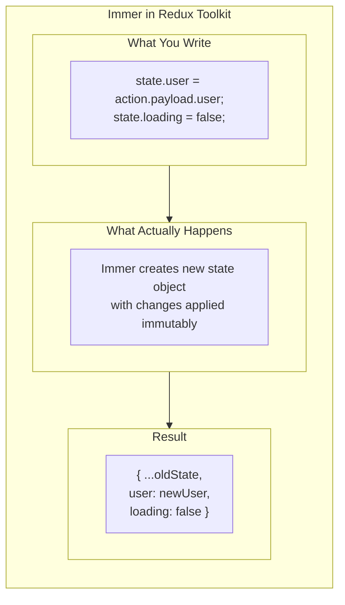
```mermaid
flowchart LR
    subgraph IMMER["Immer in Redux Toolkit"]
        direction TB

        subgraph WRITE["What You Write"]
            W["state.user = action.payload.user;<br/>state.loading = false;"]
        end

        subgraph ACTUALLY["What Actually Happens"]
            A["Immer creates new state object<br/>with changes applied immutably"]
        end

        subgraph RESULT["Result"]
            R["{ ...oldState,<br/>  user: newUser,<br/>  loading: false }"]
        end
    end

    WRITE --> ACTUALLY --> RESULT
```

**Comparison:**

```typescript
// ❌ Without Immer (manual immutable update)
.addCase(register.fulfilled, (state, action) => {
  return {
    ...state,
    loading: false,
    user: action.payload.user,
    token: action.payload.token,
    isAuthenticated: true,
  };
})

// ✅ With Immer (looks like mutation, but immutable)
.addCase(register.fulfilled, (state, action) => {
  state.loading = false;
  state.user = action.payload.user;
  state.token = action.payload.token;
  state.isAuthenticated = true;
})
```

---

### 4. configureStore

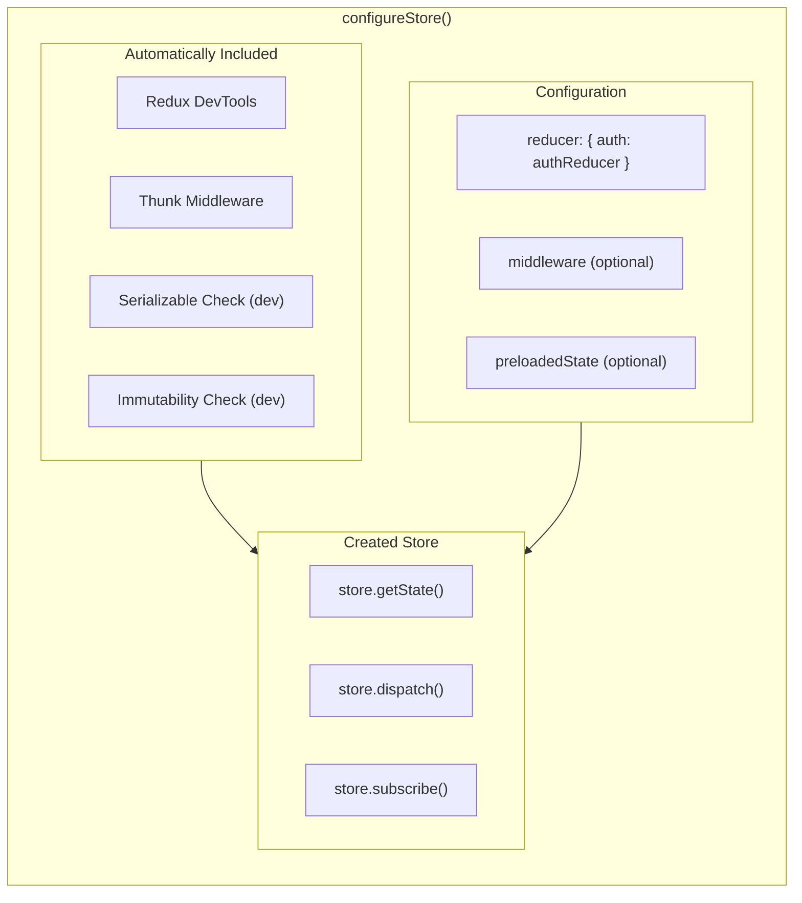
```mermaid
flowchart TB
    subgraph CONFIGURE["configureStore()"]
        direction TB

        subgraph AUTO["Automatically Included"]
            DevTools["Redux DevTools"]
            Thunk["Thunk Middleware"]
            Serializable["Serializable Check (dev)"]
            Immutable["Immutability Check (dev)"]
        end

        subgraph INPUT["Configuration"]
            Reducer["reducer: { auth: authReducer }"]
            Middleware["middleware (optional)"]
            Preload["preloadedState (optional)"]
        end

        subgraph OUTPUT["Created Store"]
            Store["store.getState()"]
            Dispatch["store.dispatch()"]
            Subscribe["store.subscribe()"]
        end
    end

    AUTO --> OUTPUT
    INPUT --> OUTPUT
```

**In Our Code:**

```typescript
export const store = configureStore({
  reducer: {
    auth: authReducer,
    // task: taskReducer,  (future)
  },
});

// Automatically includes:
// - Redux DevTools extension support
// - redux-thunk middleware
// - Development checks for common mistakes
```

---

## TypeScript Concepts

### 1. ReturnType Utility

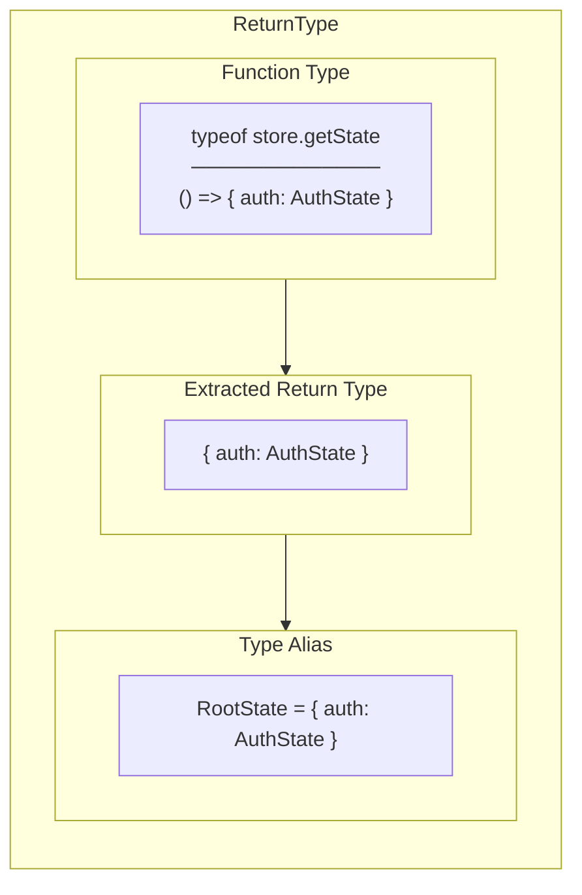
```mermaid
flowchart LR
    subgraph RETURNTYPE["ReturnType<T>"]
        direction TB

        subgraph FUNCTION["Function Type"]
            F["typeof store.getState<br/>─────────────<br/>() => { auth: AuthState }"]
        end

        subgraph EXTRACTED["Extracted Return Type"]
            E["{ auth: AuthState }"]
        end

        subgraph ALIAS["Type Alias"]
            A["RootState = { auth: AuthState }"]
        end
    end

    FUNCTION --> EXTRACTED --> ALIAS
```

**In Our Code:**

```typescript
// Extract the return type of store.getState
export type RootState = ReturnType<typeof store.getState>;

// RootState = {
//   auth: AuthState
// }

// Usage with useSelector
const user = useSelector((state: RootState) => state.auth.user);
//                        ^^^^^^^^^^^^^^ Full type inference
```

---

### 2. typeof Operator (Type Context)

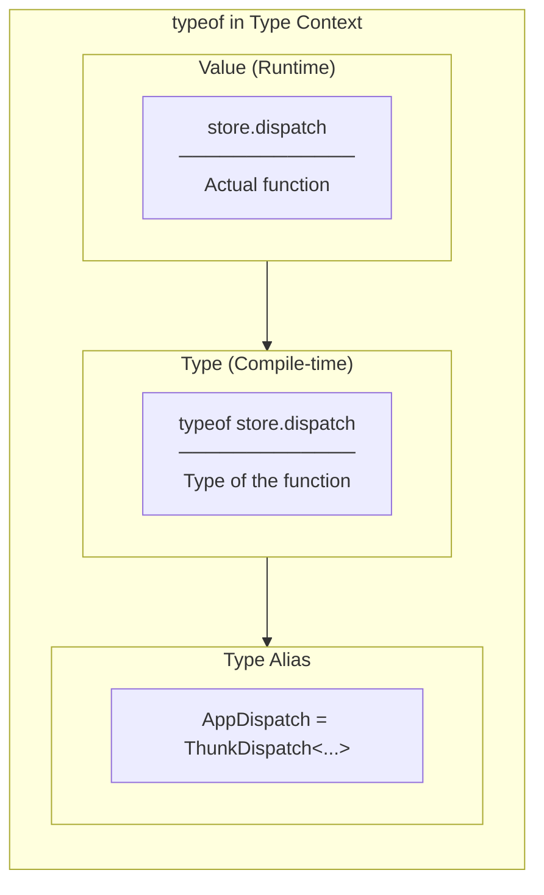
```mermaid
flowchart LR
    subgraph TYPEOF["typeof in Type Context"]
        direction TB

        subgraph VALUE["Value (Runtime)"]
            V["store.dispatch<br/>─────────────<br/>Actual function"]
        end

        subgraph TYPE["Type (Compile-time)"]
            T["typeof store.dispatch<br/>─────────────<br/>Type of the function"]
        end

        subgraph ALIAS["Type Alias"]
            A["AppDispatch = ThunkDispatch<...>"]
        end
    end

    VALUE --> TYPE --> ALIAS
```

**In Our Code:**

```typescript
// Get the type of store.dispatch function
export type AppDispatch = typeof store.dispatch;

// Why needed?
// - Regular Dispatch type doesn't know about thunks
// - AppDispatch includes thunk action support

// Usage
const dispatch = useDispatch<AppDispatch>();
dispatch(register(data));  // ✅ Thunk action accepted
```

---

### 3. Generic Functions

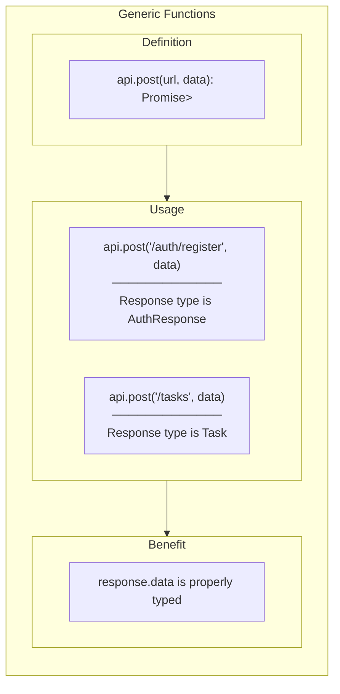
```mermaid
flowchart TB
    subgraph GENERICS["Generic Functions"]
        direction TB

        subgraph DEFINITION["Definition"]
            D["api.post<T>(url, data): Promise<AxiosResponse<T>>"]
        end

        subgraph USAGE["Usage"]
            U1["api.post<AuthResponse>('/auth/register', data)<br/>─────────────<br/>Response type is AuthResponse"]
            U2["api.post<Task>('/tasks', data)<br/>─────────────<br/>Response type is Task"]
        end

        subgraph BENEFIT["Benefit"]
            B["response.data is properly typed"]
        end
    end

    DEFINITION --> USAGE --> BENEFIT
```

**In Our Code:**

```typescript
// Generic type parameter specifies response type
const response = await api.post<AuthResponse>("/auth/register", {
  name: data.name,
  email: data.email,
  // ...
});

// response.data is typed as AuthResponse
response.data.token;  // ✅ string
response.data.user;   // ✅ User
response.data.foo;    // ❌ Error: Property 'foo' does not exist
```

---

### 4. Union Types for Role

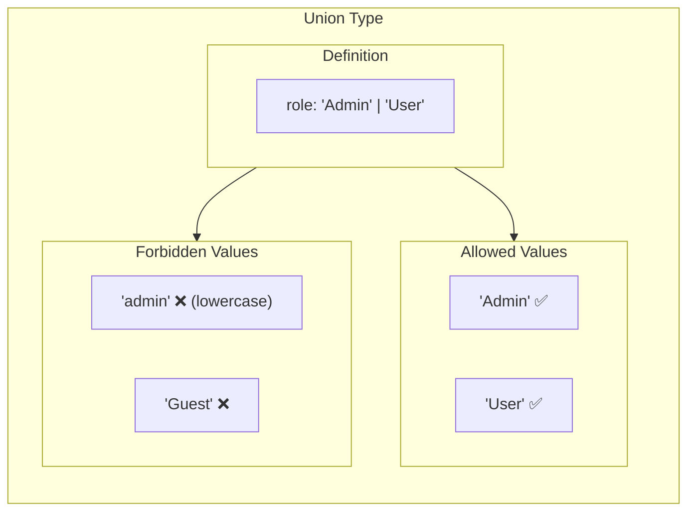
```mermaid
flowchart LR
    subgraph UNION["Union Type"]
        direction TB

        subgraph DEFINITION["Definition"]
            D["role: 'Admin' | 'User'"]
        end

        subgraph ALLOWED["Allowed Values"]
            A1["'Admin' ✅"]
            A2["'User' ✅"]
        end

        subgraph FORBIDDEN["Forbidden Values"]
            F1["'admin' ❌ (lowercase)"]
            F2["'Guest' ❌"]
        end
    end

    DEFINITION --> ALLOWED
    DEFINITION --> FORBIDDEN
```

**In Our Code:**

```typescript
export interface User {
  id: number;
  name: string;
  email: string;
  username: string;
  role: "Admin" | "User";  // Union type - only these two values allowed
}

// Type-safe role check
if (user.role === "Admin") {
  // Show admin features
}

// TypeScript catches typos
if (user.role === "admin") {  // ❌ Error: This comparison is always false
}
```

---

### 5. Type Guards with instanceof

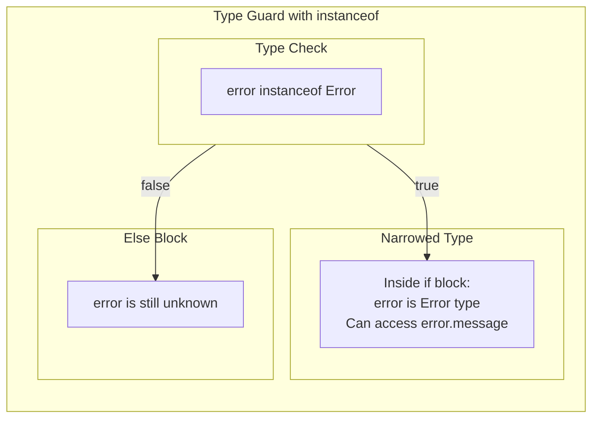
```mermaid
flowchart TB
    subgraph TYPEGUARD["Type Guard with instanceof"]
        direction TB

        subgraph CHECK["Type Check"]
            C["error instanceof Error"]
        end

        subgraph NARROWED["Narrowed Type"]
            N["Inside if block:<br/>error is Error type<br/>Can access error.message"]
        end

        subgraph FALLBACK["Else Block"]
            F["error is still unknown"]
        end
    end

    CHECK -->|"true"| N
    CHECK -->|"false"| F
```

**In Our Code:**

```typescript
catch (error: unknown) {
  // Type guard: narrow unknown to Error
  if (error instanceof Error && "response" in error) {
    const axiosError = error as { response?: { data?: { message?: string } } };
    return rejectWithValue(axiosError.response?.data?.message || "Registration failed");
  }
  return rejectWithValue("Registration failed");
}
```

---

## JavaScript/ES6+ Concepts

### 1. async/await

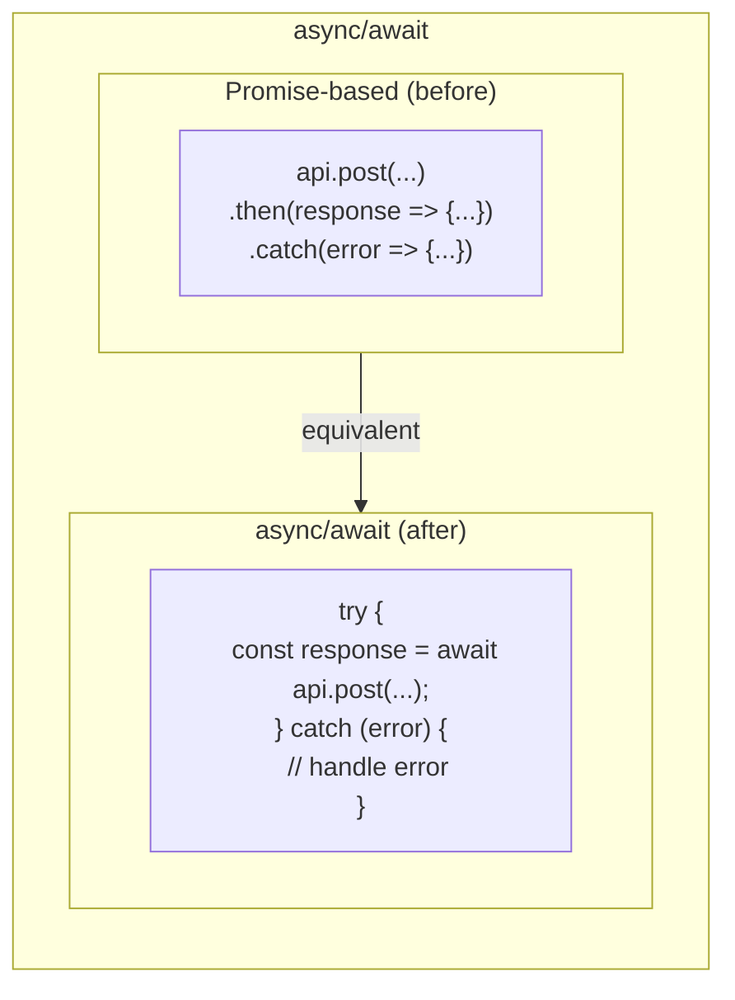
```mermaid
flowchart TB
    subgraph ASYNCAWAIT["async/await"]
        direction TB

        subgraph PROMISE["Promise-based (before)"]
            P["api.post(...)<br/>  .then(response => {...})<br/>  .catch(error => {...})"]
        end

        subgraph ASYNC["async/await (after)"]
            A["try {<br/>  const response = await api.post(...);<br/>} catch (error) {<br/>  // handle error<br/>}"]
        end
    end

    PROMISE -->|"equivalent"| ASYNC
```

**In Our Code:**

```typescript
// Async function with await
register: async (data: RegisterFormData): Promise<AuthResponse> => {
  const response = await api.post<AuthResponse>("/auth/register", {
    name: data.name,
    email: data.email,
    username: data.username,
    password: data.password,
  });
  return response.data;  // Executed after api.post resolves
}
```

**Key Points:**

| Aspect | Description |
|--------|-------------|
| `async` keyword | Marks function as returning a Promise |
| `await` keyword | Pauses execution until Promise resolves |
| Error handling | Use try/catch instead of .catch() |
| Return value | Automatically wrapped in Promise |

---

### 2. Object Shorthand

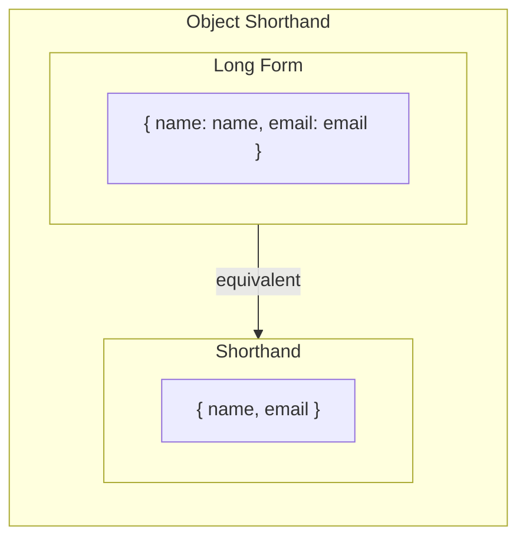
```mermaid
flowchart LR
    subgraph SHORTHAND["Object Shorthand"]
        direction TB

        subgraph LONG["Long Form"]
            L["{ name: name, email: email }"]
        end

        subgraph SHORT["Shorthand"]
            S["{ name, email }"]
        end
    end

    LONG -->|"equivalent"| SHORT
```

**In Our Code:**

```typescript
// Object with method shorthand
export const authService = {
  // Method shorthand
  register: async (data) => { ... },

  // Equivalent to:
  // register: function(data) { ... }
};
```

---

### 3. Optional Chaining (?.)

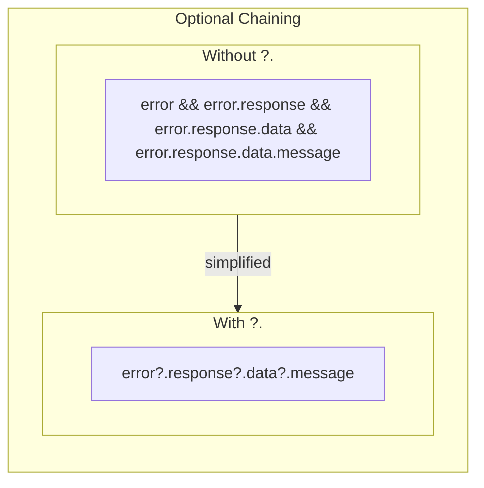
```mermaid
flowchart LR
    subgraph OPTIONAL["Optional Chaining"]
        direction TB

        subgraph WITHOUT["Without ?."]
            W["error && error.response && error.response.data && error.response.data.message"]
        end

        subgraph WITH["With ?."]
            C["error?.response?.data?.message"]
        end
    end

    WITHOUT -->|"simplified"| WITH
```

**In Our Code:**

```typescript
// Safe property access
return rejectWithValue(
  axiosError.response?.data?.message || "Registration failed"
);

// If any part is null/undefined, returns undefined
// Then || provides fallback value
```

---

### 4. Nullish Coalescing (??) vs OR (||)

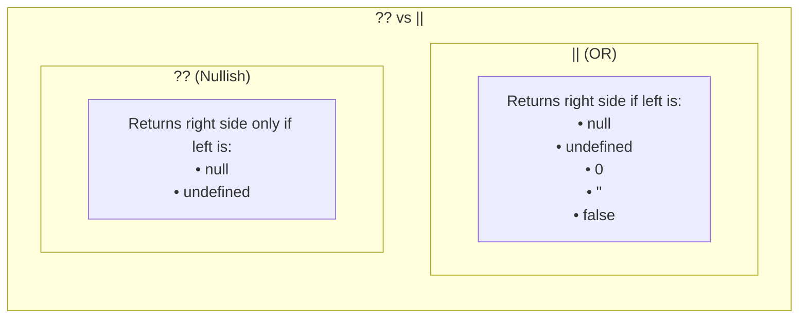
```mermaid
flowchart TB
    subgraph NULLISH["?? vs ||"]
        direction TB

        subgraph OR["|| (OR)"]
            O["Returns right side if left is:<br/>• null<br/>• undefined<br/>• 0<br/>• ''<br/>• false"]
        end

        subgraph NULLISH_OP["?? (Nullish)"]
            N["Returns right side only if left is:<br/>• null<br/>• undefined"]
        end
    end
```

**In Our Code:**

```typescript
// Using || for fallback URL
baseURL: import.meta.env.VITE_API_URL || "https://localhost:7001/api"

// If VITE_API_URL is:
// - undefined → uses fallback ✅
// - "" (empty string) → uses fallback (maybe not intended)

// With ?? would be:
baseURL: import.meta.env.VITE_API_URL ?? "https://localhost:7001/api"
// - undefined → uses fallback ✅
// - "" (empty string) → uses "" (more precise)
```

---

### 5. Template Literals

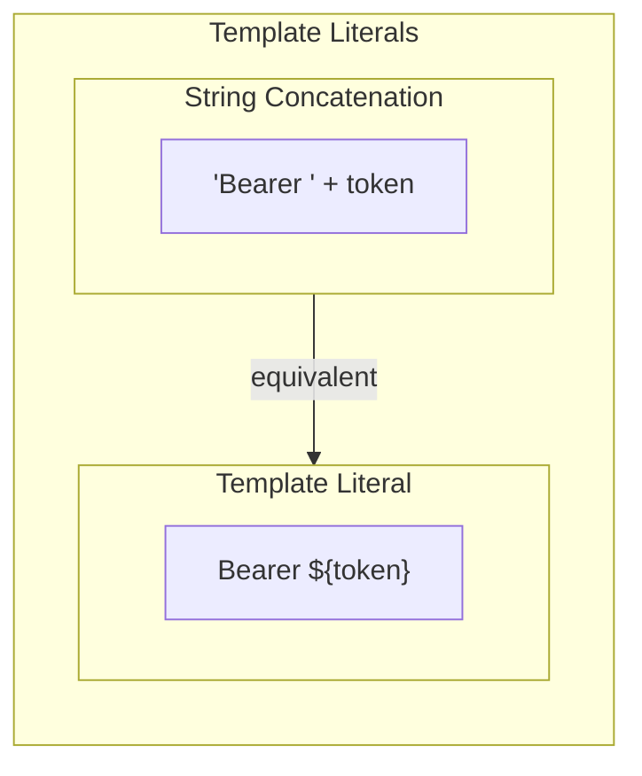
```mermaid
flowchart LR
    subgraph TEMPLATE["Template Literals"]
        direction TB

        subgraph CONCAT["String Concatenation"]
            C["'Bearer ' + token"]
        end

        subgraph TEMPLATE_LIT["Template Literal"]
            T["`Bearer ${token}`"]
        end
    end

    CONCAT -->|"equivalent"| TEMPLATE_LIT
```

**In Our Code:**

```typescript
// Template literal for Authorization header
config.headers.Authorization = `Bearer ${token}`;

// Cleaner than:
// config.headers.Authorization = "Bearer " + token;
```

---

### 6. Arrow Functions in Reducers

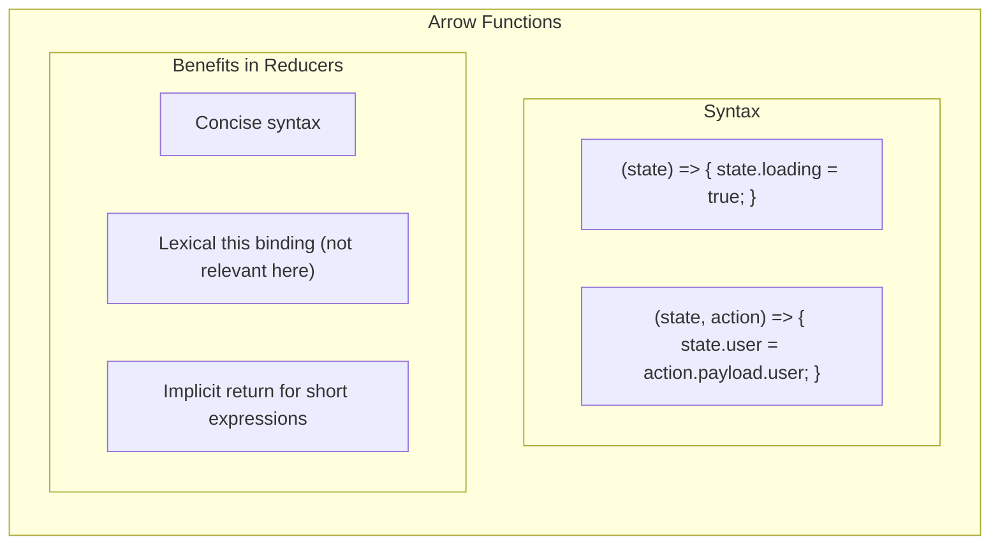
```mermaid
flowchart TB
    subgraph ARROW["Arrow Functions"]
        direction TB

        subgraph SYNTAX["Syntax"]
            S1["(state) => { state.loading = true; }"]
            S2["(state, action) => { state.user = action.payload.user; }"]
        end

        subgraph BENEFIT["Benefits in Reducers"]
            B1["Concise syntax"]
            B2["Lexical this binding (not relevant here)"]
            B3["Implicit return for short expressions"]
        end
    end
```

**In Our Code:**

```typescript
reducers: {
  logout: (state) => {
    state.user = null;
    state.token = null;
    state.isAuthenticated = false;
    state.error = null;
    localStorage.removeItem("token");
  },

  clearError: (state) => {
    state.error = null;
  },
},
```

---

## Axios Concepts

### 1. Axios Instance

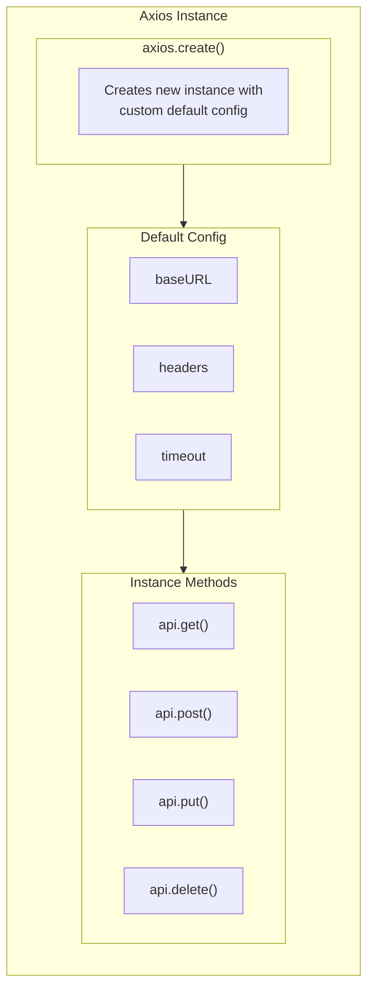
```mermaid
flowchart TB
    subgraph INSTANCE["Axios Instance"]
        direction TB

        subgraph CREATE["axios.create()"]
            C["Creates new instance with<br/>custom default config"]
        end

        subgraph CONFIG["Default Config"]
            CFG1["baseURL"]
            CFG2["headers"]
            CFG3["timeout"]
        end

        subgraph INHERIT["Instance Methods"]
            M1["api.get()"]
            M2["api.post()"]
            M3["api.put()"]
            M4["api.delete()"]
        end
    end

    CREATE --> CONFIG --> INHERIT
```

**In Our Code:**

```typescript
const api = axios.create({
  baseURL: import.meta.env.VITE_API_URL || "https://localhost:7001/api",
  headers: {
    "Content-Type": "application/json",
  },
});

// All requests inherit these defaults
api.post("/auth/register", data);
// → POST https://localhost:7001/api/auth/register
// → Content-Type: application/json
```

---

### 2. Request Interceptor

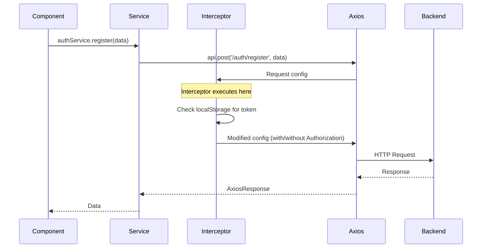
```mermaid
sequenceDiagram
    participant C as Component
    participant S as Service
    participant I as Interceptor
    participant A as Axios
    participant B as Backend

    C->>S: authService.register(data)
    S->>A: api.post('/auth/register', data)
    A->>I: Request config

    Note over I: Interceptor executes here

    I->>I: Check localStorage for token
    I->>A: Modified config (with/without Authorization)
    A->>B: HTTP Request
    B-->>A: Response
    A-->>S: AxiosResponse
    S-->>C: Data
```

**In Our Code:**

```typescript
api.interceptors.request.use((config) => {
  // Runs before every request
  const token = localStorage.getItem("token");
  if (token) {
    config.headers.Authorization = `Bearer ${token}`;
  }
  return config;  // Must return config
});
```

---

## Concept Summary Table

| Category | Concept | Where Used | Purpose |
|----------|---------|------------|---------|
| Redux Toolkit | createSlice | authSlice.ts | Define state + reducers |
| Redux Toolkit | createAsyncThunk | authSlice.ts | Handle async actions |
| Redux Toolkit | configureStore | store.ts | Create store with defaults |
| Redux Toolkit | Immer | Reducer functions | Immutable updates with mutable syntax |
| TypeScript | ReturnType | store.ts | Extract function return type |
| TypeScript | typeof | store.ts | Get type from value |
| TypeScript | Generics | api.post<T> | Type-safe responses |
| TypeScript | Union Types | User.role | Restrict to specific values |
| TypeScript | Type Guards | Error handling | Narrow unknown types |
| JavaScript | async/await | Service/Thunk | Handle Promises |
| JavaScript | Optional Chaining | Error extraction | Safe property access |
| JavaScript | Template Literals | Interceptor | String interpolation |
| Axios | Instance | api.ts | Shared configuration |
| Axios | Interceptor | api.ts | Modify requests/responses |
