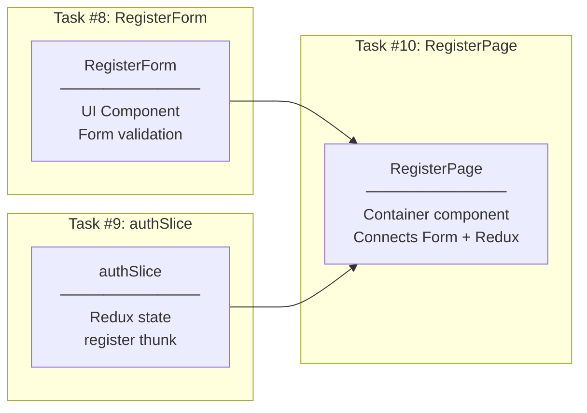
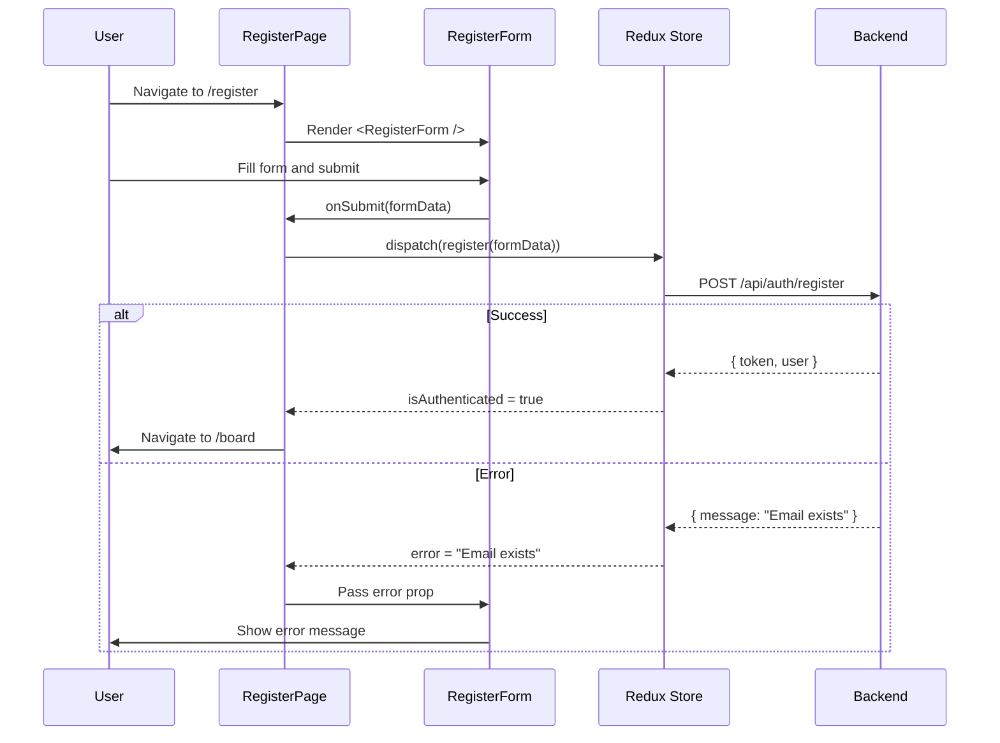
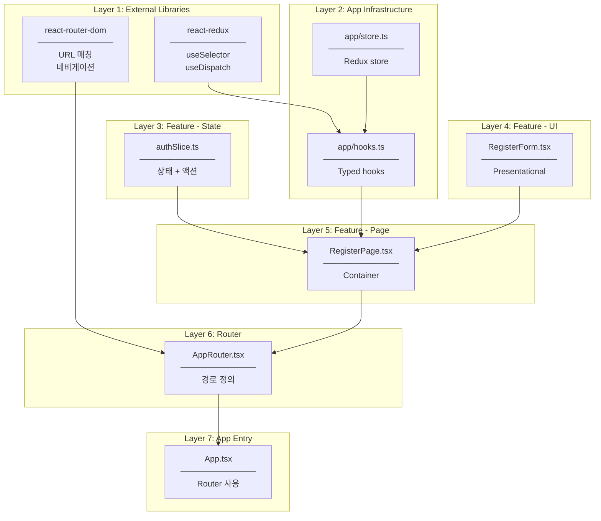

# RegisterPage Implementation Plan

## Overview

Task #10: Create RegisterPage component that connects RegisterForm (Task #8) with authSlice (Task #9).

**GitHub Issue:** #10

---

## Changes from Original Plan

### API URL 수정

**Issue:** Frontend에서 백엔드 연결 실패 (`ERR_CONNECTION_REFUSED`)

**원인:** `api.ts`의 baseURL과 백엔드 실제 포트 불일치

| 설정 | 원래 값 | 수정 값 |
|------|---------|---------|
| `src/services/api.ts` baseURL | `https://localhost:7001/api` | `https://localhost:7158/api` |

**디버깅 과정:**
1. 브라우저 DevTools → Network 탭에서 `register` 요청 확인
2. 요청 URL이 `https://localhost:7001/api/auth/register`로 전송됨 확인
3. Status: `(failed) net::ERR_CONNECTION_REFUSED` 확인
4. `Backend/.../Properties/launchSettings.json`에서 실제 포트 확인: `https://localhost:7158`
5. `api.ts` baseURL 수정 후 정상 동작 확인 (Status: 201)

**교훈:**
- 연결 실패 시 Network 탭에서 실제 요청 URL 확인
- 백엔드 포트는 `launchSettings.json`에서 확인
- Frontend/Backend 연결 시 포트 일치 필수

---

## What This Task Connects



---

## Why RegisterPage as Container?

| Problem | Without Container | With Container (RegisterPage) |
|---------|------------------|------------------------------|
| Form + Redux 연결 | RegisterForm이 Redux에 직접 의존 | RegisterPage가 연결, Form은 props만 받음 |
| 테스트 | Form 테스트 시 Redux mock 필요 | Form은 순수 UI, Page는 통합 테스트 |
| 재사용성 | RegisterForm이 Redux에 묶임 | Form은 어디서든 재사용 가능 |
| 책임 분리 | 하나의 컴포넌트가 모든 것 처리 | UI / State / Navigation 분리 |

---

## File Structure

```
src/
├── app/
│   ├── store.ts                    ← Existing (Task #9)
│   └── hooks.ts                    ← NEW: Typed Redux hooks
├── features/auth/
│   ├── components/
│   │   ├── FormInput.tsx           ← Existing (Task #8)
│   │   └── RegisterForm.tsx        ← Existing (Task #8)
│   ├── pages/
│   │   └── RegisterPage.tsx        ← NEW: Container component
│   ├── store/
│   │   └── authSlice.ts            ← Existing (Task #9)
│   └── index.ts                    ← Update exports
├── router/
│   └── AppRouter.tsx               ← NEW: Routing configuration
└── App.tsx                         ← Update with Router
```

---

## RegisterPage Responsibilities

| Aspect | Description |
|--------|-------------|
| **Responsibility** | Container component that connects UI (RegisterForm) with State (authSlice) |
| **Logic 관점** | "Redux에서 상태 읽기, Form 제출 시 dispatch, 성공 시 navigate" |
| **Runtime 관점** | /register 경로 접근 시 렌더링. useSelector로 상태 구독, useDispatch로 액션 전송 |
| **Changes when** | 페이지 레이아웃 변경, 네비게이션 로직 변경, 새 기능 추가 (소셜 로그인 버튼) |
| **Does NOT do** | 폼 UI 렌더링 (RegisterForm), 상태 관리 (authSlice), 유효성 검사 (validation.ts) |

**Why Container Pattern?**
- RegisterForm은 "어떻게 보여줄지"만 담당 (Presentational)
- RegisterPage는 "무엇을 할지"만 담당 (Container)
- 테스트 시 RegisterForm은 props만 주입하면 됨

---

## Component Flow



---

## File Responsibilities (SRP)

### pages/RegisterPage.tsx

| Aspect | Description |
|--------|-------------|
| **Responsibility** | Form과 Redux 연결, 네비게이션 처리 |
| **Logic 관점** | "useSelector로 상태 읽기, dispatch로 register 호출, isAuthenticated면 redirect" |
| **Runtime 관점** | /register 접근 시 렌더링. Redux 상태 변경 시 re-render, 성공 시 navigate 호출 |
| **Changes when** | 페이지 레이아웃, 네비게이션 로직, 추가 UI 요소 |
| **Does NOT do** | 폼 렌더링, 상태 관리, API 호출 |

**Why separate from RegisterForm?**
- RegisterForm은 Redux를 모름 → 순수 UI 컴포넌트
- 테스트 시 RegisterForm은 props만 주입
- LoginPage에서도 비슷한 패턴 재사용

---

### router/AppRouter.tsx

| Aspect | Description |
|--------|-------------|
| **Responsibility** | 앱 전체 라우팅 정의 |
| **Logic 관점** | "어떤 경로에 어떤 컴포넌트를 보여줄지" 결정 |
| **Runtime 관점** | URL 변경 시 해당 컴포넌트 렌더링 |
| **Changes when** | 새 페이지 추가, 경로 변경, 라우트 가드 추가 |
| **Does NOT do** | 페이지 내용 렌더링, 비즈니스 로직 |

**Why separate router?**
- 라우팅 설정을 한 곳에서 관리
- 새 페이지 추가 시 이 파일만 수정
- 라우트 가드 추가 용이

---

### app/hooks.ts

| Aspect | Description |
|--------|-------------|
| **Responsibility** | 타입이 적용된 Redux hooks 제공 |
| **Logic 관점** | "useDispatch, useSelector에 RootState, AppDispatch 타입 적용" |
| **Runtime 관점** | 컴포넌트에서 import하여 사용 |
| **Changes when** | store 타입 변경 시 자동 반영 |
| **Does NOT do** | 비즈니스 로직, UI 렌더링 |

**Why typed hooks?**
- 매번 `useDispatch<AppDispatch>()` 작성 불필요
- 타입 안전성 보장
- Redux 공식 권장 패턴

---

## Dependency Flow



---

## Implementation Steps

### Step 1: Install react-router-dom

```bash
npm install react-router-dom
```

| Package | Logic 관점 | Runtime 관점 |
|---------|-----------|-------------|
| `react-router-dom` | 선언적 라우팅 정의 | URL 변경 감지, 컴포넌트 렌더링 |

---

### Step 2~6: File Creation

각 파일은 위 "File Responsibilities" 섹션의 책임에 따라 구현합니다.

---

## Checklist

- [x] 1.1 Install react-router-dom
- [x] 2.1 Create src/app/hooks.ts (typed Redux hooks)
- [x] 3.1 Create src/features/auth/pages/RegisterPage.tsx
- [x] 4.1 Create src/router/AppRouter.tsx
- [x] 5.1 Update src/App.tsx with Router
- [x] 6.1 Update src/features/auth/index.ts exports
- [x] 7.1 Build verification
- [x] 8.1 Test with npm run dev

---

## Related Documentation

- [Auth Frontend Feature](../../../frontend/Features/Auth.md)
- [Task #8 RegisterForm](../08-register-form/00-development-plan.md)
- [Task #9 authSlice](../09-auth-slice/00-development-plan.md)
- [Registration Page API Contract](../../../api-contracts/02-Registration-Page-Contract.md)
