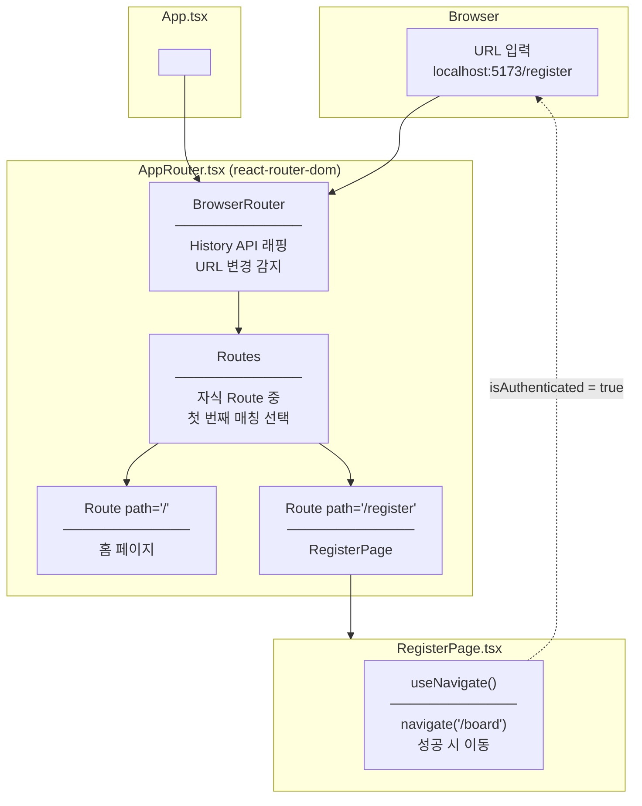
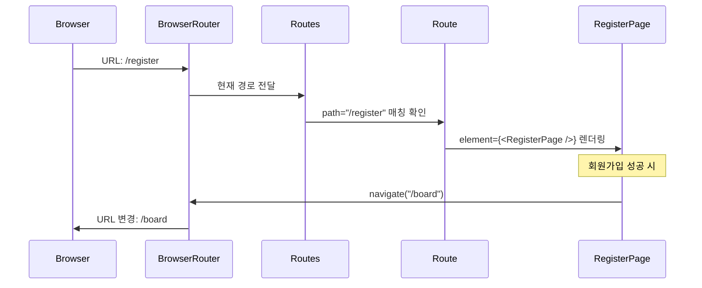
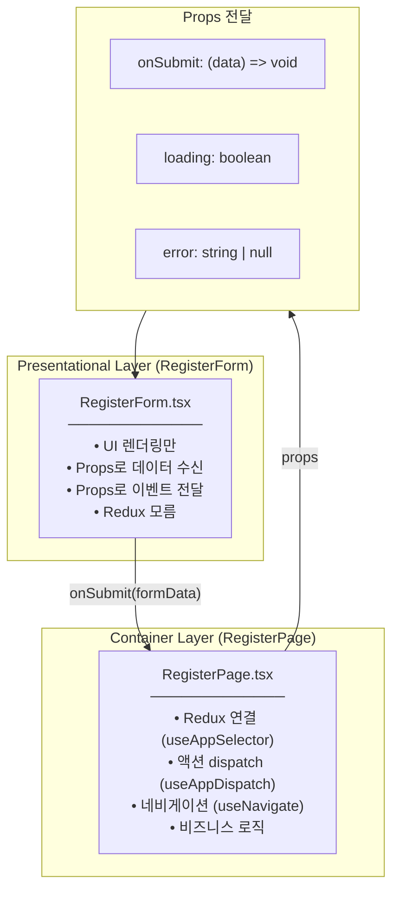
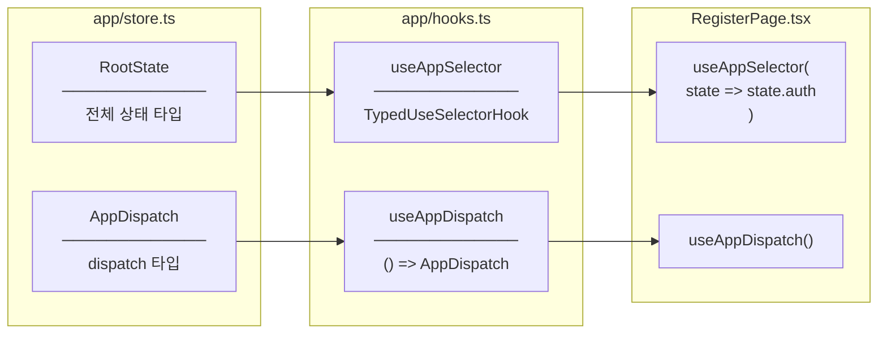
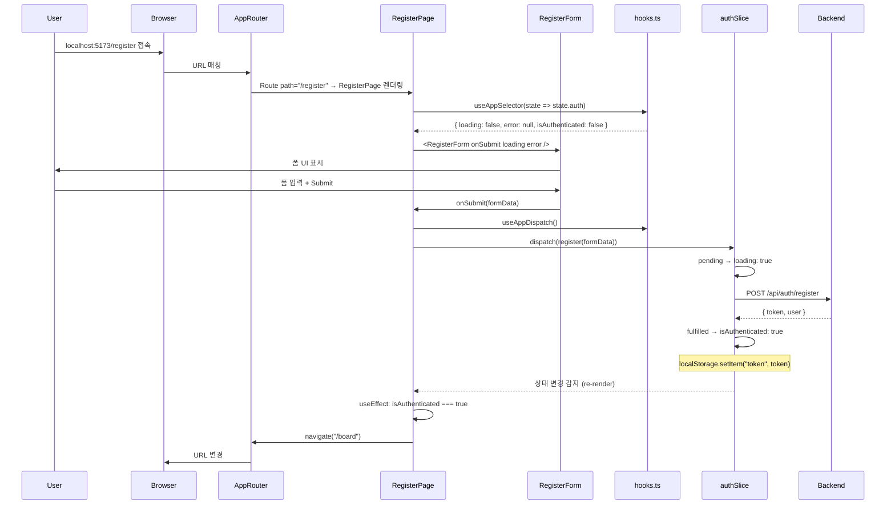
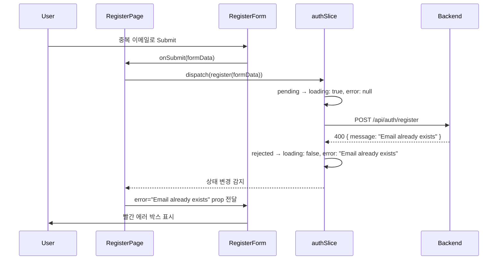
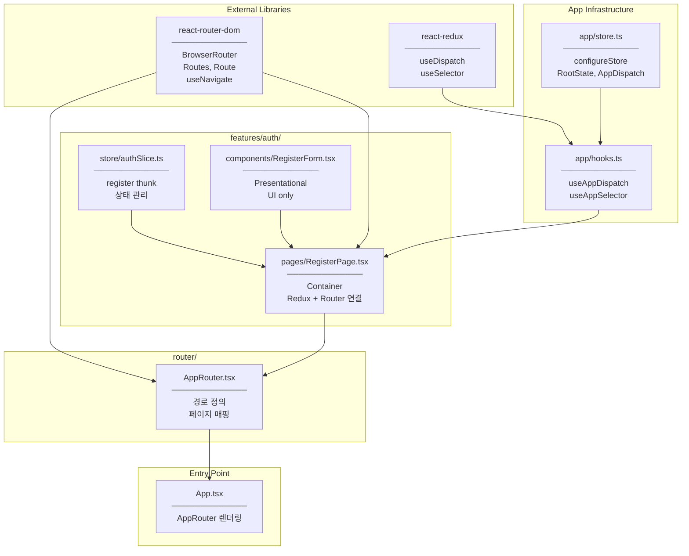

# Task #10 Architecture Diagram

## Overview

Task #10에서 구현한 RegisterPage의 전체 아키텍처와 데이터 흐름을 시각화합니다.

---

## react-router-dom 활용

### 설치된 패키지

```bash
npm install react-router-dom
```

### 사용된 컴포넌트/훅

| Import | 위치 | 역할 |
|--------|------|------|
| `BrowserRouter` | AppRouter.tsx | 앱 전체를 Router 컨텍스트로 감싸기 |
| `Routes` | AppRouter.tsx | 여러 Route 중 매칭되는 것 선택 |
| `Route` | AppRouter.tsx | 경로와 컴포넌트 매핑 |
| `useNavigate` | RegisterPage.tsx | 프로그래밍 방식으로 페이지 이동 |

---

### Router 구조



---

### URL 매칭 흐름



---

## Container/Presentational 패턴

### 컴포넌트 역할 분리



---

### Why 분리?

| 측면 | RegisterForm (Presentational) | RegisterPage (Container) |
|------|------------------------------|-------------------------|
| **알고 있는 것** | Props만 | Redux, Router, 비즈니스 로직 |
| **테스트** | Props 주입만으로 테스트 | Redux mock 필요 |
| **재사용** | 어디서든 사용 가능 | /register 경로 전용 |
| **변경 이유** | UI/스타일 변경 | 상태 로직, 네비게이션 변경 |

---

## Typed Redux Hooks 흐름

### hooks.ts 역할



---

### 타입 안전성 비교

```typescript
// ❌ Without typed hooks (매번 타입 지정 필요)
const dispatch = useDispatch<AppDispatch>();
const { user } = useSelector((state: RootState) => state.auth);

// ✅ With typed hooks (타입 자동 적용)
const dispatch = useAppDispatch();
const { user } = useAppSelector(state => state.auth);  // state 타입 자동완성
```

---

## 전체 데이터 흐름 (E2E)

### 회원가입 성공 시나리오



---

### 회원가입 실패 시나리오



---

## 파일 의존성 다이어그램



---

## 레이어별 책임 요약

| Layer | 파일 | 책임 | 의존성 |
|-------|------|------|--------|
| **Entry** | App.tsx | Router 렌더링 | AppRouter |
| **Router** | AppRouter.tsx | URL → Page 매핑 | react-router-dom, Pages |
| **Container** | RegisterPage.tsx | Redux + Router 연결 | hooks.ts, authSlice, RegisterForm |
| **Presentational** | RegisterForm.tsx | UI 렌더링 | Props only |
| **State** | authSlice.ts | 상태 + 액션 | authService |
| **Infrastructure** | hooks.ts | Typed hooks | store.ts |

---

## Related Documentation

- [02-container-pattern.md](./02-container-pattern.md) - Container/Presentational 패턴 상세
- [03-routing-layer.md](./03-routing-layer.md) - Router + Hooks 분석
- [04-design-patterns-and-solid.md](./04-design-patterns-and-solid.md) - 적용된 디자인 패턴
- [05-programming-concepts.md](./05-programming-concepts.md) - 프로그래밍 개념 정리
